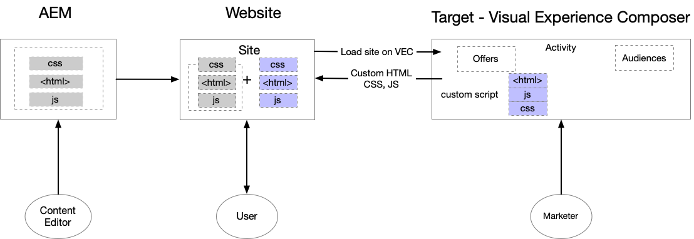
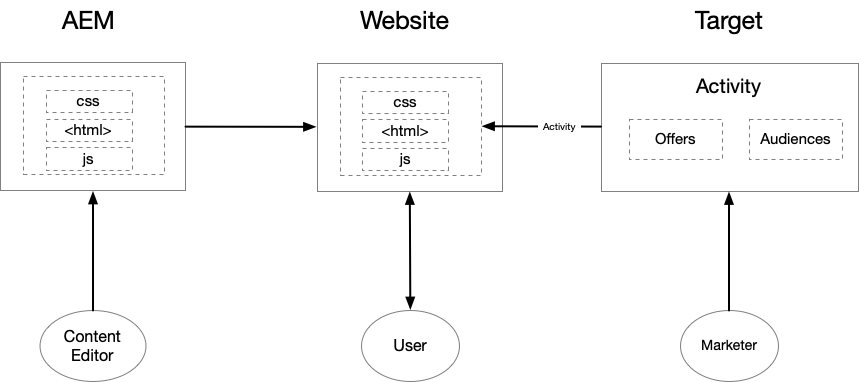

# Integrare AEM Sites e Adobe Target {#getting-started-with-aem-target}

AEM e Target sono entrambe soluzioni potenti con funzionalità apparentemente sovrapposte. A volte i clienti hanno difficoltà a capire come e quando utilizzare questi prodotti insieme per fornire esperienze personalizzate. Per offrire un’esperienza ottimizzata a ogni utente finale, i diversi team all’interno dell’organizzazione dovrebbero collaborare strettamente e definire i propri ruoli.

In questo tutorial, copriamo tre diversi scenari per AEM e Target, che ti aiutano a capire cosa funziona meglio per la tua organizzazione e come i diversi team collaborano.

* Scenario 1: personalizzazione mediante frammenti esperienza AEM
* Scenario 2: personalizzazione con il Compositore esperienza visivo
* Scenario 3: personalizzazione delle esperienze di pagine web complete

## Personalizzazione tramite frammenti di esperienza AEM {#personalization-using-aem-experience-fragment}

Per questo scenario, useremo AEM e Target. Chiaramente, entrambi i prodotti hanno i loro punti di forza e, quando si tratta di fornire esperienze personalizzate agli utenti del tuo sito, è necessario **contenuti personalizzati (contenuti dell’AEM)** e un **modo intelligente (Target)** per distribuire questi contenuti in base a un utente specifico.

L’AEM ti consente di creare contenuti personalizzati, riunendo tutti i contenuti e le risorse in una posizione centrale per alimentare la tua strategia di personalizzazione. AEM consente di creare facilmente contenuti per desktop, tablet e dispositivi mobili in un&#39;unica posizione senza scrivere codice. Non è necessario creare pagine per ogni dispositivo: l’AEM regola automaticamente ogni esperienza utilizzando il contenuto. Puoi anche esportare il contenuto dall’AEM ad Adobe Target come offerte con la pressione di un pulsante.

Ora disponiamo di contenuti personalizzati sotto forma di offerte dell’AEM in Target. Target consente di fornire queste offerte su larga scala in base a una combinazione di approcci di apprendimento automatico basati sulle regole e guidati da intelligenze automatizzate che incorporano variabili comportamentali, contestuali e offline.  Con Target puoi facilmente configurare ed eseguire attività di test A/B e multivariati (MVT) per determinare le offerte, i contenuti e le esperienze migliori.

**Frammenti di esperienza** rappresenta un enorme passo avanti per collegare i creatori di contenuti/esperienze ai professionisti della personalizzazione che stanno guidando i risultati di business utilizzando Target.

* Gli autori di contenuti personalizzati dell’editor di contenuti AEM come Frammenti di esperienza e relative varianti
* AEM esporta Experience Fragment HTML in Target&#x200B;
* Target&#x200B; utilizza il markup dei frammenti esperienza AEM come offerte nelle attività
* Target fornisce Experience Fragment HTML, AEM fornisce le immagini di riferimento

  

**Per implementare questo scenario, devi:**

* [Integrare AEM e Adobe Target tramite Launch e Adobe I/O](./implementation.md#integrating-aem-target-options)
* [AEM e Adobe Target con Cloud Service legacy](./implementation.md#integrating-aem-target-options)

***Dopo aver implementato le integrazioni di cui sopra, esplora le [scenario in dettaglio](./personalization-use-case-1.md).***

## Personalizzazione mediante Visual Experience Composer

Gli addetti al marketing possono apportare modifiche rapide al proprio sito web senza modificare il codice per eseguire un test utilizzando il Compositore esperienza visivo di Adobe Target. Il Compositore esperienza visivo è l’interfaccia utente WYSIWYG (What you see is what you get) che consente di creare e testare facilmente esperienze e offerte personalizzate nel contesto del sito. Puoi creare esperienze e offerte per le attività di Target trascinando, scambiando e modificando il layout e il contenuto di una pagina web (o offerta) oppure di una pagina web per dispositivi mobili.

Il Compositore esperienza visivo è una delle funzionalità principali di Adobe Target. Il Compositore esperienza visivo consente agli addetti al marketing e ai designer di creare e modificare i contenuti mediante un’interfaccia visiva. È possibile effettuare molte scelte di progettazione senza richiedere la modifica diretta del codice. La modifica di HTML e JavaScript è possibile anche utilizzando le opzioni di modifica disponibili nel compositore.

* Il contenuto risiede nell’AEM e gli editor di contenuti creano e gestiscono le pagine del sito
* Target utilizza le pagine del sito ospitate dall’AEM per eseguire test e personalizzazione
* Target offre contenuti personalizzati
* Il nuovo contenuto netto viene creato utilizzando Adobe Target VEC
* Applicabile sia ai siti ospitati dall’AEM che ai siti non ospitati dall’AEM

  

**Per implementare questo scenario, devi:**

* [Integrare AEM e Adobe Target tramite Launch e Adobe I/O](./implementation.md#integrating-aem-target-options)

***Dopo aver implementato l’integrazione di cui sopra, è possibile esplorare i [scenario in dettaglio.](./personalization-use-case-3.md)***

## Personalizzazione delle esperienze di pagine web complete

L’integrazione di Adobe Experience Manager con Adobe Target ti aiuta a fornire un’esperienza personalizzata agli utenti del sito. Inoltre, ti aiuta anche a capire meglio quali versioni del contenuto del sito web migliorano al meglio le tue conversioni durante un determinato periodo di test. Ad esempio, un test A/B confronta due o più versioni del contenuto del sito web per vedere quale solleva meglio le conversioni, le vendite o altre metriche identificate. Un addetto al marketing può creare attività all’interno di Adobe Target per comprendere in che modo gli utenti interagiscono con il contenuto del sito e come questo influisce sulle metriche del sito.

* Il contenuto risiede nell’AEM e gli editor di contenuti creano e gestiscono le pagine del sito
* Target utilizza le pagine del sito ospitate dall’AEM per eseguire test e personalizzazione
* Target offre contenuti personalizzati
* Nessun nuovo contenuto qui creato
* Applicabile a siti AEM e non AEM

  

**Per implementare questo scenario, devi:**

* [Integrare AEM e Adobe Target tramite Launch e Adobe I/O](./implementation.md#integrating-aem-target-options)

***Dopo aver implementato l’integrazione di cui sopra, è possibile esplorare i [scenario in dettaglio.](./personalization-use-case-2.md)***
