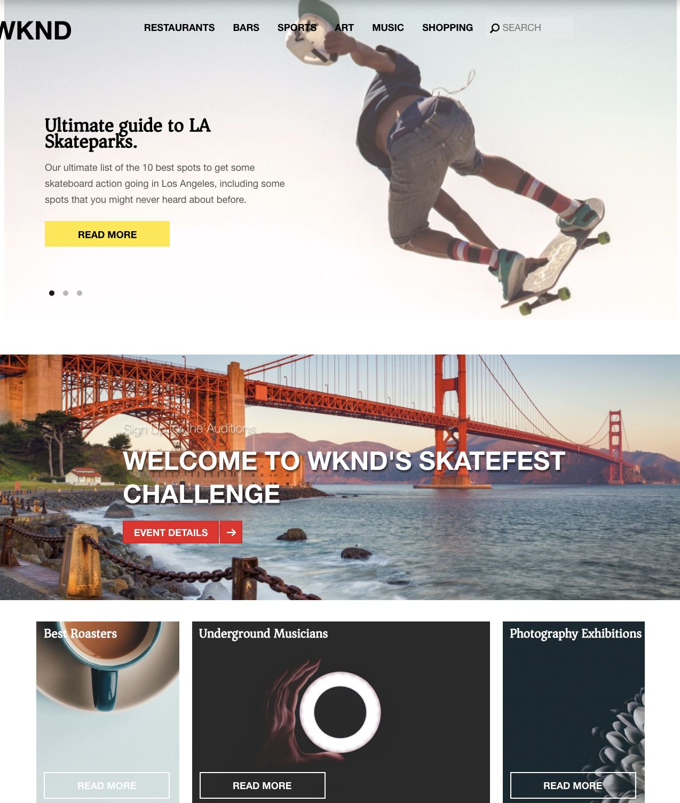
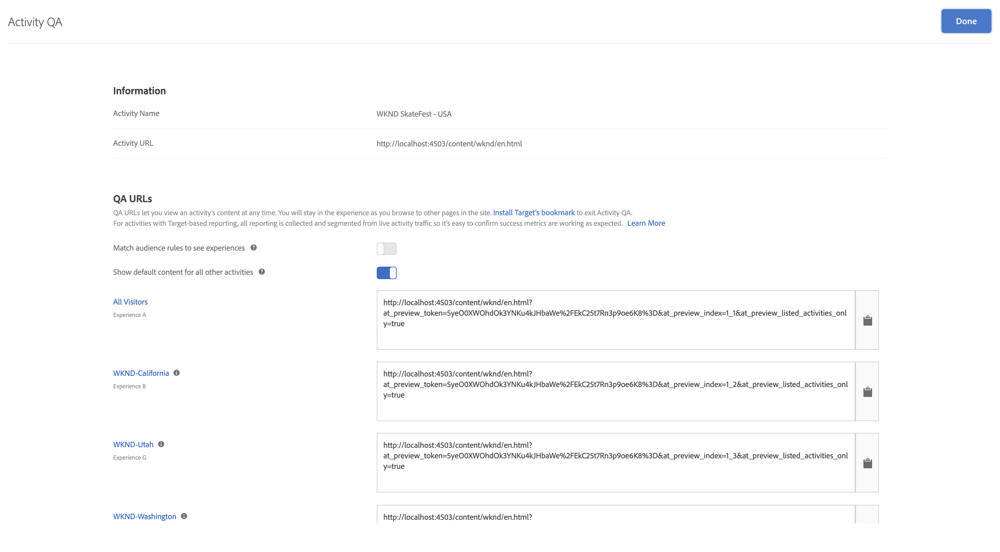

# Personalizzazione tramite frammenti di esperienza AEM e Adobe Target

Grazie alla possibilità di esportare AEM Frammenti esperienza in Adobe Target come offerte HTML, puoi combinare la facilità d’uso e la potenza del AEM con le potenti funzionalità di intelligenza automatizzata (AI) e apprendimento automatico (ML) di Target per testare e personalizzare le esperienze su larga scala.

AEM riunisce tutti i contenuti e le risorse in una posizione centrale per alimentare la tua strategia di personalizzazione. AEM consente di creare facilmente contenuti per desktop, tablet e dispositivi mobili in un’unica posizione senza scrivere codice. Non è necessario creare pagine per ogni dispositivo: AEM regola automaticamente ogni esperienza utilizzando il contenuto.

Target ti consente di fornire esperienze personalizzate su scala basata su una combinazione di approcci di apprendimento automatico basati su regole e basati su intelligenza artificiale che incorporano variabili comportamentali, contestuali e offline.  Con Target puoi facilmente impostare ed eseguire attività A/B e multivariate (MVT) per determinare le offerte, i contenuti e le esperienze migliori.

I frammenti di esperienza rappresentano un enorme passo in avanti per collegare i creatori di contenuti con gli addetti al marketing che utilizzano Target per conseguire risultati di business.

## Panoramica dello scenario

Il sito WKND sta pianificando di annunciare una **SkateFest Challenge** in tutta l&#39;America attraverso il loro sito web e vorrebbe che i loro utenti del sito si iscrivano per l&#39;audizione condotta in ogni stato. In qualità di addetto al marketing, ti è stata assegnata l’attività di eseguire una campagna nella home page del sito WKND, con messaggi di banner relativi alla posizione degli utenti e un collegamento alla pagina dei dettagli dell’evento. Esploriamo la home page del sito WKND e impariamo a creare e distribuire un’esperienza personalizzata per un utente in base alla sua posizione corrente.

### Utenti coinvolti

Per questo esercizio è necessario coinvolgere i seguenti utenti ed eseguire alcune attività, potrebbe essere necessario un accesso amministrativo.

* **Content Producer / Content Editor**  (Adobe Experience Manager)
* **Addetto al marketing**  (Adobe Target / Team di ottimizzazione)

### Prerequisiti

* **AEM**
   * [AEM autore e pubblicare instancerunning ](./implementation.md#getting-aem) su localhost 4502 e 4503 rispettivamente.
* **Experience Cloud**
   * Accesso alle organizzazioni Adobe Experience Cloud - <https://>`<yourcompany>`.experiencecloud.adobe.com
   * Experience Cloud fornito con le seguenti soluzioni
      * [Adobe Target](https://experiencecloud.adobe.com)

### Home page sito WKND

1. L’addetto al marketing avvia la discussione sulla campagna WKND SkateFest con AEM Content Editor e ne descrive i requisiti.
   * ***Requisito***: Promuovi la campagna WKND SkateFest sulla home page del sito WKND con contenuti personalizzati per i visitatori di ogni stato negli Stati Uniti. Aggiungi un nuovo blocco di contenuto sotto il carosello Home Page contenente un’immagine di sfondo, un testo e un pulsante.
      * **Immagine** di sfondo: L’immagine deve essere pertinente allo stato da cui l’utente sta visitando la pagina del sito WKND.
      * **Testo**: &quot;Iscriviti alle Audition&quot;
      * **Pulsante**: &quot;Dettagli evento&quot; che punta alla pagina WKND SkateFest
      * **Pagina** WKND SkateFest: una nuova pagina con i dettagli dell’evento, inclusa la sede dell’audizione, la data e l’ora.
1. In base ai requisiti, AEM Editor di contenuto crea un frammento esperienza per il blocco di contenuto ed lo esporta in Adobe Target come offerta. Per distribuire contenuti personalizzati per tutti gli stati degli Stati Uniti, l’autore del contenuto può creare una variante principale del frammento esperienza e quindi creare altre 50 varianti, una per ogni stato. Il contenuto di ogni variante di stato con immagini e testo pertinenti può quindi essere modificato manualmente. Quando crei un frammento esperienza, gli editor di contenuti possono accedere rapidamente a tutte le risorse disponibili in AEM Assets utilizzando l’opzione Asset Finder. Quando un frammento esperienza viene esportato in Adobe Target, anche tutte le sue varianti vengono inviate ad Adobe Target come offerte.

1. Dopo aver esportato un frammento esperienza da AEM ad Adobe Target come offerte, gli addetti al marketing possono creare un’attività in Target utilizzando queste offerte. In base alla campagna SkateFest del sito WKND, l’addetto al marketing deve creare e fornire un’esperienza personalizzata ai visitatori del sito WKND da ogni stato. Per creare un’attività Targeting esperienze, l’addetto al marketing deve identificare i tipi di pubblico. Per la nostra campagna WKND SkateFest, dobbiamo creare 50 tipi di pubblico separati, in base alla loro posizione da cui stanno visitando il sito web WKND.
   *  I tipi di pubblico definiscono il target per la tua attività e vengono utilizzati ovunque sia disponibile il targeting. I tipi di pubblico di Target sono un insieme definito di criteri per i visitatori. Le offerte possono essere indirizzate a tipi di pubblico specifici (o segmenti). Solo i visitatori che appartengono a quel pubblico visualizzano l’esperienza a loro destinata.  Ad esempio, puoi offrire un’offerta a un pubblico composto da visitatori che utilizzano un particolare browser o da una specifica geolocalizzazione.
   * Un [Offerta](https://experienceleague.adobe.com/docs/target/using/introduction/target-key-concepts.html#section_973D4CC4CEB44711BBB9A21BF74B89E9) è il contenuto che viene visualizzato sulle pagine web durante campagne o attività. Quando sottoponi a test le pagine web, misuri il successo di ogni esperienza con offerte diverse nelle tue posizioni. Un’offerta può contenere diversi tipi di contenuto, tra cui:
      * Immagine
      * Testo
      * **HTML**
         * *Le offerte HTML verranno utilizzate per l&#39;attività di questo scenario*
      * Collegamento
      * Pulsante

## Attività dell’editor di contenuti

>[!VIDEO](https://video.tv.adobe.com/v/28596?quality=12&learn=on)

>[!NOTE]
>
>Pubblica il frammento esperienza prima di esportarlo in Adobe Target.

## Attività di marketing

### Creare un pubblico con il geotargeting {#marketer-audience}

1. Passa alle organizzazioni [Adobe Experience Cloud](https://experiencecloud.adobe.com/) (<https://>`<yourcompany>`.experiencecloud.adobe.com)
1. Accedi utilizzando il tuo Adobe ID e assicurati di essere nell&#39;organizzazione corretta.
1. Dal commutatore della soluzione, fai clic su **Target** e quindi su **launch** Adobe Target.

   

1. Passa alla scheda **Offerte** e cerca le offerte &quot;WKND&quot;. Dovresti essere in grado di visualizzare l’elenco delle varianti Frammenti esperienza, esportate da AEM come offerte HTML. Ogni offerta corrisponde a uno stato. Ad esempio, *WKND SkateFest California* è l’offerta che viene fornita a un visitatore del sito WKND dalla California.

   

1. Dalla navigazione principale, fai clic su **Tipi di pubblico**.

   Un addetto al marketing deve creare 50 tipi di pubblico separati per i visitatori del sito WKND provenienti da ogni stato degli Stati Uniti d’America.

1. Per creare un pubblico, fai clic sul pulsante **Crea pubblico** e specifica un nome per il pubblico.

   **Formato del nome del pubblico : WKND-\&lt;>state *\>***

   

1. Fai clic su **Aggiungi regola > Geo**.
1. Fai clic su **Seleziona**, quindi seleziona una delle seguenti opzioni:
   * Paese
   * **Stato** *(selezionare lo stato per la campagna SkateFest del sito WKND)*
   * Città
   * Codice postale
   * Latitudine
   * Longitudine
   * DMA
   * Operatore di telefonia mobile

   **Geo**  - Utilizza i tipi di pubblico per indirizzare l’attività agli utenti in base alla loro posizione geografica, compreso paese, stato/provincia, città, CAP, DMA o gestore mobile. I parametri di geolocalizzazione consentono di eseguire il targeting di attività ed esperienze in base alla posizione geografica dei visitatori. Questi dati vengono inviati con ogni richiesta Target e si basano sull&#39;indirizzo IP del visitatore. Seleziona questi parametri come qualsiasi altro valore di targeting.

   >[!NOTE]
   >L’indirizzo IP di un visitatore viene trasmesso con una richiesta mbox, una volta per visita (sessione), per risolvere i parametri di geotargeting per quel visitatore.

1. Seleziona l’operatore come **corrisponde a**, fornisci un valore appropriato (ad esempio: California) e **Salva** le modifiche. Nel nostro caso, fornisci il nome dello stato.

   

   >[!NOTE]
   >Puoi assegnare più regole a un pubblico.

1. Ripeti i passaggi 6-9 per creare tipi di pubblico per gli altri stati.

   

A questo punto, abbiamo creato con successo i tipi di pubblico per tutti i visitatori del sito WKND in diversi stati degli Stati Uniti d’America e abbiamo anche l’offerta HTML corrispondente per ogni stato. Ora creiamo un’attività Targeting esperienza per indirizzare il pubblico con un’offerta corrispondente per la home page del sito WKND.

### Creare un’attività con il geotargeting

1. Dalla finestra di Adobe Target, passa alla scheda **Attività** .
1. Fai clic su **Crea attività** e seleziona il tipo di attività **Targeting esperienza**.
1. Seleziona il canale **Web** e scegli il **Compositore esperienza visivo**.
1. Inserisci l&#39; **URL attività** e fai clic su **Avanti** per aprire il Compositore esperienza visivo.

   URL di pubblicazione della home page del sito WKND: http://localhost:4503/content/wknd/en.html

   

1. Affinché **Compositore esperienza visivo** possa essere caricato, abilita **Consenti il caricamento di script non sicuri** nel browser e ricarica la pagina.

   

1. Osserva la home page del sito WKND aperta nell’editor del Compositore esperienza visivo.

   

1. Per aggiungere un pubblico al Compositore esperienza visivo, fai clic su **Aggiungi targeting esperienza** in Audiences, quindi seleziona il pubblico WKND-California e fai clic su **Avanti**.

   

1. Fai clic sulla pagina del sito WKND all’interno del Compositore esperienza visivo, seleziona l’elemento HTML per aggiungere l’offerta per il pubblico WKND-California, quindi scegli l’opzione **Sostituisci con** e seleziona l’ **Offerta HTML**.

   

1. Seleziona l&#39;offerta HTML **WKND SkateFest California** per il pubblico **WKND-California** dall&#39;interfaccia utente selezionata dell&#39;offerta e fai clic su **Fine**.
1. Ora dovresti essere in grado di visualizzare l’ **offerta HTML WKND SkateFest California** aggiunta alla pagina del sito WKND per il pubblico WKND-California.
1. Ripeti i passaggi 7-10 per aggiungere il targeting delle esperienze per gli altri stati e scegli l’offerta HTML corrispondente.
1. Fai clic su **Avanti** per continuare e puoi visualizzare una mappatura per Audiences to Experiences.
1. Fai clic su **Avanti** per passare a Obiettivi e impostazioni.
1. Scegli l’origine per la generazione di rapporti e identifica un obiettivo principale per l’attività. Per il nostro scenario, selezioniamo l&#39;Origine per i rapporti come **Adobe Target**, misurando l&#39;attività come **Conversione**, come visualizzata una pagina e l&#39;URL che punta alla pagina WKND SkateFest Details (Dettagli SkateFest).

   

   >[!NOTE]
   >Puoi anche scegliere Adobe Analytics come origine per la generazione di rapporti.

1. Passa il puntatore del mouse sul nome dell&#39;attività corrente e lo puoi rinominare in **WKND SkateFest - USA**, quindi **Salva e chiudi** le modifiche.
1. Dalla schermata dei dettagli dell&#39;attività, assicurati di **Attivare** l&#39;attività.

   

1. La campagna WKND SkateFest è ora live per tutti i visitatori del sito WKND.
1. Passa alla [home page del sito WKND](http://localhost:4503/content/wknd/en.html) e dovresti essere in grado di visualizzare l&#39;offerta SkateFest WKND in base alla tua geolocalizzazione (*stato: California*).

   

### Controllo di qualità delle attività di Target

1. Nella scheda **Dettagli attività > Panoramica** , fai clic sul pulsante **Controllo di qualità attività** e puoi ottenere il collegamento di controllo qualità diretto a tutte le tue esperienze.

   

1. Passa alla [home page del sito WKND](http://localhost:4503/content/wknd/en.html) e dovresti essere in grado di visualizzare l&#39;offerta SkateFest WKND in base alla tua geolocalizzazione (stato).
1. Guarda il video seguente per comprendere come un’offerta viene consegnata alla tua pagina, come personalizzare i token di risposta ed eseguire un controllo di qualità.

>[!VIDEO](https://video.tv.adobe.com/v/28658?quality=12&learn=on)

## Riepilogo

In questo capitolo, un editor di contenuti è stato in grado di creare tutti i contenuti per supportare la campagna WKND SkateFest all’interno di Adobe Experience Manager ed esportarla in Adobe Target come offerte HTML, per creare il targeting delle esperienze, in base alla geolocalizzazione degli utenti.
