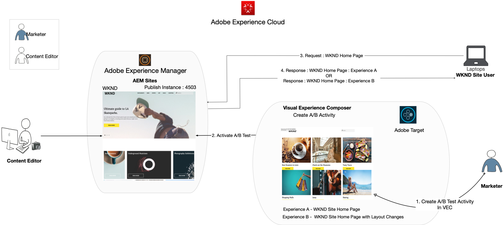
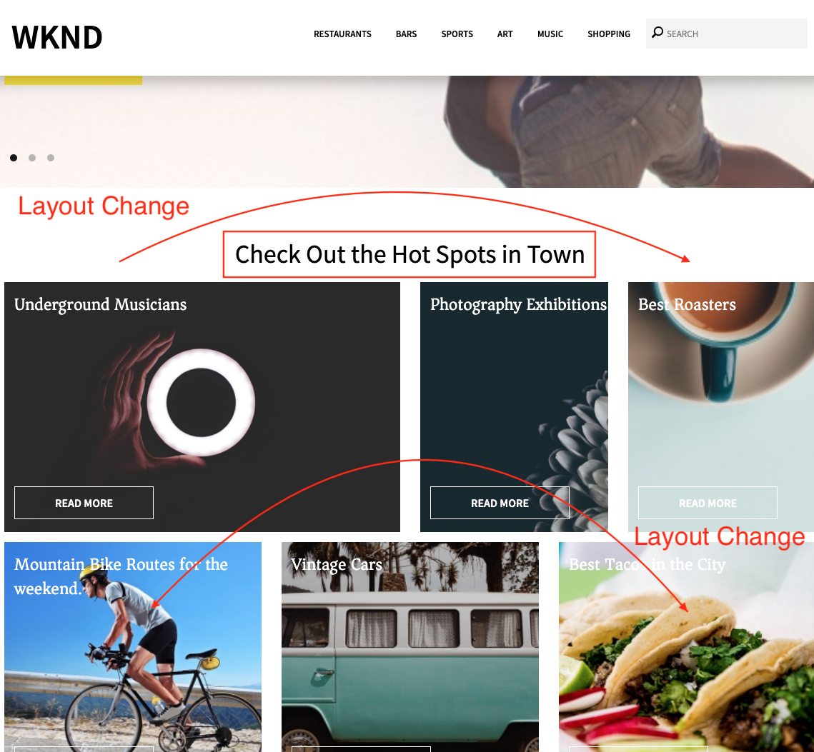

# Personalizzazione tramite Compositore esperienza visivo

In questo capitolo, esploreremo la creazione di esperienze utilizzando **Compositore esperienza visivo** trascinando, rilasciando, scambiando e modificando il layout e il contenuto di una pagina web dall’interno di Target.

## Panoramica dello scenario

La home page del sito WKND mostra le attività locali o la cosa migliore da fare intorno a una città sotto forma di layout di carte. In qualità di addetto al marketing, ti è stato assegnato il compito di modificare la home page riorganizzando i layout delle schede per vedere in che modo influisce sul coinvolgimento dell’utente e favorisce la conversione.

### Utenti coinvolti

Per questo esercizio è necessario coinvolgere i seguenti utenti ed eseguire alcune attività, potrebbe essere necessario un accesso amministrativo.

* **Content Producer/Content Editor** (Adobe Experience Manager)
* **Addetto marketing** (Adobe Target / Team di ottimizzazione)

### Home page sito WKND



### Prerequisiti

* **AEM**
   * [istanza di pubblicazione AEM](./implementation.md#getting-aem) in esecuzione su 4503
   * [AEM integrato con Adobe Target tramite Adobe Experience Platform Launch](./using-launch-adobe-io.md#aem-target-using-launch-by-adobe)
* **Experience Cloud**
   * Accesso alle organizzazioni Adobe Experience Cloud - `https://<yourcompany>.experiencecloud.adobe.com`
   * Experience Cloud fornito con [Adobe Target](https://experiencecloud.adobe.com)

## Attività di marketing

1. L’addetto al marketing crea un’attività di destinazione A/B in Adobe Target.
   1. Dalla finestra di Adobe Target, passa a **Attività** scheda .
   2. Fai clic su **Crea attività** e seleziona il tipo di attività come **Test A/B**

      
   3. Seleziona la **Web** e scegli il **Compositore esperienza visivo**.
   4. Inserisci il **URL attività** e fai clic su **Successivo** per aprire il Compositore esperienza visivo.
      
   5. Per **Compositore esperienza visivo** per caricare, abilita **Consenti caricamento script non sicuri** nel browser e ricarica la pagina.
      
   6. Osserva la home page del sito WKND aperta nell’editor del Compositore esperienza visivo.
      
   7. **Esperienza A** fornisce la home page WKND predefinita e modifichiamo il layout del contenuto per **Esperienza B**.
      
   8. Fai clic su uno dei contenitori di layout della scheda (*Migliori Roasters*) e seleziona **Ridisponi** opzione .
      
   9. Fai clic sul contenitore che desideri ridisporre e trascinalo nella posizione desiderata. Ridisponiamo il *Migliori Roasters* contenitore dalla prima riga prima colonna alla prima riga terza colonna. Ora il *Migliori Roasters* accanto a *Mostra Fotografia* contenitore.
      

      **Dopo lo scambio**
      
   10. Analogamente, ridisporre le posizioni per gli altri contenitori di carte.
      
   11. Aggiungiamo anche un testo di intestazione sotto il componente carosello e sopra il layout di scheda.
   12. Fai clic sul contenitore del carosello e seleziona il **Inserisci dopo > HTML** per aggiungere HTML.
      

      ```html
      <h1 style="text-align:center">Check Out the Hot Spots in Town</h1>
      ```

      
   13. Fai clic su **Successivo** per continuare con la tua attività.
   14. Seleziona la **Metodo di allocazione traffico** come manuale e assegna il 100% di traffico a **Esperienza B**.
      
   15. Fai clic su **Avanti**.
   16. Fornire **Metriche dell&#39;obiettivo** per la tua attività e salva e chiudi il test A/B.
      
   17. Immetti un nome (**Aggiornamento home page WKND**) per l’attività e salva le modifiche.
   18. Dalla schermata dei dettagli dell’attività, assicurati di: **Attiva** la tua attività.
      
   19. Passa alla home page WKND (http://localhost:4503/content/wknd/en.html) e noterai le modifiche aggiunte all’attività Test A/B di aggiornamento pagina Home WKND.
      
   20. Apri la console del browser e controlla la scheda di rete per cercare la risposta di destinazione per l’attività Test A/B di aggiornamento pagina iniziale WKND.
      

## Riepilogo

In questo capitolo, un addetto al marketing è stato in grado di creare un’esperienza utilizzando Visual Experience Composer (Compositore esperienza visivo) trascinando e rilasciando, scambiando e modificando il layout e il contenuto di una pagina web senza modificare il codice necessario per eseguire un test.
