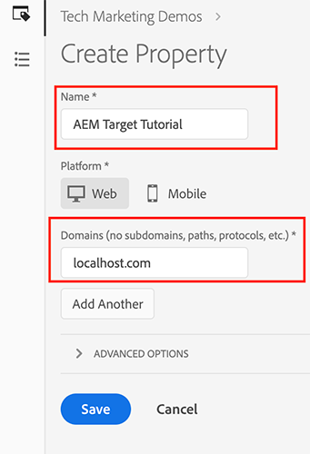

# Utilizzo di Adobe Experience Platform Launch tramite la console Adobe Developer

## Prerequisiti

* [Istanza di authoring e pubblicazione AEM](./implementation.md#set-up-aem) in esecuzione rispettivamente sulle porte localhost 4502 e 4503
* **Experience Cloud**
   * Accesso al Adobe Experience Cloud delle organizzazioni - `https://<yourcompany>.experiencecloud.adobe.com`
   * Experience Cloud con le seguenti soluzioni
      * [Adobe Experience Platform Launch](https://experiencecloud.adobe.com)
      * [Adobe Target](https://experiencecloud.adobe.com)
      * [Console per sviluppatori di Adobe](https://developer.adobe.com/console/)

     >[!NOTE]
     >Devi disporre dell&#39;autorizzazione per sviluppare, approvare, pubblicare, gestire le estensioni e gestire gli ambienti in Launch. Se non riesci a completare nessuna di queste operazioni perché le opzioni dell’interfaccia utente non sono disponibili, rivolgiti al tuo amministratore Experience Cloud per richiedere l’accesso. Per ulteriori informazioni sulle autorizzazioni di Launch, [consulta la documentazione](https://experienceleague.adobe.com/docs/experience-platform/tags/admin/user-permissions.html).

* **Plug-in browser**
   * Adobe Experience Cloud Debugger ([Chrome](https://chrome.google.com/webstore/detail/adobe-experience-platform/bfnnokhpnncpkdmbokanobigaccjkpob))
   * Avvio e switch DTM ([Chrome](https://chrome.google.com/webstore/detail/launch-and-dtm-switch/nlgdemkdapolikbjimjajpmonpbpmipk))

## Utenti interessati

Per questa integrazione, devono essere coinvolti i seguenti tipi di pubblico e, per eseguire alcune attività, potrebbe essere necessario l’accesso amministrativo.

* Sviluppatore
* Amministratore AEM
* Amministratore Experience Cloud

## Introduzione

AEM offre un’integrazione standard con Experience Platform Launch. Questa integrazione consente agli amministratori dell’AEM di configurare facilmente il Experience Platform Launch tramite un’interfaccia di facile utilizzo, riducendo in tal modo il livello di sforzo e il numero di errori durante la configurazione di questi due strumenti. E solo aggiungendo l’estensione Adobe Target al Experience Platform Launch ci aiuterà a utilizzare tutte le funzioni di Adobe Target sulle pagine web AEM.

In questa sezione verranno descritti i seguenti passaggi dell’integrazione:

* Lancio
   * Creare una proprietà Launch
   * Aggiunta dell’estensione Target
   * Creare un elemento dati
   * Crea una regola di pagina
   * Ambienti di configurazione
   * Costruire e pubblicare
* AEM
   * Creazione di un Cloud Service
   * Creare

### Lancio

#### Creare una proprietà Launch

Una proprietà è un contenitore che si riempie con estensioni, regole, elementi dati e librerie durante la distribuzione di tag nel sito.

1. Accedere alle organizzazioni [Adobe Experience Cloud](https://experiencecloud.adobe.com/) (`https://<yourcompany>.experiencecloud.adobe.com`)
2. Accedi con il tuo Adobe ID e accertati di essere nell’organizzazione corretta.
3. Dal commutatore della soluzione, fai clic su **Launch** e quindi selezionare **Vai a Launch** pulsante.

   

4. Accertati di essere nell’organizzazione corretta, quindi procedi con la creazione di una proprietà Launch.
   

   *Per ulteriori informazioni sulla creazione delle proprietà, consulta [Creare una proprietà](https://experienceleague.adobe.com/docs/experience-platform/tags/admin/companies-and-properties.html?lang=en#create-or-configure-a-property) nella documentazione del prodotto.*
5. Fai clic sul pulsante **Nuova proprietà** pulsante
6. Specifica un nome per la proprietà (ad esempio, *Tutorial su AEM Target*)
7. Come dominio, immetti *localhost.com* poiché è il dominio in cui è in esecuzione il sito di dimostrazione WKND. Anche se l’*Dominio*&#39;, la proprietà Launch funzionerà su qualsiasi dominio in cui è implementata. Lo scopo principale di questo campo è precompilare le opzioni di menu nel Generatore di regole.
8. Fai clic su **Salva** pulsante.

   

9. Apri la proprietà appena creata e fai clic sulla scheda Estensioni.

#### Aggiunta dell’estensione Target

L&#39;estensione Adobe Target supporta implementazioni lato client tramite SDK JavaScript di Target per il web moderno, `at.js`. Clienti che usano ancora una libreria Target precedente, `mbox.js`, [deve effettuare l’aggiornamento a at.js](https://experienceleague.adobe.com/docs/target-dev/developer/client-side/at-js-implementation/upgrading-from-atjs-1x-to-atjs-20.html) per utilizzare Launch.

L’estensione Target è costituita da due parti principali:

* La configurazione dell’estensione, che gestisce le impostazioni della libreria principale
* Azioni di regola per eseguire le operazioni seguenti:
   * Carica Target (at.js)
   * Aggiungi parametri a tutte le mbox
   * Aggiungi parametri a mbox globale
   * Attiva mbox globale

1. Sotto **Estensioni**, puoi visualizzare l’elenco delle estensioni già installate per la proprietà Launch. ([Estensione core Experience Platform Launch](https://exchange.adobe.com/apps/ec/100223/adobe-launch-core-extension) è installato per impostazione predefinita)
2. Fai clic sul pulsante **Catalogo delle estensioni** e cercare Target nel filtro.
3. Seleziona la versione più recente di Adobe Target at.js e fai clic su **Installa** opzione.
   

4. Fai clic su **Configura** e puoi notare la finestra di configurazione con le credenziali del tuo account Target importate e la versione at.js per questa estensione.
   

   Quando Target viene distribuito tramite i codici di incorporamento Launch asincroni, è necessario codificare un frammento pre-hiding sulle pagine prima dei codici di incorporamento Launch per gestire lo sfarfallio del contenuto. Ulteriori informazioni sul frammento pre-hiding saranno disponibili in seguito. È possibile scaricare il frammento pre-hiding [qui](assets/using-launch-adobe-io/prehiding.js)

5. Clic **Salva** per completare l’aggiunta dell’estensione Target alla proprietà Launch, ora dovresti poter visualizzare l’estensione Target elencata nella sezione **Installato** elenco delle estensioni.

6. Ripeti i passaggi precedenti per cercare l’estensione &quot;Experience Cloud ID Service&quot; e installarla.
   

#### Ambienti di configurazione

1. Fai clic sul pulsante **Ambiente** per la proprietà del sito e puoi visualizzare l’elenco degli ambienti creati per la proprietà del sito. Per impostazione predefinita, abbiamo un’istanza creata per lo sviluppo, la gestione temporanea e la produzione.

#### Costruire e pubblicare

1. Fai clic sul pulsante **Pubblicazione** sulla proprietà del sito, e creiamo una libreria per generare e distribuire le modifiche (elementi dati, regole) in un ambiente di sviluppo.
   >[!VIDEO](https://video.tv.adobe.com/v/28412?quality=12&learn=on)
2. Pubblicare le modifiche dallo sviluppo a un ambiente di staging.
   >[!VIDEO](https://video.tv.adobe.com/v/28419?quality=12&learn=on)
3. Esegui il **Opzione Genera per staging**.
4. Una volta completata la build, esegui **Approva per la pubblicazione**, che sposta le modifiche da un ambiente di staging a un ambiente di produzione.
   
5. Infine, esegui il **Genera e pubblica in produzione** per inviare le modifiche alla produzione.
   

### Adobe Experience Manager

>[!VIDEO](https://video.tv.adobe.com/v/28416?quality=12&learn=on)

>[!NOTE]
>
> Concedi all’integrazione Adobe Developer l’accesso a specifiche aree di lavoro con le opzioni [per consentire a un team centrale di apportare modifiche basate su API solo in alcune aree di lavoro](https://experienceleague.adobe.com/docs/target/using/administer/manage-users/enterprise/configure-adobe-io-integration.html).

1. Crea l’integrazione IMS nell’AEM utilizzando le credenziali di Adobe Developer. (01:12 alle 03:55)
2. In Experience Platform Launch, crea una proprietà. (coperti [sopra](#create-launch-property))
3. Utilizzando l’integrazione IMS del passaggio 1, crea l’integrazione di Experience Platform Launch per importare la proprietà Launch.
4. In AEM, mappa l’integrazione del Experience Platform Launch su un sito utilizzando la configurazione del browser. (05:28 alle 06:14)
5. Convalida manualmente l’integrazione. (06:15 alle 06:33)
6. Utilizzo del plug-in del browser Launch/DTM. (06:34 alle 06:50)
7. Utilizzo del plug-in del browser Adobe Experience Cloud Debugger. (06:51 alle 07:22)

A questo punto, hai integrato correttamente [AEM con Adobe Target tramite Adobe Experience Platform Launch](./using-aem-cloud-services.md#integrating-aem-target-options) come descritto nell&#39;opzione 1.

Per utilizzare le offerte dei frammenti di esperienza AEM per potenziare le attività di personalizzazione, procedi al capitolo successivo e integra l’AEM con Adobe Target utilizzando i servizi cloud precedenti.
