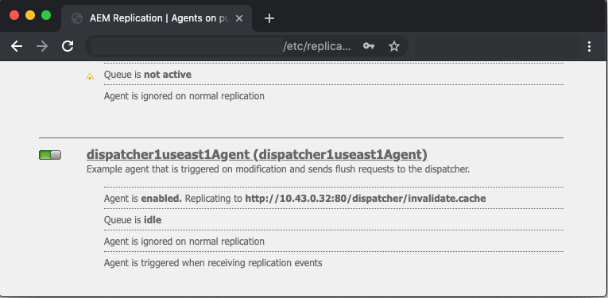

# URL personalizzati del dispatcher

[Sommario](./overview.md)

[&lt;- Precedente: Uso e nozioni di base sulle variabili](./variables.md)

Questo documento fornisce indicazioni su come si verifica lo scaricamento e illustra il meccanismo che esegue lo scaricamento e l’invalidazione della cache.


## Come funziona

### Ordine di funzionamento

Il flusso di lavoro tipico è meglio descritto quando gli autori di contenuti attivano una pagina, quando l’editore riceve il nuovo contenuto, innesca una richiesta di scaricamento al Dispatcher come mostrato nel diagramma seguente:

Questa concatenazione di eventi evidenzia che gli elementi vengono scaricati solo quando sono nuovi o sono cambiati.  In questo modo, il contenuto è stato ricevuto dall’editore prima di cancellare la cache per evitare race condition in cui lo scaricamento potrebbe verificarsi prima che le modifiche possano essere recuperate dall’editore.

## Agenti di replica

Sull’autore c’è un agente di replica configurato per indicare all’editore che quando qualcosa viene attivato si attiva per inviare il file e tutte le sue dipendenze all’editore.

Quando l’editore riceve il file, dispone di un agente di replica configurato per puntare al Dispatcher che si attiva sull’evento on-receive.  Successivamente serializza una richiesta di scaricamento e la invia al Dispatcher.

### AGENTE DI REPLICA DELL&#39;AUTORE

Di seguito sono riportati alcuni esempi di schermate di un agente di replica standard configurato


In genere sono configurati 1 o 2 agenti di replica sull’autore per ogni editore a cui replicano il contenuto.

Il primo è l’agente di replica standard a cui spinge le attivazioni dei contenuti.

Il secondo è l&#39;agente inverso.  Questo è facoltativo ed è configurato per controllare ogni pubblicazione outbox per vedere se c&#39;è nuovo contenuto da richiamare nell&#39;autore come attività di replica inversa

### AGENTE DI REPLICA DELL&#39;EDITORE

Ecco un esempio di schermata di un agente di replica di scaricamento standard configurato


### REPLICA FLUSH DEL DISPATCHER CHE RICEVE UN HOST VIRTUALE

Il modulo Dispatcher cerca intestazioni particolari per sapere quando una richiesta di POST è qualcosa da trasmettere a AEM rendering o se è serializzata come richiesta di scaricamento e deve essere gestita dal gestore del Dispatcher stesso.

Ecco una schermata della pagina di configurazione che mostra questi valori:


La pagina delle impostazioni predefinite mostra la `Serialization Type` come `Dispatcher Flush` e imposta il livello di errore


Sulla `Transport` è possibile visualizzare la scheda `URI` impostato per puntare l’indirizzo IP del Dispatcher che riceverà le richieste di scaricamento.  Il percorso `/dispatcher/invalidate.cache` non è il modo in cui il modulo determina se si tratta di uno scaricamento, è solo un endpoint ovvio che puoi vedere nel log di accesso per sapere che si tratta di una richiesta di scaricamento.  Sulla `Extended` esamineremo gli elementi disponibili per qualificare questa è una richiesta di scaricamento al modulo Dispatcher.


La `HTTP Method` per le richieste di scaricamento è solo un `GET` richiesta con alcune intestazioni di richiesta speciali:
- CQ-Action
   - Questa utilizza una variabile AEM basata sulla richiesta e il valore è tipicamente *attiva o elimina*
- CQ-Handle
   - Questa utilizza una variabile AEM basata sulla richiesta e il valore è tipicamente il percorso completo dell’elemento scaricato, ad esempio `/content/dam/logo.jpg`
- CQ-Path
   - Questa utilizza una variabile AEM basata sulla richiesta e il valore è tipicamente il percorso completo dell’elemento scaricato, ad esempio `/content/dam`
- Host
   - Qui è dove `Host` L’intestazione viene modificata in modo da eseguire il targeting di uno specifico `VirtualHost` configurato sul server web Apache del dispatcher (`/etc/httpd/conf.d/enabled_vhosts/aem_flush.vhost`).  È un valore hardcoded che corrisponde a una voce nel `aem_flush.vhost` file `ServerName` o `ServerAlias`


Sulla `Triggers` prenderemo nota dei trigger attivati che usiamo e di cosa sono

- `Ignore default`
   - Questo è abilitato in modo che l’agente di replica non venga attivato all’attivazione di una pagina.  Quando un’istanza di authoring apporta una modifica a una pagina, questo attiverebbe uno scaricamento.  Poiché questo è un editore, non vogliamo attivare quel tipo di evento.
- `On Receive`
   - Quando viene ricevuto un nuovo file, si desidera attivare lo scaricamento.  Quindi, quando l’autore ci invia un file aggiornato, attiveremo e invieremo una richiesta di scaricamento a Dispatcher.
- `No Versioning`
   - Controlliamo questo per evitare che l&#39;editore generi nuove versioni perché è stato ricevuto un nuovo file.  Sostituiremo semplicemente il file che abbiamo e ci affidiamo all’autore per tenere traccia delle versioni invece che dell’editore.

Ora, se guardiamo come si presenta una tipica richiesta di scaricamento sotto forma di una `curl` command

```
$ curl \ 
-H "CQ-Action: Activate" \ 
-H "CQ-Handle: /content/dam/logo.jpg" \ 
-H "CQ-Path: /content/dam/" \ 
-H "Content-Length: 0" \  
-H "Content-Type: application/octect-stream" \ 
-H "Host: flush" \ 
http://10.43.0.32:80/dispatcher/invalidate.cache
```

Questo esempio di scaricamento scarica `/content/dam` mediante l&#39;aggiornamento del `.stat` in quella directory.

## La `.stat` file

Il meccanismo di scaricamento è semplice e vogliamo spiegare l&#39;importanza del `.stat` file generati nella directory principale dei documenti in cui vengono creati i file di cache.

Dentro `.vhost` e `_farm.any` file configuriamo una direttiva document root per specificare dove si trova la cache e dove memorizzare/servire i file quando arriva una richiesta di un utente finale.

Se esegui il seguente comando sul server Dispatcher, inizierai a trovare `.stat` file

```
$ find /mnt/var/www/html/ -type f -name ".stat"
```

Ecco un diagramma dell’aspetto di questa struttura di file quando hai elementi nella cache e hai ricevuto una richiesta di scaricamento inviata ed elaborata dal modulo Dispatcher


### LIVELLO DI FILE STAT

Notate che in ogni directory c&#39;era un `.stat` file presente.  Questo è un indicatore che si è verificato uno scaricamento.  Nell’esempio sopra il `statfilelevel` impostazione impostata su `3` all’interno del file di configurazione della farm corrispondente.

La `statfilelevel` l’impostazione indica quante cartelle in fondo al modulo attraversano e aggiornano un `.stat` file.  Il file .stat è vuoto, non è altro che un nome di file con un datestamp e potrebbe anche essere creato manualmente ma eseguendo il comando touch sulla riga di comando del server Dispatcher.

Se l’impostazione del livello del file stat è troppo alta, ogni richiesta di scaricamento attraversa la struttura della directory toccando i file stat.  Questo può diventare un hit importante delle prestazioni su grandi cache tree e può influenzare le prestazioni complessive del tuo Dispatcher.

Se imposti questo livello di file troppo basso, una richiesta di scaricamento può cancellare più di quanto previsto.  Il che a sua volta provocherebbe l’esecuzione più frequente della cache con meno richieste servite dalla cache e potrebbe causare problemi di prestazioni.

<div style="color: #000;border-left: 6px solid #2196F3;background-color:#ddffff;"><b>Nota:</b>

Imposta la `statfilelevel` a un livello ragionevole.  Osserva la struttura delle cartelle e assicurati che sia configurata per consentire scaricamenti concisi senza dover attraversare troppe directory.   Testalo e assicurati che sia adatto alle tue esigenze durante un test delle prestazioni del sistema.

Un buon esempio è un sito che supporta le lingue.  La struttura contenuto tipica avrebbe le seguenti directory

`/content/brand1/en/us/`

In questo esempio, utilizza un’impostazione a livello di file stat pari a 4.  Questo ti garantirà quando scaricherai il contenuto che vive sotto il <b>`us`</b> cartella che non farà scaricare anche le cartelle della lingua.
</div>

### HANDSHAKE A MARCA TEMPORALE FILE STATO

Quando una richiesta di contenuto arriva nella stessa routine si verifica

1. Timestamp del `.stat` viene confrontato con la marca temporale del file richiesto
2. Se la `.stat` è più recente del file richiesto che elimina il contenuto memorizzato nella cache e ne recupera uno nuovo da AEM e lo memorizza nella cache.  Quindi distribuisce il contenuto
3. Se la `.stat` il file è più vecchio del file richiesto, quindi sa che il file è fresco e può servire il contenuto.

### GESTIONE CACHE - ESEMPIO 1

Nell’esempio precedente una richiesta per il contenuto `/content/index.html`

L&#39;ora del `index.html` il file è 2019-11-01 @ 6:21PM

L&#39;ora del più vicino `.stat` il file è 2019-11-01 @ 12:22PM

Comprendendo ciò che abbiamo letto sopra, puoi vedere che il file di indice è più recente del `.stat` il file e il file verranno serviti dalla cache all&#39;utente finale che lo ha richiesto

### GESTIONE CACHE - ESEMPIO 2

Nell’esempio precedente una richiesta per il contenuto `/content/dam/logo.jpg`

L&#39;ora del `logo.jpg` il file è 2019-10-31 @ 1:13PM

L&#39;ora del più vicino `.stat` il file è 2019-11-01 @ 12:22PM

Come puoi vedere in questo esempio, il file è più vecchio del `.stat` file e verrà rimosso e uno nuovo estratto da AEM per sostituirlo nella cache prima di essere servito all&#39;utente finale che lo ha richiesto.

## Impostazioni dei file farm

La documentazione è disponibile per tutte le opzioni di configurazione: [https://docs.adobe.com/content/help/en/experience-manager-dispatcher/using/configuring/dispatcher-configuration.html#configuring-dispatcher_configuring-the-dispatcher-cache-cache](https://experienceleague.adobe.com/docs/experience-manager-dispatcher/using/configuring/dispatcher-configuration.html?lang=it)

Vogliamo evidenziare alcuni di questi che riguardano lo scaricamento della cache

### Fatture di scarico

Ci sono due chiavi `document root` directory che memorizzano in cache i file dal traffico dell’autore e dell’editore.  Per mantenere queste directory aggiornate con contenuto fresco, sarà necessario svuotare la cache.  Queste richieste di scaricamento non vogliono essere agganciate alle normali configurazioni del tuo farm del traffico cliente che potrebbero rifiutare la richiesta o eseguire qualcosa di indesiderato.  Forniamo invece due farm di scaricamento per questa attività:

- `/etc/httpd.conf.d/available_farms/001_ams_author_flush_farm.any`
- `/etc/httpd.conf.d/available_farms/001_ams_publish_flush_farm.any`

Questi file di farm non fanno altro che svuotare le directory radice dei documenti.

```
/publishflushfarm {  
    /virtualhosts {
        "flush"
    }
    /cache {
        /docroot "${PUBLISH_DOCROOT}"
        /statfileslevel "${DEFAULT_STAT_LEVEL}"
        /rules {
            $include "/etc/httpd/conf.dispatcher.d/cache/ams_publish_cache.any"
        }
        /invalidate {
            /0000 {
                /glob "*"
                /type "allow"
            }
        }
        /allowedClients {
            /0000 {
                /glob "*.*.*.*"
                /type "deny"
            }
            $include "/etc/httpd/conf.dispatcher.d/cache/ams_publish_invalidate_allowed.any"
        }
    }
}
```

### Radice documento

Questa voce di configurazione si trova nella seguente sezione del file farm:

```
/myfarm { 
    /cache { 
        /docroot
```

Specifica la directory in cui desideri che il Dispatcher venga popolato e gestito come directory cache.

<div style="color: #000;border-left: 6px solid #2196F3;background-color:#ddffff;"><b>Nota:</b>
Questa directory deve corrispondere all’impostazione Apache document root per il dominio configurato per l’utilizzo dal server web.

Avere cartelle docroot nidificate per ogni farm che vive una sottocartella della radice dei documenti Apache è un&#39;idea terribile per molti motivi.
</div>

### Livello file di stato

Questa voce di configurazione si trova nella seguente sezione del file farm:

```
/myfarm { 
    /cache { 
        /statfileslevel
```

Questa impostazione misura la profondità `.stat` i file dovranno essere generati quando arriva una richiesta di scaricamento.

`/statfileslevel` impostato al numero seguente con la directory principale del documento di `/var/www/html/` avrebbe i seguenti risultati durante lo scaricamento `/content/dam/brand1/en/us/logo.jpg`

- 0 - Creazione dei seguenti file stat
   - `/var/www/html/.stat`
- 1 - Creazione dei seguenti file stat
   - `/var/www/html/.stat`
   - `/var/www/html/content/.stat`
- 2 - Creazione dei seguenti file stat
   - `/var/www/html/.stat`
   - `/var/www/html/content/.stat`
   - `/var/www/html/content/dam/.stat`
- 3 - Creazione dei seguenti file stat
   - `/var/www/html/.stat`
   - `/var/www/html/content/.stat`
   - `/var/www/html/content/dam/.stat`
   - `/var/www/html/content/dam/brand1/.stat`
- 4 - Creazione dei seguenti file stat
   - `/var/www/html/.stat`
   - `/var/www/html/content/.stat`
   - `/var/www/html/content/dam/.stat`
   - `/var/www/html/content/dam/brand1/.stat`
   - `/var/www/html/content/dam/brand1/en/.stat`
- 5 - Creazione dei seguenti file stat
   - `/var/www/html/.stat`
   - `/var/www/html/content/.stat`
   - `/var/www/html/content/dam/.stat`
   - `/var/www/html/content/dam/brand1/.stat`
   - `/var/www/html/content/damn/brand1/en/.stat`
   - `/var/www/html/content/damn/brand1/en/us/.stat`


<div style="color: #000;border-left: 6px solid #2196F3;background-color:#ddffff;"><b>Nota:</b>

Tieni presente che quando si verifica l’handshake con marca temporale, cerca il più vicino `.stat` file.

avere `.stat` livello di file 0 e un file stat solo in `/var/www/html/.stat` significa che il contenuto sotto cui vive `/var/www/html/content/dam/brand1/en/us/` cerca il più vicino `.stat` file e attraversa 5 cartelle per trovare l’unica `.stat` file esistente al livello 0 e confronta le date con un file specifico.  Ciò significa che uno scaricamento a quel livello alto di un livello invaliderebbe sostanzialmente tutti gli elementi memorizzati nella cache.
</div>

### Invalidazione consentita

Questa voce di configurazione si trova nella seguente sezione del file farm:

```
/myfarm { 
    /cache { 
        /allowedClients {
```

All’interno di questa configurazione puoi inserire un elenco di indirizzi IP che possono inviare richieste di scaricamento.  Se una richiesta di scaricamento arriva nel Dispatcher deve provenire da un IP attendibile.  Se hai configurato in modo errato o invii una richiesta di scaricamento da un indirizzo IP non attendibile, nel file di log verrà visualizzato il seguente errore:

```
[Mon Nov 11 22:43:05 2019] [W] [pid 3079 (tid 139859875088128)] Flushing rejected from 10.43.0.57
```

### Regole di invalidazione

Questa voce di configurazione si trova nella seguente sezione del file farm:

```
/myfarm { 
    /cache { 
        /invalidate {
```

Queste regole indicano in genere quali file possono essere invalidati con una richiesta di scaricamento.

Per evitare che file importanti vengano invalidati con l’attivazione di una pagina, puoi attivare delle regole che specificano quali file possono essere invalidati e quali devono essere invalidati manualmente.  Ecco un esempio di set di configurazione che consente solo l’annullamento della convalida dei file html:

```
/invalidate { 
   /0000 { /glob "*" /type "deny" } 
   /0001 { /glob "*.html" /type "allow" } 
}
```

## Test / Risoluzione dei problemi

Quando attivi una pagina e ottieni la luce verde che l’attivazione della pagina ha avuto successo, devi aspettarti che anche il contenuto attivato venga scaricato dalla cache.

Aggiorna la pagina e vedi le cose vecchie! cosa? c&#39;era una luce verde?!

Seguiamo alcuni passaggi manuali attraverso il processo di scaricamento per farci un&#39;idea di cosa potrebbe essere sbagliato.  Dalla shell dell’editore esegui la seguente richiesta di scaricamento utilizzando curl:

```
$ curl -H "CQ-Action: Activate" \ 
-H "CQ-Handle: /content/<PATH TO ITEM TO FLUSH>" \ 
-H "CQ-Path: /content/<PATH TO ITEM TO FLUSH>" \ 
-H "Content-Length: 0" -H "Content-Type: application/octet-stream" \ 
-H "Host: flush" \ 
http://<DISPATCHER IP ADDRESS>/dispatcher/invalidate.cache
```

Esempio di richiesta di scaricamento del test

```
$ curl -H "CQ-Action: Activate" \ 
-H "CQ-Handle: /content/customer/en-us" \ 
-H "CQ-Path: /content/customer/en-us" \ 
-H "Content-Length: 0" -H "Content-Type: application/octet-stream" \ 
-H "Host: flush" \ 
http://169.254.196.222/dispatcher/invalidate.cache
```

Dopo aver disattivato il comando di richiesta al Dispatcher, dovrai vedere cosa viene fatto nei log e cosa viene fatto con il `.stat files`.  Per confermare che la richiesta di scaricamento ha colpito il modulo Dispatcher, devi visualizzare le seguenti voci

```
[Wed Nov 13 16:54:12 2019] [I] [pid 19173:tid 140542721578752] Activation detected: action=Activate [/content/dam/logo.jpg] 
[Wed Nov 13 16:54:12 2019] [I] [pid 19173:tid 140542721578752] Touched /mnt/var/www/html/.stat 
[Wed Nov 13 16:54:12 2019] [I] [pid 19173:tid 140542721578752] Touched /mnt/var/www/html/content/.stat 
[Wed Nov 13 16:54:12 2019] [I] [pid 19173:tid 140542721578752] Touched /mnt/var/www/html/content/dam/.stat 
[Wed Nov 13 16:54:12 2019] [I] [pid 19173:tid 140542721578752] "GET /dispatcher/invalidate.cache" 200 purge [publishfarm/-] 0ms
```

Ora che vediamo il modulo raccolto e riconosciuto la richiesta di scaricamento, dobbiamo vedere come ha influenzato il `.stat` file.  Esegui il seguente comando e osserva l’aggiornamento delle marche temporali quando esegui un altro scaricamento:

```
$ watch -n 3 "find /mnt/var/www/html/ -type f -name ".stat" | xargs ls -la $1"
```

Come è possibile vedere dall&#39;output del comando le marche temporali della corrente `.stat` file

```
-rw-r--r--. 1 apache apache 0 Nov 13 16:54 /mnt/var/www/html/content/dam/.stat 
-rw-r--r--. 1 apache apache 0 Nov 13 16:54 /mnt/var/www/html/content/.stat 
-rw-r--r--. 1 apache apache 0 Nov 13 16:54 /mnt/var/www/html/.stat
```

Ora, se rieseguiamo lo scaricamento, potrai vedere l’aggiornamento dei timestamp

```
-rw-r--r--. 1 apache apache 0 Nov 13 17:17 /mnt/var/www/html/content/dam/.stat 
-rw-r--r--. 1 apache apache 0 Nov 13 17:17 /mnt/var/www/html/content/.stat 
-rw-r--r--. 1 apache apache 0 Nov 13 17:17 /mnt/var/www/html/.stat
```

Confrontiamo le marche temporali dei nostri contenuti con le nostre `.stat` timestamp dei file

```
$ stat /mnt/var/www/html/content/customer/en-us/.stat 
  File: `.stat' 
  Size: 0           Blocks: 0          IO Block: 4096   regular empty file 
Device: ca90h/51856d    Inode: 17154125    Links: 1 
Access: (0644/-rw-r--r--)  Uid: (   48/  apache)   Gid: (   48/  apache) 
Access: 2019-11-13 16:22:31.000000000 -0400 
Modify: 2019-11-13 16:22:31.000000000 -0400 
Change: 2019-11-13 16:22:31.000000000 -0400 
 
$ stat /mnt/var/www/html/content/customer/en-us/logo.jpg 
File: `logo.jpg' 
  Size: 15856           Blocks: 32          IO Block: 4096   regular file 
Device: ca90h/51856d    Inode: 9175290    Links: 1 
Access: (0644/-rw-r--r--)  Uid: (   48/  apache)   Gid: (   48/  apache) 
Access: 2019-11-11 22:41:59.642450601 +0000 
Modify: 2019-11-11 22:41:59.642450601 +0000 
Change: 2019-11-11 22:41:59.642450601 +0000
```

Se osservi una qualsiasi delle marche temporali, noterai che il contenuto ha un’ora più recente rispetto alla `.stat` file che indica al modulo di elaborare il file dalla cache perché è più recente del `.stat` file.

Inserisci semplicemente qualcosa aggiornato le marche temporali di questo file che non lo qualificano come &quot;scaricato&quot; o sostituito.

[Successivo -> URL personalizzati](./disp-vanity-url.md)