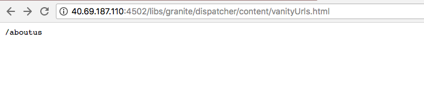

# URL personalizzati Dispatcher

[Sommario](./overview.md)

[&lt;- Precedente: Dispatcher Flush](./disp-flushing.md)

## Panoramica

Questo documento ti aiuta a capire come l’AEM gestisce gli URL personalizzati e alcune tecniche aggiuntive che utilizzano regole di riscrittura per mappare il contenuto più vicino al limite della consegna

## Cosa sono gli URL personalizzati

Se il contenuto risiede in una struttura di cartelle, non sempre si trova in un URL di facile riferimento. Gli URL personalizzati sono come scelte rapide. URL più brevi o univoci che fanno riferimento a dove si trova il contenuto reale.

Esempio: `/aboutus` ha puntato a `/content/we-retail/us/en/about-us.html`

Gli autori dell’AEM possono impostare le proprietà dell’URL personalizzato su un contenuto nell’AEM e pubblicarlo.

Affinché questa funzione funzioni, è necessario regolare i filtri Dispatcher per consentire il reindirizzamento. Questa operazione non è più ragionevole se si regolano i file di configurazione di Dispatcher alla velocità con cui gli autori dovrebbero impostare le voci di pagine personalizzate.

Per questo motivo, il modulo Dispatcher dispone di una funzione che consente automaticamente tutto ciò che è elencato come reindirizzamento nella struttura del contenuto.


## Come funziona

### Creazione di URL personalizzati

L&#39;autore visita una pagina in AEM, fa clic sulle proprietà della pagina e aggiunge voci nella sezione _URL personalizzato_. Quando si salvano le modifiche e si attiva la pagina, il reindirizzamento viene assegnato alla pagina.

Gli autori possono inoltre selezionare la casella di controllo _Reindirizza Vanity URL_ quando si aggiungono _Voci Vanity URL_. In questo modo gli URL personalizzati si comportano come reindirizzamenti 302. Ciò significa che al browser viene richiesto di passare al nuovo URL (tramite l&#39;intestazione di risposta `Location`) e il browser effettua una nuova richiesta al nuovo URL.

#### Interfaccia utente touch:


#### Finder contenuti classico:


>[!NOTE]
>
>Comprendere che questo è soggetto a problemi di spazio dei nomi. Le voci di reindirizzamento sono globali per tutte le pagine. Questo è solo uno dei difetti per cui devi pianificare soluzioni alternative. Ne illustreremo alcune in seguito.


## Risoluzione/mappatura risorse

Ogni voce di reindirizzamento è una voce di mappatura sling per un reindirizzamento interno.

Le mappe sono visibili visitando la console Felix delle istanze dell&#39;AEM ( `/system/console/jcrresolver` )

Ecco una schermata di una voce mappa creata da una voce di reindirizzamento:


Nell&#39;esempio precedente, quando si chiede all&#39;istanza AEM di visitare `/aboutus`, viene risolto in `/content/we-retail/us/en/about-us.html`

## Filtri di Dispatcher per l’autorizzazione automatica

Dispatcher in uno stato protetto esclude le richieste nel percorso `/` tramite Dispatcher perché si tratta della radice della struttura JCR.

È importante assicurarsi che gli editori consentano solo il contenuto da `/content` e altri percorsi sicuri e così via, e non percorsi come `/system`.

Il problema è che gli URL personalizzati si trovano nella cartella base di `/`, quindi come possiamo consentire loro di raggiungere gli editori in modo sicuro?

Simple Dispatcher dispone di un meccanismo di filtro automatico per l&#39;autorizzazione. È necessario installare un pacchetto AEM e quindi configurare Dispatcher in modo che punti alla pagina del pacchetto.

[https://experience.adobe.com/#/downloads/content/software-distribution/en/aem.html?package=/content/software-distribution/en/details.html/content/dam/aem/public/adobe/packages/granite/vanityurls-components](https://experience.adobe.com/#/downloads/content/software-distribution/it/aem.html?package=/content/software-distribution/en/details.html/content/dam/aem/public/adobe/packages/granite/vanityurls-components)

Nel file farm di Dispatcher è presente una sezione di configurazione:

```
/vanity_urls { 
    /url    "/libs/granite/dispatcher/content/vanityUrls.html" 
    /file   "/tmp/vanity_urls" 
    /delay  300 
}
```

Il parametro `/delay`, misurato in secondi, non funziona in base a intervalli fissi, ma in base a una verifica basata su condizioni. Dispatcher valuta la marca temporale della modifica di `/file` (che memorizza l&#39;elenco degli URL personalizzati riconosciuti) al ricevimento di una richiesta per un URL non elencato. `/file` non verrà aggiornato se la differenza di tempo tra il momento corrente e l&#39;ultima modifica di `/file` è inferiore alla durata di `/delay`. L&#39;aggiornamento di `/file` si verifica in due condizioni:

1. La richiesta in ingresso è per un URL non memorizzato nella cache o elencato in `/file`.
1. Sono trascorsi almeno `/delay` secondi dall&#39;ultimo aggiornamento di `/file`.

Questo meccanismo è progettato per proteggere dagli attacchi Denial of Service (DoS), che altrimenti potrebbero sopraffare Dispatcher con le richieste, sfruttando la funzione URL personalizzati.

In termini più semplici, `/file` contenente URL personalizzati viene aggiornato solo se arriva una richiesta per un URL non già in `/file` e se l&#39;ultima modifica di `/file` è stata più lunga rispetto al periodo `/delay`.

Per attivare in modo esplicito un aggiornamento di `/file`, è possibile richiedere un URL inesistente dopo aver verificato che sia trascorso l&#39;intervallo di tempo `/delay` richiesto dall&#39;ultimo aggiornamento. Gli URL di esempio per questo scopo includono:

- `https://dispatcher-host-name.com/this-vanity-url-does-not-exist`
- `https://dispatcher-host-name.com/please-hand-me-that-planet-maestro`
- `https://dispatcher-host-name.com/random-vanity-url`

Questo approccio forza Dispatcher ad aggiornare `/file`, a condizione che l&#39;intervallo `/delay` specificato sia trascorso dall&#39;ultima modifica.

Memorizza la cache della risposta nell&#39;argomento `/file`, quindi in questo esempio `/tmp/vanity_urls`

Quindi, se visiti l’istanza dell’AEM all’URI, puoi vedere cosa recupera:



È letteralmente una lista, molto semplice

## Riscrivi regole come regole personalizzate

Perché citare l’utilizzo di regole di riscrittura invece del meccanismo predefinito integrato nell’AEM come descritto sopra?

Semplicemente perché i problemi di spazio dei nomi, le prestazioni e la logica di livello superiore possono essere gestiti meglio.

Passiamo ora a un esempio della voce di reindirizzamento `/aboutus` per il suo contenuto `/content/we-retail/us/en/about-us.html` utilizzando il modulo `mod_rewrite` di Apache per eseguire questa operazione.

```
RewriteRule ^/aboutus /content/we-retail/us/en/about-us.html [PT,L,NC]
```

Questa regola cerca il reindirizzamento `/aboutus` e recupera il percorso completo dal renderer con il flag PT (Pass Through).

Inoltre, interrompe l’elaborazione di tutte le altre regole con flag L (Last), il che significa che non deve esaminare un lungo elenco di regole come nel caso del Resolving JCR.

Oltre a non dover delegare la richiesta, e aspettare che l&#39;editore AEM risponda questi due elementi rendono questo metodo molto più performante.

La ciliegina sulla torta qui è il flag NC (No Case-Sensitive), che significa che se un cliente digita l&#39;URI con `/AboutUs` invece di `/aboutus`, questo funziona ancora.

Per creare una regola di riscrittura per eseguire questa operazione, è necessario creare un file di configurazione in Dispatcher (ad esempio: `/etc/httpd/conf.d/rewrites/examplevanity_rewrite.rules`) e includerlo nel file `.vhost` che gestisce il dominio che richiede l&#39;applicazione di questi URL personalizzati.

Di seguito è riportato un frammento di codice di esempio da includere in `/etc/httpd/conf.d/enabled_vhosts/we-retail.vhost`

```
<VirtualHost *:80> 
 ServerName weretail.com 
 ServerAlias www.weretail.com 
        ........ SNIP ........ 
 <IfModule mod_rewrite.c> 
  ReWriteEngine on 
  LogLevel warn rewrite:info 
  Include /etc/httpd/conf.d/rewrites/examplevanity_rewrite.rules 
 </IfModule> 
        ........ SNIP ........ 
</VirtualHost>
```

## Quale metodo e dove

L’utilizzo dell’AEM per controllare le voci vanity presenta i seguenti vantaggi

- Gli autori possono crearli al volo
- Si trovano insieme al contenuto e possono essere confezionati con il contenuto

L&#39;utilizzo di `mod_rewrite` per controllare le voci di reindirizzamento presenta i seguenti vantaggi

- Risoluzione più rapida dei contenuti
- È più vicino al limite delle richieste di contenuto degli utenti finali
- Maggiore estensibilità e opzioni per controllare il modo in cui il contenuto viene mappato su altre condizioni
- Può non fare distinzione tra maiuscole e minuscole

Utilizza entrambi i metodi, ma ecco i consigli e i criteri su quale utilizzare quando:

- Se il reindirizzamento è temporaneo e prevede bassi livelli di traffico, utilizza la funzione integrata AEM
- Se il reindirizzamento è un endpoint di base che non cambia spesso e che è usato di frequente, utilizza una regola `mod_rewrite`.
- Se lo spazio dei nomi personalizzato (ad esempio: `/aboutus`) deve essere riutilizzato per molti marchi nella stessa istanza AEM, utilizzare le regole di riscrittura.

>[!NOTE]
>
>Se desideri utilizzare la funzione di reindirizzamento AEM ed evitare lo spazio dei nomi, puoi creare una convenzione di denominazione. Utilizzo di URL personalizzati nidificati come `/brand1/aboutus`, `brand2/aboutus`, `brand3/aboutus`.

[Successivo -> Registrazione comune](./common-logs.md)
