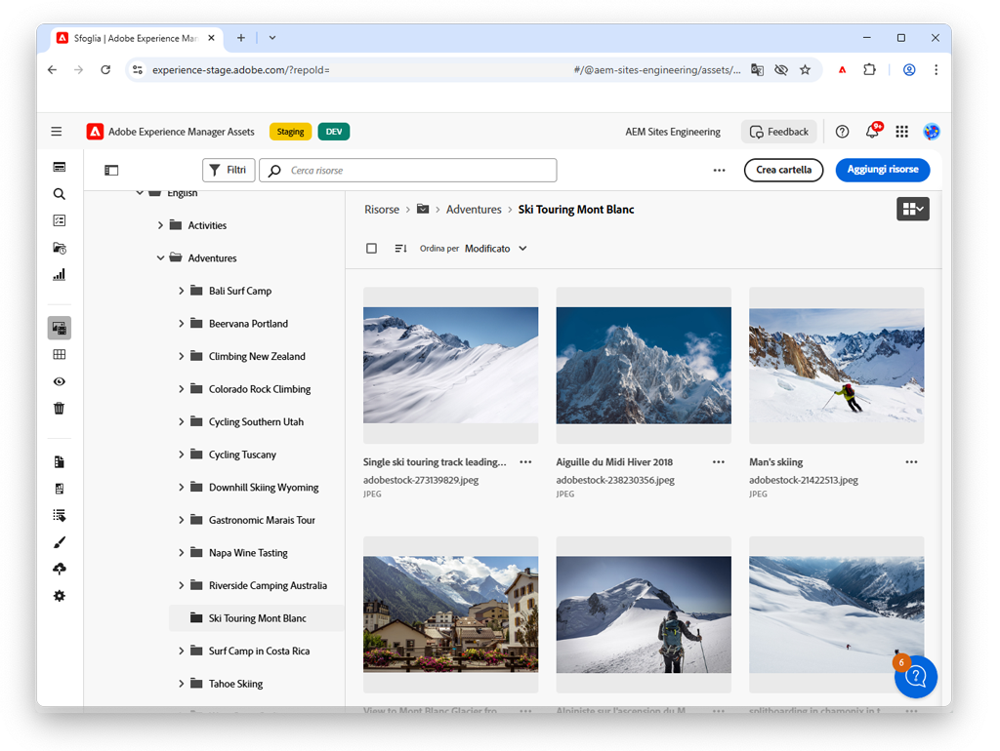

# Video sugli Assets Essentials

Experience Manager Assets Essentials offre un’interfaccia utente semplificata per una gestione semplificata delle risorse e la collaborazione.

Guarda questi video su come utilizzare gli Assets Essentials per gestire le tue risorse e come integrarli con Adobe Workfront e Adobe Percorsi Orchestrator.

## Ulteriori informazioni sugli Assets Essentials

<table>
<td>
   
   

      <a href="./basics/managing.md">
      <strong>Guida introduttiva agli Assets Essentials</strong>
      </a>
   

   

      <em>Scopri le nozioni di base degli Assets Essentials!</em>
   

</td>
<td>
   
   

      <a href="https://experienceleague.adobe.com/docs/experience-manager-assets-essentials/help/introduction.html?lang=it">
      <strong>Documentazione Assets Essentials</strong>
      </a>
   

   

      <em>Consulta la documentazione degli Assets Essentials!</em>
   

</td>
<td>
   
   

      <a href="https://experienceleague.adobe.com/docs/journey-optimizer-learn/tutorials/create-messages/create-email-content-with-the-message-editor.html?lang=it">
      <strong>Integrazione Adobe Journey Optimizer</strong>
      </a>
   

   

      <em>Scopri come gli Assets Essentials si integrano con Adobe Journey Optimizer!</em>
   

</td>
</table>
