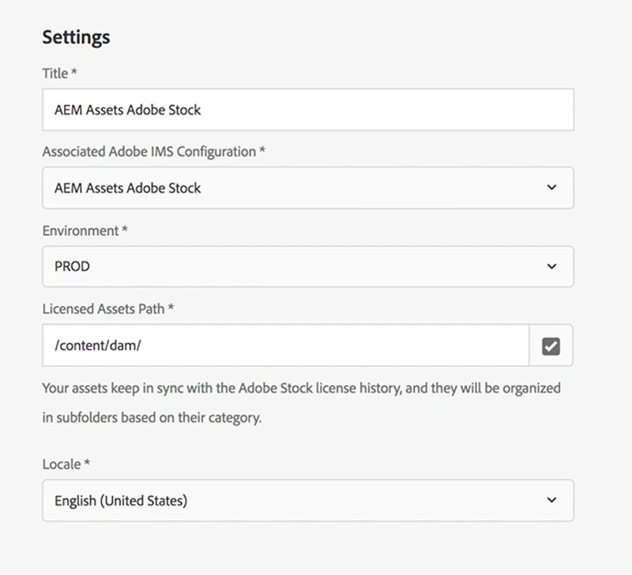

# Utilizzo di Adobe Stock con AEM Assets{#using-adobe-stock-assets-with-aem-assets}

AEM 6.4.2 consente agli utenti di cercare, visualizzare in anteprima, salvare e concedere in licenza le risorse Adobe Stock direttamente dall’AEM. Le organizzazioni possono ora integrare il proprio piano aziendale Adobe Stock con AEM Assets per assicurarsi che le risorse concesse in licenza siano ora ampiamente disponibili per i loro progetti creativi e di marketing, con le potenti funzionalità di gestione delle risorse dell’AEM.

>[!VIDEO](https://video.tv.adobe.com/v/24678?quality=12&learn=on)

>[!NOTE]
>
>L&#39;integrazione richiede un [piano Enterprise Adobe Stock](https://landing.adobe.com/en/na/products/creative-cloud/ctir-4625-stock-for-enterprise/index.html) e AEM 6.4 con almeno Service Pack 2 distribuiti. Per informazioni dettagliate sul service pack AEM 6.4, consulta le [note sulla versione](https://helpx.adobe.com/it/experience-manager/6-4/release-notes/sp-release-notes.html).

L’integrazione tra Adobe Stock e AEM Assets consente agli autori di contenuti e agli esperti di marketing di concedere facilmente in licenza e utilizzare le risorse disponibili per scopi creativi o di marketing. Puoi eseguire una ricerca di risorse Stock utilizzando Omni Search, aggiungendo il filtro di posizione come Adobe Stock oppure navigando nella navigazione principale di AEM Assets e facendo clic sull’icona Ricerca nell’interfaccia utente di Adobe Stock Coral.

## Funzionalità

### Cerca e salva

* Esegui la ricerca di risorse Adobe Stock senza uscire dall’area di lavoro AEM.
* Salva le risorse Adobe Stock per l’anteprima, senza concedere la licenza per la risorsa.
* Possibilità di concedere in licenza e salvare le risorse Adobe Stock in AEM Assets
* Possibilità di cercare risorse simili da Adobe Stock nell’interfaccia di AEM Assets
* Visualizzare una risorsa selezionata da Stock Search in AEM Assets sul sito web di Adobe Stock
* I file di risorse concessi in licenza sono contrassegnati da un contrassegno blu per una facile identificazione

### Metadati risorsa

* La risorsa concessa in licenza viene memorizzata in AEM Assets. Le proprietà della risorsa contengono metadati Stock in una scheda separata dei metadati della risorsa
* Possibilità di aggiungere riferimenti di licenza ai metadati delle risorse

### Profilo scorte risorse

* Un utente può selezionare il profilo Adobe Stock in *Utente > Preferenze > Configurazione Stock*
* È possibile aggiungere riferimenti obbligatori e opzionali alla finestra Asset Licensing.
* Possibilità di scegliere la lingua preferita per la finestra Asset Licensing in base all’area geografica.

### Filtro

* L’utente può filtrare le risorse stock in base al tipo di risorsa, all’orientamento e alla visualizzazione simile
* Il tipo di risorsa include foto, illustrazioni, vettori, video, modelli, 3D, Premium, editoriale
* L&#39;orientamento include Orizzontale, Verticale e Quadrato.
* Visualizza filtro simile richiede il numero di file Adobe Stock

### Controllo accesso

* Durante la configurazione del servizio cloud Adobe Stock, gli amministratori possono fornire a determinati utenti/gruppi le autorizzazioni per la licenza delle risorse di magazzino.
* Se un utente/gruppo specifico non dispone delle autorizzazioni necessarie per concedere le licenze per le risorse in stock, la funzionalità *Ricerca risorse in stock/Licenze risorse* verrà disabilitata.

## Configurare Adobe Stock con AEM Assets{#set-up-adobe-stock-with-aem-assets}

AEM 6.4.2 consente agli utenti di cercare, visualizzare in anteprima, salvare e concedere in licenza le risorse Adobe Stock direttamente dall’AEM. Questo video illustra rapidamente come impostare le scorte di Adobi con AEM Assets utilizzando Adobe I/O Console.

>[!VIDEO](https://video.tv.adobe.com/v/25043?quality=12&learn=on)

>[!NOTE]
>
>Per la configurazione del servizio Adobe Stock Cloud, è necessario selezionare l&#39;ambiente di produzione e il percorso della risorsa concessa in licenza su `/content/dam`. Il campo Ambiente viene ora rimosso nell’AEM.

>[!NOTE]
>
>L&#39;integrazione richiede un [piano Enterprise Adobe Stock](https://landing.adobe.com/en/na/products/creative-cloud/ctir-4625-stock-for-enterprise/index.html) e AEM 6.4 con almeno [Service Pack 2](https://experience.adobe.com/#/downloads/content/software-distribution/en/aem.html?fulltext=AEM*+6*+4*+Service*+Pack*&amp;2_group.propertyvalues.property=.%2Fjcr%3Acontent%2Fmetadata%2Fdc%3Aversion&amp;2_group.propertyvalues.operation=equals&amp;2_group.propertyvalues.0_values=target-version%3Aaem%2F6-4&amp;3_group.propertyvalues.property=.%2Fjcr%3Acontent%2Fmetadata%2Fdc%3AsoftwareType&amp;3_group.propertyvalues.operation=equals&amp;3_group.propertyvalues.0_values=tipo-software%3Aservice-and-cumulative-fix&amp;orderby=%40jcr%3Acontent%2Fmetadata%2Fdc%3Atitle&amp;orderby.sort=asc&amp;layout=list&amp;p.offset=0&amp;p.limit=24) distribuiti. Per informazioni dettagliate sul service pack AEM 6.4, consulta le [note sulla versione](https://helpx.adobe.com/it/experience-manager/6-4/release-notes/sp-release-notes.html). Per configurare l&#39;integrazione, è inoltre necessario disporre delle autorizzazioni di amministratore per [Adobe I/O Console](https://console.adobe.io/), [Adobe Admin Console](https://adminconsole.adobe.com/) e Adobe Experience Manager.

### Installazione {#installations}

* Per AEM 6.4, è necessario installare [AEM Service Pack 2](https://experience.adobe.com/#/downloads/content/software-distribution/en/aem.html?fulltext=AEM*+6*+4*+Service*+Pack*&amp;2_group.propertyvalues.property=.%2Fjcr%3Acontent%2Fmetadata%2Fdc%3Aversion&amp;2_group.propertyvalues.operation=equals&amp;2_group.propertyvalues.0_values=target-version%3Aaem%2F6-4&amp;3_group.propertyvalues.property=.%2Fjcr%3Acontent%2Fmetadata%2Fdc%3AsoftwareType&amp;3_group.propertyvalues.operation=equals&amp;3_group.propertyvalues.0_values=tipo-software%3Aservice-and-cumulative-fix&amp;orderby=%40jcr%3Acontent%2Fmetadata%2Fdc%3Atitle&amp;orderby.sort=asc&amp;layout=list&amp;p.offset=0&amp;p.limit=24) e quindi reinstallare il file cq-dam-stock-integration-content-1.0.4.zip.
* Assicurati di disporre delle autorizzazioni di amministratore per [Adobe I/O Console](https://console.adobe.io/), [Adobe Admin Console](https://adminconsole.adobe.com/) e Adobe Experience Manager per configurare l&#39;integrazione.

#### Configurare la configurazione Adobe IMS tramite la console Adobe I/O {#set-up-adobe-ims-configuration-using-adobe-i-o-console}

1. Crea una configurazione account tecnico Adobe IMS in **Strumenti > Sicurezza**
2. Seleziona *Soluzione cloud* come *Adobe Stock* e crea un nuovo certificato o riutilizza un certificato esistente per la configurazione.
3. Passa a Adobe I/O Console e crea una nuova integrazione dell&#39;account di servizio per *Adobe Stock*.
4. Carica il certificato dal passaggio 2 all’integrazione dell’account di servizio Adobe Stock.
5. Scegli la configurazione del profilo Adobe Stock richiesta e completa l’integrazione del servizio.
6. Utilizza i dettagli di integrazione per completare la configurazione dell’account tecnico Adobe IMS
7. Assicurati di poter ricevere il token di accesso utilizzando l’account tecnico Adobe IMS.

#### Configurare i Cloud Service Adobe Stock {#set-up-adobe-stock-cloud-services}

1. Crea una nuova configurazione del servizio cloud per Adobe Stock in **Strumenti > Cloud Service.**
2. Seleziona la *configurazione Adobe IMS* creata nella sezione precedente per la *configurazione Adobe Stock Cloud*

3. Accertarsi di selezionare **ENVIRONMENT** come PROD.
4. **Il percorso della risorsa concessa in licenza** può essere indirizzato a qualsiasi directory in `/content/dam`.
5. Selezionare la lingua e completare l&#39;installazione.
6. Puoi anche aggiungere utenti/gruppi al servizio Adobe Stock Cloud per abilitare l’accesso a utenti o gruppi specifici.

### Risorse aggiuntive

* [Piano azionario aziendale](https://landing.adobe.com/en/na/products/creative-cloud/ctir-4625-stock-for-enterprise/index.html)
* [Note sulla versione di AEM 6.4 Service Pack 2](https://experienceleague.adobe.com/docs/experience-manager-65/release-notes/release-notes.html?lang=it)
* [Integrare AEM e Adobe Stock](https://experienceleague.adobe.com/docs/experience-manager-65/assets/using/aem-assets-adobe-stock.html)
* [API di integrazione console Adobe I/O](https://www.adobe.io/apis/cloudplatform/console/authentication/gettingstarted.html)
* [Documentazione API di Adobe Stock](https://www.adobe.io/apis/creativecloud/stock/docs.html)
