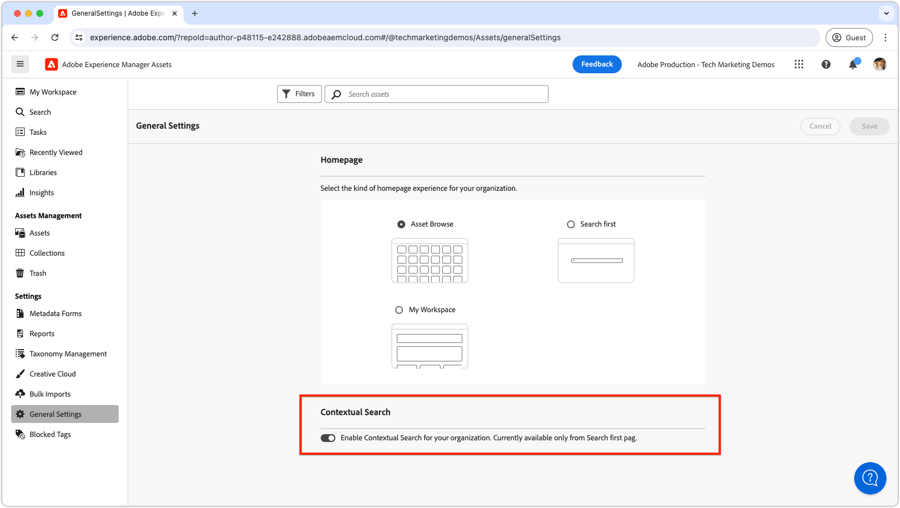

# Ricerca contestuale

Scopri come utilizzare la ricerca contestuale in Adobe Experience Manager Assets per trovare in modo efficiente le risorse con query in linguaggio naturale.

>[!VIDEO](https://video.tv.adobe.com/v/3428667/?learn=on)

## Attiva/disattiva ricerca contestuale

Per abilitare o disabilitare la ricerca contestuale per tutti gli utenti, gli amministratori di AEM possono passare alle __Impostazioni generali__ e impostare il parametro __Ricerca contestuale__ sull'impostazione desiderata.

Per impostazione predefinita, la ricerca contestuale è abilitata per tutti gli utenti.

