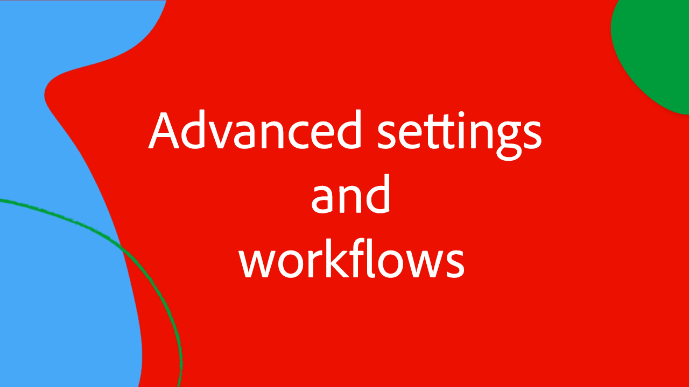

# Workfront per Experience Manager connettore avanzato serie Expert

Partecipa agli esperti Adobe Workfront e Experience Manager Assets di questa serie di video in quattro parti per illustrare e discutere gli ingressi e le uscite di Workfront per Experience Manager il connettore avanzato.

Questa serie di esperti in quattro parti fa seguito a un gruppo di esperti di Adobe - da product manager, consulenti e partner di Adobe - che discutono:

1. [Esecuzione delle configurazioni di configurazione iniziali in Workfront e AEM](./setup.md)
2. [Configurazione della sincronizzazione dei metadati tra moduli personalizzati Workfront e AEM](./custom-forms.md)
3. [Utilizzo di tag AEM, cartelle collegate a progetti, Adobe gli schemi di collegamento risorse e metadati cartelle per massimizzare il valore](./aem-tags-project-linked-folders-and-folder-metadata.md)
4. [Utilizzo di flussi di lavoro AEM avanzati per semplificare i processi aziendali in AEM e Workfront e altre impostazioni avanzate](./advanced-settings-and-workflows.md)

<table>
  <td>
      
      

         <a href="./setup.md"><strong>Configurazione e configurazione iniziale</strong></a>
          <em>Parte 1/4</em>
      

      

         
         Scopri come impostare ed eseguire la configurazione iniziale di Workfront per un connettore avanzato Experience Manager.
      

   </td>
   <!-- Workfront custom forms and metadata mapping -->
   <td>
      
      

         <a href="./custom-forms.md"><strong>Mappatura di moduli personalizzati e metadati Workfront</strong></a>
          <em>Parte 2/4</em>
      

      

         
         Scopri i moduli personalizzati Workfront e come sono mappati a schemi di metadati Experience Manager Assets per sincronizzare i dati.
      

    </td>
    <!-- AEM Tags, project linked folders, and folder metadata -->
    <td>
      
      

         <a href="./aem-tags-project-linked-folders-and-folder-metadata.md"><strong>Tag AEM, cartelle collegate a un progetto e metadati di cartelle</strong></a>
          <em>Parte 3/4</em> 
      

      

         
            Scopri come gestire AEM tassonomia da Workfront, utilizzare le cartelle collegate ai progetti e i dati per AEM metadati delle cartelle di risorse.
      

   </td>   
   <!-- Advanced workflows -->
    <td>
      
      

         <a href="./advanced-settings-and-workflows.md"><strong>Impostazioni avanzate e flussi di lavoro</strong></a>
          <em>Parte 4/4</em>
      

      

         
            Scopri come configurare le impostazioni avanzate per Workfront per AEM connettore avanzato, gestire la sincronizzazione dati utilizzando flussi di lavoro avanzati.
      

   </td>
  </tr>  
</tbody></table>
