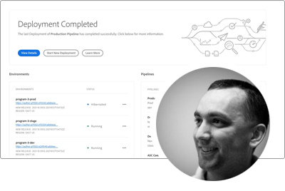

# Serie di esperti Adobe Experience Manager as a Cloud Service

Scopri Adobe Experience Manager (AEM) as a Cloud Service dagli ingegneri esperti di Adobe che lo costruiscono e dal team di servizi professionali che lo forniscono. Unisciti agli esperti Adobi per esplorare ciò che AEM as a Cloud Service è, come è lo stesso e diverso da AEM 6, e come passare da AEM 6 a AEM as a Cloud Service.

  
 

## Guida introduttiva ad AEM as a Cloud Service

Scopri i fondamenti di AEM come Cloud Services e come differisce da AEM 6, dagli architetti di Adobe di Senior Cloud.

<table>
  <tr>
   <td>
      
      

         <a href="./migration/moving-to-aem-as-a-cloud-service/introduction.md"><strong>Pensare diversamente</strong></a>         
          <em>con Darin Kuntze, architetto senior del cloud</em>
      

      

         
         Scopri AEM’architettura di as a Cloud Service e come pensare diversamente alle implementazioni as a Cloud Service AEM.
      

     </td>   
     <td>
      
      

         <a href="./migration/moving-to-aem-as-a-cloud-service/onboarding.md"><strong>Onboarding a AEM as a Cloud Service</strong></a>
          <em>con Damian Langsweirdt, architetto senior del cloud</em>
      

      

         
         Scopri come effettuare l’onboarding AEM as a Cloud Service, a partire dalla fase del contratto per la configurazione di ambienti self-service tramite Cloud Manager.
      

   </td>     
   </td>   
     <td>
      
      

         <a href="./migration/moving-to-aem-as-a-cloud-service/cloud-manager.md"><strong>Cloud Manager per AEM as a Cloud Service</strong></a>
          <em>con Bryan Stopp, architetto senior di Cloud</em>
      

      

         
         Scopri Cloud Manager per AEM as a Cloud Service e le sue differenze con Cloud Manager per AEM in Adobe Manage Services (AMS).
      

   </td> 
  </tr>
</table>

## Passaggio ad AEM as a Cloud Service?

Pianifica il passaggio da AEM 6 a AEM as a Cloud Service? Scopri la metodologia di Adobe per il passaggio a AEM as a Cloud Service, nonché i vari strumenti e funzionalità che rendono questa transizione fluida.

<table>
  <tr>
   <td>
      
      

         <a href="./migration/moving-to-aem-as-a-cloud-service/bpa-and-cam.md" target="_aem-experts-series-video"><strong>Metodologia di migrazione</strong></a>
          <em>con Roger Blanton, Adobe Consulting Services Technical Architect</em>
      

      

         
        Osserva la metodologia di migrazione delle best practice per passare da AEM 6 a AEM as a Cloud Service utilizzando AEM Best Practice Analyzer (BPA) e Cloud Acceleration Manager (CAM).
      

   </td>   
     <td>
      
      

         <a href="./migration/moving-to-aem-as-a-cloud-service/aem-modernization-tools.md" target="_aem-experts-series-video"><strong>Modernizzazione dei contenuti</strong></a>
          <em>con Bryan Stopp, architetto senior di Cloud</em>
      

      

         
         Scopri come modernizzare automaticamente il contenuto AEM per sfruttare le funzioni as a Cloud Service AEM più recenti.
      

   </td>     
   </td>   
     <td>
      
      

         <a href="./migration/moving-to-aem-as-a-cloud-service/repository-modernization.md" target="_aem-experts-series-video"><strong>Modernizzazione del progetto Maven AEM</strong></a>
          <em>con Varun Mitra, architetto cloud</em>
      

      

         
         Scopri come modernizzare automaticamente la struttura e l’organizzazione del progetto Maven dell’applicazione AEM personalizzata in modo che sia AEM compatibile con l’as a Cloud Service e in linea con le ultime best practice di Adobe.
      

   </td> 
  </tr>
  <tr>
   <td>
      
      

         <a href="./migration/moving-to-aem-as-a-cloud-service/search-and-indexing.md" target="_aem-experts-series-video"><strong>Modernizzazione degli indici Oak</strong></a>
          <em>con Darin Kuntze, architetto senior del cloud</em>
      

      

         
        Scopri come convertire automaticamente le definizioni dell’indice Oak AEM 6 per renderle AEM compatibili con l’as a Cloud Service, nonché come mantenere gli indici Oak per AEM as a Cloud Service in futuro.
      

   </td>   
     <td>
      
      

         <a href="./migration/moving-to-aem-as-a-cloud-service/dispatcher.md" target="_aem-experts-series-video"><strong>Modernizzazione della configurazione del Dispatcher</strong></a>
          <em>con Bryan Stopp, architetto senior di Cloud</em>
      

      

         
         Scopri AEM Dispatcher per AEM as a Cloud Service, concentrandoti sulle modifiche di rilievo apportate da Dispatcher per AEM 6, sullo strumento di conversione di Dispatcher e su come utilizzare l’SDK degli strumenti di Dispatcher.
      

   </td>     
   </td>   
     <td>
      
      

         <a href="./migration/moving-to-aem-as-a-cloud-service/content-migration/content-transfer-tool.md" target="_aem-experts-series-video"><strong>Trasferimento dei contenuti a AEM as a Cloud Service</strong></a>
          <em>con Kiran Murugulla, Senior Cloud Architect</em>
      

      

         
         Scopri come lo strumento Content Transfer (Trasferimento contenuti) consente di migrare i contenuti a AEM as a Cloud Service da AEM 6.3+.
      

   </td> 
  </tr>  
</table>

## Funzionalità di AEM as a Cloud Services

Scopri AEM funzionalità esclusive di as a Cloud Service dagli esperti di Adobe.

<table>
  <tr>
   <td>
      
      

         <a href="./migration/moving-to-aem-as-a-cloud-service/asset-compute-microservices.md" target="_aem-experts-series-video"><strong>Microservizi di Asset compute</strong></a>
          <em>con Amol Anand, architetto principale di Cloud</em>
      

      

         
        Scopri gli Asset compute di Microsoft Services di AEM Assets, come sostituiscono l’elaborazione delle risorse AEM 6 e come possono essere estese per generare rappresentazioni personalizzate delle risorse.
      

   </td>   
  </tr>
</table>
