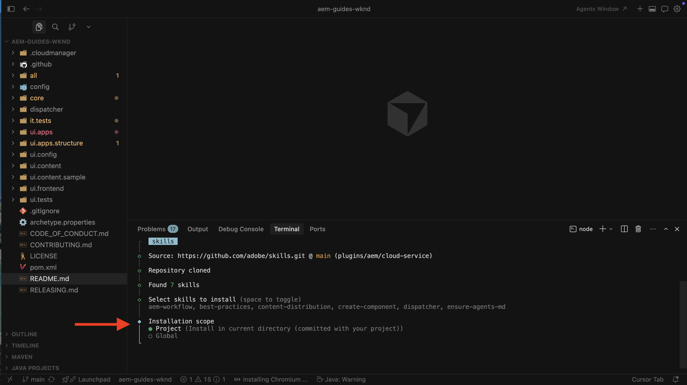

# Configurare le abilità dell’agente AEM

Scopri come configurare le competenze dell’agente AEM per lo sviluppo basato sull’intelligenza artificiale.

Quando chiedi a un agente di codifica, tramite un IDE basato sull&#39;intelligenza artificiale, di lavorare sulle attività di sviluppo di AEM, può utilizzare **Abilità dell&#39;agente AEM** linee guida procedurali di Adobe, invece di affidarsi solo all&#39;apprendimento generico dei modelli o a qualsiasi elemento possa derivare dal solo archivio.

Adobe fornisce le competenze AEM Agent tramite l&#39;archivio [Adobe Skills](https://github.com/adobe/skills). Consulta anche [Sviluppo assistito da IA](../overview.md) per informazioni su come Adobe supporta lo sviluppo assistito da IA.

In questo tutorial, installi le abilità su un clone locale del [progetto WKND Sites](https://github.com/adobe/aem-guides-wknd). Puoi utilizzare gli stessi passaggi per il tuo progetto AEM as a Cloud Service.

>[!VIDEO](https://video.tv.adobe.com/v/3484940/?learn=on&enablevpops)

## Prerequisiti

Per seguire questa esercitazione, è necessario quanto segue:

- Un clone locale del [progetto WKND Sites](https://github.com/adobe/aem-guides-wknd) o del tuo progetto AEM as a Cloud Service.
- Un IDE basato sull’intelligenza artificiale come Cursore o Codice Visual Studio con Copilota GitHub.

## Installare le competenze dell’agente AEM

Installa AEM Agent Skills con il comando `npx` (richiede [Node.js](https://nodejs.org/), quindi `npx` è disponibile). Per altre opzioni di installazione, ad esempio i plug-in Claude Code o l&#39;estensione CLI di GitHub, vedi la sezione [Installazione](https://github.com/adobe/skills/tree/main#installation) nell&#39;archivio delle abilità di Adobe.

1. Clona il [progetto WKND Sites](https://github.com/adobe/aem-guides-wknd) localmente:

   ```shell
   $ git clone https://github.com/adobe/aem-guides-wknd.git
   ```

1. Apri il progetto clonato nell’IDE basato sull’intelligenza artificiale (ad esempio, Cursore) e apri il terminale integrato.
   

1. Esegui il comando seguente per aggiungere le abilità dell’agente AEM per il cursore:

   ```shell
   $ npx skills add https://github.com/adobe/skills/tree/main/plugins/aem/cloud-service --agent cursor
   ```

   Per altri tipi di agenti, vedere la sezione [Installazione](https://github.com/adobe/skills/tree/main#installation) nell&#39;archivio Adobe Skills.

1. Quando richiesto, scegli l’agente AEM da installare.
   

   Selezionare l&#39;abilità **sure-agents-md** in modo che il programma di installazione possa creare file **AGENTS.md** e **CLAUDE.md** nella directory principale dell&#39;archivio. Questa abilità di avvio controlla il progetto, ad esempio la radice `pom.xml` e i moduli, e genera una guida dell&#39;agente personalizzata.

   Se **AGENTS.md** esiste già, **non** verrà sovrascritto.

1. Scegliere l&#39;ambito di installazione. Per questa procedura dettagliata, l&#39;ambito **Progetto** è tipico in modo che i file di abilità risiedano nell&#39;archivio.
   

1. Confermare l&#39;installazione in `.agents/skills`. Dovresti trovare **SKILLS.md** e le cartelle di riferimento e risorse correlate.
   

1. Quando Adobe aggiunge o aggiorna le abilità, utilizza CLI per aggiungerle, aggiornarle, rimuoverle o elencarle. Per visualizzare tutti i comandi:

   ```shell
   $ npx skills --help
   ```

   

## Casi d’uso

<!-- 
CARDS
{target = _self}

* ../use-cases/component-development.md    
    {title = Create AEM Component with AI-assisted development}
    {description = Learn how to use AI-assisted development to develop AEM components.}
    {image = ../assets/component-development/review-generated-code.png}
    {cta = Create AEM Component}
-->
<!-- START CARDS HTML - DO NOT MODIFY BY HAND -->
<div class="columns">
    <div class="column is-half-tablet is-half-desktop is-one-third-widescreen" aria-label="Create AEM Component with AI-assisted development">
        <div class="card" style="height: 100%; display: flex; flex-direction: column; height: 100%;">
            <div class="card-image">
                <figure class="image x-is-16by9">
                    <a href="../use-cases/component-development.md" title="Creare un componente AEM con sviluppo basato sull’intelligenza artificiale" target="_self" rel="referrer">
                        
                    </a>
                </figure>
            </div>
            <div class="card-content is-padded-small" style="display: flex; flex-direction: column; flex-grow: 1; justify-content: space-between;">
                <div class="top-card-content">
                    <p class="headline is-size-6 has-text-weight-bold">
                        <a href="../use-cases/component-development.md" target="_self" rel="referrer" title="Creare un componente AEM con sviluppo basato sull’intelligenza artificiale">Creare un componente AEM con sviluppo basato sull'intelligenza artificiale</a>
                    </p>
                    <p class="is-size-6">Scopri come utilizzare lo sviluppo basato sull’intelligenza artificiale per sviluppare componenti AEM.</p>
                </div>
                <a href="../use-cases/component-development.md" target="_self" rel="referrer" class="spectrum-Button spectrum-Button--outline spectrum-Button--primary spectrum-Button--sizeM" style="align-self: flex-start; margin-top: 1rem;">
                    <span class="spectrum-Button-label has-no-wrap has-text-weight-bold">Crea componente AEM</span>
                </a>
            </div>
        </div>
    </div>
</div>
<!-- END CARDS HTML - DO NOT MODIFY BY HAND -->

## Risorse aggiuntive

- [Sviluppo locale con strumenti AI](https://experienceleague.adobe.com/it/docs/experience-manager-cloud-service/content/ai-in-aem/local-development-with-ai-tools)

- [Abilità di Adobe per gli agenti di codifica AI](https://github.com/adobe/skills)

- [AGENTS.md](https://agents.md/)

- [Abilità agente](https://agentskills.io/home)
