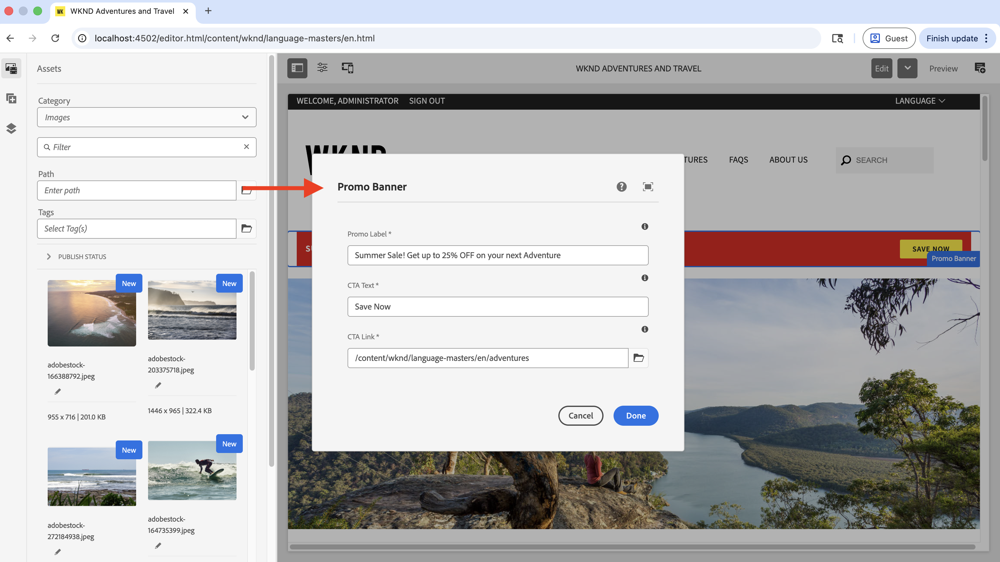

# Sviluppo di componenti con AEM Agent Skills

Scopri come sviluppare un componente AEM utilizzando le competenze dell&#39;agente AEM nell&#39;ambito dello sviluppo [assistito da IA](../overview.md).

In questa procedura dettagliata si utilizza il linguaggio naturale in un IDE basato sull&#39;intelligenza artificiale (ad esempio, Cursor) per sviluppare un componente **Banner promozionale** nel [progetto Sites WKND](https://github.com/adobe/aem-guides-wknd). L&#39;agente di codifica applica l&#39;abilità dell&#39;agente AEM `create-component` per generare l&#39;implementazione.

>[!VIDEO](https://video.tv.adobe.com/v/3484952/?learn=on&enablevpops)

## Prerequisiti

Per seguire questa esercitazione, è necessario quanto segue:

- Un IDE basato sull’intelligenza artificiale come Cursore o Codice Visual Studio con Copilota GitHub.
- Clone locale del [progetto WKND Sites](https://github.com/adobe/aem-guides-wknd), generato e distribuito in un&#39;istanza _AEM SDK_ locale.
- _AEM Agent Skills_ installato nel progetto. Se non l&#39;hai ancora fatto, completa [Imposta le abilità dell&#39;agente AEM](../setup/agent-skills.md).

## Fabbisogno componente

Supponiamo che il team WKND desideri visualizzare un banner promozionale nella home page e che il riferimento di progettazione sia il seguente:


Gli autori devono essere in grado di impostare i campi _Etichetta promozionale_, _Etichetta CTA_ e _Collegamento CTA_ nella finestra di dialogo del componente.

Il riferimento di progettazione è uno screenshot ottenuto tramite wireframe, mockup o acquisizione di markup statico.

## Sviluppare il componente

1. Apri il progetto WKND nell’IDE. Verificare che AEM Agent Skills sia presente (ad esempio, in `.agents/skills`), quindi avviare una nuova chat agente.
   

1. Immetti un prompt simile al seguente. Allega la schermata di progettazione del componente (ottenuta tramite wireframe, mockup o acquisizione di markup statico) se l’IDE supporta le immagini in chat:

   ```text
   Create a WKND Promo Banner Component. Please see attached screenshot for design reference.
   
   Dialog specification are:
   
   1. Promo Label - Textfield, required
   2. CTA Text - Textfield, required
   3. CTA Link - Pathfield, required
   ```

1. L&#39;agente di codifica utilizza l&#39;abilità dell&#39;agente AEM `create-component` per generare il componente. Esamina i file HTL, Sling Model, dialog XML proposti e i file correlati.
   

>[!TIP]
>
>Invece di fornire il riferimento di progettazione come schermata, puoi anche fornire una progettazione Figma tramite il server [Figma MCP](https://www.figma.com/mcp-catalog/) per generare il componente. L&#39;abilità `create-component` supporta l&#39;integrazione di progettazione [Figma](https://github.com/adobe/skills/blob/main/plugins/aem/cloud-service/skills/create-component/references/figma-design-rules.md)


1. Distribuisci il componente nell’istanza AEM/SDK locale.

   ```shell
   $ mvn clean install -PautoInstallSinglePackage
   ```

1. Durante l’authoring, inserisci il banner promozionale nella pagina Home e convalida il comportamento. Affina l’implementazione se diverge ancora dal riferimento della progettazione.
   

1. Rivedi il componente appena creato pubblicando la pagina o Visualizza come pubblicato.
   

Congratulazioni. È stato creato un nuovo componente AEM utilizzando AEM Agent Skills nell’ambito dello sviluppo assistito da intelligenza artificiale.

## Oltre i componenti semplici

In questa procedura dettagliata viene utilizzato un componente semplice. La stessa abilità `create-component` supporta anche casi più ricchi, tra cui:

- Campi con più campi e finestre di dialogo nidificate
- Estensioni dei Componenti core di AEM (inclusi i modelli di Sling Resource Merger)
- URL di file Figma o frame per layout e stile, quando il server Figma MCP (ad esempio `plugin-figma-figma`) è abilitato nell&#39;IDE

Per i tipi di campo, i modelli di finestre di dialogo, le regole Figma e gli esempi, leggere `SKILL.md` nella cartella abilità installata, ad esempio `.agents/skills/create-component/SKILL.md`.

Per una panoramica, i percorsi di installazione per IDE e la risoluzione dei problemi, vedere [AEM Component Development Agent](https://github.com/adobe/skills/blob/main/plugins/aem/cloud-service/skills/create-component/README.md) nell&#39;archivio Adobe Skills.

## AGENTS.md

Prima di concludere, comprendiamo come è stato generato AGENTS.md durante la creazione del componente.

Per i progetti AEM as a Cloud Service, l&#39;abilità di avvio di `ensure-agents-md` (selezionata durante l&#39;installazione di [Competenze agente AEM](../setup/agent-skills.md)) crea `AGENTS.md` nella radice del repository quando è **mancante**. Utilizza ciò che apprende dal layout del progetto.

**not** sovrascrive un file `AGENTS.md` esistente.


## Risorse aggiuntive

- [Sviluppo locale con strumenti AI](https://experienceleague.adobe.com/it/docs/experience-manager-cloud-service/content/ai-in-aem/local-development-with-ai-tools)

- [Abilità di Adobe per gli agenti di codifica AI](https://github.com/adobe/skills)

- [AGENTS.md](https://agents.md/)

- [Abilità agente](https://agentskills.io/home)
