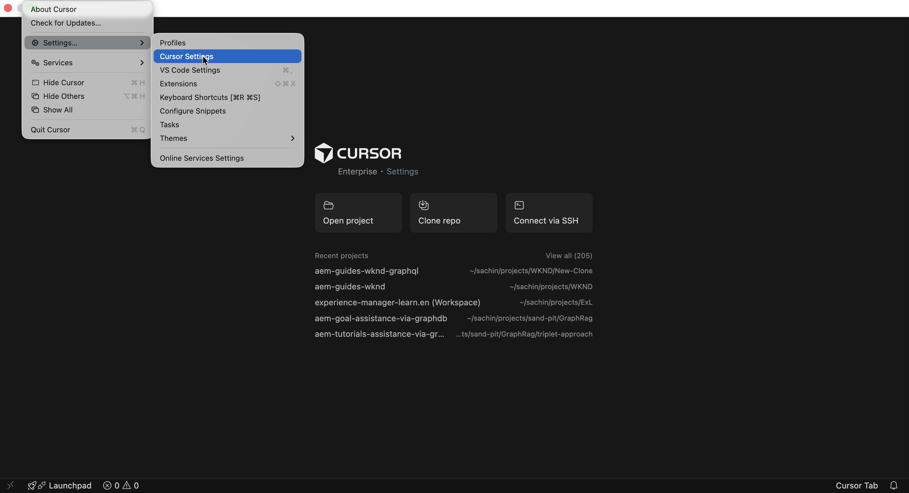

# Accelerazione delle operazioni sui contenuti AEM tramite Content MCP Server

Utilizza il **Content MCP Server** da un IDE basato sull&#39;intelligenza artificiale come [Cursor IDE](https://www.cursor.com/) per lavorare con contenuti AEM in linguaggio naturale, senza codice API di basso livello o navigazione nell&#39;interfaccia utente.

In questo tutorial _rivedi_ i dettagli dei frammenti di contenuto di Adventure, _aggiorna_ un frammento (ad esempio, il prezzo di un&#39;avventura) e _verifica_ la modifica nell&#39;app [WKND Adventures React](https://github.com/adobe/aem-guides-wknd-graphql/tree/main/react-app), tutto dall&#39;IDE rispetto a un ambiente AEM _inferiore_ (RDE o Sviluppo) senza uscire dal flusso MCP.

## Panoramica

AEM as a Cloud Service fornisce _Server MCP_ per consentire all&#39;app IDE o di chat di funzionare con AEM in modo sicuro. Il server **Content MCP** supporta pagine, frammenti e risorse. Per ulteriori informazioni, vedere [Server MCP in AEM](./overview.md).

## Come Possono Utilizzarlo Gli Sviluppatori

Connetti l&#39;[IDE cursore](https://www.cursor.com/) al server Content MCP ed esegui lo scenario seguente.

### Configurazione - Server MCP dei contenuti in cursore

Configuriamo il server Content MCP in Cursor con questi passaggi.

1. Apri il cursore sul computer.

1. Vai a **Impostazioni** > **Impostazioni cursore** dal menu Cursore per aprire la finestra delle impostazioni.
   

1. Nella barra laterale a sinistra, fai clic su **Strumenti e MCP** per aprire il pannello.
   

1. Fai clic su **Aggiungi MCP personalizzato** o **Nuovo server MCP** per aprire `mcp.json`, quindi incolla questa configurazione:

   ```json
   {
       "mcpServers": {
           // Use this for create, read, update, and delete operations
           "AEM-RDE-Content": {
               "url": "https://mcp.adobeaemcloud.com/adobe/mcp/content"
           },
           //Use this for read-only operations
           "AEM-RDE-Content-Read-Only": {
               "url": "https://mcp.adobeaemcloud.com/adobe/mcp/content-readonly"
           }
       }
   }
   ```

   >[!CAUTION]
   >
   > Ai fini dell&#39;esercitazione, la configurazione precedente aggiunge sia **Content** che **Content (sola lettura)** per questa esercitazione. In pratica, il contenuto **Content** include già tutte le offerte **Content (sola lettura)**, oltre agli strumenti di creazione, aggiornamento ed eliminazione.
   >
   >
   > Per evitare la creazione, la modifica o l&#39;eliminazione di contenuto, configurare solo il contenuto **Contenuto (sola lettura)** (`/content-readonly`) e omettere il contenuto **Contenuto** (`/content`). In questo modo si evitano modifiche accidentali.

   

1. Nella finestra Impostazioni cursore, fare clic su **Connetti** per avviare il processo di autenticazione. Utilizza il flusso PKCE OAuth 2.0 per ottenere il **token di accesso specifico dell&#39;utente** per accedere al server MCP di AEM.
   

1. Accedi con il tuo Adobe ID, quindi torna alla finestra Impostazioni cursore.
   

1. Verificare che **AEM-RDE-Content-Read-Only** e **AEM-RDE-Content** siano connessi. È possibile espandere ogni server per visualizzare i relativi strumenti.

   

### Configurazione - App di reazione WKND Adventures

Quindi, imposta l&#39;[app WKND Adventures React](https://github.com/adobe/aem-guides-wknd-graphql/tree/main/react-app) in Cursor.

1. Clona questi due repository sul tuo computer:

   ```bash
   ## WKND GraphQL repo, the `react-app` folder is the WKND Adventures app
   $ git clone git@github.com:adobe/aem-guides-wknd-graphql.git
   
   ## WKND Site repo, you deploy this to RDE so the app can use its content fragments data via GraphQL
   $ git clone git@github.com:adobe/aem-guides-wknd.git
   ```

1. Distribuisci il progetto [WKND Site](https://github.com/adobe/aem-guides-wknd) nel tuo RDE. Per i passaggi dettagliati, vedi [Come utilizzare l&#39;ambiente di sviluppo rapido](https://experienceleague.adobe.com/it/docs/experience-manager-learn/cloud-service/developing/rde/how-to-use#deploy-aem-artifacts-using-the-aem-rde-plugin).

1. Aprire la cartella `react-app` nell&#39;IDE.

1. Modifica `.env.development` e imposta:
   - `REACT_APP_HOST_URI`: l&#39;URL dell&#39;autore RDE
   - `REACT_APP_AUTH_METHOD`: da `basic`
   - `REACT_APP_BASIC_AUTH_USER` e `REACT_APP_AEM_AUTH_PASSWORD`: per essere `aem-headless` (creare questo utente in RDE e aggiungerlo al gruppo `administrators`)

1. Dal terminale IDE, eseguire:

   ```bash
   $ cd aem-guides-wknd-graphql/react-app
   $ npm install
   $ npm start
   ```

1. Nel browser, passa a [http://localhost:3000](http://localhost:3000) per visualizzare l&#39;app WKND Adventures.

   

### Scenario di produttività: revisione e aggiornamento dei contenuti di AEM

Supponiamo che tu debba mostrare un banner _OFFERTA CALDA_ sulle schede Avventura quando viene soddisfatta una semplice regola. L’approccio abituale sarebbe:

- Osserva il codice del componente per le schede Avventura
- Aggiungi la logica che determina quando visualizzare il banner
- Controlla il modello per frammenti di contenuto Adventure in AEM
- Modifica una o più proprietà del frammento Adventure per testare la regola

Per semplificare le cose, mostriamo il banner _HOT DEAL_ quando il prezzo dell&#39;avventura è inferiore a 100 $.

Poiché l’app React ottiene i dati dall’ambiente RDE, è necessario conoscere il modello per frammenti di contenuto di Adventure e quindi aggiornare le proprietà giuste del frammento. Questo è esattamente ciò che il server AEM Content MCP può aiutare con. Ecco come.

1. In Cursore, apri una nuova chat e digita:

   ```text
   I want to review my Content Fragment Models from AEM RDE, can you list the Adventure Content Fragment details.
   ```

   


   Prima di richiamare il server Content MCP, richiede conferma per continuare. In questo modo, puoi mantenere il controllo sulle operazioni relative ai contenuti.

   IA utilizza il server Content MCP per recuperare i dati e quindi li presenta in modo chiaro e strutturato. Include i dettagli del modello per frammenti di contenuto, il numero di frammenti e le informazioni di riepilogo.

1. Per attivare il banner _OFFERTA CALDA_, aggiorna il prezzo di un&#39;avventura. Nella stessa chat, prova:

   ```text
   Can you update adventure Beervana in Portland's price to 99.99
   ```

   

   Analogamente, l’IA richiede la conferma per procedere prima di aggiornare il contenuto. Inoltre, riepiloga l’operazione sul contenuto prima e dopo l’aggiornamento.

1. Nell&#39;app React, verifica che nella scheda Beervana sia ora visualizzato il banner _OFFERTA CALDA_.

   

### Richieste aggiuntive

Prova questi prompt incentrati sul contenuto nell’IDE (con Content MCP Server connesso) per esplorare altri flussi di lavoro e funzionalità.

- Scopri contenuto:

  ```text
  List all content fragments in the WKND Adventures folder
  
  List all WKND Site pages from US English site
  
  Can you give me page metadata for Tahoe Skiing English page? 
  
  List assets of Bali Surf camp
  
  What Content Fragment models are available in this environment?
  ```

- Cerca contenuto:

  ```text
  Search for content fragments that mention 'cycling'
  
  Do we have a magazine page in US English site with "Camping" in it
  ```

- Aggiorna contenuto:

  ```text
  In WKND US English create a copy of Downhill Skiing Wyoming as "Test Downhill Skiing Wyoming"
  
  In newly created "Test Downhill Skiing Wyoming" please change title to "Duplicated Page"
  ```

- Pubblicazione o annullamento della pubblicazione:

  ```text
  Can you publish the page at /us/en/adventures/test-downhill-skiing-wyoming and give me publish page URL
  
  Can you unpublish the test-downhill-skiing-wyoming page
  ```

## Riepilogo

Il server AEM Content MCP è configurato in Cursor e collegato all’ambiente RDE (o di sviluppo). Hai quindi utilizzato l’app WKND Adventures React e hai chattato in linguaggio naturale per rivedere i dettagli dei frammenti di contenuto Adventure. Hai anche aggiornato il prezzo di un frammento con l’intelligenza artificiale chiedendo la tua conferma prima di ogni operazione di contenuto. Hai verificato la modifica nell’app in esecuzione. Puoi utilizzare lo stesso flusso incentrato sull’uomo dall’IDE per rivedere, aggiornare e creare contenuti AEM senza passare all’interfaccia utente di AEM o scrivere codice API di basso livello.
