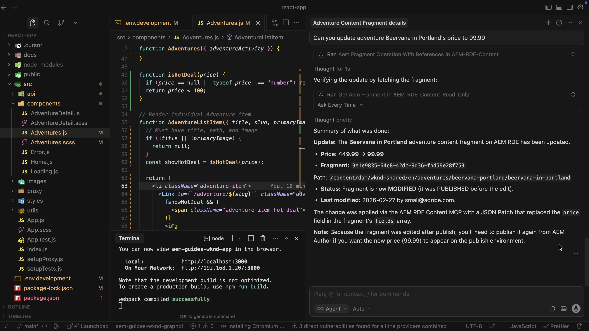

# Server MCP in AEM

Scopri come utilizzare i server AEM _Model Context Protocol (MCP)_ dalle applicazioni IDE basate su intelligenza artificiale o chat preferite per semplificare e accelerare il lavoro sui contenuti AEM. Invece di scrivere un codice API di basso livello o navigare attraverso l’interfaccia utente di AEM, descrivi ciò che desideri in un linguaggio naturale.

## Elenco dei server MCP di AEM

Tutti i server MCP di AEM sono disponibili in `https://mcp.adobeaemcloud.com/adobe/mcp/`. Per ulteriori informazioni, vedere [Utilizzo di MCP con AEM as a Cloud Service](https://experienceleague.adobe.com/en/docs/experience-manager-cloud-service/content/ai-in-aem/using-mcp-with-aem-as-a-cloud-service).

- **Contenuto** (`/content`): accesso completo per creare, leggere, aggiornare ed eliminare pagine, frammenti e risorse.
- **Contenuto (sola lettura)** (`/content-readonly`): sola lettura per elencare e ottenere pagine, frammenti e risorse (nessuna modifica).
- **Cloud Manager** (`/cloudmanager`): per gestire programmi, ambienti, archivi e pipeline di Adobe Cloud Manager.

>[!TIP]
>
>Gli strumenti esposti da ciascun server possono cambiare nel tempo. Per visualizzare ciò che è disponibile ora, chiedi all&#39;intelligenza artificiale di elencare tutti gli strumenti AEM MCP (ad esempio, `List all AEM MCP tools available from this server and describe what they do`) o digita il prompt `tools/list` nell&#39;IDE.

## Modelli di utilizzo per il server MCP

Prima di iniziare a utilizzare i server MCP di AEM, comprendiamo i due principali modelli di utilizzo per i server MCP:

- **Centrato sull&#39;uomo** - Sei al posto del conducente. Quando chiedi, l’intelligenza artificiale ti suggerisce o esegue gli strumenti nell’IDE.
- **Agente**: un&#39;applicazione agente (agente o agente secondario) chiama il server da sola, scegliendo gli strumenti e lavorando per un obiettivo con un input umano limitato.

Ecco come si confrontano questi due modelli di utilizzo:

| Aspetto | Incentrato sull&#39;uomo | Agentico |
| ------ | ------------- | ------- |
| **Chi gestisce le azioni** | Tu.   L&#39;intelligenza artificiale suggerisce o esegue gli strumenti necessari nell&#39;applicazione basata su IDE o Chat. | L&#39;intelligenza artificiale.   seleziona gli strumenti da utilizzare e continua con indicazioni minime. |
| **Autorità di decisione** | Tu rimani in controllo. Approva o attiva ogni passaggio. | L&#39;intelligenza artificiale ha più libertà. Le azioni ad alto impatto possono richiedere guardrail o approvazioni. |
| **Schema di utilizzo tipico** | **Per-developer**, utilizzalo dalla tua applicazione basata su IDE o Chat, uno sviluppatore per sessione, buono per il lavoro di sviluppo giornaliero. | **Condiviso** tramite un&#39;applicazione agente, come servizi condivisi e gateway per molti utenti o agenti. |
| **Più adatto per** | Revisione del contenuto, esecuzione di aggiornamenti guidati, esplorazione o ripetizione di attività mentre si resta nel loop. | Flussi di lavoro agenti, processi batch, pipeline e obiettivi in cui il sistema deve essere eseguito con il minimo intervento. |

### Quando si utilizza MCP in Agentic Systems

I server MCP sono progettati per **client MCP gestiti dall&#39;utente** con interfaccia utente interattiva e supervisione umana. La specifica degli strumenti MCP consiglia a _un utente nel ciclo_ che può approvare o negare le chiamate allo strumento.

Se utilizzi i server MCP in un sistema agente o autonomo, considera tale livello di compatibilità come separato. **non utilizzare nomi di strumenti hardcode** in _prompt_, _inserisce nell&#39;elenco Consentiti_ o _logica di routing_. In MCP, il _nome strumento_ è un identificatore programmatico, la _descrizione_ è l&#39;hint rivolto al modello per LLM. Preferisci funzionalità o descrizione basata su prompt e selezione.

Implementa l&#39;individuazione runtime tramite `tools/list`, gestisci le modifiche all&#39;elenco strumenti (`notifications/tools/list_changed`) e allinea il provider del server MCP all&#39;onboarding e al controllo delle versioni se hai bisogno di garanzie di stabilità oltre la linea di base del protocollo.

## Entità MCP e relativa mappatura

MCP è basato su tre entità: **host**, **client** e **server**. La [specifica MCP](https://modelcontextprotocol.io/docs/getting-started/intro) li definisce formalmente. Tuttavia, la tabella seguente spiega ogni server in termini semplici e la relativa mappatura quando si utilizzano i server MCP di AEM.

| Componente | Definizione Standard | Quando si utilizzano i server MCP di AEM |
| --------- | ------------------- | ---------------- |
| **Host** | L’app che esegue tutto, raccoglie il contesto, parla con l’intelligenza artificiale, gestisce le autorizzazioni e crea client. | L&#39;host è l&#39;applicazione **IDE** (cursore) o basata su chat. Esegue il client MCP e determina quali strumenti e server utilizzare nella sessione. |
| **Client** | Una singola connessione dall’host a un server. Trasmette i messaggi avanti e indietro e mantiene l&#39;accesso di quel server separato dagli altri. | Il client **MCP** risiede nell&#39;applicazione basata su IDE o Chat. Quando si aggiunge il server AEM Content MCP in impostazioni, l&#39;applicazione basata su IDE o Chat crea un client che comunica con tale server. Le richieste e le chiamate allo strumento passano attraverso questo client. |
| **Server** | Servizio che espone strumenti, dati e prompt tramite MCP. Può essere eseguito sul computer o in remoto. | I **server AEM MCP** in hosting in Adobe offrono gli strumenti per creare, leggere, aggiornare ed eliminare pagine, frammenti di contenuto e risorse in modo che l&#39;intelligenza artificiale nell&#39;applicazione basata su IDE o Chat possa funzionare con il tuo ambiente AEM. |

In breve, **Host** è la tua applicazione basata su IDE o Chat, **Client** è la connessione dall&#39;applicazione basata su IDE o Chat ad AEM, **Server** è il server AEM MCP ospitato da Adobe che esegue il lavoro.

## Configurazione

I server MCP di AEM sono progettati per funzionare con un set definito di applicazioni compatibili con MCP. Sono ufficialmente supportate le seguenti applicazioni:

- [Claude antropico](https://claude.com/product/overview)
- [Cursore](https://www.cursor.com/)
- [ChatGPT OpenAI](https://chatgpt.com/)
- [Microsoft Copilot Studio](https://www.microsoft.com/en-us/microsoft-365-copilot/microsoft-copilot-studio)

Per ulteriori informazioni, vedere [Panoramica installazione](https://experienceleague.adobe.com/en/docs/experience-manager-cloud-service/content/ai-in-aem/using-mcp-with-aem-as-a-cloud-service#setup-overview).

## Casi d’uso

<!-- CARDS
{target = _self}

* ./accelerate-content-operations-with-aem-mcp-server.md    
  {title = Accelerate Content Operations with AEM MCP Server}
  {description = Learn how to use the AEM Content MCP Server from Cursor IDE to streamline and accelerate your AEM content work.}
  {image = ../assets/content-mcp-server/update-adventure-price-prompt-response.png}
  {cta = Learn Content MCP Server}

* ./cloud-manager.md
  {title = Cloud Manager MCP Server}
  {description = Learn how to use the AEM Cloud Manager MCP Server from Cursor IDE to streamline and accelerate your AEM cloud manager work.}
  {image = ../assets/cm-mcp-server/start-pipeline.png}
  {cta = Learn Cloud Manager MCP Server}
-->
<!-- START CARDS HTML - DO NOT MODIFY BY HAND -->

    

        

            

                <figure class="image x-is-16by9">
                    
                </figure>
            

            

                

                    

                        <a href="./accelerate-content-operations-with-aem-mcp-server.md" target="_self" rel="referrer" title="Accelerazione delle operazioni sui contenuti con AEM MCP Server">Accelera le operazioni sui contenuti con AEM MCP Server</a>
                    

                    
Scopri come utilizzare AEM Content MCP Server dall’IDE del cursore per semplificare e accelerare il lavoro sui contenuti AEM.

                

                <a href="./accelerate-content-operations-with-aem-mcp-server.md" target="_self" rel="referrer" class="spectrum-Button spectrum-Button--outline spectrum-Button--primary spectrum-Button--sizeM" style="align-self: flex-start; margin-top: 1rem;">
                    Scopri il server MCP dei contenuti
                </a>
            

        

    

    

        

            

                <figure class="image x-is-16by9">
                    
                </figure>
            

            

                

                    

                        <a href="./cloud-manager.md" target="_self" rel="referrer" title="Server Cloud Manager MCP">Server MCP Cloud Manager</a>
                    

                    
Scopri come utilizzare il server MCP di AEM Cloud Manager dall’IDE del cursore per semplificare e accelerare il lavoro di AEM Cloud Manager.

                

                <a href="./cloud-manager.md" target="_self" rel="referrer" class="spectrum-Button spectrum-Button--outline spectrum-Button--primary spectrum-Button--sizeM" style="align-self: flex-start; margin-top: 1rem;">
                    Informazioni su Cloud Manager MCP Server
                </a>
            

        

    

<!-- END CARDS HTML - DO NOT MODIFY BY HAND -->
