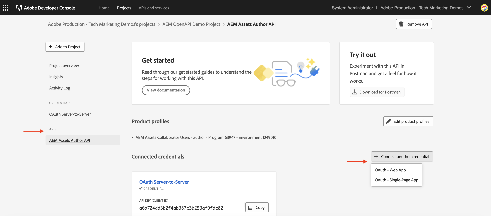

# Gestione delle credenziali API e del profilo di prodotto

Scopri come gestire _Credenziali e profilo di prodotto_ per le API AEM basate su OpenAPI.

Questa esercitazione spiega come aggiungere o rimuovere:

- _Credenziali_: fornire l&#39;autenticazione per un&#39;API AEM.
- _Profili di prodotto_: fornisci le autorizzazioni (o autorizzazioni) per le credenziali di accesso alle risorse di AEM.

## Esperienza pregressa

Quando utilizzi un&#39;API di AEM, devi definire le _credenziali_ e il _profilo di prodotto_ nel progetto Adobe Developer Console (o ADC). Nella schermata seguente puoi visualizzare le _credenziali_ e il _profilo di prodotto_ per un&#39;API di authoring AEM Assets:

Le _credenziali_ forniscono il meccanismo di autenticazione per l&#39;API. Il _profilo prodotto_ concede _autorizzazioni (o autorizzazione)_ alle credenziali, fornendo l&#39;accesso alle risorse di AEM. La richiesta API potrebbe essere per conto di un’applicazione o di un utente.

Un profilo di prodotto è associato a uno o più _Servizi_. In AEM as a Cloud Service, un _servizio_ rappresenta gruppi di utenti con elenchi di controllo di accesso (ACL) predefiniti per i nodi dell&#39;archivio, consentendo la gestione granulare delle autorizzazioni.

Dopo aver chiamato correttamente l’API, viene creato nel servizio AEM Author un utente che rappresenta le credenziali del progetto ADC, insieme ai gruppi di utenti che corrispondono alla configurazione del profilo di prodotto e dei servizi.

Nello scenario precedente, l&#39;utente `1323d2...` viene creato nel servizio AEM Author ed è membro dei gruppi di utenti `AEM Assets Collaborator Users - Service` e `AEM Assets Collaborator Users - author - Program XXX - Environment XXX`.

## Aggiungi o rimuovi credenziali

Le API di AEM supportano i seguenti tipi di credenziali per l’autenticazione:

1. **OAuth Server-to-Server**: progettato per le interazioni da macchina a macchina.
1. **App Web OAuth**: progettata per le interazioni guidate dall&#39;utente con un server back-end nell&#39;applicazione client.
1. **App a pagina singola OAuth**: progettata per interazioni guidate dall&#39;utente senza un server back-end nell&#39;applicazione client.

Puoi supportare diversi casi d’uso utilizzando diversi tipi di credenziali.

Tutte le credenziali vengono gestite nel progetto ADC.

>[!BEGINTABS]

>[!TAB Aggiungi credenziali]

Per aggiungere le credenziali per un&#39;API AEM, vai alla sezione **API** del progetto ADC e fai clic su **Connetti un&#39;altra credenziale**. Quindi, seguire le istruzioni per il tipo di credenziale specifico.

>[!TAB Rimuovi credenziali]

Per rimuovere le credenziali API di AEM, selezionarle nella sezione **API** del progetto ADC, quindi fare clic su **Elimina credenziali**.

>[!ENDTABS]

## Aggiungere o rimuovere profili di prodotto

Il _profilo prodotto_ fornisce le _autorizzazioni (o autorizzazione)_ alle credenziali per accedere alle risorse AEM. Le autorizzazioni fornite dal _profilo prodotto_ si basano sui _servizi_ associati al _profilo prodotto_. La maggior parte dei _Servizi_ fornisce l&#39;autorizzazione _READ_ alle risorse AEM tramite i gruppi di utenti nell&#39;istanza AEM che hanno lo stesso nome del _Servizio_.

In alcuni casi le credenziali (ovvero l&#39;utente dell&#39;account tecnico) richiedono autorizzazioni aggiuntive, ad esempio _Crea, Aggiorna, Elimina_ (CUD) delle risorse AEM. In questi casi, è necessario aggiungere un nuovo _Profilo prodotto_ associato ai _Servizi_ che forniscono le autorizzazioni necessarie.

Ad esempio, quando la chiamata API di AEM Assets Author riceve l&#39;errore [403 per richieste non GET](../use-cases/invoke-api-using-oauth-s2s.md#403-error-for-non-get-requests), puoi aggiungere **Amministratori AEM - Autore - Programma XXX - Ambiente XXX** _Profilo prodotto_ per risolvere il problema.

>[!CAUTION]
>
>Il servizio **Amministratori AEM** fornisce l&#39;accesso amministrativo _COMPLETO_ ad Experience Manager. In alternativa, è possibile aggiornare [Autorizzazioni dei servizi](./services-user-group-permission-management.md) per fornire solo le autorizzazioni richieste.

>[!BEGINTABS]

>[!TAB Aggiungi profili di prodotto]

Per aggiungere profili di prodotto per un&#39;API AEM, fai clic su **Modifica profili di prodotto** nella sezione **API** del progetto ADC, seleziona il profilo di prodotto desiderato nella finestra di dialogo **Configura API** e salva le modifiche.

Seleziona il profilo di prodotto desiderato (ad esempio, **Amministratori AEM - Autore - Programma XXX - Ambiente XXX**) associato ai servizi richiesti, quindi salva le modifiche.

Il profilo di prodotto **Amministratori AEM - Autore - Programma XXX - Ambiente XXX** è associato sia al servizio **Amministratori AEM** che al servizio **Utenti API AEM Assets**. In assenza di quest’ultimo, il profilo di prodotto non verrà visualizzato nell’elenco dei profili di prodotto disponibili.

La richiesta di **PATCH** per aggiornare i metadati della risorsa ora dovrebbe funzionare senza problemi.

>[!TAB Rimuovi profili di prodotto]

Per rimuovere i profili di prodotto per un&#39;API di AEM, fai clic su **Modifica profili di prodotto** nella sezione **API** del progetto ADC, deseleziona il profilo di prodotto desiderato nella finestra di dialogo **Configura API** e salva le modifiche.

>[!ENDTABS]

## Riepilogo

Hai imparato a modificare il meccanismo di autenticazione e le autorizzazioni per le API di AEM utilizzando _Credenziali e profilo di prodotto_ nel progetto Adobe Developer Console (ADC).
