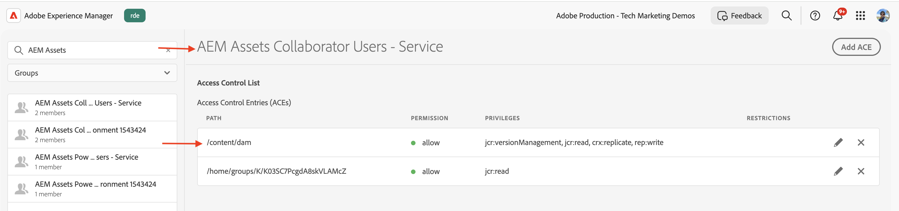

# Gestione delle autorizzazioni per i gruppi di utenti Profilo prodotto e Servizi

Scopri come gestire le autorizzazioni per i gruppi di utenti Profilo di prodotto e Servizi in AEM as a Cloud Service.

In questa esercitazione imparerai:

- Profilo di prodotto e sua associazione ai Servizi.
- Aggiornamento delle autorizzazioni del gruppo utenti Servizi.

## Informazioni di base

Quando utilizzi un&#39;API di AEM, devi assegnare il _profilo di prodotto_ alle _credenziali_ nel progetto Adobe Developer Console (o ADC). Il _profilo prodotto_ (e servizio associato) fornisce le _autorizzazioni o autorizzazioni_ alle credenziali per accedere alle risorse di AEM. Nella schermata seguente puoi visualizzare le _credenziali_ e il _profilo di prodotto_ per un&#39;API di authoring AEM Assets:


Un profilo di prodotto è associato a uno o più _Servizi_. In AEM as a Cloud Service, un _servizio_ rappresenta gruppi di utenti con elenchi di controllo di accesso (ACL) predefiniti per i nodi dell&#39;archivio, consentendo la gestione granulare delle autorizzazioni.


Dopo aver chiamato correttamente l’API, viene creato nel servizio AEM Author un utente che rappresenta le credenziali del progetto ADC, insieme ai gruppi di utenti che corrispondono alla configurazione del profilo di prodotto e dei servizi.


Nello scenario precedente, l&#39;utente `1323d2...` viene creato nel servizio AEM Author ed è membro dei gruppi di utenti `AEM Assets Collaborator Users - Service` e `AEM Assets Collaborator Users - author - Program XXX - Environment XXX`.

## Autorizzazioni del gruppo utenti di Update Services

La maggior parte dei _Servizi_ fornisce l&#39;autorizzazione _READ_ alle risorse AEM tramite i gruppi di utenti nell&#39;istanza AEM che hanno lo stesso nome del _Servizio_.

In alcuni casi le credenziali (ovvero l&#39;utente dell&#39;account tecnico) richiedono autorizzazioni aggiuntive, ad esempio _Crea, Aggiorna, Elimina_ (CUD) delle risorse AEM. In questi casi, è possibile aggiornare le autorizzazioni dei gruppi di utenti _Services_ nell&#39;istanza di AEM.

Ad esempio, quando la chiamata API di AEM Assets Author riceve un errore [403 per le richieste non GET](../use-cases/invoke-api-using-oauth-s2s.md#403-error-for-non-get-requests), è possibile aggiornare le autorizzazioni del gruppo di utenti _AEM Assets Collaborator Users - Service_ nell&#39;istanza AEM.

Utilizzando l&#39;interfaccia utente per le autorizzazioni o lo script [Inizializzazione archivio Sling](https://sling.apache.org/documentation/bundles/repository-initialization.html), puoi aggiornare le autorizzazioni dei gruppi di utenti predefiniti nell&#39;istanza di AEM.

### Aggiornare le autorizzazioni tramite l’interfaccia utente delle autorizzazioni

Per aggiornare le autorizzazioni del gruppo di utenti dei servizi (ad esempio `AEM Assets Collaborator Users - Service`) tramite l&#39;interfaccia utente delle autorizzazioni, eseguire la procedura seguente:

- Passa a **Strumenti** > **Sicurezza** > **Autorizzazioni** nell&#39;istanza di AEM.

- Cercare il gruppo di utenti dei servizi (ad esempio `AEM Assets Collaborator Users - Service`).

  

- Fare clic su **Aggiungi ACE** per aggiungere una nuova voce di controllo di accesso (ACE) per il gruppo di utenti.

  

### Aggiornare le autorizzazioni utilizzando lo script di inizializzazione del repository

Per aggiornare le autorizzazioni del gruppo di utenti dei servizi (ad esempio `AEM Assets Collaborator Users - Service`) tramite lo script di inizializzazione del repository, eseguire la procedura seguente:

- Apri il progetto AEM nell’IDE preferito.

- Passa al modulo `ui.config`

- Creare un file in `ui.config/src/main/content/jcr_root/apps/<PROJECT-NAME>/osgiconfig/config.author` denominato `org.apache.sling.jcr.repoinit.RepositoryInitializer-services-group-acl-update.cfg.json` con il contenuto seguente:

  ```json
  {
      "scripts": [
          "set ACL for \"AEM Assets Collaborator Users - Service\" (ACLOptions=ignoreMissingPrincipal)",
          "    allow jcr:read,jcr:versionManagement,crx:replicate,rep:write on /content/dam",
          "end"
      ]
  }
  ```

- Esegui il commit e invia le modifiche all’archivio.

- Distribuisci le modifiche all&#39;istanza di AEM utilizzando la [pipeline full stack di Cloud Manager](https://experienceleague.adobe.com/en/docs/experience-manager-cloud-service/content/implementing/using-cloud-manager/cicd-pipelines/introduction-ci-cd-pipelines#full-stack-pipeline).

- Puoi anche verificare le autorizzazioni del gruppo di utenti utilizzando la visualizzazione **Autorizzazioni**. Passa a **Strumenti** > **Sicurezza** > **Autorizzazioni** nell&#39;istanza di AEM.

  

### Verificare le autorizzazioni

Dopo aver aggiornato le autorizzazioni utilizzando uno dei metodi di cui sopra, la richiesta di PATCH di aggiornare i metadati della risorsa dovrebbe ora funzionare senza alcun problema.


## Riepilogo

Hai imparato a gestire le autorizzazioni per i gruppi di utenti Profilo di prodotto e Servizi in AEM as a Cloud Service. È possibile aggiornare le autorizzazioni dei gruppi di utenti dei servizi nell’istanza di AEM utilizzando l’interfaccia utente delle autorizzazioni o lo script di inizializzazione del repository.
