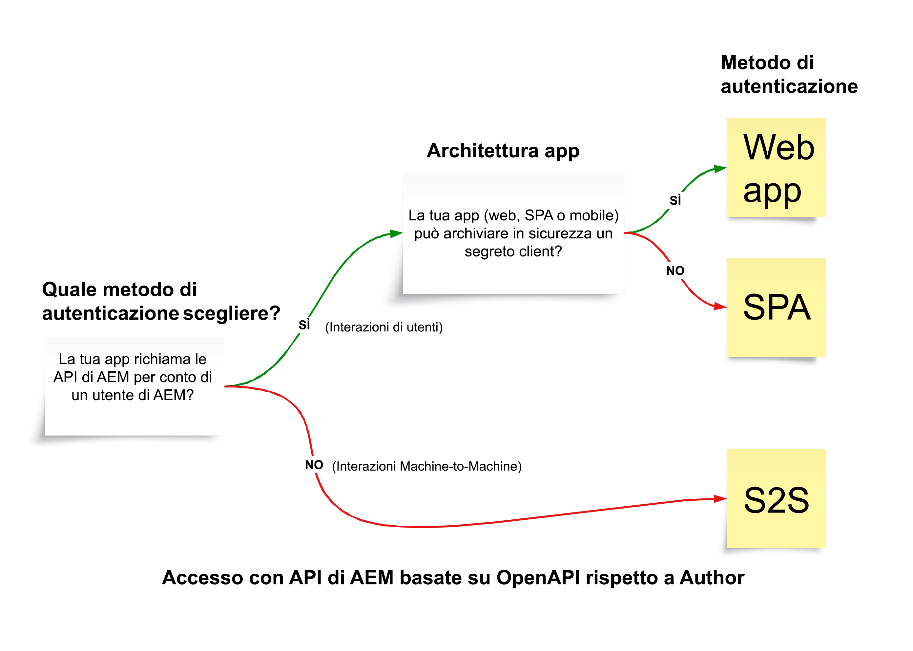

# API AEM basate su OpenAPI

>[!IMPORTANT]
>
>Le API AEM basate su OpenAPI sono disponibili solo in AEM as a Cloud Service e non sono compatibili con AEM 6.X.

Scopri di più sulle API AEM basate su OpenAPI, tra cui il supporto per l’autenticazione, i concetti chiave e le modalità di accesso alle API Adobe.

La [specifica OpenAPI](https://swagger.io/specification/) (precedentemente nota come Swagger) è uno standard ampiamente utilizzato per la definizione delle API RESTful. AEM as a Cloud Service fornisce diverse API basate sulla specifica OpenAPI (o semplicemente API AEM basate su OpenAPI), semplificando la creazione di applicazioni personalizzate che interagiscono con i tipi di servizi di authoring o di pubblicazione di AEM. Di seguito sono riportati alcuni esempi:

**Sites**

- [API di Sites](https://developer.adobe.com/experience-cloud/experience-manager-apis/api/stable/sites/): API per utilizzare i frammenti di contenuto.

**Risorse**

- [API per cartelle](https://developer.adobe.com/experience-cloud/experience-manager-apis/api/experimental/folders/): API per utilizzare le cartelle, come la creazione, l’elenco e l’eliminazione di cartelle.

- [API di authoring delle risorse](https://developer.adobe.com/experience-cloud/experience-manager-apis/api/experimental/assets/author/): API per l’utilizzo delle risorse e dei relativi metadati.

**Moduli**

- [API di comunicazione con moduli](https://developer.adobe.com/experience-cloud/experience-manager-apis/api/experimental/document/): API per l’utilizzo di moduli e documenti.

Nelle versioni future, verranno aggiunte più API AEM basate su OpenAPI per supportare casi d’uso aggiuntivi.

## Supporto per l’autenticazione{#authentication-support}

Le API AEM basate su OpenAPI supportano l’autenticazione OAuth 2.0, inclusi i seguenti tipi di concessione:

- **Credenziale da server a server OAuth**: ideale per i servizi di back-end che richiedono accesso API senza interazione da parte dell’utente. Utilizza il tipo di concessione _client_credentials_, che consente la gestione dell’accesso sicuro a livello di server. Per ulteriori informazioni, consulta [Credenziale da server a server OAuth](https://developer.adobe.com/developer-console/docs/guides/authentication/ServerToServerAuthentication/#oauth-server-to-server-credential).

- **Credenziale app web OAuth**: adatta per applicazioni web con componenti front-end e _back-end_ che accedono alle API AEM per conto degli utenti. Utilizza il tipo di concessione _authorization_code_, in cui il server back-end gestisce in modo sicuro segreti e token. Per ulteriori informazioni, consulta [Credenziale app web OAuth](https://developer.adobe.com/developer-console/docs/guides/authentication/UserAuthentication/implementation#oauth-web-app-credential).

- **Credenziale applicazione a pagina singola OAuth**: progettata per SPA in esecuzione nel browser, che devono accedere alle API per conto di un utente senza un server back-end. Utilizza il tipo di concessione _authorization_code_ e si basa su meccanismi di sicurezza lato client che utilizzano l’estensione PKCE (Proof Key for Code Exchange) per proteggere il flusso del codice di autorizzazione. Per ulteriori informazioni, consulta [Credenziale applicazione a pagina singola OAuth](https://developer.adobe.com/developer-console/docs/guides/authentication/UserAuthentication/implementation#oauth-single-page-app-credential).

## Quale metodo di autenticazione usare{#auth-method-decision}

Quando decidi quale metodo di autenticazione utilizzare, tieni presente quanto segue:

L’autenticazione utente (app web o applicazione a pagina singola) deve essere la scelta predefinita ogni volta che viene coinvolto un contesto utente di AEM. Questo assicura che tutte le azioni nell’archivio vengano attribuite correttamente all’utente autenticato e che l’utente sia limitato solo alle autorizzazioni a cui ha diritto.
L’utilizzo da server a server (o account di sistema tecnico) per eseguire azioni per conto di un singolo utente ignora il modello di sicurezza e introduce rischi quali l’escalation dei privilegi e il controllo non accurato.

## Differenza tra le credenziali da server a server OAuth rispetto ad app web e all’applicazione a pagina singola{#difference-between-oauth-server-to-server-vs-web-app-vs-single-page-app-credentials}

La tabella seguente riepiloga le differenze tra i tre metodi di autenticazione OAuth supportati dalle API AEM basate su OpenAPI:

|  | Da server a server OAuth | App web OAuth | Applicazione a pagina singola (SPA) OAuth |
| --- | --- | --- | --- |
| **Scopo dell’autenticazione** | Progettata per interazioni macchina-macchina. | Progettata per interazioni guidate dall’utente in un’app Web con un _back-end_. | Progettata per interazioni guidate dall’utente in un’_applicazione JavaScript lato client_. |
| **Comportamento token** | Rilascia i token di accesso che rappresentano l’applicazione client stessa. | Rilascia i token di accesso per conto di un utente autenticato _tramite un back-end_. | Rilascia i token di accesso per conto di un utente autenticato _tramite un flusso solo front-end_. |
| **Casi d’uso** | Servizi back-end che richiedono accesso API senza interazione da parte dell’utente. | Applicazioni web con componenti front-end e back-end che accedono alle API per conto degli utenti. | Applicazioni front-end pure (JavaScript) che accedono alle API per conto degli utenti senza un back-end. |
| **Considerazioni sulla sicurezza** | Archivia in modo sicuro le credenziali sensibili (`client_id`, `client_secret`) nei sistemi back-end. | Dopo l’autenticazione, all’utente viene concesso il proprio token di accesso _temporaneo tramite una chiamata back-end_. Archivia in modo sicuro le credenziali sensibili (`client_id`, `client_secret`) nei sistemi back-end per scambiare il codice di autorizzazione con il token di accesso. | Dopo l’autenticazione, all’utente viene concesso il proprio token di accesso _temporaneo tramite una chiamata front-end_. Non utilizza `client_secret`, poiché l’archiviazione nelle app front-end non è sicura. Si basa su PKCE per scambiare il codice di autorizzazione con il token di accesso. |
| **Tipo di concessione** | _client_credentials_ | _authorization_code_ | _authorization_code_ con **PKCE** |
| **Tipo di credenziali Adobe Developer Console** | Da server a server OAuth | App web OAuth | Applicazione a pagina singola OAuth |
| **Tutorial** | [Richiamare l’API tramite l’autenticazione da server a server](./use-cases/invoke-api-using-oauth-s2s.md) | [Richiamare l’API tramite l’autenticazione da app Web](./use-cases/invoke-api-using-oauth-web-app.md) | [Richiamare l’API tramite l’autenticazione da applicazione a pagina singola](./use-cases/invoke-api-using-oauth-single-page-app.md) |

## Accesso alle API di Adobe e ai concetti correlati{#accessing-adobe-apis-and-related-concepts}

Prima di accedere alle API di Adobe, è essenziale comprendere i seguenti concetti chiave:

- **[Adobe Developer Console](https://developer.adobe.com/)**: hub per sviluppatori per accedere a API, SDK, eventi in tempo reale, funzioni senza server di Adobe e altro ancora. Tieni presente che è diverso dalla Developer Console di _AEM_, utilizzata per il debug delle applicazioni AEM.

- **[Progetto Adobe Developer Console](https://developer.adobe.com/developer-console/docs/guides/projects/)**: posizione centrale per la gestione di integrazioni API, eventi e funzioni di runtime. Qui puoi configurare le API, impostare l’autenticazione e generare le credenziali richieste.

- **[Profili di prodotto](https://helpx.adobe.com/it/enterprise/using/manage-product-profiles.html)**: i profili di prodotto forniscono un predefinito di autorizzazione che consente di controllare l’accesso dell’utente o dell’applicazione ai prodotti Adobe, tra cui AEM, Adobe Target, Adobe Analytics e altri. A ogni prodotto Adobe sono associati profili di prodotto predefiniti.

- **Servizi**: i servizi definiscono le autorizzazioni effettive e sono associati al profilo di prodotto. Per ridurre o aumentare il predefinito di autorizzazioni, puoi deselezionare o selezionare i servizi associati al profilo di prodotto. In questo modo, puoi controllare il livello di accesso al prodotto e alle relative API. In AEM as a Cloud Service, i servizi rappresentano gruppi di utenti con elenchi di controllo degli accessi (ACL) predefiniti per i nodi dell’archivio, consentendo una gestione granulare delle autorizzazioni.

## Introduzione

Scopri come configurare l’ambiente AEM as a Cloud Service e un progetto Adobe Developer Console per abilitare l’accesso alle API AEM basate su OpenAPI. Accedi anche all’API di AEM utilizzando il browser per verificare la configurazione e rivedere la richiesta e la risposta.

<!-- CARDS
{target = _self}

* ./setup.md
  {title = Set up OpenAPI-based AEM APIs}
  {description = Learn how to set up your AEM as a Cloud Service environment to enable access to the OpenAPI-based AEM APIs.}
  {image = ./assets/setup/OpenAPI-Setup.png}
-->
<!-- START CARDS HTML - DO NOT MODIFY BY HAND -->

    

        

            

                <figure class="image x-is-16by9">
                    
                </figure>
            

            

                

                    

                        <a href="./setup.md" target="_self" rel="referrer" title="Configurare le API AEM basate su OpenAPI">Configurare le API AEM basate su OpenAPI</a>
                    

                    
Scopri come configurare l’ambiente AEM as a Cloud Service per abilitare l’accesso alle API AEM basate su OpenAPI.

                

                <a href="./setup.md" target="_self" rel="referrer" class="spectrum-Button spectrum-Button--outline spectrum-Button--primary spectrum-Button--sizeM" style="align-self: flex-start; margin-top: 1rem;">
                    Ulteriori informazioni
                </a>
            

        

    

<!-- END CARDS HTML - DO NOT MODIFY BY HAND -->

## Tutorial API

Scopri come utilizzare le API AEM basate su OpenAPI utilizzando diversi metodi di autenticazione OAuth:

<!-- CARDS
{target = _self}

* ./use-cases/invoke-api-using-oauth-s2s.md
  {title = Invoke API using Server-to-Server authentication}
  {description = Learn how to invoke OpenAPI-based AEM APIs from a custom NodeJS application using OAuth Server-to-Server authentication.}
  {image = ./assets/s2s/OAuth-S2S.png}
* ./use-cases/invoke-api-using-oauth-web-app.md
  {title = Invoke API using Web App authentication}
  {description = Learn how to invoke OpenAPI-based AEM APIs from a custom web application using OAuth Web App authentication.}
  {image = ./assets/web-app/OAuth-WebApp.png}
* ./use-cases/invoke-api-using-oauth-single-page-app.md
  {title = Invoke API using Single Page App authentication}
  {description = Learn how to invoke OpenAPI-based AEM APIs from a custom Single Page App (SPA) using OAuth Single Page App authentication.}
  {image = ./assets/spa/OAuth-SPA.png}  
-->
<!-- START CARDS HTML - DO NOT MODIFY BY HAND -->

    

        

            

                <figure class="image x-is-16by9">
                    
                </figure>
            

            

                

                    

                        <a href="./use-cases/invoke-api-using-oauth-s2s.md" target="_self" rel="referrer" title="Richiamare l’API tramite autenticazione da server a server">Richiamare l’API tramite autenticazione da server a server</a>
                    

                    
Scopri come richiamare le API AEM basate su OpenAPI da un’applicazione NodeJS personalizzata utilizzando l’autenticazione da server a server di OAuth.

                

                <a href="./use-cases/invoke-api-using-oauth-s2s.md" target="_self" rel="referrer" class="spectrum-Button spectrum-Button--outline spectrum-Button--primary spectrum-Button--sizeM" style="align-self: flex-start; margin-top: 1rem;">
                    Ulteriori informazioni
                </a>
            

        

    

    

        

            

                <figure class="image x-is-16by9">
                    
                </figure>
            

            

                

                    

                        <a href="./use-cases/invoke-api-using-oauth-web-app.md" target="_self" rel="referrer" title="Richiamare l’API tramite l’autenticazione da app web">Richiamare l’API tramite l’autenticazione da app web</a>
                    

                    
Scopri come richiamare le API AEM basate su OpenAPI da un’applicazione web personalizzata utilizzando l’autenticazione app web OAuth.

                

                <a href="./use-cases/invoke-api-using-oauth-web-app.md" target="_self" rel="referrer" class="spectrum-Button spectrum-Button--outline spectrum-Button--primary spectrum-Button--sizeM" style="align-self: flex-start; margin-top: 1rem;">
                    Ulteriori informazioni
                </a>
            

        

    

    

        

            

                <figure class="image x-is-16by9">
                    
                </figure>
            

            

                

                    

                        <a href="./use-cases/invoke-api-using-oauth-single-page-app.md" target="_self" rel="referrer" title="Richiamare l’API tramite l’autenticazione da applicazione a pagina singola">Richiamare l’API tramite l’autenticazione da applicazione a pagina singola</a>
                    

                    
Scopri come richiamare le API AEM basate su OpenAPI da un’applicazione a pagina singola (SPA) personalizzata utilizzando l’autenticazione OAuth per applicazione a pagina singola.

                

                <a href="./use-cases/invoke-api-using-oauth-single-page-app.md" target="_self" rel="referrer" class="spectrum-Button spectrum-Button--outline spectrum-Button--primary spectrum-Button--sizeM" style="align-self: flex-start; margin-top: 1rem;">
                    Ulteriori informazioni
                </a>
            

        

    

<!-- END CARDS HTML - DO NOT MODIFY BY HAND -->
