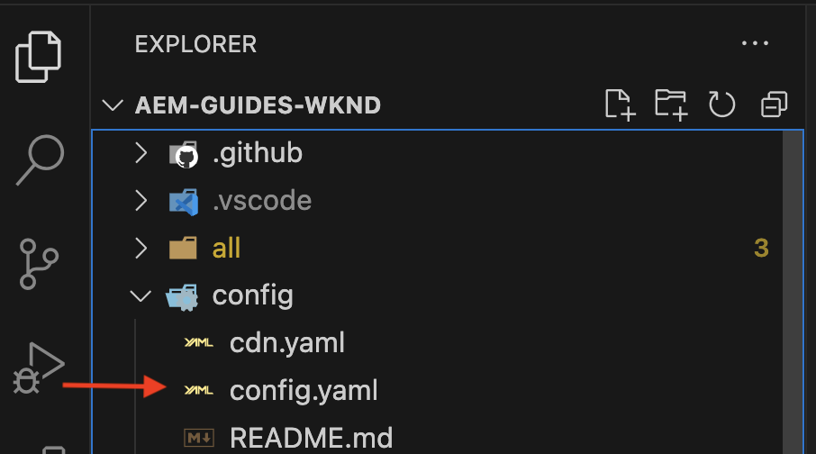

# Configurare le API AEM basate su OpenAPI

Scopri come configurare l’ambiente AEM as a Cloud Service per abilitare l’accesso alle API AEM basate su OpenAPI.

>[!AVAILABILITY]
>
>Le API AEM basate su OpenAPI sono disponibili come parte di un programma di accesso anticipato. Se ti interessa accedervi, ti invitiamo a inviare un&#39;e-mail a [aem-apis@adobe.com](mailto:aem-apis@adobe.com) con una descrizione del tuo caso d&#39;uso.

Il processo di configurazione ad alto livello prevede le seguenti fasi:

1. Modernizzazione dell’ambiente AEM as a Cloud Service.
1. Abilita l’accesso alle API di AEM.
1. Crea progetto Adobe Developer Console (ADC).
1. Configura progetto ADC
1. Configura l’istanza di AEM per abilitare la comunicazione al progetto ADC.

## Modernizzazione dell’ambiente AEM as a Cloud Service

La modernizzazione dell’ambiente AEM as a Cloud Service è un’attività una tantum per ogni ambiente che prevede i seguenti passaggi:

- Aggiornamento ad AEM versione **2024.10.18459.20241031T210302Z** o successiva.
- Aggiungi nuovi profili di prodotto, se l’ambiente è stato creato prima della versione 2024.10.18459.20241031T210302Z.

### Aggiorna istanza AEM

Per aggiornare l&#39;istanza di AEM, nella sezione _Ambienti_ di Adobe [Cloud Manager](https://my.cloudmanager.adobe.com/), seleziona l&#39;icona _puntini di sospensione_ accanto al nome dell&#39;ambiente e seleziona l&#39;opzione **Aggiorna**.


Quindi fai clic sull&#39;pulsante **Invia** ed esegui la _pipeline Fullstack suggerita_ .


Nel mio caso, la pipeline Fullstack si chiama **Dev:: Fullstack-Deploy**, e l&#39;ambiente AEM si chiama **wknd-program-dev**. I tuoi nomi potrebbero essere diversi.

### Aggiungere nuovi profili di prodotto

Per aggiungere nuovi profili di prodotto all&#39;istanza di AEM, nella sezione _Ambienti_ di Adobe [Cloud Manager](https://my.cloudmanager.adobe.com/), seleziona l&#39;icona _puntini di sospensione_ accanto al nome dell&#39;ambiente e l&#39;opzione **Aggiungi profili di prodotto**.


Puoi esaminare i profili di prodotto appena aggiunti facendo clic sull&#39;icona con i _puntini di sospensione_ accanto al nome dell&#39;ambiente e selezionando **Gestisci** accesso **>** profili Autore.

Nella _finestra Admin Console_ vengono visualizzati i profili di prodotto appena aggiunti.


I passaggi precedenti completano la modernizzazione del AEM come ambiente Cloud Service.

## Abilita accesso alle API di AEM{#enable-aem-apis-access}

La presenza di _nuovi profili di prodotto_ abilita l&#39;accesso API AEM basato su OpenAPI in Adobe Developer Console (ADC). Ricorda che [Adobe Developer Console (ADC)](./overview.md#accessing-adobe-apis-and-related-concepts) è l&#39;hub di sviluppo per accedere alle API di Adobe, agli SDK, agli eventi in tempo reale, alle funzioni senza server e altro ancora.

I nuovi profili di prodotto aggiunti sono associati ai _Servizi_ che rappresentano _gruppi di utenti AEM con elenchi di controllo di accesso (ACL) predefiniti_. I _servizi_ vengono utilizzati per controllare il livello di accesso alle API di AEM.

Puoi anche selezionare o deselezionare i _servizi_ associati al profilo prodotto per ridurre o aumentare il livello di accesso.

Rivedi l&#39;associazione facendo clic sull&#39;icona _Visualizza dettagli_ accanto al nome del profilo di prodotto.


Per impostazione predefinita, il servizio **Utenti API AEM Assets** non è associato ad alcun profilo di prodotto. Associamolo al profilo di prodotto **Utenti AEM Assets Collaborator - Autore - Programma XXX - Ambiente XXX** appena aggiunto. Dopo questa associazione, l&#39;_API Asset Author_ del progetto ADC può impostare l&#39;autenticazione server-to-server desiderata e associare l&#39;account di autenticazione dal progetto ADC (creato nel passaggio successivo) al profilo di prodotto.


>[!IMPORTANT]
>
>Il passaggio precedente è fondamentale per abilitare l’autenticazione server-to-server per l’API di AEM Assets. Senza questa associazione, l’API di AEM Assets non può essere utilizzata con il metodo di autenticazione server-to-server.

## Crea progetto Adobe Developer Console (ADC)

Il progetto ADC viene utilizzato per aggiungere le API desiderate, configurarne l’autenticazione e associare l’account di autenticazione al profilo di prodotto.

Per creare un progetto ADC:

1. Accedi a [Adobe Developer Console](https://developer.adobe.com/console) utilizzando il tuo Adobe ID.

   

1. Dalla sezione _Guida rapida_, fare clic sul pulsante **Crea nuovo progetto**.

   

1. Crea un nuovo progetto con il nome predefinito.

   

1. Modifica il nome del progetto facendo clic sul pulsante **Modifica progetto** nell&#39;angolo in alto a destra. Specifica un nome significativo e fai clic su **Salva**.

   

## Configura progetto ADC

Dopo aver creato il progetto ADC, devi aggiungere le API AEM desiderate, configurarne l’autenticazione e associare l’account di autenticazione al profilo di prodotto.

1. Per aggiungere le API di AEM, fai clic sul pulsante **Aggiungi API**.

   

1. Nella finestra di dialogo _Aggiungi API_, filtra per _Experience Cloud_ e seleziona l&#39;API AEM desiderata. Ad esempio, in questo caso, è selezionata l&#39;API _Asset Author_.

   

1. Quindi, nella finestra di dialogo _Configura API_, seleziona l&#39;opzione di autenticazione desiderata. In questo caso, ad esempio, è selezionata l&#39;opzione di autenticazione **Server-to-Server**.

   

   L’autenticazione server-to-server è ideale per i servizi back-end che richiedono accesso API senza interazione da parte dell’utente. Le opzioni di autenticazione dell’app web e dell’app a pagina singola sono adatte per le applicazioni che necessitano dell’accesso API per conto degli utenti. Per ulteriori informazioni, vedere [Differenza tra le credenziali server-to-server OAuth e app Web rispetto alle credenziali app a pagina singola](./overview.md#difference-between-oauth-server-to-server-vs-web-app-vs-single-page-app-credentials).

1. Se necessario, puoi rinominare l’API per facilitarne l’identificazione. A scopo dimostrativo, viene utilizzato il nome predefinito.

   

1. In questo caso, il metodo di autenticazione è **OAuth Server-to-Server**, pertanto è necessario associare l&#39;account di autenticazione al profilo di prodotto. Seleziona il profilo di prodotto **Utenti AEM Assets Collaborator - Autore - Programma XXX - Ambiente XXX** e fai clic su **Salva**.

   

1. Controlla l’API di AEM e la configurazione dell’autenticazione.

   

   

Se si sceglie il metodo di autenticazione **OAuth Web App** o **OAuth Single Page App**, l&#39;associazione del profilo di prodotto non viene richiesta, ma è necessario l&#39;URI di reindirizzamento dell&#39;applicazione. L’URI di reindirizzamento dell’applicazione viene utilizzato per reindirizzare l’utente all’applicazione dopo l’autenticazione con un codice di autorizzazione. Le esercitazioni sui casi d’uso pertinenti descrivono tali configurazioni specifiche per l’autenticazione.

## Configura l’istanza di AEM per abilitare la comunicazione del progetto ADC

Per abilitare l’ID client del progetto ADC alla comunicazione con l’istanza AEM, devi configurare l’istanza AEM.

Questa operazione viene eseguita definendo la configurazione API nel file `config.yaml` di
il progetto AEM e distribuirlo utilizzando la pipeline di configurazione in Cloud Manager.

1. In AEM Project individuare o creare il file `config.yaml` dalla cartella `config`.

   

1. Aggiungi la seguente configurazione al file `config.yaml`.

   ```yaml
   kind: "API"
   version: "1.0"
   metadata: 
       envTypes: ["dev", "stage", "prod"]
   data:
       allowedClientIDs:
           author:
           - "<ADC Project's Credentials ClientID>"
   ```

   `<ADC Project's Credentials ClientID>` Sostituisci con l&#39;ID client effettivo del valore Credenziali del progetto ADC. L&#39;endpoint API utilizzato in questo esercitazione è disponibile solo nel livello di authoring, ma per altre API, la configurazione yaml può anche avere un _nodo pubblicare_ o _di anteprima_ .

   >[!CAUTION]
   >
   > A scopo dimostrativo, lo stesso ClientID viene utilizzato per tutti gli ambienti. Si consiglia di utilizzare un ClientID separato per ogni ambiente (dev, stage, prod) per migliorare la sicurezza e il controllo.

1. Apporta le modifiche alla configurazione e le invia all’archivio Git remoto a cui è connessa la pipeline Cloud Manager.

1. Distribuisci le modifiche precedenti utilizzando la pipeline di configurazione in Cloud Manager. Il file `config.yaml` può essere installato anche in un RDE, utilizzando gli strumenti della riga di comando.

   

## Passaggi successivi

Una volta configurato il istanza AEM per abilitare la comunicazione del progetto ADC, è possibile iniziare a utilizzare le API AEM basate su OpenAPI. Scopri come utilizzare le API AEM basate su OpenAPI utilizzando diversi metodi di autenticazione OAuth:

<!-- CARDS
{target = _self}

* ./use-cases/invoke-api-using-oauth-s2s.md
  {title = Invoke API using Server-to-Server authentication}
  {description = Learn how to invoke OpenAPI-based AEM APIs from a custom NodeJS application using OAuth Server-to-Server authentication.}
  {image = ./assets/s2s/OAuth-S2S.png}
* ./use-cases/invoke-api-using-oauth-web-app.md
  {title = Invoke API using Web App authentication}
  {description = Learn how to invoke OpenAPI-based AEM APIs from a custom web application using OAuth Web App authentication.}
  {image = ./assets/web-app/OAuth-WebApp.png}
* ./use-cases/invoke-api-using-oauth-single-page-app.md
  {title = Invoke API using Single Page App authentication}
  {description = Learn how to invoke OpenAPI-based AEM APIs from a custom Single Page App (SPA) using OAuth 2.0 PKCE flow.}
  {image = ./assets/spa/OAuth-SPA.png}  
-->
<!-- START CARDS HTML - DO NOT MODIFY BY HAND -->
<div class="columns">
    <div class="column is-half-tablet is-half-desktop is-one-third-widescreen" aria-label="Invoke API using Server-to-Server authentication">
        <div class="card" style="height: 100%; display: flex; flex-direction: column; height: 100%;">
            <div class="card-image">
                <figure class="image x-is-16by9">
                    <a href="./use-cases/invoke-api-using-oauth-s2s.md" title="Richiamare l&apos;API utilizzando l&apos;autenticazione da server a server" target="_self" rel="referrer">
                        
                    </a>
                </figure>
            </div>
            <div class="card-content is-padded-small" style="display: flex; flex-direction: column; flex-grow: 1; justify-content: space-between;">
                <div class="top-card-content">
                    <p class="headline is-size-6 has-text-weight-bold">
                        <a href="./use-cases/invoke-api-using-oauth-s2s.md" target="_self" rel="referrer" title="Richiama API tramite autenticazione server-to-server">Richiama API tramite autenticazione server-to-server</a>
                    </p>
                    <p class="is-size-6">Scopri come richiamare le API AEM basate su OpenAPI da un’applicazione NodeJS personalizzata utilizzando l’autenticazione server-to-server di OAuth.</p>
                </div>
                <a href="./use-cases/invoke-api-using-oauth-s2s.md" target="_self" rel="referrer" class="spectrum-Button spectrum-Button--outline spectrum-Button--primary spectrum-Button--sizeM" style="align-self: flex-start; margin-top: 1rem;">
                    <span class="spectrum-Button-label has-no-wrap has-text-weight-bold">Ulteriori informazioni</span>
                </a>
            </div>
        </div>
    </div>
    <div class="column is-half-tablet is-half-desktop is-one-third-widescreen" aria-label="Invoke API using Web App authentication">
        <div class="card" style="height: 100%; display: flex; flex-direction: column; height: 100%;">
            <div class="card-image">
                <figure class="image x-is-16by9">
                    <a href="./use-cases/invoke-api-using-oauth-web-app.md" title="Richiama l’API tramite l’autenticazione tramite app web" target="_self" rel="referrer">
                        
                    </a>
                </figure>
            </div>
            <div class="card-content is-padded-small" style="display: flex; flex-direction: column; flex-grow: 1; justify-content: space-between;">
                <div class="top-card-content">
                    <p class="headline is-size-6 has-text-weight-bold">
                        <a href="./use-cases/invoke-api-using-oauth-web-app.md" target="_self" rel="referrer" title="Richiamare l&apos;API utilizzando l&apos;autenticazione app Web">Richiamare l'API utilizzando l'autenticazione app Web</a>
                    </p>
                    <p class="is-size-6">Scopri come richiamare API AEM basate su OpenAPI da un applicazione web personalizzato utilizzando l'autenticazione Web app OAuth.</p>
                </div>
                <a href="./use-cases/invoke-api-using-oauth-web-app.md" target="_self" rel="referrer" class="spectrum-Button spectrum-Button--outline spectrum-Button--primary spectrum-Button--sizeM" style="align-self: flex-start; margin-top: 1rem;">
                    <span class="spectrum-Button-label has-no-wrap has-text-weight-bold">Ulteriori informazioni</span>
                </a>
            </div>
        </div>
    </div>
    <div class="column is-half-tablet is-half-desktop is-one-third-widescreen" aria-label="Invoke API using Single Page App authentication">
        <div class="card" style="height: 100%; display: flex; flex-direction: column; height: 100%;">
            <div class="card-image">
                <figure class="image x-is-16by9">
                    <a href="./use-cases/invoke-api-using-oauth-single-page-app.md" title="Richiamare l&apos;API utilizzando l&apos;autenticazione in Pagina singola app" target="_self" rel="referrer">
                        
                    </a>
                </figure>
            </div>
            <div class="card-content is-padded-small" style="display: flex; flex-direction: column; flex-grow: 1; justify-content: space-between;">
                <div class="top-card-content">
                    <p class="headline is-size-6 has-text-weight-bold">
                        <a href="./use-cases/invoke-api-using-oauth-single-page-app.md" target="_self" rel="referrer" title="Richiamare l&apos;API utilizzando l&apos;autenticazione in Pagina singola app">Richiamare l'API utilizzando l'autenticazione in Pagina singola app</a>
                    </p>
                    <p class="is-size-6">Scopri come richiamare API AEM basate su OpenAPI da una Single Pagina app (SPA) personalizzata utilizzando il flusso PKCE OAuth 2.0.</p>
                </div>
                <a href="./use-cases/invoke-api-using-oauth-single-page-app.md" target="_self" rel="referrer" class="spectrum-Button spectrum-Button--outline spectrum-Button--primary spectrum-Button--sizeM" style="align-self: flex-start; margin-top: 1rem;">
                    <span class="spectrum-Button-label has-no-wrap has-text-weight-bold">Ulteriori informazioni</span>
                </a>
            </div>
        </div>
    </div>
</div>
<!-- END CARDS HTML - DO NOT MODIFY BY HAND -->
