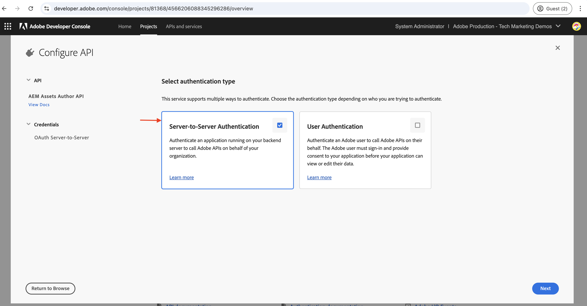

# Configurare le API AEM basate su OpenAPI

Scopri come configurare l’ambiente AEM as a Cloud Service per abilitare l’accesso alle API AEM basate su OpenAPI.

In questo esempio, l&#39;API **AEM Assets** che utilizza il metodo di autenticazione **Server-to-Server** viene utilizzata per dimostrare il processo di installazione delle API AEM basate su OpenAPI. È possibile seguire la stessa procedura per configurare [altre API AEM basate su OpenAPI](https://developer.adobe.com/experience-cloud/experience-manager-apis/#openapi-based-apis).

>[!VIDEO](https://video.tv.adobe.com/v/3457510?quality=12&learn=on)

Il processo di configurazione di alto livello prevede i seguenti passaggi:

1. Modernizzazione dell’ambiente AEM as a Cloud Service.
1. Abilita l’accesso alle API di AEM.
1. Crea progetto Adobe Developer Console (ADC).
1. Configura progetto ADC.
1. Configura l’istanza di AEM per abilitare la comunicazione al progetto ADC.

## Prerequisiti

- Accesso all’ambiente Cloud Manager e AEM as a Cloud Service
- Accesso a Adobe Developer Console (ADC).
- Progetto AEM per aggiungere o aggiornare la configurazione API nel file `api.yaml`.

## Modernizzazione dell’ambiente AEM as a Cloud Service{#modernization-of-aem-as-a-cloud-service-environment}

La modernizzazione dell&#39;ambiente AEM as a Cloud Service è una **attività una tantum per ogni ambiente** che prevede i seguenti passaggi. Se hai già modernizzato il tuo ambiente AEM as a Cloud Service, puoi saltare questo passaggio.

- Aggiornamento ad AEM versione **2024.10.18459.20241031T210302Z** o successiva.
- Aggiungi nuovi profili di prodotto, se l’ambiente è stato creato prima della versione 2024.10.18459.20241031T210302Z.

### Aggiorna istanza AEM{#update-aem-instance}

- Per aggiornare l&#39;istanza di AEM, dopo aver effettuato l&#39;accesso a Adobe [Cloud Manager](https://my.cloudmanager.adobe.com/), passa alla sezione _Ambienti_, seleziona l&#39;icona _puntini di sospensione_ accanto al nome dell&#39;ambiente e seleziona l&#39;opzione **Aggiorna**.


- Quindi fai clic sul pulsante **Invia** ed esegui la _pipeline suggerita_ Fullstack.


Nel mio caso, la pipeline full stack si chiama **Dev :: Fullstack-Deploy** e l&#39;ambiente AEM si chiama **wknd-program-dev**. I tuoi nomi possono essere diversi.

### Aggiungere nuovi profili di prodotto{#add-new-product-profiles}

- Per aggiungere nuovi profili di prodotto all&#39;istanza di AEM, nella sezione [Ambienti](https://my.cloudmanager.adobe.com/) di Adobe _Cloud Manager_, seleziona l&#39;icona _puntini di sospensione_ accanto al nome dell&#39;ambiente e l&#39;opzione **Aggiungi profili di prodotto**.


- Rivedi i profili di prodotto appena aggiunti facendo clic sull&#39;icona _puntini di sospensione_ accanto al nome dell&#39;ambiente e selezionando **Gestisci accesso** > **Profili autore**.

- Nella finestra _Admin Console_ sono visualizzati i profili di prodotto appena aggiunti. A seconda delle adesioni ad AEM come AEM Assets, AEM Sites, AEM Forms, ecc., è possibile che vengano visualizzati profili di prodotto diversi. Ad esempio, nel mio caso, ho i diritti per AEM Assets e Sites, quindi visualizzo i seguenti profili di prodotto.


- I passaggi precedenti completano la modernizzazione dell’ambiente AEM as a Cloud Service.

## Abilita accesso alle API di AEM{#enable-aem-apis-access}

La presenza di _nuovi profili di prodotto_ abilita l&#39;accesso API AEM basato su OpenAPI in [Adobe Developer Console (ADC)](https://developer.adobe.com/). Senza questi profili di prodotto, non è possibile configurare le API AEM basate su OpenAPI in Adobe Developer Console (ADC).

I nuovi profili di prodotto aggiunti sono associati ai _Servizi_ che rappresentano _gruppi di utenti AEM con elenchi di controllo di accesso (ACL) predefiniti_. I _servizi_ vengono utilizzati per controllare il livello di accesso alle API di AEM. Puoi anche selezionare o deselezionare i _servizi_ associati al profilo prodotto per ridurre o aumentare il livello di accesso.

Rivedi l&#39;associazione facendo clic sull&#39;icona _Visualizza dettagli_ accanto al nome del profilo di prodotto. Nella schermata seguente, puoi vedere l&#39;associazione di **AEM Sites Content Manager - Author - Program XXX - Environment XXX** Product Profile con il servizio **AEM Sites Content Manager**. Esaminare gli altri profili di prodotto e le relative associazioni ai servizi.


### Abilita accesso alle API di AEM Assets{#enable-aem-assets-apis-access}

In questo esempio viene utilizzata l&#39;**API AEM Assets** per illustrare il processo di installazione delle API AEM basate su OpenAPI. Tuttavia, per impostazione predefinita, il servizio **Utenti API AEM Assets** non è associato ad alcun profilo di prodotto. È necessario associarlo al profilo di prodotto desiderato.

Associamolo al profilo di prodotto **Utenti AEM Assets Collaborator - Autore - Programma XXX - Ambiente XXX** appena aggiunto o a qualsiasi altro profilo di prodotto che desideri utilizzare per l&#39;accesso all&#39;API AEM Assets.


### Abilita autenticazione server-to-server

Per abilitare l&#39;autenticazione server-to-server per le API AEM basate su OpenAPI desiderate, è necessario aggiungere l&#39;utente che imposta l&#39;integrazione utilizzando Adobe Developer Console (ADC) come sviluppatore al _profilo prodotto_ a cui è associato il _servizio_.

Ad esempio, per abilitare l&#39;autenticazione server-to-server per l&#39;API di AEM Assets, l&#39;utente deve essere aggiunto come sviluppatore a **Utenti di AEM Assets Collaborator - Autore - Programma XXX - Ambiente XXX** _Profilo prodotto_.


Dopo questa associazione, l&#39;_API Asset Author_ del progetto ADC può impostare l&#39;autenticazione server-to-server desiderata e associare l&#39;account di autenticazione dal progetto ADC (creato nel passaggio successivo) al profilo di prodotto.

>[!IMPORTANT]
>
>Il passaggio precedente è fondamentale per abilitare l’autenticazione server-to-server per l’API AEM desiderata. Senza questa associazione, l’API di AEM non può essere utilizzata con il metodo di autenticazione server-to-server.

Eseguendo tutti i passaggi precedenti, hai preparato l’ambiente AEM as a Cloud Service per abilitare l’accesso alle API AEM basate su OpenAPI. Successivamente, devi creare il progetto Adobe Developer Console (ADC) per configurare le API AEM basate su OpenAPI.

## Crea progetto Adobe Developer Console (ADC){#adc-project}

Il progetto Adobe Developer Console (ADC) viene utilizzato per configurare le API AEM basate su OpenAPI. Ricorda che [Adobe Developer Console (ADC)](./overview.md#accessing-adobe-apis-and-related-concepts) è l&#39;hub di sviluppo per accedere alle API di Adobe, agli SDK, agli eventi in tempo reale, alle funzioni senza server e altro ancora.

Il progetto ADC viene utilizzato per aggiungere le API desiderate, configurarne l’autenticazione e associare l’account di autenticazione al profilo di prodotto.

Per creare un progetto ADC:

1. Accedi a [Adobe Developer Console](https://developer.adobe.com/console) utilizzando il tuo Adobe ID.

   

1. Dalla sezione _Guida rapida_, fare clic sul pulsante **Crea nuovo progetto**.

   

1. Crea un nuovo progetto con il nome predefinito.

   

1. Modifica il nome del progetto facendo clic sul pulsante **Modifica progetto** nell&#39;angolo in alto a destra. Specifica un nome significativo e fai clic su **Salva**.

   

## Configura progetto ADC{#configure-adc-project}

Dopo aver creato il progetto ADC, devi aggiungere le API AEM desiderate, configurarne l’autenticazione e associare l’account di autenticazione al profilo di prodotto.

In questo caso, viene utilizzata l&#39;**API AEM Assets** per illustrare il processo di installazione delle API AEM basate su OpenAPI. Tuttavia, puoi seguire la stessa procedura per aggiungere altre API AEM basate su OpenAPI, come **API AEM Sites**, **API AEM Forms**, ecc. I diritti di AEM determinano le API disponibili in Adobe Developer Console (ADC).

1. Per aggiungere le API di AEM, fai clic sul pulsante **Aggiungi API**.

   

1. Nella finestra di dialogo _Aggiungi API_, filtra per _Experience Cloud_ e seleziona l&#39;API AEM desiderata. Ad esempio, in questo caso, è selezionata l&#39;API _Asset Author_.

   

   >[!TIP]
   >
   >    Se la **scheda API AEM** desiderata è disabilitata e _Perché è disabilitata?Le informazioni di_ mostrano il messaggio **Licenza richiesta** uno dei motivi potrebbe essere che NON hai modernizzato l&#39;ambiente AEM as a Cloud Service. Per ulteriori informazioni, consulta [Modernizzazione dell&#39;ambiente AEM as a Cloud Service](#modernization-of-aem-as-a-cloud-service-environment).

1. Quindi, nella finestra di dialogo _Configura API_, seleziona l&#39;opzione di autenticazione desiderata. In questo caso, ad esempio, è selezionata l&#39;opzione di autenticazione **Server-to-Server**.

   

   L’autenticazione server-to-server è ideale per i servizi back-end che richiedono accesso API senza interazione da parte dell’utente. Le opzioni di autenticazione dell’app web e dell’app a pagina singola sono adatte per le applicazioni che necessitano dell’accesso API per conto degli utenti. Per ulteriori informazioni, vedere [Differenza tra le credenziali server-to-server OAuth e app Web rispetto alle credenziali app a pagina singola](./overview.md#difference-between-oauth-server-to-server-vs-web-app-vs-single-page-app-credentials).

   >[!TIP]
   >
   >Se l’opzione di autenticazione da server a server non è visibile, significa che l’utente che configura l’integrazione non viene aggiunto come sviluppatore al profilo di prodotto a cui è associato il servizio. Per ulteriori informazioni, vedere [Abilitare l&#39;autenticazione server-to-server](#enable-server-to-server-authentication).


1. Se necessario, puoi rinominare l’API per facilitarne l’identificazione. A scopo dimostrativo, viene utilizzato il nome predefinito.

   

1. In questo caso, il metodo di autenticazione è **OAuth Server-to-Server**, pertanto è necessario associare l&#39;account di autenticazione al profilo di prodotto. Seleziona il profilo di prodotto **Utenti AEM Assets Collaborator - Autore - Programma XXX - Ambiente XXX** e fai clic su **Salva**.

   

1. Controlla l’API di AEM e la configurazione dell’autenticazione.

   

   

Se si sceglie il metodo di autenticazione **OAuth Web App** o **OAuth Single Page App**, l&#39;associazione del profilo di prodotto non viene richiesta, ma è necessario l&#39;URI di reindirizzamento dell&#39;applicazione. L’URI di reindirizzamento dell’applicazione viene utilizzato per reindirizzare l’utente all’applicazione dopo l’autenticazione con un codice di autorizzazione. Le esercitazioni sui casi d’uso pertinenti descrivono tali configurazioni specifiche per l’autenticazione.

## Configura l’istanza di AEM per abilitare la comunicazione del progetto ADC{#configure-aem-instance}

Successivamente, devi configurare l’istanza di AEM per abilitare la comunicazione al progetto ADC.

Senza questa configurazione, il ClientID del progetto ADC NON può comunicare con l’istanza AEM e restituisce un errore 403 Forbidden. Considera questa configurazione come una regola del firewall per consentire solo ai ClientID consentiti di comunicare con l’istanza di AEM.

Seguiamo i passaggi per configurare l’istanza di AEM per abilitare la comunicazione al progetto ADC di cui sopra.

1. Nel computer locale passare al progetto AEM (o clonarlo, se non lo hai già fatto) e individuare la cartella `config`.

1. In AEM Project individuare o creare il file `api.yaml` dalla cartella `config`. Nel mio caso, il [progetto AEM WKND Sites](https://github.com/adobe/aem-guides-wknd) viene utilizzato per dimostrare il processo di configurazione delle API AEM basate su OpenAPI.

   

1. Aggiungi la seguente configurazione al file `api.yaml` per consentire al ClientID del progetto ADC di comunicare con l&#39;istanza AEM.

   ```yaml
   kind: "API"
   version: "1.0"
   metadata: 
       envTypes: ["dev", "stage", "prod"]
   data:
       allowedClientIDs:
           author:
           - "<ADC Project's Credentials ClientID>"
   ```

   Sostituire `<ADC Project's Credentials ClientID>` con l&#39;ID client effettivo del valore Credenziali del progetto ADC. L&#39;endpoint API utilizzato in questa esercitazione è disponibile solo sul livello di authoring, ma per altre API la configurazione yaml può avere anche un nodo _publish_ o _preview_.

   >[!CAUTION]
   >
   > A scopo dimostrativo, viene utilizzato lo stesso ClientID per tutti gli ambienti. Si consiglia di utilizzare un ClientID separato per ogni ambiente (dev, stage, prod) per migliorare la sicurezza e il controllo.

1. Apporta le modifiche alla configurazione e le invia all’archivio Git remoto a cui è connessa la pipeline Cloud Manager.

1. Distribuisci le modifiche precedenti utilizzando [Pipeline di configurazione](https://experienceleague.adobe.com/en/docs/experience-manager-cloud-service/content/implementing/using-cloud-manager/cicd-pipelines/introduction-ci-cd-pipelines#config-deployment-pipeline) in Cloud Manager.

   

Il file `api.yaml` può essere installato anche in un [RDE](https://experienceleague.adobe.com/en/docs/experience-manager-learn/cloud-service/developing/rde/overview), [utilizzando gli strumenti della riga di comando](https://experienceleague.adobe.com/en/docs/experience-manager-learn/cloud-service/developing/rde/how-to-use#deploy-configuration-yaml-files). Questo è utile per testare le modifiche di configurazione prima di distribuirle nell’ambiente di produzione.

>[!CAUTION]
>
>Il file YAML (`api.yaml`) è l&#39;unico modo per configurare l&#39;istanza di AEM per abilitare la comunicazione con il progetto ADC. Altri metodi, come l’utilizzo di variabili di ambiente, non sono supportati per questa configurazione.


## Passaggi successivi

Una volta configurata l’istanza di AEM per abilitare la comunicazione con il progetto ADC, puoi iniziare a utilizzare le API AEM basate su OpenAPI. Scopri come utilizzare le API AEM basate su OpenAPI utilizzando diversi metodi di autenticazione OAuth:

<!-- CARDS
{target = _self}

* ./use-cases/invoke-api-using-oauth-s2s.md
  {title = Invoke API using Server-to-Server authentication}
  {description = Learn how to invoke OpenAPI-based AEM APIs from a custom NodeJS application using OAuth Server-to-Server authentication.}
  {image = ./assets/s2s/OAuth-S2S.png}
* ./use-cases/invoke-api-using-oauth-web-app.md
  {title = Invoke API using Web App authentication}
  {description = Learn how to invoke OpenAPI-based AEM APIs from a custom web application using OAuth Web App authentication.}
  {image = ./assets/web-app/OAuth-WebApp.png}
* ./use-cases/invoke-api-using-oauth-single-page-app.md
  {title = Invoke API using Single Page App authentication}
  {description = Learn how to invoke OpenAPI-based AEM APIs from a custom Single Page App (SPA) using OAuth 2.0 PKCE flow.}
  {image = ./assets/spa/OAuth-SPA.png}  
-->
<!-- START CARDS HTML - DO NOT MODIFY BY HAND -->
<div class="columns">
    <div class="column is-half-tablet is-half-desktop is-one-third-widescreen" aria-label="Invoke API using Server-to-Server authentication">
        <div class="card" style="height: 100%; display: flex; flex-direction: column; height: 100%;">
            <div class="card-image">
                <figure class="image x-is-16by9">
                    <a href="./use-cases/invoke-api-using-oauth-s2s.md" title="Richiamare l’API tramite autenticazione da server a server" target="_self" rel="referrer">
                        
                    </a>
                </figure>
            </div>
            <div class="card-content is-padded-small" style="display: flex; flex-direction: column; flex-grow: 1; justify-content: space-between;">
                <div class="top-card-content">
                    <p class="headline is-size-6 has-text-weight-bold">
                        <a href="./use-cases/invoke-api-using-oauth-s2s.md" target="_self" rel="referrer" title="Richiamare l’API tramite autenticazione da server a server">Richiamare l’API tramite autenticazione da server a server</a>
                    </p>
                    <p class="is-size-6">Scopri come richiamare le API AEM basate su OpenAPI da un’applicazione NodeJS personalizzata utilizzando l’autenticazione da server a server di OAuth.</p>
                </div>
                <a href="./use-cases/invoke-api-using-oauth-s2s.md" target="_self" rel="referrer" class="spectrum-Button spectrum-Button--outline spectrum-Button--primary spectrum-Button--sizeM" style="align-self: flex-start; margin-top: 1rem;">
                    <span class="spectrum-Button-label has-no-wrap has-text-weight-bold">Ulteriori informazioni</span>
                </a>
            </div>
        </div>
    </div>
    <div class="column is-half-tablet is-half-desktop is-one-third-widescreen" aria-label="Invoke API using Web App authentication">
        <div class="card" style="height: 100%; display: flex; flex-direction: column; height: 100%;">
            <div class="card-image">
                <figure class="image x-is-16by9">
                    <a href="./use-cases/invoke-api-using-oauth-web-app.md" title="Richiamare l’API tramite l’autenticazione da app web" target="_self" rel="referrer">
                        
                    </a>
                </figure>
            </div>
            <div class="card-content is-padded-small" style="display: flex; flex-direction: column; flex-grow: 1; justify-content: space-between;">
                <div class="top-card-content">
                    <p class="headline is-size-6 has-text-weight-bold">
                        <a href="./use-cases/invoke-api-using-oauth-web-app.md" target="_self" rel="referrer" title="Richiamare l’API tramite l’autenticazione da app web">Richiamare l’API tramite l’autenticazione da app web</a>
                    </p>
                    <p class="is-size-6">Scopri come richiamare le API AEM basate su OpenAPI da un’applicazione web personalizzata utilizzando l’autenticazione app web OAuth.</p>
                </div>
                <a href="./use-cases/invoke-api-using-oauth-web-app.md" target="_self" rel="referrer" class="spectrum-Button spectrum-Button--outline spectrum-Button--primary spectrum-Button--sizeM" style="align-self: flex-start; margin-top: 1rem;">
                    <span class="spectrum-Button-label has-no-wrap has-text-weight-bold">Ulteriori informazioni</span>
                </a>
            </div>
        </div>
    </div>
    <div class="column is-half-tablet is-half-desktop is-one-third-widescreen" aria-label="Invoke API using Single Page App authentication">
        <div class="card" style="height: 100%; display: flex; flex-direction: column; height: 100%;">
            <div class="card-image">
                <figure class="image x-is-16by9">
                    <a href="./use-cases/invoke-api-using-oauth-single-page-app.md" title="Richiamare l’API tramite l’autenticazione da applicazione a pagina singola" target="_self" rel="referrer">
                        
                    </a>
                </figure>
            </div>
            <div class="card-content is-padded-small" style="display: flex; flex-direction: column; flex-grow: 1; justify-content: space-between;">
                <div class="top-card-content">
                    <p class="headline is-size-6 has-text-weight-bold">
                        <a href="./use-cases/invoke-api-using-oauth-single-page-app.md" target="_self" rel="referrer" title="Richiamare l’API tramite l’autenticazione da applicazione a pagina singola">Richiamare l’API tramite l’autenticazione da applicazione a pagina singola</a>
                    </p>
                    <p class="is-size-6">Scopri come richiamare le API AEM basate su OpenAPI da un’app a pagina singola personalizzata (SPA) utilizzando il flusso PKCE di OAuth 2.0.</p>
                </div>
                <a href="./use-cases/invoke-api-using-oauth-single-page-app.md" target="_self" rel="referrer" class="spectrum-Button spectrum-Button--outline spectrum-Button--primary spectrum-Button--sizeM" style="align-self: flex-start; margin-top: 1rem;">
                    <span class="spectrum-Button-label has-no-wrap has-text-weight-bold">Ulteriori informazioni</span>
                </a>
            </div>
        </div>
    </div>
</div>
<!-- END CARDS HTML - DO NOT MODIFY BY HAND -->
