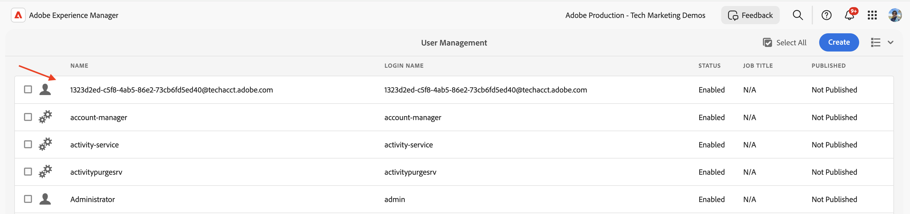

# Richiama le API AEM basate su OpenAPI utilizzando l’autenticazione server-to-server OAuth

Scopri come richiamare le API AEM basate su OpenAPI su AEM as a Cloud Service da applicazioni personalizzate utilizzando l’autenticazione _OAuth Server-to-Server_.

L’autenticazione server-to-server di OAuth è ideale per i servizi back-end che richiedono l’accesso API senza l’interazione dell’utente. Utilizza il tipo di sovvenzione OAuth 2.0 _client_credentials_ per autenticare l&#39;applicazione client.

>[!AVAILABILITY]
>
>Le API AEM basate su OpenAPI sono disponibili come parte di un programma di accesso anticipato. Se ti interessa accedervi, ti invitiamo a inviare un&#39;e-mail a [aem-apis@adobe.com](mailto:aem-apis@adobe.com) con una descrizione del tuo caso d&#39;uso.

## Cosa impara{#what-you-learn}

In questo tutorial imparerai a:

- Configura un progetto Adobe Developer Console (ADC) per accedere all&#39;API di authoring di Assets utilizzando _Autenticazione server-to-server OAuth_.

- Sviluppa un’applicazione NodeJS di esempio che chiama l’API Assets Author per recuperare i metadati di una risorsa specifica.

Prima di iniziare, assicurati di aver rivisto quanto segue:

- [Accesso alle API di Adobe e ai concetti correlati](../overview.md#accessing-adobe-apis-and-related-concepts).
- [Configura l&#39;articolo sulle API AEM basate su OpenAPI](../setup.md).

## Prerequisiti

Per completare questa esercitazione, è necessario:

- L’ambiente AEM as a Cloud Service è stato modernizzato con:
   - AEM versione `2024.10.18459.20241031T210302Z` o successiva.
   - Nuovi profili di prodotto (se l’ambiente è stato creato prima di novembre 2024)

  Consulta l&#39;articolo [Configurare le API AEM basate su OpenAPI](../setup.md) per ulteriori dettagli.

- Il progetto [WKND Sites](https://github.com/adobe/aem-guides-wknd?#aem-wknd-sites-project) di esempio deve essere distribuito su di esso.

- Accesso a [Adobe Developer Console](https://developer.adobe.com/developer-console/docs/guides/getting-started/).

- Installa [Node.js](https://nodejs.org/it/) nel computer locale per eseguire l&#39;applicazione NodeJS di esempio.

## Passaggi di sviluppo

Le fasi di sviluppo di alto livello sono:

1. Configura progetto ADC
   1. Aggiungere l’API di authoring di Assets
   1. Configurare il relativo metodo di autenticazione come server-to-server OAuth
   1. Associare il profilo di prodotto alla configurazione di autenticazione
1. Configura l’istanza di AEM per abilitare la comunicazione del progetto ADC
1. Sviluppare un esempio di applicazione NodeJS
1. Verificare il flusso end-to-end

## Configura progetto ADC

Il passaggio di configurazione del progetto ADC è _repeat_ dalle [API AEM basate su OpenAPI](../setup.md). Viene ripetuto per aggiungere l’API di authoring di Assets e configurare il relativo metodo di autenticazione come server-to-server OAuth.

>[!TIP]
>
>Assicurati di aver completato il passaggio **Abilita accesso API di AEM** dall&#39;articolo [Configura API di AEM basate su OpenAPI](../setup.md#enable-aem-apis-access). Senza di esso, l’opzione di autenticazione server-to-server non è disponibile.


1. Da [Adobe Developer Console](https://developer.adobe.com/console/projects), apri il progetto desiderato.

1. Per aggiungere le API di AEM, fai clic sul pulsante **Aggiungi API**.

   

1. Nella finestra di dialogo _Aggiungi API_, filtra per _Experience Cloud_, seleziona la scheda **API Autore AEM Assets** e fai clic su **Avanti**.

   

1. Nella finestra di dialogo _Configura API_, selezionare l&#39;opzione di autenticazione **Server-to-Server** e fare clic su **Avanti**. L’autenticazione server-to-server è ideale per i servizi back-end che richiedono accesso API senza interazione da parte dell’utente.

   

1. Rinominare le credenziali per semplificarne l&#39;identificazione (se necessario) e fare clic su **Avanti**. A scopo dimostrativo, viene utilizzato il nome predefinito.

   

1. Seleziona il profilo di prodotto **Utenti AEM Assets Collaborator - Autore - Programma XXX - Ambiente XXX** e fai clic su **Salva**. Come puoi vedere, è disponibile per la selezione solo il profilo di prodotto associato al servizio Utenti API di AEM Assets.

   

1. Controlla l’API di AEM e la configurazione dell’autenticazione.

   

   

## Configura istanza AEM per abilitare la comunicazione del progetto ADC

Segui le istruzioni riportate nell&#39;articolo [Configura le API AEM basate su OpenAPI](../setup.md#configure-the-aem-instance-to-enable-adc-project-communication) per configurare l&#39;istanza di AEM in modo da abilitare la comunicazione con il progetto ADC.

## Sviluppare un esempio di applicazione NodeJS

Sviluppiamo un’applicazione NodeJS di esempio che chiama l’API Assets Author.

Per sviluppare l’applicazione puoi utilizzare altri linguaggi di programmazione come Java, Python, ecc.

A scopo di test, puoi utilizzare [Postman](https://www.postman.com/), [curl](https://curl.se/) o qualsiasi altro client REST per richiamare le API di AEM.

### Rivedere l’API

Prima di sviluppare l&#39;applicazione, esaminiamo [distribuire l&#39;endpoint dei metadati](https://developer.adobe.com/experience-cloud/experience-manager-apis/api/experimental/../assets/author/#operation/getAssetMetadata) della risorsa specificata dall&#39;_API Assets Author_. La sintassi API è:

```http
GET https://{bucket}.adobeaemcloud.com/adobe/../assets/{assetId}/metadata
```

Per recuperare i metadati di una risorsa specifica, sono necessari i valori `bucket` e `assetId`. `bucket` è il nome dell&#39;istanza di AEM senza il nome di dominio di Adobe (.adobeaemcloud.com), ad esempio `author-p63947-e1420428`.

`assetId` è l&#39;UUID JCR della risorsa con il prefisso `urn:aaid:aem:`, ad esempio `urn:aaid:aem:a200faf1-6d12-4abc-bc16-1b9a21f870da`. Esistono diversi modi per ottenere `assetId`:

- Aggiungere l&#39;estensione del percorso della risorsa AEM `.json` per ottenere i metadati della risorsa. `https://author-p63947-e1420429.adobeaemcloud.com/content/dam/wknd-shared/en/adventures/cycling-southern-utah/adobestock-221043703.jpg.json` e cercare la proprietà `jcr:uuid`.

- In alternativa, è possibile ottenere `assetId` esaminando la risorsa nella finestra di ispezione degli elementi del browser. Cercare l&#39;attributo `data-id="urn:aaid:aem:..."`.

  

### Richiama l’API tramite il browser

Prima di sviluppare l&#39;applicazione, richiamiamo l&#39;API utilizzando la funzionalità **Prova** nella [documentazione API](https://developer.adobe.com/experience-cloud/experience-manager-apis/api/experimental/assets/author/).

1. Apri la [documentazione dell&#39;API Assets Author](https://developer.adobe.com/experience-cloud/experience-manager-apis/api/experimental/assets/author/) nel browser.

1. Espandi la sezione _Metadati_ e fai clic sull&#39;opzione **Distribuisce i metadati della risorsa specificata**.

1. Nel riquadro destro fare clic sul pulsante **Prova**.
   

1. Immetti i seguenti valori:

   | Sezione | Parametro | Valore |
   | --- | --- | --- |
   |  | bucket | Il nome dell&#39;istanza AEM senza il nome di dominio Adobe (.adobeaemcloud.com), ad esempio `author-p63947-e1420428`. |
   | **Sicurezza** | Token Bearer | Utilizza il token di accesso dalle credenziali server-to-server OAuth del progetto ADC. |
   | **Sicurezza** | X-Api-Key | Utilizza il valore `ClientID` dalle credenziali server-to-server OAuth del progetto ADC. |
   | **Parametri** | assetId | Identificatore univoco della risorsa in AEM, ad esempio `urn:aaid:aem:a200faf1-6d12-4abc-bc16-1b9a21f870da` |
   | **Parametri** | X-Adobe-Accept-Experimental | 1 |

   

   

1. Fai clic su **Invia** per richiamare l&#39;API e controlla la risposta nella scheda **Risposta**.

   

I passaggi precedenti confermano la modernizzazione dell’ambiente AEM as a Cloud Service, consentendo l’accesso alle API di AEM. Inoltre, conferma la corretta configurazione del progetto ADC e la comunicazione delle credenziali server-to-server OAuth ClientID con l’istanza Autore AEM.

### Esempio di applicazione NodeJS

Creiamo un esempio di applicazione NodeJS.

Per sviluppare l&#39;applicazione, puoi utilizzare _Esegui l&#39;applicazione campione_ o le istruzioni _Sviluppo_.

>[!BEGINTABS]

>[!TAB Esegui l&#39;applicazione campione]

1. Scarica il file zip dell&#39;applicazione [demo-nodejs-app-to-invoke-aem-openapi](../assets/s2s/demo-nodejs-app-to-invoke-aem-openapi.zip) di esempio ed estrailo.

1. Passa alla cartella estratta e installa le dipendenze.

   ```bash
   $ npm install
   ```

1. Sostituire i segnaposto nel file `.env` con i valori effettivi delle credenziali server-to-server OAuth del progetto ADC.

1. Sostituire `<BUCKETNAME>` e `<ASSETID>` nel file `src/index.js` con i valori effettivi.

1. Esegui l’applicazione NodeJS.

   ```bash
   $ node src/index.js
   ```

>[!TAB Sviluppo guidato]

1. Crea un nuovo progetto NodeJS.

   ```bash
   $ mkdir demo-nodejs-app-to-invoke-aem-openapi
   $ cd demo-nodejs-app-to-invoke-aem-openapi
   $ npm init -y
   ```

1. Installa le librerie _fetch_ e _dotenv_ per effettuare richieste HTTP e leggere le variabili di ambiente rispettivamente.

   ```bash
   $ npm install node-fetch
   $ npm install dotenv
   ```

1. Apri il progetto nel tuo editor di codice preferito e aggiorna il file `package.json` per aggiungere `type` a `module`.

   ```json
   {
       ...
       "version": "1.0.0",
       "type": "module",
       "main": "index.js",
       ...
   }
   ```

1. Crea il file `.env` e aggiungi la seguente configurazione. Sostituisci i segnaposto con i valori effettivi delle credenziali server-to-server OAuth del progetto ADC.

   ```properties
   CLIENT_ID=<ADC Project OAuth Server-to-Server credential ClientID>
   CLIENT_SECRET=<ADC Project OAuth Server-to-Server credential Client Secret>
   SCOPES=<ADC Project OAuth Server-to-Server credential Scopes>
   ```

1. Creare il file `src/index.js` e aggiungere il codice seguente e sostituire `<BUCKETNAME>` e `<ASSETID>` con i valori effettivi.

   ```javascript
   // Import the dotenv configuration to load environment variables from the .env file
   import "dotenv/config";
   
   // Import the fetch function to make HTTP requests
   import fetch from "node-fetch";
   
   // REPLACE THE FOLLOWING VALUES WITH YOUR OWN
   const bucket = "<BUCKETNAME>"; // Bucket name is the AEM instance name (e.g. author-p63947-e1420428)
   const assetId = "<ASSETID>"; // Asset ID is the unique identifier for the asset in AEM (e.g. urn:aaid:aem:a200faf1-6d12-4abc-bc16-1b9a21f870da). You can get it by inspecting the asset in browser's element inspector, look for data-id="urn:aaid:aem:..."
   
   // Load environment variables for authentication
   const clientId = process.env.CLIENT_ID; // Adobe IMS client ID
   const clientSecret = process.env.CLIENT_SECRET; // Adobe IMS client secret
   const scopes = process.env.SCOPES; // Scope for the API access
   
   // Adobe IMS endpoint for obtaining an access token
   const adobeIMSV3TokenEndpointURL =
   "https://ims-na1.adobelogin.com/ims/token/v3";
   
   // Function to obtain an access token from Adobe IMS
   const getAccessToken = async () => {
       console.log("Getting access token from IMS"); // Log process initiation
       //console.log("Client ID: " + clientId); // Display client ID for debugging purposes
   
       // Configure the HTTP POST request to fetch the access token
       const options = {
           method: "POST",
           headers: {
           "Content-Type": "application/x-www-form-urlencoded", // Specify form data content type
           },
           // Send client ID, client secret, and scopes as the request body
           body: `grant_type=client_credentials&client_id=${clientId}&client_secret=${clientSecret}&scope=${scopes}`,
       };
   
       // Make the HTTP request to fetch the access token
       const response = await fetch(adobeIMSV3TokenEndpointURL, options);
   
       //console.log("Response status: " + response.status); // Log the HTTP status for debugging
   
       const responseJSON = await response.json(); // Parse the JSON response
   
       console.log("Access token received"); // Log success message
   
       // Return the access token
       return responseJSON.access_token;
   };
   
   // Function to retrieve metadata for a specific asset from AEM
   const getAssetMetadat = async () => {
       // Fetch the access token using the getAccessToken function
       const accessToken = await getAccessToken();
   
       console.log("Getting asset metadata from AEM");
   
       // Invoke the Assets Author API to retrieve metadata for a specific asset
       const resp = await fetch(
           `https://${bucket}.adobeaemcloud.com/adobe/../assets/${assetId}/metadata`, // Construct the URL with bucket and asset ID
           {
           method: "GET",
           headers: {
               "If-None-Match": "string", // Header to handle caching (not critical for this tutorial)
               "X-Adobe-Accept-Experimental": "1", // Header to enable experimental Adobe API features
               Authorization: "Bearer " + accessToken, // Provide the access token for authorization
               "X-Api-Key": clientId, // Include the OAuth S2S ClientId for identification
           },
           }
       );
   
       const data = await resp.json(); // Parse the JSON response
   
       console.log("Asset metadata received"); // Log success message
       console.log(data); // Display the retrieved metadata
   };
   
   // Call the getAssets function to start the process
   getAssetMetadat();
   ```

1. Esegui l’applicazione NodeJS.

   ```bash
   $ node src/index.js
   ```

>[!ENDTABS]

### Risposta API

Dopo la corretta esecuzione, la risposta API viene visualizzata nella console. La risposta contiene i metadati della risorsa specificata.

```json
{
  "assetId": "urn:aaid:aem:9c09ff70-9ee8-4b14-a5fa-ec37baa0d1b3",
  "assetMetadata": {    
    ...
    "dc:title": "A Young Mountain Biking Couple Takes A Minute To Take In The Scenery",
    "xmp:CreatorTool": "Adobe Photoshop Lightroom Classic 7.5 (Macintosh)",
    ...
  },
  "repositoryMetadata": {
    ...
    "repo:name": "adobestock-221043703.jpg",
    "repo:path": "/content/dam/wknd-shared/en/adventures/cycling-southern-utah/adobestock-221043703.jpg",
    "repo:state": "ACTIVE",
    ...
  }
}
```

Congratulazioni Le API AEM basate su OpenAPI sono state richiamate dall’applicazione personalizzata mediante l’autenticazione server-to-server di OAuth.

### Rivedi il codice dell’applicazione

I callout chiave dal codice di esempio dell’applicazione NodeJS sono:

1. **Autenticazione IMS**: recupera un token di accesso utilizzando l&#39;impostazione delle credenziali da server a server OAuth nel progetto ADC.

   ```javascript
   // Function to obtain an access token from Adobe IMS
   const getAccessToken = async () => {
   
       // Configure the HTTP POST request to fetch the access token
       const options = {
           method: "POST",
           headers: {
           "Content-Type": "application/x-www-form-urlencoded", // Specify form data content type
           },
           // Send client ID, client secret, and scopes as the request body
           body: `grant_type=client_credentials&client_id=${clientId}&client_secret=${clientSecret}&scope=${scopes}`,
       };
   
       // Make the HTTP request to fetch the access token from Adobe IMS token endpoint https://ims-na1.adobelogin.com/ims/token/v3
       const response = await fetch(adobeIMSV3TokenEndpointURL, options);
   
       const responseJSON = await response.json(); // Parse the JSON response
   
       // Return the access token
       return responseJSON.access_token;
   };
   ...
   ```

1. **Chiamata API**: richiama l&#39;API Assets Author per recuperare i metadati per una risorsa specifica fornendo il token di accesso per l&#39;autorizzazione.

   ```javascript
   // Function to retrieve metadata for a specific asset from AEM
   const getAssetMetadat = async () => {
       // Fetch the access token using the getAccessToken function
       const accessToken = await getAccessToken();
   
       console.log("Getting asset metadata from AEM");
   
       // Invoke the Assets Author API to retrieve metadata for a specific asset
       const resp = await fetch(
           `https://${bucket}.adobeaemcloud.com/adobe/../assets/${assetId}/metadata`, // Construct the URL with bucket and asset ID
           {
           method: "GET",
           headers: {
               "If-None-Match": "string", // Header to handle caching (not critical for this tutorial)
               "X-Adobe-Accept-Experimental": "1", // Header to enable experimental Adobe API features
               Authorization: "Bearer " + accessToken, // Provide the access token for authorization
               "X-Api-Key": clientId, // Include the OAuth S2S ClientId for identification
           },
           }
       );
   
       const data = await resp.json(); // Parse the JSON response
   
       console.log("Asset metadata received"); // Log success message
       console.log(data); // Display the retrieved metadata
   };
   ...
   ```

## Sotto il cofano

Dopo aver chiamato correttamente l’API, nel servizio AEM Author viene creato un utente che rappresenta le credenziali da server a server OAuth del progetto ADC, insieme ai gruppi di utenti che corrispondono alla configurazione del profilo di prodotto e dei servizi. L&#39;_utente account tecnico_ è associato al profilo di prodotto e al gruppo di utenti _Servizi_, che dispone delle autorizzazioni necessarie per _LEGGERE_ i metadati della risorsa.

Per verificare la creazione di utenti e gruppi di utenti per l’account tecnico, effettua le seguenti operazioni:

- Nel progetto ADC, passa alla configurazione delle credenziali **OAuth Server-to-Server**. Nota il valore **E-mail account tecnico**.

  

- Nel servizio AEM Author, passa a **Strumenti** > **Sicurezza** > **Utenti** e cerca il valore **E-mail account tecnico**.

  

- Fai clic sull&#39;utente account tecnico per visualizzare i dettagli dell&#39;utente, ad esempio l&#39;iscrizione a **Gruppi**. Come mostrato di seguito, l&#39;utente dell&#39;account tecnico è associato ai gruppi di utenti **AEM Assets Collaborator Users - author - Program XXX - Environment XXX** e **AEM Assets Collaborator Users - Service**.

  

- L&#39;utente dell&#39;account tecnico è associato al profilo di prodotto **Utenti AEM Assets Collaborator - Autore - Programma XXX - Ambiente XXX**. Il profilo di prodotto è associato ai servizi **Utenti API AEM Assets** e **Utenti AEM Assets Collaborator**.

  

- Il profilo prodotto e l&#39;associazione utente dell&#39;account tecnico possono essere verificati nella scheda **Credenziali API** di **Profili prodotto**.

  

## Errore 403 per richieste non GET

Per _LEGGERE_ i metadati della risorsa, l&#39;utente dell&#39;account tecnico creato per le credenziali server-to-server OAuth dispone delle autorizzazioni necessarie tramite il gruppo di utenti Servizi (ad esempio, Utenti di AEM Assets Collaborator - Servizio).

Tuttavia, per _creare, aggiornare, eliminare_ (CUD) i metadati della risorsa, l&#39;utente dell&#39;account tecnico necessita di autorizzazioni aggiuntive. Puoi verificarla richiamando l’API con una richiesta non GET (ad esempio, PATCH, DELETE) e osservare la risposta di errore 403.

Invochiamo la richiesta _PATCH_ per aggiornare i metadati della risorsa e osservare la risposta all&#39;errore 403.

- Apri la [documentazione dell&#39;API Assets Author](https://developer.adobe.com/experience-cloud/experience-manager-apis/api/experimental/assets/author/) nel browser.

- Immetti i seguenti valori:

  | Sezione | Parametro | Valore |
  | --- | --- | --- |
  | **Bucket** |  | Il nome dell&#39;istanza AEM senza il nome di dominio Adobe (.adobeaemcloud.com), ad esempio `author-p63947-e1420428`. |
  | **Sicurezza** | Token Bearer | Utilizza il token di accesso dalle credenziali server-to-server OAuth del progetto ADC. |
  | **Sicurezza** | X-Api-Key | Utilizza il valore `ClientID` dalle credenziali server-to-server OAuth del progetto ADC. |
  | **Corpo** |  | `[{ "op": "add", "path": "foo","value": "bar"}]` |
  | **Parametri** | assetId | Identificatore univoco della risorsa in AEM, ad esempio `urn:aaid:aem:a200faf1-6d12-4abc-bc16-1b9a21f870da` |
  | **Parametri** | X-Adobe-Accept-Experimental | * |
  | **Parametri** | X-Adobe-Accept-Experimental | 1 |

- Fai clic su **Invia** per richiamare la richiesta _PATCH_ e osservare la risposta di errore 403.

  

Per correggere l&#39;errore 403, sono disponibili due opzioni:

- In ADC Project, aggiorna il profilo di prodotto associato alle credenziali server-to-server OAuth con un profilo di prodotto appropriato che disponga delle autorizzazioni necessarie per _creare, aggiornare, eliminare_ (CUD) i metadati della risorsa, ad esempio **Amministratori AEM - Autore - Programma XXX - Ambiente XXX**. Per ulteriori informazioni, consulta l&#39;articolo [Procedura: credenziali connesse dell&#39;API e gestione dei profili di prodotto](../how-to/credentials-and-product-profile-management.md).

- Utilizzando AEM Project, aggiorna le autorizzazioni del gruppo di utenti del servizio AEM associato (ad esempio, Utenti di AEM Assets Collaborator - Servizio) in AEM Author per consentire _la creazione, l&#39;aggiornamento, l&#39;eliminazione_ (CUD) dei metadati della risorsa. Per ulteriori informazioni, vedere l&#39;articolo [Procedura: gestione delle autorizzazioni dei gruppi di utenti del servizio AEM](../how-to/services-user-group-permission-management.md).

## Riepilogo

In questo tutorial, hai imparato a richiamare le API AEM basate su OpenAPI da applicazioni personalizzate. Hai abilitato l’accesso alle API di AEM, hai creato e configurato un progetto Adobe Developer Console (ADC).
Nel progetto ADC, hai aggiunto le API di AEM, ne hai configurato il tipo di autenticazione e hai associato il profilo di prodotto. Hai anche configurato l’istanza di AEM per abilitare la comunicazione al progetto ADC e sviluppato un’applicazione NodeJS di esempio che chiama l’API di authoring di Assets.

## Risorse aggiuntive

- [Guida all’implementazione delle credenziali da server a server OAuth](https://developer.adobe.com/developer-console/docs/guides/authentication/ServerToServerAuthentication/implementation/)
