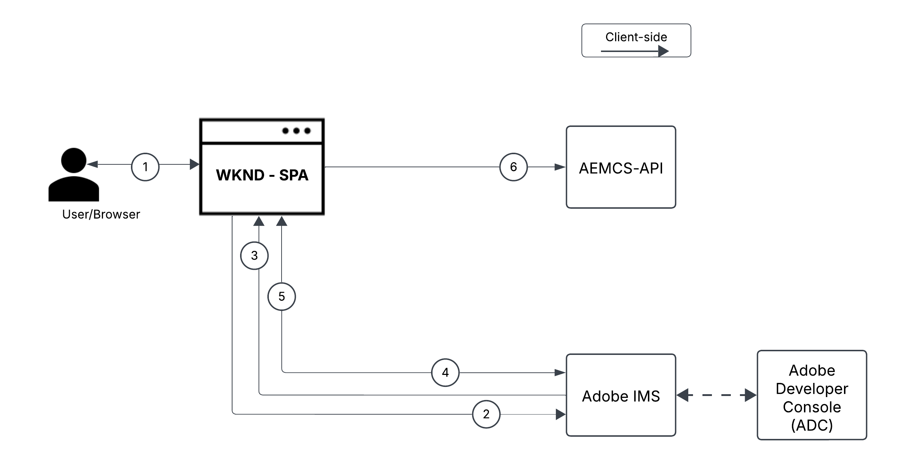
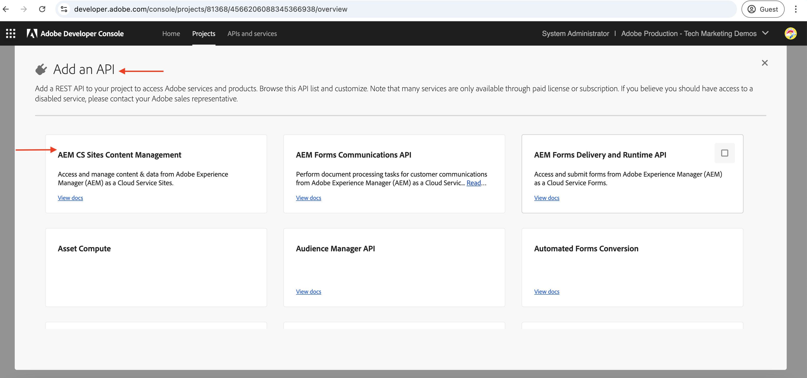
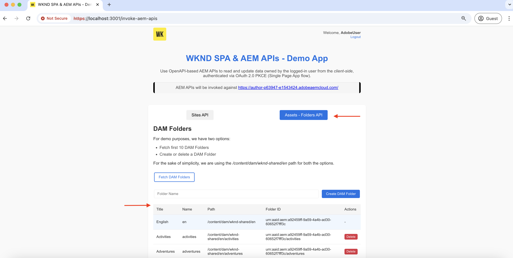

# Richiama le API AEM basate su OpenAPI tramite l’app a pagina singola OAuth

Scopri come richiamare le API AEM basate su OpenAPI su AEM as a Cloud Service utilizzando l’**autenticazione app a pagina singola OAuth**. Segue il flusso PKCE (Proof Key for Code Exchange) di OAuth 2.0 per l’autenticazione basata sull’utente in un’applicazione a pagina singola.

L’autenticazione tramite app a pagina singola OAuth è ideale per le applicazioni basate su JavaScript in esecuzione nel browser. Se non dispongono di un server back-end o se devono recuperare i token di accesso per interagire con le API di AEM per conto di un utente.

Il flusso PKCE estende il tipo di concessione _authorization_code_ di OAuth 2.0, migliorando la sicurezza impedendo l’intercettazione del codice di autorizzazione. Per ulteriori informazioni, consulta la sezione [Differenza tra le credenziali da server a server OAuth e da app Web e credenziali app a pagina singola](../overview.md#difference-between-oauth-server-to-server-vs-web-app-vs-single-page-app-credentials).

## Argomenti trattati{#what-you-learn}

In questo tutorial imparerai a:

- Configura un progetto Adobe Developer Console (ADC) per accedere alle API AEM basate su OpenAPI utilizzando l&#39;autenticazione _OAuth Single Page App_ o comunemente nota come _flusso PKCE OAuth 2.0_.

- Implementa il flusso di autenticazione di app a pagina singola OAuth in un’applicazione a pagina singola personalizzata.
   - Autenticazione utente IMS e autorizzazione app.
   - Accedi al recupero del token utilizzando il flusso PKCE di OAuth 2.0.
   - Utilizza il token di accesso per richiamare le API AEM basate su OpenAPI.

Prima di iniziare, assicurati di aver rivisto quanto segue:

- [Accesso alle API di Adobe e ai concetti correlati](../overview.md#accessing-adobe-apis-and-related-concepts).
- [Configura l&#39;articolo sulle API AEM basate su OpenAPI](../setup.md).

## Panoramica e flusso funzionale dell’applicazione a pagina singola WKND{#wknd-spa-overview-and-functional-flow}

Esaminiamo cos’è l’applicazione a pagina singola WKND, come viene creata e come funziona.

L&#39;applicazione a pagina singola WKND è un&#39;applicazione a pagina singola basata su **React** che illustra come ottenere in modo sicuro un token di accesso specifico per l&#39;utente e interagire direttamente con le API di AEM dal lato client. Implementa il flusso di autenticazione PKCE OAuth 2.0 tramite Adobe IMS e si integra con due API chiave di AEM:

1. **API Sites**: per accedere ai modelli per frammenti di contenuto
1. **API Assets**: per la gestione delle cartelle DAM

Il progetto Adobe Developer Console (ADC) è configurato per abilitare l&#39;autenticazione app a pagina singola OAuth, fornendo il **client_id** richiesto per avviare il flusso PKCE OAuth 2.0.

>[!IMPORTANT]
>
>Il progetto ADC NON fornisce un _client_secret_. L&#39;applicazione a pagina singola genera invece un _code_verifier_ e un _code_challenge_ per scambiare in modo sicuro il codice di autorizzazione per un _token di accesso_. Elimina la necessità di memorizzare un segreto client sul lato client, migliorando la sicurezza.


>[!VIDEO](https://video.tv.adobe.com/v/3456972?quality=12&learn=on&captions=ita)


Il diagramma seguente illustra il flusso funzionale dell&#39;applicazione a pagina singola WKND _che ottiene il token di accesso specifico dell&#39;utente per richiamare le API AEM basate su OpenAPI_:



1. L’applicazione a pagina singola avvia il flusso di autenticazione indirizzando l’utente al sistema Adobe Identity Management (IMS) tramite una richiesta di autorizzazione.
1. Come parte della richiesta di autorizzazione, l&#39;applicazione a pagina singola invia il _client_id_, _redirect_uri_ e _code_challenge_ a IMS, seguendo il flusso PKCE di OAuth 2.0. L&#39;applicazione a pagina singola genera un _code_verifier_ casuale, esegue l&#39;hash utilizzando SHA-256 e Base64 codifica il risultato per creare la _code_challenge_.
1. IMS autentica l&#39;utente e, in caso di autenticazione corretta, emette un _authorization_code_, che viene inviato nuovamente all&#39;applicazione a pagina singola tramite _redirect_uri_.
1. L&#39;applicazione a pagina singola scambia il _codice_autorizzazione_ per un _token di accesso_ inviando una richiesta POST all&#39;endpoint del token IMS. Include il _code_verifier_ nella richiesta di convalida della _code_challenge_ inviata in precedenza. In questo modo la richiesta di autorizzazione (passaggio 2) e la richiesta di token (passaggio 4) sono collegate allo stesso flusso di autenticazione, impedendo attacchi di intercettazione.
1. IMS convalida il _code_verifier_ e restituisce il _token di accesso_ specifico dell&#39;utente.
1. L&#39;applicazione a pagina singola include il _token di accesso_ nelle richieste API ad AEM per l&#39;autenticazione e il recupero di contenuto specifico dell&#39;utente.

L&#39;applicazione a pagina singola WKND è un&#39;applicazione basata su [React](https://react.dev/) e utilizza [React Context](https://react.dev/reference/react/createContext) per la gestione dello stato di autenticazione, [React Router](https://reactrouter.com/home) per la navigazione.

Altri framework SPA come Angular, Vue o Vanilla JavaScript possono essere utilizzati per creare SPA che si integrano con le API Adobe utilizzando gli approcci illustrati in questa esercitazione.

## Come utilizzare questa esercitazione{#how-to-use-this-tutorial}

Puoi affrontare questa esercitazione in due modi:

- [Rivedi snippet di codice chiave SPA](#review-spa-key-code-snippets): scopri il flusso di autenticazione delle app a pagina singola OAuth ed esplora le implementazioni delle chiamate API chiave nell&#39;applicazione a pagina singola WKND.
- [Imposta ed esegui l&#39;applicazione a pagina singola](#setup-and-run-the-spa): segui le istruzioni dettagliate per configurare ed eseguire l&#39;applicazione a pagina singola WKND nel computer locale.

Scegli il percorso che meglio si adatta alle tue esigenze!

## Rivedi snippet di codice chiave SPA{#review-spa-key-code-snippets}

Approfondiamo i frammenti di codice chiave dell’applicazione a pagina singola WKND che mostrano come:

- Ottieni un token di accesso specifico per l’utente utilizzando il flusso di autenticazione OAuth per app a pagina singola.

- Richiama le API AEM basate su OpenAPI direttamente dal lato client.

Questi snippet aiutano a comprendere il processo di autenticazione e le interazioni API all’interno dell’applicazione a pagina singola.

### Scarica il codice SPA{#download-the-spa-code}

1. Scarica il file zip [WKND SPA &amp; AEM API - Demo App](../assets/spa/wknd-spa-with-aemapis-demo.zip) ed estrailo.

1. Passa alla cartella estratta e apri il file `.env.example` nel tuo editor di codice preferito. Esamina i parametri di configurazione richiesti.

   ```plaintext
   ########################################################################
   # Adobe IMS, Adobe Developer Console (ADC), and AEM as a Cloud Service Information
   ########################################################################
   # Adobe IMS OAuth endpoints
   REACT_APP_ADOBE_IMS_AUTHORIZATION_ENDPOINT=https://ims-na1.adobelogin.com/ims/authorize/v2
   REACT_APP_ADOBE_IMS_TOKEN_ENDPOINT=https://ims-na1.adobelogin.com/ims/token/v3
   
   # Adobe Developer Console (ADC) Project's OAuth Single-Page App credential
   REACT_APP_ADC_CLIENT_ID=<ADC Project OAuth Single-Page App credential ClientID>
   REACT_APP_ADC_SCOPES=<ADC Project OAuth Single-Page App credential Scopes>
   
   # AEM Assets Information
   REACT_APP_AEM_ASSET_HOSTNAME=<AEMCS Hostname, e.g., https://author-p63947-e1502138.adobeaemcloud.com/>
   
   ################################################
   # Single Page Application Information
   ################################################
   
   # Enable HTTPS for local development
   HTTPS=true
   PORT=3001
   
   # SSL Certificate and Key for local development 
   SSL_CRT_FILE=./ssl/server.crt
   SSL_KEY_FILE=./ssl/server.key
   
   # The URL to which the user will be redirected after the OAuth flow is complete
   REACT_APP_REDIRECT_URI=https://localhost:3000/callback
   ```

   È necessario sostituire i segnaposto con i valori effettivi del progetto Adobe Developer Console (ADC) e dell’istanza di AEM as a Cloud Service Assets.

### Autenticazione utente IMS e autorizzazione SPA{#ims-user-authentication-and-spa-authorization}

Esaminiamo il codice che gestisce l’autenticazione utente IMS e l’autorizzazione SPA. Per recuperare i modelli per frammenti di contenuto e le cartelle DAM, l’utente deve effettuare l’autenticazione con Adobe IMS e concedere l’autorizzazione SPA WKND per accedere alle API di AEM per suo conto.

Durante l’accesso iniziale, all’utente viene richiesto di fornire il consenso, consentendo all’applicazione a pagina singola WKND di accedere in modo sicuro alle risorse richieste.


1. Nel file `src/context/IMSAuthContext.js`, la funzione `login` avvia l&#39;autenticazione utente IMS e il flusso di autorizzazione dell&#39;app. Genera un `code_verifier` e un `code_challenge` casuali per scambiare in modo sicuro `code` per un token di accesso. `code_verifier` è archiviato nell&#39;archivio locale per un utilizzo successivo. Come accennato in precedenza, l&#39;applicazione a pagina singola non archivia o utilizza `client_secret`, ne genera una al volo e la utilizza in due passaggi: `authorize` e `token` richieste.

   ```javascript
   ...
   const login = async () => {
       try {
           const codeVerifier = generateCodeVerifier();
           const codeChallenge = generateCodeChallenge(codeVerifier);
   
           localStorage.setItem(STORAGE_KEYS.CODE_VERIFIER, codeVerifier);
   
           const params = new URLSearchParams(
               getAuthParams(AUTH_METHODS.S256, codeChallenge, codeVerifier)
           );
   
           window.location.href = `${
               APP_CONFIG.adobe.ims.authorizationEndpoint //https://ims-na1.adobelogin.com/ims/authorize/v2
           }?${params.toString()}`;
       } catch (error) {
           console.error("Login initialization failed:", error);
           throw error;
       }
   };
   ...
   
   // Generate a random code verifier
   export function generateCodeVerifier() {
       const array = new Uint8Array(32);
       window.crypto.getRandomValues(array);
       const wordArray = CryptoJS.lib.WordArray.create(array);
       return base64URLEncode(wordArray);
   }
   
   // Generate code challenge using SHA-256
   export function generateCodeChallenge(codeVerifier) {
       const hash = CryptoJS.SHA256(codeVerifier);
       return base64URLEncode(hash);
   }
   
   // Get authorization URL parameters
   const getAuthParams = useCallback((method, codeChallenge, codeVerifier) => {
       const baseParams = {
           client_id: APP_CONFIG.adobe.adc.clientId, // ADC Project OAuth Single-Page App credential ClientID
           scope: APP_CONFIG.adobe.adc.scopes, // ADC Project OAuth Single-Page App credential Scopes
           response_type: "code",
           redirect_uri: APP_CONFIG.adobe.spa.redirectUri, // SPA redirect URI https://localhost:3000/callback
           code_challenge_method: method, // S256 or plain
       };
   
       return {
           ...baseParams,
           code_challenge:
               method === AUTH_METHODS.S256 ? codeChallenge : codeVerifier,
           };
   }, []);    
   ...
   ```

   Se l’utente non è autenticato tramite Adobe IMS, viene visualizzata la pagina di accesso di Adobe ID in cui viene richiesto all’utente di eseguire l’autenticazione.

   Se è già stato autenticato, l&#39;utente verrà reindirizzato al _redirect_uri_ specificato dell&#39;applicazione a pagina singola WKND con un _authorization_code_.

### Recupero del token di accesso tramite il flusso PKCE di OAuth 2.0{#access-token-retrieval-using-oauth-20-pkce-flow}

L&#39;applicazione a pagina singola WKND scambia in modo sicuro il _authorization_code_ con Adobe IMS per un token di accesso specifico dell&#39;utente utilizzando _client_id_ e _code_verifier_.

1. Nel file `src/context/IMSAuthContext.js`, la funzione `exchangeCodeForToken` scambia il _authorization_code_ per un token di accesso specifico dell&#39;utente.

   ```javascript
   ...
   // Handle the callback from the Adobe IMS authorization endpoint
   const handleCallback = async (code) => {
       if (authState.isProcessingCallback) return;
   
       try {
           updateAuthState({ isProcessingCallback: true });
   
           const data = await exchangeCodeForToken(code);
   
           if (data.access_token) {
               handleStorageToken(data.access_token);
               localStorage.removeItem(STORAGE_KEYS.CODE_VERIFIER);
           }
       } catch (error) {
           console.error("Error exchanging code for token:", error);
           throw error;
       } finally {
           updateAuthState({ isProcessingCallback: false });
       }
   };
   
   ...
   // Exchange the authorization code for an access token
   const exchangeCodeForToken = useCallback(async (code) => {
       const codeVerifier = localStorage.getItem(STORAGE_KEYS.CODE_VERIFIER);
   
       if (!codeVerifier) {
           throw new Error("No code verifier found");
       }
   
       //https://ims-na1.adobelogin.com/ims/token/v3
       const response = await fetch(APP_CONFIG.adobe.ims.tokenEndpoint, {
           method: "POST",
           headers: { "Content-Type": "application/x-www-form-urlencoded" },
           body: new URLSearchParams({
               grant_type: "authorization_code",
               client_id: APP_CONFIG.adobe.adc.clientId, // ADC Project OAuth Single-Page App credential ClientID
               code_verifier: codeVerifier, // Code verifier generated during login
               code, // Authorization code received from the IMS
               redirect_uri: `${window.location.origin}/callback`,
           }),
       });
   
       if (!response.ok) {
           throw new Error("Token request failed");
       }
   
       return response.json();
   }, []);
   
   const handleStorageToken = useCallback(
       (token) => {
           if (token) {
               localStorage.setItem(STORAGE_KEYS.ACCESS_TOKEN, token);
               updateAuthState({ isLoggedIn: true, accessToken: token });
           }
       },
       [updateAuthState]
   );
   ...
   ```

   Il token di accesso viene memorizzato nell’archiviazione locale del browser e utilizzato nelle chiamate API successive alle API di AEM.

### Accesso alle API AEM basate su OpenAPI tramite il token di accesso{#accessing-openapi-based-aem-apis-using-the-access-token}

L’applicazione a pagina singola WKND utilizza il token di accesso specifico dell’utente per richiamare i modelli per frammenti di contenuto e gli endpoint API per cartelle DAM.

Nel file `src/components/InvokeAemApis.js`, la funzione `fetchContentFragmentModels` illustra come utilizzare il token di accesso per richiamare le API AEM basate su OpenAPI dal lato client.

```javascript
    ...
  // Fetch Content Fragment Models
  const fetchContentFragmentModels = useCallback(async () => {
    try {
      updateState({ isLoading: true, error: null });
      const data = await makeApiRequest({
        endpoint: `${API_PATHS.CF_MODELS}?cursor=0&limit=10&projection=summary`,
      });
      updateState({ cfModels: data.items });
    } catch (err) {
      updateState({ error: err.message });
      console.error("Error fetching CF models:", err);
    } finally {
      updateState({ isLoading: false });
    }
  }, [makeApiRequest, updateState]);

  // Common API request helper
  const makeApiRequest = useCallback(
    async ({ endpoint, method = "GET", passAPIKey = false, body = null }) => {
    
      // Get the access token from the local storage
      const token = localStorage.getItem("adobe_ims_access_token");
      if (!token) {
        throw new Error("No access token available. Please login again.");
      }

      const headers = {
        Authorization: `Bearer ${token}`,
        "Content-Type": "application/json",
        ...(passAPIKey && { "x-api-key": APP_CONFIG.adobe.adc.clientId }),
      };

      const response = await fetch(
        `${APP_CONFIG.adobe.aem.hostname}${endpoint}`,
        {
          method,
          headers,
          ...(body && { body: JSON.stringify(body) }),
        }
      );

      if (!response.ok) {
        throw new Error(`API request failed: ${response.statusText}`);
      }

      return method === "DELETE" ? null : response.json();
    },
    []
  );
  ...
```

## Configurare ed eseguire l’applicazione a pagina singola{#setup-and-run-the-spa}

Configuriamo ed eseguiamo l’applicazione a pagina singola WKND sul computer locale per comprendere il flusso di autenticazione app a pagina singola OAuth e le chiamate API.

### Prerequisiti{#prerequisites}

Per completare questa esercitazione, è necessario:

- L’ambiente AEM as a Cloud Service è stato modernizzato con:
   - AEM versione `2024.10.18459.20241031T210302Z` o successiva.
   - Nuovi profili di prodotto (se l’ambiente è stato creato prima di novembre 2024)

  Per ulteriori dettagli, consulta l&#39;articolo [Configurazione delle API AEM basate su OpenAPI](../setup.md).

- Il progetto [WKND Sites](https://github.com/adobe/aem-guides-wknd?#aem-wknd-sites-project) di esempio deve essere distribuito su di esso.

- Accesso a [Adobe Developer Console](https://developer.adobe.com/developer-console/docs/guides/getting-started).

- Installa [Node.js](https://nodejs.org/it/) nel computer locale per eseguire l&#39;applicazione NodeJS di esempio.

### Passaggi di sviluppo{#development-steps}

Le fasi di sviluppo di alto livello sono:

1. Configura progetto ADC
   1. Aggiungi le API Assets e Sites.
   1. Configura le credenziali dell&#39;app a pagina singola OAuth.
1. Configurare l’istanza di AEM
   1. Per abilitare la comunicazione di un progetto ADC
   1. Consentire all’applicazione a pagina singola di accedere alle API di AEM configurando le impostazioni CORS.
1. Configurare ed eseguire l’applicazione a pagina singola WKND sul computer locale
1. Verificare il flusso end-to-end

### Configura progetto ADC{#configure-adc-project}

Il passaggio di configurazione del progetto ADC è _repeat_ dalle [API AEM basate su OpenAPI](../setup.md). Viene ripetuto per aggiungere l’API Assets e Sites e configurarne il metodo di autenticazione come app a pagina singola OAuth.

1. Da [Adobe Developer Console](https://developer.adobe.com/console/projects), apri il progetto desiderato.

1. Per aggiungere le API di AEM, fai clic sul pulsante **Aggiungi API**.

   

1. Nella finestra di dialogo _Aggiungi API_, filtra per _Experience Cloud_, seleziona la scheda **Gestione contenuto siti AEM CS** e fai clic su **Avanti**.

   

   >[!TIP]
   >
   >Se la **scheda API AEM** desiderata è disabilitata e _Perché è disabilitata?Le informazioni di_ mostrano il messaggio **Licenza richiesta** uno dei motivi potrebbe essere che NON hai modernizzato l&#39;ambiente AEM as a Cloud Service. Per ulteriori informazioni, consulta [Modernizzazione dell&#39;ambiente AEM as a Cloud Service](../setup.md#modernization-of-aem-as-a-cloud-service-environment).

1. Nella finestra di dialogo _Configura API_, selezionare l&#39;opzione di autenticazione **Autenticazione utente** e fare clic su **Avanti**.

   

1. Nella prossima finestra di dialogo _Configura API_, seleziona l&#39;opzione di autenticazione **App a pagina singola OAuth** e fai clic su **Avanti**.

   

1. Nella finestra di dialogo _Configura app a pagina singola OAuth_, immetti i dettagli seguenti e fai clic su **Avanti**.
   - URI di reindirizzamento predefinito: `https://localhost:3001/callback`
   - Schema URI di reindirizzamento: `https://localhost:3001/callback`

   

1. Rivedi gli ambiti disponibili e fai clic su **Salva API configurata**.

   

1. Ripeti i passaggi precedenti per aggiungere l&#39;**API Autore AEM Assets**.

1. Controlla l’API di AEM e la configurazione dell’autenticazione.

   

   

### Configura istanza AEM per abilitare la comunicazione del progetto ADC{#configure-aem-instance-to-enable-adc-project-communication}

Segui le istruzioni riportate nell&#39;articolo [Configura le API AEM basate su OpenAPI](../setup.md#configure-the-aem-instance-to-enable-adc-project-communication) per configurare l&#39;istanza di AEM in modo da abilitare la comunicazione con il progetto ADC.

### Configurazione AEM CORS{#aem-cors-configuration}

La condivisione CORS (Cross-Origin Resource Sharing) di AEM as a Cloud Service facilita le proprietà web non AEM nell’effettuare chiamate lato client alle API AEM basate su browser.

1. In AEM Project individuare o creare il file `com.adobe.granite.cors.impl.CORSPolicyImpl~wknd-graphql.cfg.json` dalla cartella `/ui.config/src/main/content/jcr_root/apps/wknd/osgiconfig/config.author/`.

   

1. Aggiungi la seguente configurazione al file.

   ```json
   {
       "alloworigin":[
         ""
       ],
       "alloworiginregexp":[
         "https://localhost:.*",
         "http://localhost:.*"
       ],
       "allowedpaths": [
         "/adobe/sites/.*",
         "/graphql/execute.json.*",
         "/content/_cq_graphql/wknd-shared/endpoint.json",
         "/content/experience-fragments/.*"
       ],
       "supportedheaders": [
         "Origin",
         "Accept",
         "X-Requested-With",
         "Content-Type",
         "Access-Control-Request-Method",
         "Access-Control-Request-Headers",
         "Authorization"
       ],
       "supportedmethods":[
         "GET",
         "HEAD",
         "POST"
       ],
       "maxage:Integer": 1800,
       "supportscredentials": true,
       "exposedheaders":[ "" ]
   }
   ```

1. Apporta le modifiche alla configurazione e le invia all’archivio Git remoto a cui è connessa la pipeline Cloud Manager.

1. Distribuisci le modifiche precedenti utilizzando la pipeline FullStack in Cloud Manager.

### Configurare ed eseguire l’applicazione a pagina singola{#configure-and-run-the-spa}

1. Scarica il file zip [WKND SPA &amp; AEM API - Demo App](../assets/spa/wknd-spa-with-aemapis-demo.zip) ed estrailo.

1. Passare alla cartella estratta e copiare il file `.env.example` in `.env`.

1. Aggiorna il file `.env` con i parametri di configurazione richiesti dal progetto Adobe Developer Console (ADC) e dall&#39;ambiente AEM as a Cloud Service. Ad esempio:

   ```plaintext
   ########################################################################
   # Adobe IMS, Adobe Developer Console (ADC), and AEM as a Cloud Service Information
   ########################################################################
   # Adobe IMS OAuth endpoints
   REACT_APP_ADOBE_IMS_AUTHORIZATION_ENDPOINT=https://ims-na1.adobelogin.com/ims/authorize/v2
   REACT_APP_ADOBE_IMS_TOKEN_ENDPOINT=https://ims-na1.adobelogin.com/ims/token/v3
   REACT_APP_ADOBE_IMS_USERINFO_ENDPOINT=https://ims-na1.adobelogin.com/ims/userinfo/v2
   
   # Adobe Developer Console (ADC) Project's OAuth Single-Page App credential
   REACT_APP_ADC_CLIENT_ID=ddsfs455a4a440c48c7474687c96945d
   REACT_APP_ADC_SCOPES=AdobeID,openid,aem.folders,aem.assets.author,aem.fragments.management
   
   # AEM Assets Information
   REACT_APP_AEM_ASSET_HOSTNAME=https://author-p69647-e1453424.adobeaemcloud.com/
   
   ################################################
   # Single Page Application Information
   ################################################
   
   # Enable HTTPS for local development
   HTTPS=true
   PORT=3001
   
   # SSL Certificate and Key for local development 
   SSL_CRT_FILE=./ssl/server.crt
   SSL_KEY_FILE=./ssl/server.key
   
   # The URL to which the user will be redirected after the OAuth flow is complete
   REACT_APP_REDIRECT_URI=https://localhost:3000/callback
   ```

1. Apri un terminale e passa alla cartella estratta. Installa le dipendenze richieste e avvia l’applicazione a pagina singola WKND utilizzando il comando seguente.

   ```bash
   $ npm install
   $ npm start
   ```

### Verificare il flusso end-to-end{#verify-the-end-to-end-flow}

1. Apri un browser e passa a `https://localhost:3001` per accedere all’applicazione a pagina singola WKND. Accetta l’avviso del certificato autofirmato.

   

1. Fai clic sul pulsante **Accesso Adobe IMS** per avviare il flusso di autenticazione OAuth per app a pagina singola.

1. Esegui l’autenticazione in base a Adobe IMS e fornisci il consenso per consentire all’applicazione a pagina singola WKND di accedere alle risorse per tuo conto.

1. Dopo aver eseguito correttamente l&#39;autenticazione, si viene reindirizzati alla route `/invoke-aem-apis` dell&#39;applicazione a pagina singola WKND e il token di accesso viene archiviato nell&#39;archivio locale del browser.

   

1. Dalla route `https://localhost:3001/invoke-aem-apis`, fai clic sul pulsante **Recupera modelli per frammenti di contenuto** per richiamare l&#39;API Modelli per frammenti di contenuto. L’applicazione a pagina singola visualizza l’elenco dei modelli per frammenti di contenuto.

   

1. Analogamente, nella scheda **Assets - Folders API** puoi elencare, creare ed eliminare cartelle DAM.

   

1. Negli strumenti per sviluppatori del browser, puoi esaminare le richieste e le risposte di rete per comprendere le chiamate API.

   

>[!IMPORTANT]
>
>Se l’utente autenticato non dispone delle autorizzazioni necessarie per elencare, creare o eliminare le risorse AEM, le chiamate API non riescono e viene visualizzato un errore 403 Forbidden (Non consentito). In questo modo, anche se l’utente è autenticato e dispone di un token di accesso IMS valido, non può accedere alle risorse di AEM senza le autorizzazioni necessarie.

### Rivedi il codice SPA{#review-the-spa-code}

Esaminiamo la struttura del codice di alto livello e i principali punti di ingresso dell’applicazione a pagina singola WKND. L’applicazione a pagina singola viene creata utilizzando il framework React e utilizza l’API React Context per l’autenticazione e la gestione dello stato.

1. Il file `src/App.js` è il punto di ingresso principale dell&#39;applicazione a pagina singola WKND. Il componente app esegue il wrapping dell&#39;intera applicazione e inizializza il contesto `IMSAuthProvider`.

1. `src/context/IMSAuthContext.js` crea Adobe IMSAuthContext per fornire lo stato di autenticazione ai componenti figlio. Include le funzioni di accesso, logout e handleCallback per avviare il flusso di autenticazione dell&#39;app a pagina singola OAuth.

1. La cartella `src/components` contiene vari componenti per dimostrare le chiamate API alle API di AEM. Il componente `InvokeAemApis.js` illustra come utilizzare il token di accesso per richiamare le API di AEM.

1. Il file `src/config/config.js` carica le variabili di ambiente dal file `.env` e le esporta per l&#39;utilizzo nell&#39;applicazione.

1. Il file `src/utils/auth.js` contiene funzioni di utilità per generare il codice di validazione e il codice di autenticazione per il flusso PKCE di OAuth 2.0.

1. La cartella `ssl` contiene il certificato autofirmato e i file chiave per eseguire il proxy HTTP SSL locale.

Puoi sviluppare o integrare l’applicazione a pagina singola esistente con le API di Adobe utilizzando gli approcci illustrati in questa esercitazione.

## Riepilogo{#summary}

In questo tutorial, hai imparato a richiamare le API AEM basate su OpenAPI su AEM as a Cloud Service utilizzando l’autenticazione basata sull’utente da un’app a pagina singola (SPA) tramite il flusso PKCE OAuth 2.0.

## Risorse aggiuntive{#additional-resources}

- [API di Adobe Experience Manager as a Cloud Service](https://developer.adobe.com/experience-cloud/experience-manager-apis/)
- [Guida all&#39;implementazione dell&#39;autenticazione utente](https://developer.adobe.com/developer-console/docs/guides/authentication/UserAuthentication/implementation)
- [Autorizza richiesta](https://developer.adobe.com/developer-console/docs/guides/authentication/UserAuthentication/ims#authorize-request)
- [Recupero dei token di accesso](https://developer.adobe.com/developer-console/docs/guides/authentication/UserAuthentication/ims#fetching-access-tokens)
