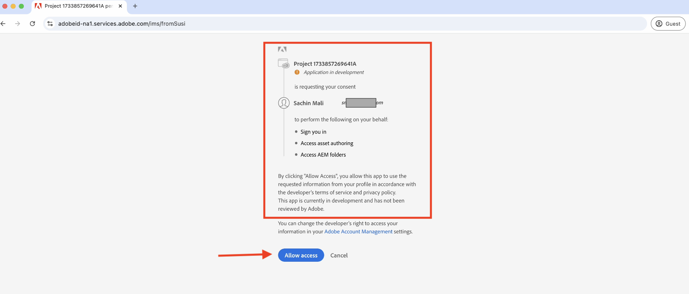
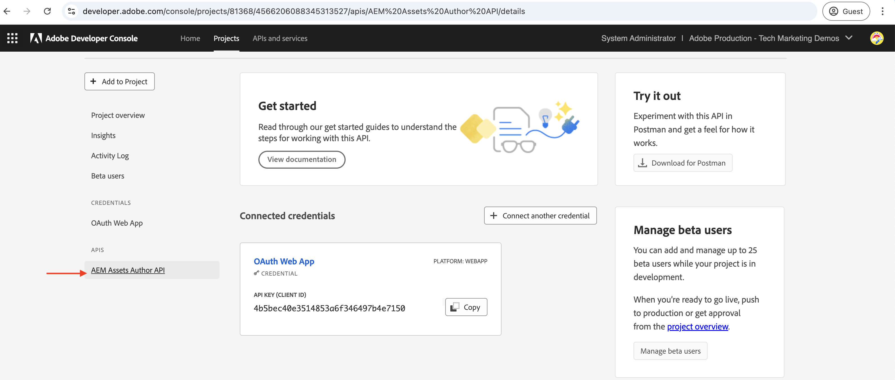

# Richiama le API AEM basate su OpenAPI tramite l’autenticazione OAuth Web App

Scopri come richiamare su AEM as a Cloud Service le API AEM basate su OpenAPI utilizzando l’autenticazione basata sull’utente da un’app web personalizzata che utilizza l’app web OAuth.

L&#39;autenticazione OAuth Web App è ideale per le applicazioni Web con componenti front-end e _back-end_ che devono **accedere alle API AEM per conto di un utente**. Utilizza il tipo di concessione _authorization_code_ di OAuth 2.0 per ottenere un token di accesso per conto dell&#39;utente per accedere alle API di AEM. Per ulteriori informazioni, vedi [Differenza tra le credenziali da server a server OAuth e da app Web e app a pagina singola](../overview.md#difference-between-oauth-server-to-server-vs-web-app-vs-single-page-app-credentials).

## Cosa impara{#what-you-learn}

In questo tutorial imparerai a:

- Configura un progetto Adobe Developer Console (ADC) per accedere all&#39;API di authoring di Assets utilizzando l&#39;autenticazione _OAuth Web App_.

- Implementa il flusso di autenticazione dell’app web OAuth in un’app web personalizzata.
   - Autenticazione utente IMS e autorizzazione app.
   - Recupero del token di accesso specifico dell’utente.
   - Accesso alle API AEM basate su OpenAPI utilizzando il token di accesso specifico dell’utente.

Prima di iniziare, assicurati di aver rivisto quanto segue:

- [Accesso alle API di Adobe e ai concetti correlati](../overview.md#accessing-adobe-apis-and-related-concepts).
- [Configura l&#39;articolo sulle API AEM basate su OpenAPI](../setup.md).

## App web di esempio: panoramica WKND-PIM e flusso funzionale

Comprendiamo l’app web di esempio, WKND Product Information Management (PIM), e il relativo flusso funzionale.

L’app PIM WKND è un’applicazione web di esempio progettata per gestire gli attributi del prodotto e i metadati delle relative risorse memorizzati in AEM as a Cloud Service. Questo esempio dimostra come le app web possono integrarsi perfettamente con le API di Adobe per fornire flussi di lavoro efficienti e incentrati sull’utente.

Il progetto Adobe Developer Console (ADC) è configurato per accedere all’API di authoring di Assets utilizzando l’autenticazione OAuth Web App. Fornisce il _client_id_ e il _client_secret_ necessari all&#39;app Web WKND-PIM per avviare il flusso di sovvenzione _authorization_code_.

>[!VIDEO](https://video.tv.adobe.com/v/3442757?quality=12&learn=on)


Il diagramma seguente illustra il flusso funzionale dell&#39;app Web WKND-PIM _che ottiene token di accesso specifici dell&#39;utente per interagire con l&#39;API di authoring di Assets_.


1. L’app web avvia il processo reindirizzando l’utente al sistema Adobe Identity Management (IMS) per l’autenticazione.
1. Insieme al reindirizzamento, l&#39;app Web passa il _client_id_ e il _redirect_uri_ richiesti a IMS.
1. IMS autentica l&#39;utente e lo invia nuovamente al _redirect_uri_ specificato con un _authorization_code_.
1. L&#39;app Web scambia il _authorization_code_ con IMS per un token di accesso specifico dell&#39;utente, utilizzando il relativo _client_id_ e _client_secret_.
1. Dopo la convalida, IMS rilascia il _token di accesso_ specifico per l&#39;utente.
1. L&#39;app Web utilizza in modo sicuro il _token di accesso_ per interagire con l&#39;API di authoring di Assets, consentendo all&#39;utente di recuperare o aggiornare i metadati delle risorse di prodotto.

L&#39;app Web WKND-PIM è stata sviluppata utilizzando [Node.js](https://nodejs.org/en) e [Express](https://expressjs.com/). Express funge da server che gestisce in modo sicuro i segreti privati e i token di accesso specifici per l’utente.

Altri stack web (Java, Python, basati su .NET, ecc.) possono essere utilizzati per creare app web che si integrano con le API di Adobe utilizzando gli approcci illustrati in questa esercitazione.

## Come utilizzare questa esercitazione{#how-to-use-this-tutorial}

Puoi consultare la sezione [Revisione dei frammenti di codice chiave dell&#39;app Web](#review-web-app-key-code-snippets) per comprendere il flusso di autenticazione dell&#39;app Web OAuth e i frammenti di codice per le chiamate API utilizzati nell&#39;app Web WKND-PIM. Oppure passa direttamente alla sezione [Configurazione ed esecuzione dell&#39;app Web](#setup-run-web-app) per configurare ed eseguire l&#39;app Web WKND-PIM nel computer locale per comprendere il flusso di autenticazione e le chiamate API dell&#39;app Web OAuth.

## Rivedi snippet di codice chiave dell’app web{#review-web-app-key-code-snippets}

Esaminiamo i frammenti di codice chiave utilizzati nell’app web WKND-PIM per comprendere il flusso di autenticazione dell’app web OAuth e le chiamate API.

### Scarica il codice dell’app web WKND-PIM

1. Scarica il file zip [WKND-PIM](../assets/web-app/wknd-pim-demo-web-app.zip) ed estrailo.

1. Passa alla cartella estratta e apri il file `.env.example` nel tuo editor di codice preferito. Esamina i parametri di configurazione richiesti.

   ```plaintext
   ########################################################################
   # Adobe IMS, Adobe Developer Console (ADC), and AEM Assets Information
   ########################################################################
   # Adobe IMS OAuth endpoints
   ADOBE_IMS_AUTHORIZATION_ENDPOINT=https://ims-na1.adobelogin.com/ims/authorize/v2
   ADOBE_IMS_TOKEN_ENDPOINT=https://ims-na1.adobelogin.com/ims/token/v3
   ADOBE_IMS_USERINFO_ENDPOINT=https://ims-na1.adobelogin.com/ims/userinfo/v2
   
   # Adobe Developer Console (ADC) Project's OAuth Web App credential
   ADC_CLIENT_ID=<ADC Project OAuth Web App credential ClientID>
   ADC_CLIENT_SECRET=<ADC Project OAuth Web App credential Client Secret>
   ADC_SCOPES=<ADC Project OAuth Web App credential credential Scopes>
   
   # AEM Assets Information
   AEM_ASSET_HOSTNAME=<AEM Assets Hostname, e.g., https://author-p63947-e1502138.adobeaemcloud.com/>
   AEM_ASSET_IDS=< AEM Asset IDs Comma Seperated, e.g., urn:aaid:aem:9f20a8ce-934a-4560-8720-250e529fbb17,urn:aaid:aem:6e0123cd-8a67-4d1f-b721-1b3da987d831>
   
   ################################################
   # Web App Information
   ################################################
   # The port number on which this server (web app) will run
   PORT = 3000
   
   # The URL to which the user will be redirected after the OAuth flow is complete
   REDIRECT_URI=https://localhost:3001/callback
   
   # The Express (express-session) uses this secret to encrypt and verify the authenticity of that cookie
   EXPRESS_SESSION_SECRET=<Express Session Secret>
   ```

   È necessario sostituire i segnaposto con i valori effettivi del progetto Adobe Developer Console (ADC) e dell’istanza di AEM as a Cloud Service Assets.

### Autenticazione utente IMS e autorizzazione app

Esaminiamo il codice che avvia l’autenticazione utente IMS e l’autorizzazione dell’app. Per rivedere o aggiornare i metadati della risorsa, l’utente deve eseguire l’autenticazione in base all’IMS di Adobe e autorizzare l’app web WKND-PIM ad accedere all’API di authoring di Assets per suo conto.

Al primo tentativo di accesso, l’utente deve fornire il consenso per consentire all’app web WKND-PIM di accedere all’API di authoring di Assets per suo conto.



1. Il file `routes/update-product-attributes.js` verifica se la [sessione Express](https://www.npmjs.com/package/express-session) dell&#39;utente dispone di un token di accesso. In caso contrario, reindirizzerà l&#39;utente alla route `/auth`.

   ```javascript
   ...
   // The update-product-attributes route, shows the product attributes form with tabs
   router.get("/update-product-attributes", async (req, res) => {
     // Check if the user is authenticated, if not redirect to the auth route
     if (!req.session.accessToken) {
         return res.redirect("/auth");
     }
     ...
   });
   ```

1. Nel file `routes/adobe-ims-auth.js`, la route `/auth` avvia il flusso di autenticazione utente IMS e di autorizzazione dell&#39;app. Nota i parametri _client_id_, _redirect_uri_ e _response_type_ passati all&#39;endpoint di autorizzazione Adobe IMS.

   ```javascript
   ...
   // Route to initiate Adobe IMS user authentication
   router.get("/auth", (req, res) => {
     // Redirect user to Adobe IMS authorization endpoint
     try {
         // Constructing the authorization URL
         const params = new URLSearchParams({
         client_id: adobeADCConfig.clientId,
         redirect_uri: redirectUri,
         response_type: "code",
         });
   
         // Append scopes if defined in configuration
         if (adobeADCConfig?.scopes) params.append("scope", adobeADCConfig.scopes);
   
         // Redirect user to Adobe IMS authorization URL
         const imsAuthorizationUrl = `${
         adobeIMSConfig.authorizationEndpoint
         }?${params.toString()}`;
   
         res.redirect(imsAuthorizationUrl);
     } catch (error) {
         console.error("Error initiating Adobe IMS authentication:", error);
         res.status(500).send("Unable to initiate authentication");
     }
   });
   ...
   ```

Se l’utente non è autenticato tramite Adobe IMS, viene visualizzata la pagina di accesso di Adobe ID in cui viene richiesto all’utente di eseguire l’autenticazione.

Se è già stato autenticato, l&#39;utente verrà reindirizzato al _redirect_uri_ specificato dell&#39;app Web WKND-PIM con un _authorization_code_.

### Recupero del token di accesso

L&#39;app Web WKND-PIM scambia in modo sicuro il _authorization_code_ con Adobe IMS per un token di accesso specifico dell&#39;utente utilizzando il _client_id_ e il _client_secret_ delle credenziali OAuth Web App del progetto ADC.

Nel file `routes/adobe-ims-auth.js`, la route `/callback` scambia il _authorization_code_ con Adobe IMS per un token di accesso specifico per l&#39;utente.

```javascript
...
// Callback route to exchange authorization code for access token
router.get("/callback", async (req, res) => {
  // Extracting authorization code from the query parameters
  const authorizationCode = req.query.code;

  if (!authorizationCode) {
    return res.status(400).send("Missing authorization code");
  }

  // Exchange authorization code for access token
  try {
    // Fetch access token from Adobe IMS token endpoint
    const response = await fetch(adobeIMSConfig.tokenEndpoint, {
      method: "POST",
      headers: {
        "Content-Type": "application/x-www-form-urlencoded",
        Authorization: `Basic ${Buffer.from(
          `${adobeADCConfig.clientId}:${adobeADCConfig.clientSecret}`
        ).toString("base64")}`,
      },
      body: new URLSearchParams({
        code: authorizationCode,
        grant_type: "authorization_code",
      }),
    });

    if (!response.ok) {
      console.error("Failed to fetch access token:", response.statusText);
      return res.status(500).send("Failed to fetch access token");
    }

    const data = await response.json();

    if (!data.access_token) {
      console.error("Access token missing in the response:", data);
      return res.status(500).send("Invalid response from token endpoint");
    }

    // For debugging purposes
    console.log("Access token:", data.access_token);

    // Store the access token in the session
    req.session.accessToken = data.access_token;

    // Redirect user to update product attributes
    res.redirect("/update-product-attributes");
  } catch (error) {
    console.error("Error exchanging authorization code:", error);
    res.status(500).send("Error during token exchange");
  }
});
```

Il token di accesso è archiviato nella [sessione Express](https://www.npmjs.com/package/express-session) per le richieste successive all&#39;API di authoring di Assets.

### Accesso alle API AEM basate su OpenAPI tramite il token di accesso

L’app web WKND-PIM utilizza in modo sicuro il token di accesso specifico dell’utente per interagire con l’API di authoring di Assets e consentire all’utente di recuperare o aggiornare i metadati delle risorse del prodotto.

Nel file `routes/invoke-aem-apis.js`, le route `/api/getAEMAssetMetadata` e `/api/updateAEMAssetMetadata` richiamano le API Assets Author tramite il token di accesso.

```javascript
...
// API Route: Get AEM Asset Metadata
router.get("/api/getAEMAssetMetadata", async (req, res) => {
  const assetId = req.query.assetId;
  const bucketName = getBucketName(aemAssetsConfig.hostname);

  if (!assetId || !bucketName) {
    return res.status(400).json({ error: "Missing AEM Information" });
  }

  // Get the access token from the session
  const accessToken = req.session.accessToken;

  if (!accessToken) {
    return res.status(401).json({ error: "Not Authenticated with Adobe IMS" });
  }

  try {
    const assetMetadata = await invokeGetAssetMetadataAPI(
      bucketName,
      assetId,
      accessToken
    );

    const filteredMetadata = getFilteredMetadata(JSON.parse(assetMetadata));
    res.status(200).json(filteredMetadata);
  } catch (error) {
    console.error("Error getting asset metadata:", error.message);
    res.status(500).json({ error: `Internal Server Error: ${error.message}` });
  }
});

// Helper function to invoke the AEM API to get asset metadata
async function invokeGetAssetMetadataAPI(bucketName, assetId, accessToken) {
  const apiUrl = `https://${bucketName}.adobeaemcloud.com/adobe/assets/${assetId}/metadata`;


  // For debugging purposes
  console.log("API URL:", apiUrl);
  console.log("Access Token:", accessToken);
  console.log("API Key:", adobeADCConfig.clientId);

  try {
    const response = await fetch(apiUrl, {
      method: "GET",
      headers: {
        "If-None-Match": "string",
        "X-Adobe-Accept-Experimental": "1",
        Authorization: `Bearer ${accessToken}`,
        "X-Api-Key": adobeADCConfig.clientId,
      },
    });

    console.log("Response Status:", response.status);

    if (!response.ok) {
      throw new Error(`AEM API Error: ${response.statusText}`);
    }

    return await response.text();
  } catch (error) {
    throw new Error(`Failed to fetch asset metadata: ${error.message}`);
  }
}

// Helper function to filter the metadata properties like pim: and dc:
function getFilteredMetadata(data) {
  if (!data || !data.assetMetadata) {
    throw new Error("Invalid metadata structure received from API");
  }

  const properties = data.assetMetadata;
  return Object.keys(properties).reduce((filtered, key) => {
    if (
      key.startsWith("pim:") ||
      key === "dc:title" ||
      key === "dc:description"
    ) {
      filtered[key] = properties[key];
    }
    return filtered;
  }, {});
}

// API Route: Update AEM Asset Metadata
router.post("/api/updateAEMAssetMetadata", async (req, res) => {
  const { assetId, metadata } = req.body;

  if (!assetId || !metadata || typeof metadata !== "object") {
    return res.status(400).json({ error: "Invalid or Missing Metadata" });
  }

  const bucketName = getBucketName(aemAssetsConfig.hostname);
  if (!bucketName) {
    return res.status(400).json({ error: "Missing AEM Information" });
  }

  const accessToken = req.session.accessToken;
  if (!accessToken) {
    return res.status(401).json({ error: "Not Authenticated with Adobe IMS" });
  }

  try {
    const updatedMetadata = await invokePatchAssetMetadataAPI(
      bucketName,
      assetId,
      metadata,
      accessToken
    );
    res.status(200).json(updatedMetadata);
  } catch (error) {
    console.error("Error updating asset metadata:", error.message);
    res.status(500).json({ error: `Internal Server Error: ${error.message}` });
  }
});

// Helper function to invoke the AEM API to update asset metadata
async function invokePatchAssetMetadataAPI(
  bucketName,
  assetId,
  metadata,
  accessToken
) {
  const apiUrl = `https://${bucketName}.adobeaemcloud.com/adobe/assets/${assetId}/metadata`;
  const headers = {
    "Content-Type": "application/json-patch+json",
    "If-Match": "*",
    "X-Adobe-Accept-Experimental": "1",
    Authorization: `Bearer ${accessToken}`,
    "X-Api-Key": adobeADCConfig.clientId,
  };

  try {
    const response = await fetch(apiUrl, {
      method: "PATCH",
      headers,
      body: JSON.stringify(getTransformedMetadata(metadata)),
    });

    if (!response.ok) {
      throw new Error(`AEM API Error: ${response.statusText}`);
    }

    return await response.json();
  } catch (error) {
    throw new Error(`Failed to update asset metadata: ${error.message}`);
  }
}

// Helper function to transform metadata into JSON Patch format, e.g. [{ op: "add", path: "dc:title", value: "New Title" }]
function getTransformedMetadata(metadata) {
  return Object.keys(metadata).map((key) => ({
    op: "add",
    path: `/${key}`,
    value: metadata[key],
  }));
}
```

Le chiamate API di AEM basate su OpenAPI vengono effettuate dal lato server (middleware Express) e non direttamente dal lato client (browser) per garantire che il token di accesso sia gestito in modo sicuro e non esposto al lato client.

### Aggiornamento del token di accesso

Per aggiornare il token di accesso prima della scadenza, puoi implementare il flusso del token di aggiornamento. Tuttavia, per semplificare l’esercitazione, l’app web WKND-PIM non implementa il flusso del token di aggiornamento.


>[!TIP]
>
>Puoi seguire la sezione successiva per provare l’app web WKND-PIM sul computer locale e sperimentare direttamente il flusso di autenticazione e le chiamate API di OAuth Web App.

## Configurare ed eseguire l’app web

Configuriamo ed eseguiamo l’app web WKND-PIM sul computer locale per comprendere il flusso di autenticazione dell’app web OAuth e le chiamate API.

### Prerequisiti

Per completare questa esercitazione, è necessario:

- L’ambiente AEM as a Cloud Service è stato modernizzato con:
   - AEM versione `2024.10.18459.20241031T210302Z` o successiva.
   - Nuovi profili di prodotto (se l’ambiente è stato creato prima di novembre 2024)

  Consulta l&#39;articolo [Configurare le API AEM basate su OpenAPI](../setup.md) per ulteriori dettagli.

- Il progetto [WKND Sites](https://github.com/adobe/aem-guides-wknd?#aem-wknd-sites-project) di esempio deve essere distribuito su di esso.

- Accesso a [Adobe Developer Console](https://developer.adobe.com/developer-console/docs/guides/getting-started).

- Installa [Node.js](https://nodejs.org/it/) nel computer locale per eseguire l&#39;applicazione NodeJS di esempio.

- Installa un [local-ssl-proxy](https://www.npmjs.com/package/local-ssl-proxy#local-ssl-proxy) nel computer locale per creare un proxy HTTP SSL locale utilizzando un certificato autofirmato.


### Passaggi di sviluppo

Le fasi di sviluppo di alto livello sono:

1. Configura progetto ADC
   1. Aggiungere l’API di authoring di Assets
   1. Configurare le credenziali OAuth Web App
1. Configura l’istanza di AEM per abilitare la comunicazione del progetto ADC
1. In AEM, crea e applica lo schema metadati risorse
1. Configurare ed eseguire l’app web WKND-PIM
1. Verificare il flusso end-to-end

### Configura progetto ADC

Il passaggio di configurazione del progetto ADC è _repeat_ dalle [API AEM basate su OpenAPI](../setup.md). Viene ripetuto per aggiungere l’API di authoring di Assets e configurarne il metodo di autenticazione come app web OAuth.

1. Da [Adobe Developer Console](https://developer.adobe.com/console/projects), apri il progetto desiderato.

1. Per aggiungere le API di AEM, fai clic sul pulsante **Aggiungi API**.

   

1. Nella finestra di dialogo _Aggiungi API_, filtra per _Experience Cloud_, seleziona la scheda **API Autore AEM Assets** e fai clic su **Avanti**.

   

1. Nella finestra di dialogo _Configura API_, selezionare l&#39;opzione di autenticazione **Autenticazione utente** e fare clic su **Avanti**.

   

1. Nella prossima finestra di dialogo _Configura API_, seleziona l&#39;opzione di autenticazione **OAuth Web App** e fai clic su **Avanti**.

   

1. Nella finestra di dialogo _Configura app Web OAuth_, immetti i dettagli seguenti e fai clic su **Avanti**.
   - URI di reindirizzamento predefinito: `https://localhost:3001/callback`
   - Schema URI di reindirizzamento: `https://localhost:3001/callback`

   

1. Rivedi gli ambiti disponibili e fai clic su **Salva API configurata**.

   

1. Controlla l’API di AEM e la configurazione dell’autenticazione.

   

   

### Configura istanza AEM per abilitare la comunicazione del progetto ADC

Segui le istruzioni riportate nell&#39;articolo [Configura le API AEM basate su OpenAPI](../setup.md#configure-the-aem-instance-to-enable-adc-project-communication) per configurare l&#39;istanza di AEM in modo da abilitare la comunicazione con il progetto ADC.

### Creare e applicare lo schema di metadati delle risorse

Per impostazione predefinita, il progetto WKND Sites non dispone dello schema di metadati delle risorse necessario per visualizzare gli attributi del prodotto. Creiamo e applichiamo lo schema di metadati di risorse a una cartella di risorse nell’istanza di AEM.

1. Accedi all’istanza di AEM as a Cloud Service Asset. Utilizzando la [visualizzazione risorse](https://experienceleague.adobe.com/en/docs/experience-manager-learn/assets/authoring/switch-views), passa alla cartella `/content/dam/wknd-shared/en`.

   

1. Crea un **PIM** e al suo interno crea la cartella **Camping**, quindi carica [immagini di esempio](../assets/web-app/camping-gear-imgs.zip) nella cartella **Camping**.

   

Quindi, creiamo lo schema di metadati specifico per l&#39;attributo PIM e applichiamolo alla cartella **PIM**.

1. Passa all&#39;opzione **Impostazioni** > **Forms metadati** dalla barra a sinistra e fai clic sul pulsante **Crea**.

1. Nella finestra di dialogo **Crea modulo metadati**, immetti i dettagli seguenti e fai clic su **Crea**.
   - Nome: `PIM`
   - Usa la struttura del modulo esistente come modello: `Check`
   - Scegli tra: `default`

   

1. Fai clic sull&#39;icona **+** per aggiungere una nuova scheda **PIM** e aggiungere **componenti Testo a riga singola**. I nomi delle proprietà dei metadati devono iniziare con il prefisso `pim:`.

   

   | Etichetta | Segnaposto | Proprietà metadati |
   | --- | --- | --- |
   | SKU | Inserisci ID SKU | `pim:sku` |
   | Tipo di prodotto | ad es. zaino, tenda, giacca | `pim:productType` |
   | Categoria di prodotto | es., Camping, Trekking, Arrampicata | `pim:productCategory` |
   | Produttore | Inserisci il nome del produttore | `pim:manufacturer` |
   | Modello | Inserisci il nome del modello | `pim:model` |
   | Marchio | Immetti il nome del brand | `pim:brandName` |

1. Fai clic su **Salva** e **Chiudi** per salvare il modulo metadati.

1. Infine, applicare lo schema di metadati **PIM** alla cartella **PIM**.

   

Con i passaggi precedenti, le risorse della cartella **PIM** sono pronte per memorizzare i metadati degli attributi del prodotto.

### Configurare ed eseguire l’app web WKND-PIM

1. Scarica il file zip [WKND-PIM](../assets/web-app/wknd-pim-demo-web-app.zip) ed estrailo.

1. Passare alla cartella estratta e copiare il file `.env.example` in `.env`.

1. Aggiorna il file `.env` con i parametri di configurazione richiesti dal progetto Adobe Developer Console (ADC) e dall&#39;istanza di AEM as a Cloud Service Assets.

   ```plaintext
   ########################################################################
   # Adobe IMS, Adobe Developer Console (ADC), and AEM Assets Information
   ########################################################################
   # Adobe IMS OAuth endpoints
   ADOBE_IMS_AUTHORIZATION_ENDPOINT=https://ims-na1.adobelogin.com/ims/authorize/v2
   ADOBE_IMS_TOKEN_ENDPOINT=https://ims-na1.adobelogin.com/ims/token/v3
   ADOBE_IMS_USERINFO_ENDPOINT=https://ims-na1.adobelogin.com/ims/userinfo/v2
   
   # Adobe Developer Console (ADC) Project OAuth Web App credential
   ADC_CLIENT_ID=e1adsfsd59384320bbe4f9298f00b7ab
   ADC_CLIENT_SECRET=p8e-Mdfgfdsg43RHugVRTEOyWlmEU5m
   ADC_SCOPES=AdobeID,openid,aem.folders,aem.assets.author
   
   # AEM Assets Information
   AEM_ASSET_HOSTNAME=https://author-p3947-e1542138.adobeaemcloud.com/
   AEM_ASSET_IDS=urn:aaid:aem:aa689a9f-04da-4fbb-b460-74a5b6a69090,urn:aaid:aem:e4fdb6f6-1007-4e84-9726-a9522931786a
   
   ################################################
   # Web App Information
   ################################################
   # The port number on which this server (web app) will run
   PORT = 3000
   
   # The URL to which the user will be redirected after the OAuth flow is complete
   REDIRECT_URI=http://localhost:3000/auth/callback
   
   # The Express (express-session) uses this secret to encrypt and verify the authenticity of that cookie
   # For demonstration purposes, this is a simple secret. In production, you should use a strong secret
   EXPRESS_SESSION_SECRET=1234554321
   ```

   `AEM_ASSET_IDS` sono il valore della proprietà `jcr:uuid` delle immagini caricate nella cartella **Camping**. Per ulteriori informazioni, consulta questa [sezione](./invoke-api-using-oauth-s2s.md#review-the-api).

1. Apri un terminale e passa alla cartella estratta. Installa le dipendenze richieste utilizzando il comando seguente.

   ```bash
   $ npm install
   ```

1. Avvia l’app web WKND-PIM utilizzando il comando seguente.

   ```bash
   $ npm start
   ```

1. Esegui il proxy HTTP SSL locale utilizzando il comando seguente.

   ```bash
   $ local-ssl-proxy --source 3001 --target 3000 --cert ./ssl/server.crt --key ./ssl/server.key
   ```

   Il proxy HTTP SSL locale viene utilizzato poiché IMS richiede che l’URI di reindirizzamento sia HTTPS.

### Verificare il flusso end-to-end

1. Apri un browser e passa a `https://localhost:3001` per accedere all&#39;app Web WKND-PIM. Accetta l’avviso del certificato autofirmato.

   

1. Fai clic su **Prova** per rivedere e aggiornare i metadati degli attributi del prodotto. Avvia l’autenticazione utente IMS e il flusso di autorizzazione dell’app.

1. Accedi con le credenziali di Adobe ID e fornisci il consenso per consentire all’app web WKND-PIM di accedere all’API di authoring di Assets per tuo conto.

1. Dalla route/pagina `https://localhost:3001/update-product-attributes`, fai clic sulla scheda **Attributi risorsa AEM**. Dal menu a discesa **ID risorsa**, seleziona un ID risorsa per visualizzare i metadati della risorsa.

   

1. Aggiorna i metadati della risorsa e fai clic su **Aggiorna attributi risorsa AEM** per aggiornare i metadati della risorsa.

   

>[!IMPORTANT]
>
>Se l’utente autenticato non dispone delle autorizzazioni necessarie per rivedere o aggiornare i metadati delle risorse, le API AEM basate su OpenAPI restituiscono un errore 403 Forbidden. In questo modo, anche se l’utente è autenticato e dispone di un token di accesso IMS valido, non può accedere alle risorse di AEM senza le autorizzazioni necessarie.


### Rivedi il codice dell’applicazione

Esaminiamo la struttura del codice di alto livello e i principali punti di ingresso dell’app web WKND-PIM. L’applicazione viene sviluppata utilizzando Node.js + Express.

1. `app.js` è il punto di ingresso principale dell&#39;applicazione. Inizializza l’app Express, imposta la sessione e installa i percorsi.

1. La cartella `public` contiene le risorse statiche come CSS, JavaScript e immagini. Il file `script.js` contiene il codice JavaScript lato client per interagire con le route Express `/api/getAEMAssetMetadata` e `/api/updateAEMAssetMetadata`.

1. La cartella `routes` contiene le route rapide:
   1. `index.js`: route principale per il rendering della home page.
   1. `update-product-attributes.js`: la route che esegue il rendering del modulo degli attributi del prodotto con le schede verifica anche la sessione Express per il token di accesso.
   1. `adobe-ims-auth.js`: route che avvia l&#39;autenticazione utente Adobe IMS e il flusso di autorizzazione dell&#39;app.
   1. `invoke-aem-apis.js`: route che richiama le API AEM basate su OpenAPI utilizzando il token di accesso specifico dell&#39;utente.

1. La cartella `views` contiene i modelli EJS per il rendering delle pagine HTML.

1. La cartella `utils` contiene le funzioni dell&#39;utilità.

1. La cartella `ssl` contiene il certificato autofirmato e i file chiave per eseguire il proxy HTTP SSL locale.

Puoi sviluppare o integrare l’app web esistente con le API di Adobe utilizzando altre tecnologie lato server come Java, Python o .NET.

## Riepilogo

In questo tutorial, hai imparato a richiamare le API AEM basate su OpenAPI su AEM as a Cloud Service da un’app web personalizzata utilizzando l’autenticazione OAuth Web App. Hai rivisto i frammenti di codice chiave utilizzati nell’app web WKND-PIM per comprendere il flusso di autenticazione dell’app web OAuth.

Puoi utilizzare il tutorial come riferimento per integrare le API AEM basate su OpenAPI con le applicazioni web personalizzate, al fine di fornire flussi di lavoro efficienti e incentrati sull’utente.

## Risorse aggiuntive

- [Guida all&#39;implementazione dell&#39;autenticazione utente](https://developer.adobe.com/developer-console/docs/guides/authentication/UserAuthentication/implementation)
- [Autorizza richiesta](https://developer.adobe.com/developer-console/docs/guides/authentication/UserAuthentication/ims#authorize-request)
- [Recupero dei token di accesso](https://developer.adobe.com/developer-console/docs/guides/authentication/UserAuthentication/ims#fetching-access-tokens)
- [Aggiornamento dei token di accesso](https://developer.adobe.com/developer-console/docs/guides/authentication/UserAuthentication/ims#refreshing-access-tokens)
