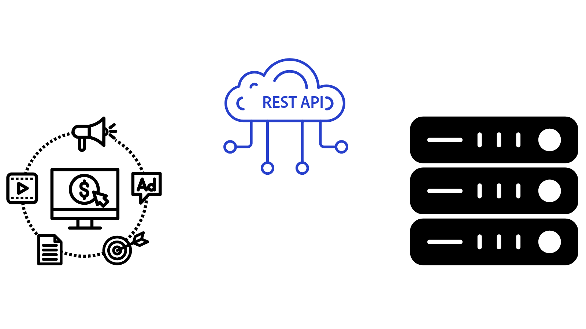

# Panoramica delle API di AEM{#aem-apis-overview}

Scopri i diversi tipi di API in Adobe Experience Manager (AEM) e quali API scegliere per l’integrazione.

Per creare, leggere, aggiornare ed eliminare contenuti, risorse e moduli in AEM, gli sviluppatori possono utilizzare un’ampia gamma di API. Queste API consentono agli sviluppatori di creare applicazioni personalizzate che interagiscono con AEM.

Esaminiamo i diversi tipi di API in AEM e capiamo quale API scegliere per l’integrazione.

## Tipi di API di AEM{#types-of-aem-apis}

AEM offre le seguenti API per interagire con i suoi tipi di servizi Author e Publish.

| Tipo di API di AEM | Descrizione | Disponibilità | Caso d’uso | Esempi di API |
| --- | --- | --- | --- | --- |
| API AEM basate su OpenAPI | API standardizzate e leggibili da dispositivo automatico per Assets, Sites e Forms. | **Solo AEM as a Cloud Service** | Sviluppo API-first, applicazioni moderne | [API Autore Assets](https://developer.adobe.com/experience-cloud/experience-manager-apis/api/experimental/assets/author/), [API Cartelle](https://developer.adobe.com/experience-cloud/experience-manager-apis/api/experimental/folders/), [API AEM Sites](https://developer.adobe.com/experience-cloud/experience-manager-apis/api/experimental/sites/delivery/), [Servizi Forms Acrobat](https://developer.adobe.com/experience-cloud/experience-manager-apis/api/experimental/document/) e altri |
| API RESTful | Endpoint REST tradizionali per l’interazione con le risorse AEM. | AEM 6.X, AEM as a Cloud Service | Operazioni CRUD, applicazioni moderne | [API HTTP Assets](https://experienceleague.adobe.com/en/docs/experience-manager-cloud-service/content/assets/admin/mac-api-assets), [API REST flusso di lavoro](https://experienceleague.adobe.com/en/docs/experience-manager-65/content/implementing/developing/extending-aem/extending-workflows/workflows-program-interaction#using-the-workflow-rest-api), [Esportatore JSON per Content Services](https://experienceleague.adobe.com/en/docs/experience-manager-cloud-service/content/implementing/developing/full-stack/components-templates/json-exporter) e altri |
| API di GraphQL | Ottimizzato per recuperare in modo efficiente i contenuti strutturati con query flessibili. | AEM 6.X, AEM as a Cloud Service | CMS headless, SPA, app per dispositivi mobili | [API GraphQL](https://experienceleague.adobe.com/en/docs/experience-manager-cloud-service/content/headless/graphql-api/content-fragments) |
| API tradizionali (non RESTful) | API meno recenti come JCR, modelli Sling, Query Builder e altri. | AEM 6.X, AEM as a Cloud Service | Integrazioni legacy, compatibilità con le versioni precedenti | [API Query Builder](https://experienceleague.adobe.com/en/docs/experience-manager-cloud-service/content/implementing/developing/full-stack/search/query-builder-api) e altri |

Per ulteriori dettagli, visita la pagina [API Adobe Experience Manager as a Cloud Service](https://developer.adobe.com/experience-cloud/experience-manager-apis/).

## Quale API scegliere{#which-api-to-choose}

Quando selezioni un’API per l’integrazione, considera i seguenti fattori:

- **Caso d&#39;uso**: verifica se l&#39;API AEM supporta il tuo caso d&#39;uso. Quando possibile, _utilizza API AEM basate su OpenAPI_, in quanto forniscono un approccio standardizzato e moderno all&#39;interazione con AEM. Se le API basate su OpenAPI non sono disponibili, è consigliabile utilizzare le API RESTful o GraphQL e, come ultima risorsa, le API tradizionali.

- **Compatibilità**: verifica che l&#39;API selezionata sia compatibile con la versione di AEM in uso. Ad esempio, _Le API AEM basate su OpenAPI sono esclusive di AEM as a Cloud Service_ e non sono disponibili in AEM 6.X.

- **Tipo di servizio AEM: Autore vs. Pubblicazione**: la scelta dell&#39;API dipende anche dal fatto che venga eseguita sul servizio Author o Publish, in quanto i loro modelli di accesso sono diversi. Il servizio AEM Author viene utilizzato per la creazione di contenuti e richiede sempre l’autenticazione. Il servizio di pubblicazione di AEM viene utilizzato per la distribuzione dei contenuti e potrebbe non richiedere l’autenticazione, a seconda del caso d’uso.

- **Autenticazione**: verificare che l&#39;API supporti il metodo di autenticazione che si intende utilizzare. Ad esempio:
   - **API AEM basate su OpenAPI**: supportano l&#39;autenticazione OAuth 2.0, incluse le credenziali client (server-to-server), il codice di autorizzazione (app Web) e i tipi di concessione Proof Key for Code Exchange (app a pagina singola). Altre API di AEM non supportano l’autenticazione OAuth 2.0.
   - **API RESTful**: supportano l&#39;autenticazione JSON Web Token (JWT), nota anche come autenticazione basata su token.

## Differenza tra JSON Web Token (JWT) e OAuth 2.0{#difference-between-jwt-and-oauth}

Confrontiamo JSON Web Token (JWT) e OAuth 2.0, due meccanismi di autenticazione comuni utilizzati nelle API di AEM:

| Funzione | Token web JSON (JWT) | OAuth 2.0 |
| --- | --- | --- |
| Utilizzato in | API RESTful | API AEM basate su OpenAPI (non supportate nelle API RESTful o di altro tipo) |
| Scopo | Autenticazione del servizio | Autenticazione utente o servizio |
| Interazione utente | Non è richiesta alcuna interazione da parte dell’utente | Interazione utente richiesta per i tipi di concessione Codice di autorizzazione e App a pagina singola |
| Ideale per | Chiamate API server-to-server | Accesso sicuro e consentito per app e utenti |
| Informazioni richieste | Chiave privata per la firma JWT | ID client e segreto client per OAuth 2.0 |
| Scadenza token | Breve durata, spesso necessita di aggiornamento | Il token di accesso è di breve durata. Il token di aggiornamento ha una lunga durata e viene utilizzato per ottenere un nuovo token di accesso |
| Gestione credenziali | [AEM Developer Console](https://experienceleague.adobe.com/en/docs/experience-manager-learn/cloud-service/debugging/debugging-aem-as-a-cloud-service/developer-console) | [Adobe Developer Console](https://developer.adobe.com/developer-console/) |

## API AEM basate su OpenAPI

Ulteriori informazioni sulle API AEM basate su OpenAPI e sui concetti importanti relativi all&#39;accesso alle API Adobe sono disponibili nella guida [API AEM basate su OpenAPI](./openapis/overview.md).

### Casi d’uso

<!-- CARDS
{target = _self}

* ./openapis/use-cases/invoke-api-using-oauth-s2s.md
  {title = Invoke API using Server-to-Server authentication}
  {description = Learn how to invoke OpenAPI-based AEM APIs from a custom NodeJS application using OAuth Server-to-Server authentication.}
  {image = ./openapis/assets/s2s/OAuth-S2S.png}
* ./openapis/use-cases/invoke-api-using-oauth-web-app.md
  {title = Invoke API using Web App authentication}
  {description = Learn how to invoke OpenAPI-based AEM APIs from a custom web application using OAuth Web App authentication.}
  {image = ./openapis/assets/web-app/OAuth-WebApp.png}  
-->
<!-- START CARDS HTML - DO NOT MODIFY BY HAND -->

    

        

            

                <figure class="image x-is-16by9">
                    
                </figure>
            

            

                

                    

                        <a href="./openapis/use-cases/invoke-api-using-oauth-s2s.md" target="_self" rel="referrer" title="Richiama API tramite autenticazione server-to-server">Richiama API tramite autenticazione server-to-server</a>
                    

                    
Scopri come richiamare le API AEM basate su OpenAPI da un’applicazione NodeJS personalizzata utilizzando l’autenticazione server-to-server di OAuth.

                

                <a href="./openapis/use-cases/invoke-api-using-oauth-s2s.md" target="_self" rel="referrer" class="spectrum-Button spectrum-Button--outline spectrum-Button--primary spectrum-Button--sizeM" style="align-self: flex-start; margin-top: 1rem;">
                    Ulteriori informazioni
                </a>
            

        

    

    

        

            

                <figure class="image x-is-16by9">
                    
                </figure>
            

            

                

                    

                        <a href="./openapis/use-cases/invoke-api-using-oauth-web-app.md" target="_self" rel="referrer" title="Richiama l’API tramite l’autenticazione tramite app web">Richiama l'API tramite l'autenticazione dell'app Web</a>
                    

                    
Scopri come richiamare le API AEM basate su OpenAPI da un’applicazione web personalizzata utilizzando l’autenticazione OAuth Web App.

                

                <a href="./openapis/use-cases/invoke-api-using-oauth-web-app.md" target="_self" rel="referrer" class="spectrum-Button spectrum-Button--outline spectrum-Button--primary spectrum-Button--sizeM" style="align-self: flex-start; margin-top: 1rem;">
                    Ulteriori informazioni
                </a>
            

        

    

<!-- END CARDS HTML - DO NOT MODIFY BY HAND -->

## API di GraphQL - Esempi

Ulteriori informazioni sulle API di GraphQL e su come utilizzarle nella [Guida introduttiva ad AEM Headless - GraphQL](https://experienceleague.adobe.com/en/docs/experience-manager-learn/getting-started-with-aem-headless/graphql/overview)

### Casi d’uso

<!-- CARDS
{target = _self}

* https://experienceleague.adobe.com/en/docs/experience-manager-learn/getting-started-with-aem-headless/deployments/spa#example-single-page-app
  {title = Single Page Application (SPA)}
  {description = Learn how to build a Single Page Application (SPA) that fetches content from AEM using GraphQL APIs.}
  {image = ./assets/react-app-card.png}
* https://experienceleague.adobe.com/en/docs/experience-manager-learn/getting-started-with-aem-headless/deployments/mobile#example-mobile-apps
  {title = Mobile App}
  {description = Learn how to build a mobile app that fetches content from AEM using GraphQL APIs.}
  {image = ./assets/ios-app-card.png}
* https://experienceleague.adobe.com/en/docs/experience-manager-learn/getting-started-with-aem-headless/deployments/web-component#example-web-component
  {title = Web Component}
  {description = Learn how to build a web component that fetches content from AEM using GraphQL APIs.}
  {image = ./assets/web-component-card.png}
-->
<!-- START CARDS HTML - DO NOT MODIFY BY HAND -->

    

        

            

                <figure class="image x-is-16by9">
                    
                </figure>
            

            

                

                    

                        <a href="https://experienceleague.adobe.com/en/docs/experience-manager-learn/getting-started-with-aem-headless/deployments/spa#example-single-page-app" target="_self" rel="referrer" title="Applicazione a pagina singola">Applicazione a pagina singola</a>
                    

                    
Scopri come creare un’applicazione a pagina singola che recupera contenuti da AEM utilizzando le API di GraphQL.

                

                <a href="https://experienceleague.adobe.com/en/docs/experience-manager-learn/getting-started-with-aem-headless/deployments/spa#example-single-page-app" target="_self" rel="referrer" class="spectrum-Button spectrum-Button--outline spectrum-Button--primary spectrum-Button--sizeM" style="align-self: flex-start; margin-top: 1rem;">
                    Ulteriori informazioni
                </a>
            

        

    

    

        

            

                <figure class="image x-is-16by9">
                    
                </figure>
            

            

                

                    

                        <a href="https://experienceleague.adobe.com/en/docs/experience-manager-learn/getting-started-with-aem-headless/deployments/mobile#example-mobile-apps" target="_self" rel="referrer" title="App mobile">App mobile</a>
                    

                    
Scopri come creare un’app mobile che recuperi contenuti da AEM utilizzando le API di GraphQL.

                

                <a href="https://experienceleague.adobe.com/en/docs/experience-manager-learn/getting-started-with-aem-headless/deployments/mobile#example-mobile-apps" target="_self" rel="referrer" class="spectrum-Button spectrum-Button--outline spectrum-Button--primary spectrum-Button--sizeM" style="align-self: flex-start; margin-top: 1rem;">
                    Ulteriori informazioni
                </a>
            

        

    

    

        

            

                <figure class="image x-is-16by9">
                    
                </figure>
            

            

                

                    

                        <a href="https://experienceleague.adobe.com/en/docs/experience-manager-learn/getting-started-with-aem-headless/deployments/web-component#example-web-component" target="_self" rel="referrer" title="Componente Web">Componente Web</a>
                    

                    
Scopri come creare un componente web che recupera contenuti da AEM utilizzando le API di GraphQL.

                

                <a href="https://experienceleague.adobe.com/en/docs/experience-manager-learn/getting-started-with-aem-headless/deployments/web-component#example-web-component" target="_self" rel="referrer" class="spectrum-Button spectrum-Button--outline spectrum-Button--primary spectrum-Button--sizeM" style="align-self: flex-start; margin-top: 1rem;">
                    Ulteriori informazioni
                </a>
            

        

    

<!-- END CARDS HTML - DO NOT MODIFY BY HAND -->

## API RESTful - Esempi

Ulteriori informazioni sulle API RESTful, ad esempio [Assets HTTP API](https://experienceleague.adobe.com/en/docs/experience-manager-cloud-service/content/assets/admin/mac-api-assets) e [JSON Exporter](https://experienceleague.adobe.com/en/docs/experience-manager-cloud-service/content/implementing/developing/full-stack/components-templates/json-exporter).

### Casi d’uso

<!-- CARDS
{target = _self}

* https://experienceleague.adobe.com/en/docs/experience-manager-learn/getting-started-with-aem-headless/content-services/overview
  {title = Invoke API using Server-to-Server authentication}
  {description = Learn how to build a native mobile app that fetches content from AEM using Content Services RESTful APIs.}
  {image = ./assets/RESTful-Content-Service.png}
* https://experienceleague.adobe.com/en/docs/experience-manager-learn/getting-started-with-aem-headless/authentication/overview
  {title = Token-based Authentication for RESTful APIs}
  {description = Learn how to invoke RESTful APIs using JSON Web Token (JWT) authentication.}
  {image = ./assets/RESTful-TokenAuth.png}
-->
<!-- START CARDS HTML - DO NOT MODIFY BY HAND -->

    

        

            

                <figure class="image x-is-16by9">
                    
                </figure>
            

            

                

                    

                        <a href="https://experienceleague.adobe.com/en/docs/experience-manager-learn/getting-started-with-aem-headless/content-services/overview" target="_self" rel="referrer" title="Richiama API tramite autenticazione server-to-server">Richiama API tramite autenticazione server-to-server</a>
                    

                    
Scopri come creare un’app mobile nativa che recuperi contenuti da AEM utilizzando le API RESTful di Content Services.

                

                <a href="https://experienceleague.adobe.com/en/docs/experience-manager-learn/getting-started-with-aem-headless/content-services/overview" target="_self" rel="referrer" class="spectrum-Button spectrum-Button--outline spectrum-Button--primary spectrum-Button--sizeM" style="align-self: flex-start; margin-top: 1rem;">
                    Ulteriori informazioni
                </a>
            

        

    

    

        

            

                <figure class="image x-is-16by9">
                    
                </figure>
            

            

                

                    

                        <a href="https://experienceleague.adobe.com/en/docs/experience-manager-learn/getting-started-with-aem-headless/authentication/overview" target="_self" rel="referrer" title="Autenticazione basata su token per le API RESTful">Autenticazione basata su token per le API RESTful</a>
                    

                    
Scopri come richiamare le API RESTful utilizzando l’autenticazione JSON Web Token (JWT).

                

                <a href="https://experienceleague.adobe.com/en/docs/experience-manager-learn/getting-started-with-aem-headless/authentication/overview" target="_self" rel="referrer" class="spectrum-Button spectrum-Button--outline spectrum-Button--primary spectrum-Button--sizeM" style="align-self: flex-start; margin-top: 1rem;">
                    Ulteriori informazioni
                </a>
            

        

    

<!-- END CARDS HTML - DO NOT MODIFY BY HAND -->

