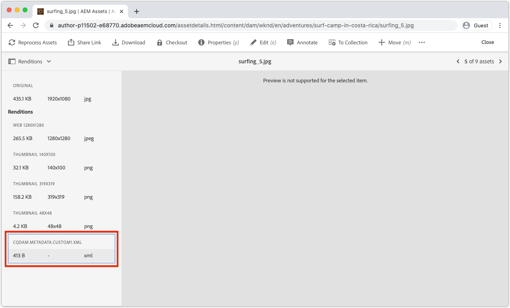

# Sviluppare un processo di lavoro per metadati di Asset compute

I processi di lavoro di Asset compute personalizzati possono produrre dati XMP (XML) che vengono rimandati a AEM e memorizzati come metadati su una risorsa.

I casi d’uso comuni includono:

+ Integrazioni con sistemi di terze parti, ad esempio un sistema PIM (Product Information Management System), in cui è necessario recuperare e memorizzare metadati aggiuntivi sulla risorsa
+ Integrazioni con i servizi Adobe, ad esempio Content and Commerce AI per migliorare i metadati delle risorse con attributi di apprendimento automatico aggiuntivi
+ Derivazione dei metadati della risorsa dal suo binario e memorizzazione come metadati della risorsa in AEM as a Cloud Service

## Cosa farai

>[!VIDEO](https://video.tv.adobe.com/v/327313?quality=12&learn=on)

Questa esercitazione creerà un processo di lavoro per metadati di Asset compute che deriverà i colori più comunemente utilizzati in una risorsa di immagine e riscrive i nomi dei colori nei metadati della risorsa in AEM. Anche se il processo di lavoro è di base, questa esercitazione lo utilizza per esplorare come i processi di lavoro di Asset compute possono essere utilizzati per scrivere i metadati sulle risorse in AEM as a Cloud Service.

## Flusso logico della chiamata di un processo di lavoro per metadati di Asset compute

L&#39;invocazione dei lavoratori dei metadati Asset compute è quasi identica a quella di [processi di generazione del rendering binario](../develop/worker.md), con la differenza principale che il tipo restituito è un rendering XMP (XML) i cui valori vengono scritti anche nei metadati della risorsa.

I dipendenti di Asset compute implementano il contratto Asset compute SDK worker API nel `renditionCallback(...)` funzione concettualmente:

+ __Ingresso:__ Parametri binari e del profilo di elaborazione originali di una risorsa AEM
+ __Uscita:__ Un rendering XMP (XML) persisteva nella risorsa AEM come rendering e nei metadati della risorsa


1. Il servizio AEM Author richiama il processo di lavoro per metadati di Asset compute, fornendo le __(1 bis)__ binario originale e __1 ter)__ eventuali parametri definiti nel profilo di elaborazione.
1. L&#39;SDK di Asset compute orchestra l&#39;esecuzione del processo di lavoro dei metadati di Asset compute personalizzati `renditionCallback(...)` funzione, derivare un rendering XMP (XML) in base al binario della risorsa __(1 bis)__ ed eventuali parametri del profilo di elaborazione __1 ter)__.
1. Il processo di lavoro Asset compute salva la rappresentazione XMP (XML) in `rendition.path`.
1. Dati XMP (XML) scritti in `rendition.path` viene trasportato tramite Asset compute SDK a AEM Author Service e lo espone come __4 bis)__ una rappresentazione testuale e __4 ter)__ persistita nel nodo di metadati della risorsa.

## Configura il file manifest.yml{#manifest}

Tutti i lavoratori Asset compute devono essere registrati nel [manifest.yml](../develop/manifest.md).

Apri il `manifest.yml` e aggiungere una voce lavoratore che configura il nuovo lavoratore, in questo caso `metadata-colors`.

_Ricorda `.yml` è sensibile agli spazi bianchi._

```
packages:
  __APP_PACKAGE__:
    license: Apache-2.0
    actions: 
      worker:
        function: actions/worker/index.js 
        web: 'yes' 
        runtime: 'nodejs:12'
        limits:
          timeout: 60000 # in ms
          memorySize: 512 # in MB
          concurrency: 10 
        annotations:
          require-adobe-auth: true
      metadata-colors:
        function: actions/metadata-colors/index.js 
        web: 'yes' 
        runtime: 'nodejs:12'
        limits:
          memorySize: 512 # in MB   
```

`function` fa riferimento all&#39;implementazione del processo di lavoro creata in [passaggio successivo](#metadata-worker). Denomina i lavoratori semanticamente (ad esempio, il `actions/worker/index.js` potrebbe essere stato meglio chiamato `actions/rendition-circle/index.js`), come mostrato nella [URL del lavoratore](#deploy) e anche determinare [nome della cartella della suite di test del processo di lavoro](#test).

La `limits` e `require-adobe-auth` sono configurati in modo discreto per lavoratore. In questo lavoratore, `512 MB` di memoria viene allocata mentre il codice controlla (potenzialmente) grandi dati di immagine binari. L&#39;altro `limits` vengono rimossi per utilizzare le impostazioni predefinite.

## Sviluppare un processo di lavoro per metadati{#metadata-worker}

Crea un nuovo file JavaScript di lavoro metadati nel progetto di Asset compute sul percorso [definito manifest.yml per il nuovo lavoratore](#manifest), a `/actions/metadata-colors/index.js`

### Installare i moduli npm

Installa i moduli npm aggiuntivi ([@adobe/asset-compute-xmp](https://www.npmjs.com/package/@adobe/asset-compute-xmp?activeTab=versions), [get-image-color](https://www.npmjs.com/package/get-image-colors)e [color-name](https://www.npmjs.com/package/color-namer)) utilizzata in questo processo di lavoro di Asset compute.

```
$ npm install @adobe/asset-compute-xmp
$ npm install get-image-colors
$ npm install color-namer
```

### Codice lavoratore metadati

Questo lavoratore assomiglia molto al [lavoratore che genera rendering](../develop/worker.md), la differenza principale consiste nel scrivere dati XMP (XML) nel `rendition.path` per essere salvati in AEM.


```javascript
"use strict";

const { worker, SourceCorruptError } = require("@adobe/asset-compute-sdk");
const fs = require("fs").promises;

// Require the @adobe/asset-compute-xmp module to create XMP 
const { serializeXmp } = require("@adobe/asset-compute-xmp");

// Require supporting npm modules to derive image colors from image data
const getColors = require("get-image-colors");
// Require supporting npm modules to convert image colors to color names
const namer = require("color-namer");

exports.main = worker(async (source, rendition, params) => {
  // Perform any necessary source (input) checks
  const stats = await fs.stat(source.path);
  if (stats.size === 0) {
    // Throw appropriate errors whenever an erring condition is met
    throw new SourceCorruptError("source file is empty");
  }
  const MAX_COLORS = 10;
  const DEFAULT_COLORS_FAMILY = 'basic';

  // Read the color family parameter to use to derive the color names
  let colorsFamily = rendition.instructions.colorsFamily || DEFAULT_COLORS_FAMILY;

  if (['basic', 'hex', 'html', 'ntc', 'pantone', 'roygbiv'].indexOf(colorsFamily) === -1) { 
      colorsFamily = DEFAULT_COLORS_FAMILY;
  }
  
  // Use the `get-image-colors` module to derive the most common colors from the image
  let colors = await getColors(source.path, { options: MAX_COLORS });

  // Convert the color Chroma objects to their closest names
  let colorNames = colors.map((color) => getColorName(colorsFamily, color));

  // Serialize the data to XMP metadata
  // These properties are written to the [dam:Asset]/jcr:content/metadata resource
  // This stores
  // - The list of color names is stored in a JCR property named `wknd:colors`
  // - The colors family used to derive the color names is stored in a JCR property named `wknd:colorsFamily`
  const xmp = serializeXmp({
      // Use a Set to de-duplicate color names
      "wknd:colors": [...new Set(colorNames)],
      "wknd:colorsFamily": colorsFamily
    }, {
      // Define any property namespaces used in the above property/value definition
      // These namespaces are automatically registered in AEM if they do not yet exist
      namespaces: {
        wknd: "https://wknd.site/assets/1.0/",
      },
    }
  );

  // Save the XMP metadata to be written back to the asset's metadata node
  await fs.writeFile(rendition.path, xmp, "utf-8");
});

/**
 * Helper function that derives the closest color name for the color, based on the colors family
 * 
 * @param {*} colorsFamily the colors name family to use
 * @param {*} color the color to convert to a name
 */
function getColorName(colorsFamily, color) {
    if ('hex' === colorsFamily) {  return color; }

    let names = namer(color.rgb())[colorsFamily];

    if (names.length >= 1) { return names[0].name; }
}
```

## Eseguire il processo di lavoro metadati localmente{#development-tool}

Completato il codice del lavoratore, può essere eseguito utilizzando lo strumento di sviluppo Asset compute locale.

Perché il nostro progetto di Asset compute contiene due lavoratori (il precedente [rappresentazione a cerchio](../develop/worker.md) e questo `metadata-colors` lavoratore), [dello strumento di sviluppo di Asset compute](../develop/development-tool.md) nella definizione del profilo sono elencati i profili di esecuzione per entrambi i processi di lavoro. La seconda definizione del profilo punta al nuovo `metadata-colors` operaio.


1. Dalla directory principale del progetto Asset compute
1. Esegui `aio app run` per avviare lo strumento di sviluppo Asset compute
1. In __Seleziona un file...__ a discesa, scegli un [immagine campione](../assets/samples/sample-file.jpg) per elaborare
1. Nella seconda configurazione di definizione del profilo, che punta alla `metadata-colors` lavoratore, aggiornamento `"name": "rendition.xml"` poiché questo processo di lavoro genera un rendering XMP (XML). Facoltativamente, aggiungi un `colorsFamily` (valori supportati) `basic`, `hex`, `html`, `ntc`, `pantone`, `roygbiv`).

   ```json
   {
       "renditions": [
           {
               "worker": "...",
               "name": "rendition.xml",
               "colorsFamily": "pantone"
           }
       ]
   }
   ```

1. Tocca __Esegui__ e attendere la generazione del rendering XML
   + Poiché entrambi i processi di lavoro sono elencati nella definizione del profilo, verranno generate entrambe le rappresentazioni. Facoltativamente, la definizione del profilo principale che punta alla [lavoratore a rendering circolare](../develop/worker.md) può essere eliminato, per evitare di eseguirlo dallo strumento di sviluppo.
1. La __Rendering__ visualizza in anteprima il rendering generato. Tocca `rendition.xml` per scaricarlo e aprirlo in VS Code (o il tuo editor XML/text preferito) per la revisione.

## Test del processo di lavoro{#test}

I processi di lavoro dei metadati possono essere testati utilizzando [lo stesso framework di test di Asset compute delle rappresentazioni binarie](../test-debug/test.md). L&#39;unica differenza è la `rendition.xxx` nel caso di test deve essere il rendering previsto XMP (XML).

1. Crea la seguente struttura nel progetto di Asset compute:

   ```
   /test/asset-compute/metadata-colors/success-pantone/
   
       file.jpg
       params.json
       rendition.xml
   ```

2. Utilizza la [file di esempio](../assets/samples/sample-file.jpg) come caso di prova `file.jpg`.
3. Aggiungi il seguente JSON al `params.json`.

   ```
   {
       "fmt": "xml",
       "colorsFamily": "pantone"
   }
   ```

   Tieni presente che `"fmt": "xml"` è necessario per istruire la suite di test affinché generi un `.xml` rendering basato su testo.

4. Fornisci il codice XML previsto nel `rendition.xml` file. Ciò può essere ottenuto:
   + Esecuzione del file di input di prova tramite lo strumento di sviluppo e salvataggio del rendering XML (convalidato).

   ```
   <?xml version="1.0" encoding="UTF-8"?><rdf:RDF xmlns:rdf="http://www.w3.org/1999/02/22-rdf-syntax-ns#" xmlns:wknd="https://wknd.site/assets/1.0/"><rdf:Description><wknd:colors><rdf:Seq><rdf:li>Silver</rdf:li><rdf:li>Black</rdf:li><rdf:li>Outer Space</rdf:li></rdf:Seq></wknd:colors><wknd:colorsFamily>pantone</wknd:colorsFamily></rdf:Description></rdf:RDF>
   ```

5. Esegui `aio app test` dalla directory principale del progetto Asset compute per eseguire tutte le suite di test.

### Distribuire il processo di lavoro in Adobe I/O Runtime{#deploy}

Per richiamare questo nuovo processo di lavoro metadati da AEM Assets, è necessario distribuirlo in Adobe I/O Runtime utilizzando il comando :

```
$ aio app deploy
```


In questo modo verranno distribuiti tutti i processi di lavoro del progetto. Consulta la sezione [istruzioni di distribuzione non abbreviate](../deploy/runtime.md) per informazioni su come distribuire nelle aree di lavoro Stage e Production.

### Integrazione con i profili di elaborazione AEM{#processing-profile}

Richiama il lavoratore da AEM creando un nuovo servizio Profilo di elaborazione personalizzato esistente che richiama il lavoratore distribuito o modificandone uno esistente.


1. Accedi a AEM servizio Author as a Cloud Service come __Amministratore AEM__
1. Passa a __Strumenti > Risorse > Profili di elaborazione__
1. __Crea__ una nuova, oppure __modifica__ ed esistente, profilo di elaborazione
1. Tocca __Personalizzato__ e tocca __Aggiungi nuovo__
1. Definire il nuovo servizio
   + __Creare una rappresentazione dei metadati__: Passa a attivo
   + __Endpoint:__ `https://...adobeioruntime.net/api/v1/web/wkndAemAssetCompute-0.0.1/metadata-colors`
      + Si tratta dell’URL del processo di lavoro ottenuto durante il [distribuire](#deploy) o utilizzando il comando `aio app get-url`. Assicurati che l’URL punti nell’area di lavoro corretta in base all’ambiente as a Cloud Service AEM.
   + __Parametri del servizio__
      + Tocca __Aggiungi parametro__
         + Chiave: `colorFamily`
         + Valore: `pantone`
            + Valori supportati: `basic`, `hex`, `html`, `ntc`, `pantone`, `roygbiv`
   + __Tipi mime__
      + __Include:__ `image/jpeg`, `image/png`, `image/gif`, `image/svg`
         + Questi sono gli unici tipi MIME supportati dai moduli npm di terze parti utilizzati per ricavare i colori.
      + __Escludi:__ `Leave blank`
1. Tocca __Salva__ in alto a destra
1. Applica il profilo di elaborazione a una cartella AEM Assets se non lo fai già

### Aggiornare lo schema metadati{#metadata-schema}

Per rivedere i metadati dei colori, mappare due nuovi campi dello schema metadati dell&#39;immagine alle nuove proprietà dei dati dei metadati che il processo di lavoro compila.


1. Nel servizio AEM Author, accedi a __Strumenti > Risorse > Schemi di metadati__
1. Passa a __default__ e seleziona e modifica __immagine__ e aggiungere campi modulo di sola lettura per esporre i metadati di colore generati
1. Aggiungi un __Testo a riga singola__
   + __Etichetta campo__: `Colors Family`
   + __Mappa su proprietà__: `./jcr:content/metadata/wknd:colorsFamily`
   + __Regole > Campo > Disattiva modifica__: Selezionato
1. Aggiungi un __Testo con più valori__
   + __Etichetta campo__: `Colors`
   + __Mappa su proprietà__: `./jcr:content/metadata/wknd:colors`
1. Tocca __Salva__ in alto a destra

## Elaborazione delle risorse


1. Nel servizio AEM Author, accedi a __Risorse > File__
1. Passa alla cartella o alla sottocartella a cui viene applicato il profilo di elaborazione
1. Carica una nuova immagine (JPEG, PNG, GIF o SVG) nella cartella oppure rielabora le immagini esistenti utilizzando l’aggiornamento [Profilo di elaborazione](#processing-profile)
1. Al termine dell’elaborazione, seleziona la risorsa e tocca __proprietà__ nella barra delle azioni superiore per visualizzare i relativi metadati
1. Consulta la sezione `Colors Family` e `Colors` [campi metadati](#metadata-schema) per i metadati riscritti dal processo di lavoro metadati di Asset compute personalizzato.

Con i metadati del colore scritti nei metadati della risorsa, sul `[dam:Asset]/jcr:content/metadata` , questi metadati sono indicizzati e consentono di aumentare la capacità di individuazione delle risorse utilizzando questi termini tramite ricerca, e possono anche essere riscritti nel binario della risorsa se __Writeback di metadati DAM__ viene richiamato su di esso.

### Rendering dei metadati in AEM Assets



Anche il file XMP effettivo generato dal processo di lavoro metadati Asset compute viene memorizzato come rendering discreto sulla risorsa. Questo file generalmente non viene utilizzato, ma i valori applicati al nodo di metadati della risorsa vengono utilizzati, ma l&#39;output XML non elaborato del processo di lavoro è disponibile in AEM.

## codice lavoratore a colori metadati su Github

Il finale `metadata-colors/index.js` è disponibile su Github all’indirizzo:

+ [aem-guides-wknd-asset-compute/actions/metadata-colors/index.js](https://github.com/adobe/aem-guides-wknd-asset-compute/blob/master/actions/metadata-colors/index.js)

Il finale `test/asset-compute/metadata-colors` la suite di test è disponibile su Github all’indirizzo:

+ [aem-guides-wknd-asset-compute/test/asset-compute/metadata-color](https://github.com/adobe/aem-guides-wknd-asset-compute/blob/master/test/asset-compute/metadata-colors)
