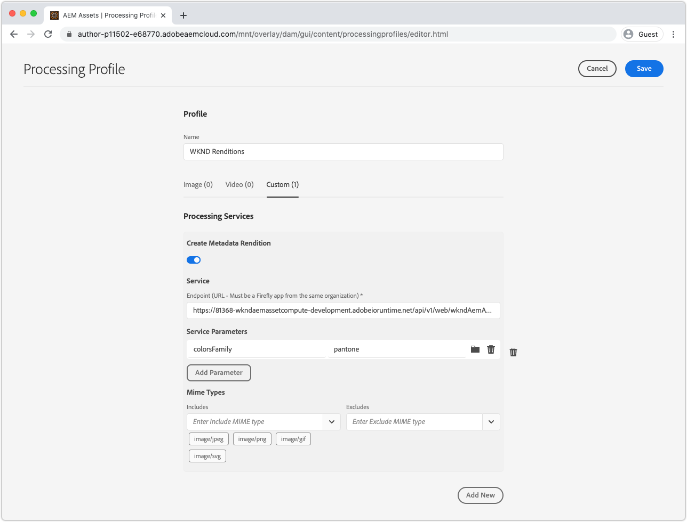

# Sviluppare un lavoratore metadati Asset compute 

I lavoratori  Asset compute personalizzati possono produrre dati XMP (XML) che vengono reinviati a AEM e memorizzati come metadati in una risorsa.

I casi d’uso più comuni includono:

+ Integrazioni con sistemi di terze parti, come un PIM (Product Information Management System), in cui è necessario recuperare e memorizzare ulteriori metadati nella risorsa
+ Integrazioni con  servizi di Adobe, come Content and Commerce AI per l&#39;aggiunta dei metadati delle risorse con altri attributi di machine learning
+ Ottenimento dei metadati relativi alla risorsa dal binario e memorizzazione come metadati di risorsa in AEM come Cloud Service

## Azioni

>[!VIDEO](https://video.tv.adobe.com/v/327313?quality=12&learn=on)

In questa esercitazione verrà creato un  Asset compute per metadati che ricava i colori più comunemente utilizzati in una risorsa immagine e riscrive i nomi dei colori nei metadati della risorsa in AEM. Anche se il lavoratore è di base, questa esercitazione lo utilizza per scoprire in che modo  Asset compute possono essere utilizzati per scrivere i metadati alle risorse in AEM come Cloud Service.

## Flusso logico della chiamata di un lavoratore metadati Asset compute 

La chiamata di  lavoratori di metadati Asset compute è quasi identica a quella di [rendering binario che genera lavoratori](../develop/worker.md), con la differenza principale che è il tipo di restituzione è una rappresentazione XMP (XML) i cui valori sono anche scritti nei metadati della risorsa.

 Asset compute implementano il contratto di  Asset compute SDK Worker API, nella funzione `renditionCallback(...)`, concettualmente:

+ __Input:__ Parametri binari e profilo di elaborazione originali di una risorsa AEM
+ __Output:__ Una rappresentazione XMP (XML) persistente nella risorsa AEM come rappresentazione e nei metadati della risorsa


1. Il servizio AEM Author richiama il lavoratore metadati del Asset compute , fornendo il file binario __(1a)__ originale della risorsa e __(1b)__ eventuali parametri definiti nel profilo di elaborazione.
1. L&#39;SDK del Asset compute  orchestra l&#39;esecuzione della funzione `renditionCallback(...)` del lavoratore di metadati del Asset compute  personalizzato, derivando una rappresentazione XMP (XML), basata sul binario __(1a)__ della risorsa ed eventuali parametri del profilo di elaborazione __(1b)__.
1. Il lavoratore del Asset compute  salva la rappresentazione XMP (XML) in `rendition.path`.
1. I dati XMP (XML) scritti in `rendition.path` vengono trasportati tramite l&#39;SDK del Asset compute  in AEM Author Service ed esposti come __(4a)__ una rappresentazione di testo e __(4b)__ persistenti nel nodo di metadati della risorsa.

## Configurare manifest.yml{#manifest}

Tutti  lavoratori Asset compute devono essere registrati nel file [manifest.yml](../develop/manifest.md).

Aprire il progetto `manifest.yml` e aggiungere una voce di lavoro che configuri il nuovo lavoratore, in questo caso `metadata-colors`.

_Ricorda:  `.yml` gli spazi bianchi sono sensibili._

```
packages:
  __APP_PACKAGE__:
    license: Apache-2.0
    actions: 
      worker:
        function: actions/worker/index.js 
        web: 'yes' 
        runtime: 'nodejs:12'
        limits:
          timeout: 60000 # in ms
          memorySize: 512 # in MB
          concurrency: 10 
        annotations:
          require-adobe-auth: true
      metadata-colors:
        function: actions/metadata-colors/index.js 
        web: 'yes' 
        runtime: 'nodejs:12'
        limits:
          memorySize: 512 # in MB   
```

`function` indica l&#39;implementazione del lavoratore creata nel passaggio  [successivo](#metadata-worker). Assegnare un nome ai lavoratori in modo semantico (ad esempio, `actions/worker/index.js` potrebbe essere stato meglio denominato `actions/rendition-circle/index.js`), come mostrato nell&#39; [URL del lavoratore](#deploy) e determinare anche il [nome della cartella della suite di test del lavoratore](#test).

Le `limits` e `require-adobe-auth` sono configurate in modo discreto per ogni lavoratore. In questo processo di lavoro, `512 MB` di memoria viene allocata mentre il codice analizza (potenzialmente) i dati di grandi dimensioni dell&#39;immagine binaria. Gli altri `limits` vengono rimossi per utilizzare i valori predefiniti.

## Sviluppare un lavoratore metadati{#metadata-worker}

Create un nuovo file JavaScript del lavoratore metadati nel progetto di Asset compute  nel percorso [manifest.yml definito per il nuovo lavoratore](#manifest), all&#39;indirizzo `/actions/metadata-colors/index.js`

### Installare i moduli npm

Installate i moduli npm aggiuntivi ([@adobe/asset-compute-xmp](https://www.npmjs.com/package/@adobe/asset-compute-xmp?activeTab=versions), [get-image-color](https://www.npmjs.com/package/get-image-colors) e [color-name](https://www.npmjs.com/package/color-namer)) che verranno utilizzati in questo  Asset compute di lavoro.

```
$ npm install @adobe/asset-compute-xmp
$ npm install get-image-colors
$ npm install color-namer
```

### Codice del lavoratore metadati

Questo lavoratore ha un aspetto molto simile al lavoratore [che genera le rappresentazioni](../develop/worker.md), la differenza principale è che scrive XMP (XML) dati sul `rendition.path` per essere salvato nuovamente in AEM.


```javascript
"use strict";

const { worker, SourceCorruptError } = require("@adobe/asset-compute-sdk");
const fs = require("fs").promises;

// Require the @adobe/asset-compute-xmp module to create XMP 
const { serializeXmp } = require("@adobe/asset-compute-xmp");

// Require supporting npm modules to derive image colors from image data
const getColors = require("get-image-colors");
// Require supporting npm modules to convert image colors to color names
const namer = require("color-namer");

exports.main = worker(async (source, rendition, params) => {
  // Perform any necessary source (input) checks
  const stats = await fs.stat(source.path);
  if (stats.size === 0) {
    // Throw appropriate errors whenever an erring condition is met
    throw new SourceCorruptError("source file is empty");
  }
  const MAX_COLORS = 10;
  const DEFAULT_COLORS_FAMILY = 'basic';

  // Read the color family parameter to use to derive the color names
  let colorsFamily = rendition.instructions.colorsFamily || DEFAULT_COLORS_FAMILY;

  if (['basic', 'hex', 'html', 'ntc', 'pantone', 'roygbiv'].indexOf(colorsFamily) === -1) { 
      colorsFamily = DEFAULT_COLORS_FAMILY;
  }
  
  // Use the `get-image-colors` module to derive the most common colors from the image
  let colors = await getColors(source.path, { options: MAX_COLORS });

  // Convert the color Chroma objects to their closest names
  let colorNames = colors.map((color) => getColorName(colorsFamily, color));

  // Serialize the data to XMP metadata
  // These properties are written to the [dam:Asset]/jcr:content/metadata resource
  // This stores
  // - The list of color names is stored in a JCR property named `wknd:colors`
  // - The colors family used to derive the color names is stored in a JCR property named `wknd:colorsFamily`
  const xmp = serializeXmp({
      // Use a Set to de-duplicate color names
      "wknd:colors": [...new Set(colorNames)],
      "wknd:colorsFamily": colorsFamily
    }, {
      // Define any property namespaces used in the above property/value definition
      // These namespaces will be automatically registered in AEM if they do not yet exist
      namespaces: {
        wknd: "https://wknd.site/assets/1.0/",
      },
    }
  );

  // Save the XMP metadata to be written back to the asset's metadata node
  await fs.writeFile(rendition.path, xmp, "utf-8");
});

/**
 * Helper function that derives the closest color name for the color, based on the colors family
 * 
 * @param {*} colorsFamily the colors name family to use
 * @param {*} color the color to convert to a name
 */
function getColorName(colorsFamily, color) {
    if ('hex' === colorsFamily) {  return color; }

    let names = namer(color.rgb())[colorsFamily];

    if (names.length >= 1) { return names[0].name; }
}
```

## Eseguire il lavoro metadati localmente{#development-tool}

Una volta completato il codice del lavoratore, può essere eseguito utilizzando lo strumento di sviluppo  Asset compute locale.

Poiché il nostro progetto di Asset compute  contiene due lavoratori (la precedente [rappresentazione cerchio](../develop/worker.md) e questo `metadata-colors` lavoratore), la definizione del profilo [ Strumento di sviluppo Asset compute ](../develop/development-tool.md) elenca i profili di esecuzione per entrambi i lavoratori. La seconda definizione del profilo punta al nuovo `metadata-colors` lavoratore.


1. Dal livello principale del progetto del Asset compute 
1. Eseguire `aio app run` per avviare lo strumento di sviluppo del Asset compute 
1. In __Selezionare un file...A discesa__, scegliere un&#39;immagine di esempio [a3/> da elaborare](../assets/samples/sample-file.jpg)
1. Nella seconda configurazione di definizione del profilo, che punta al lavoratore `metadata-colors`, aggiorna `"name": "rendition.xml"` in quanto questo lavoratore genera una rappresentazione XMP (XML). Facoltativamente, aggiungere un parametro `colorsFamily` (valori supportati `basic`, `hex`, `html`, `ntc`, `pantone`, `roygbiv`).

   ```json
   {
       "renditions": [
           {
               "worker": "...",
               "name": "rendition.xml",
               "colorsFamily": "pantone"
           }
       ]
   }
   ```
1. Toccate __Esegui__ e attendete che venga generata la rappresentazione XML
   + Poiché entrambi i lavoratori sono elencati nella definizione del profilo, entrambe le rappresentazioni verranno generate. Facoltativamente, è possibile eliminare la definizione del profilo principale che punta al [lavoratore di rappresentazione del cerchio](../develop/worker.md), per evitare di eseguirla dallo strumento di sviluppo.
1. La sezione __Rendering__ visualizza l&#39;anteprima della rappresentazione generata. Toccate il `rendition.xml` per scaricarlo e apritelo in Codice VS (o nell&#39;editor XML/testo preferito) per la revisione.

## Test del lavoratore{#test}

I lavoratori di metadati possono essere testati utilizzando lo [stesso framework di test dei Asset compute  come rappresentazioni binarie](../test-debug/test.md). L&#39;unica differenza è rappresentata dal file `rendition.xxx` nel caso di test deve essere il rendering previsto XMP (XML).

1. Create la struttura seguente nel progetto di Asset compute :

   ```
   /test/asset-compute/metadata-colors/success-pantone/
   
       file.jpg
       params.json
       rendition.xml
   ```

2. Utilizzare il file di esempio [](../assets/samples/sample-file.jpg) come custodia di prova `file.jpg`.
3. Aggiungete il seguente JSON al `params.json`.

   ```
   {
       "fmt": "xml",
       "colorsFamily": "pantone"
   }
   ```

   Tenete presente che `"fmt": "xml"` è necessario per indicare alla suite di test di generare una rappresentazione basata su testo `.xml`.

4. Immettere il codice XML previsto nel file `rendition.xml`. Questo può essere ottenuto tramite:
   + Eseguire il file di input test tramite lo strumento di sviluppo e salvare la rappresentazione XML (convalidata) in uscita.

   ```
   <?xml version="1.0" encoding="UTF-8"?><rdf:RDF xmlns:rdf="http://www.w3.org/1999/02/22-rdf-syntax-ns#" xmlns:wknd="https://wknd.site/assets/1.0/"><rdf:Description><wknd:colors><rdf:Seq><rdf:li>Silver</rdf:li><rdf:li>Black</rdf:li><rdf:li>Outer Space</rdf:li></rdf:Seq></wknd:colors><wknd:colorsFamily>pantone</wknd:colorsFamily></rdf:Description></rdf:RDF>
   ```

5. Esegui `aio app test` dalla radice del progetto del Asset compute  per eseguire tutte le suite di test.

### Distribuzione del lavoratore in Adobe I/O Runtime{#deploy}

Per richiamare questo nuovo lavoratore metadati da  AEM Assets, è necessario distribuirlo in Adobe I/O Runtime utilizzando il comando:

```
$ aio app deploy
```


Nota: questo implementerà tutti i lavoratori nel progetto. Leggere le [istruzioni di distribuzione senza limiti](../deploy/runtime.md) per informazioni su come distribuire nelle aree di lavoro di fase e produzione.

### Integrazione con AEM profili di elaborazione{#processing-profile}

Richiamare il lavoratore da AEM creando un nuovo servizio personalizzato di profilo di elaborazione esistente che richiama il lavoratore distribuito o modificandone uno nuovo.



1. Accedi a AEM come servizio di authoring di Cloud Service come __AEM Amministratore__
1. Passa a __Strumenti > Risorse > Profili di elaborazione__
1. __Crea__ un profilo di elaborazione nuovo o  ____ modificato ed esistente
1. Toccate la scheda __Personalizzato__, quindi toccate __Aggiungi nuovo__
1. Definire il nuovo servizio
   + __Crea rappresentazione__ metadati: Attiva/disattiva
   + __Endpoint:__ `https://...adobeioruntime.net/api/v1/web/wkndAemAssetCompute-0.0.1/metadata-colors`
      + Si tratta dell&#39;URL del lavoratore ottenuto durante la [implementazione](#deploy) o utilizzando il comando `aio app get-url`. Assicuratevi che l’URL punti nell’area di lavoro corretta in base al AEM come ambiente di Cloud Service.
   + __Parametri del servizio__
      + Toccare __Aggiungi parametro__
         + Chiave: `colorFamily`
         + Valore: `pantone`
            + Valori supportati: `basic`, `hex`, `html`, `ntc`, `pantone`, `roygbiv`
   + __Tipi mime__
      + __Include:__ `image/jpeg`,  `image/png`,  `image/gif`,  `image/svg`
         + Questi sono gli unici tipi MIME supportati dai moduli npm di terze parti utilizzati per derivare i colori.
      + __Esclude:__ `Leave blank`
1. Toccate __Salva__ in alto a destra
1. Applicate il profilo di elaborazione a una cartella AEM Assets  se non lo avete già fatto

### Aggiornare lo schema metadati{#metadata-schema}

Per esaminare i metadati dei colori, mappate due nuovi campi sullo schema dei metadati dell&#39;immagine sulle nuove proprietà dei dati di metadati che il lavoratore compila.


1. Nel servizio AEM Author, andate a __Strumenti > Risorse > Schemi di metadati__
1. Accedere a __default__, selezionare e modificare __image__ e aggiungere campi modulo di sola lettura per esporre i metadati colore generati
1. Aggiungere un __testo a riga singola__
   + __Etichetta campo__: `Colors Family`
   + __Mappa su proprietà__: `./jcr:content/metadata/wknd:colorsFamily`
   + __Regole > Campo > Disattiva modifica__: Selezionato
1. Aggiungere un __testo con più valori__
   + __Etichetta campo__: `Colors`
   + __Mappa su proprietà__: `./jcr:content/metadata/wknd:colors`
1. Toccate __Salva__ in alto a destra

## Elaborazione delle risorse


1. Nel servizio AEM Author, andate a __Risorse > File__
1. Andate alla cartella o sottocartella a cui è applicato il profilo di elaborazione
1. Caricate una nuova immagine (JPEG, PNG, GIF o SVG) nella cartella oppure rielaborate le immagini esistenti utilizzando il [profilo di elaborazione aggiornato](#processing-profile)
1. Al termine dell&#39;elaborazione, selezionate la risorsa e toccate __proprietà__ nella barra delle azioni superiore per visualizzarne i metadati
1. Esaminate i `Colors Family` e `Colors` [campi di metadati](#metadata-schema) per i metadati riscritti dal lavoratore di metadati  Asset compute personalizzato.

Con i metadati di colore scritti nei metadati della risorsa, nella risorsa `[dam:Asset]/jcr:content/metadata` questi metadati sono indicizzati per consentire l&#39;individuazione delle risorse in base a questi termini mediante la ricerca e possono essere persino riscritti nel binario della risorsa se vi viene richiamato il flusso di lavoro __DAM Metadata Writeback__.

### Rappresentazioni di metadati in  AEM Assets


Anche il file XMP effettivo generato dal lavoratore metadati del Asset compute  viene memorizzato come rappresentazione discreta sulla risorsa. In genere questo file non viene utilizzato, ma vengono utilizzati i valori applicati al nodo di metadati della risorsa, mentre l&#39;output XML non elaborato del lavoratore è disponibile in AEM.

## metadata-color codice lavoratore su Github

L&#39;ultima `metadata-colors/index.js` è disponibile su Github all&#39;indirizzo:

+ [aem-guides-wknd-asset-compute/actions/metadata-colors/index.js](https://github.com/adobe/aem-guides-wknd-asset-compute/blob/master/actions/metadata-colors/index.js)

La suite di test finale `test/asset-compute/metadata-colors` è disponibile su Github all&#39;indirizzo:

+ [aem-guide-wknd-asset-compute/test/asset-compute/metadata-color](https://github.com/adobe/aem-guides-wknd-asset-compute/blob/master/test/asset-compute/metadata-colors)
