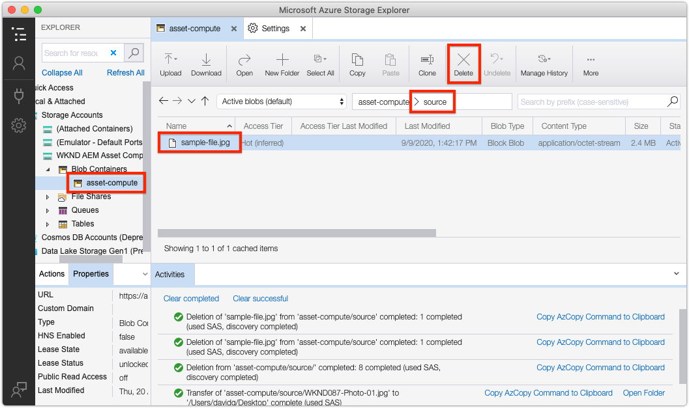

# Strumento di sviluppo del calcolo delle risorse

Asset Compute Development Tool è un cablaggio Web locale che consente agli sviluppatori di configurare ed eseguire i lavoratori Risorse per computer localmente, al di fuori del contesto dell’SDK AEM rispetto alle risorse Asset Compute di Adobe I/O Runtime.

## Eseguire lo strumento di sviluppo del calcolo delle risorse

Lo strumento di sviluppo del calcolo delle risorse può essere eseguito dalla radice del progetto Asset Compute tramite il comando terminale:

```
$ aio app run
```

Questo attiverà lo strumento di sviluppo all&#39;indirizzo __http://localhost:9000__ e lo aprirà automaticamente in una finestra del browser. Affinché lo strumento di sviluppo possa essere eseguito, è necessario fornire [un devToolToken generato automaticamente e valido tramite un parametro](#troubleshooting__devtooltoken)di query.

## Comprendere l’interfaccia Strumenti di sviluppo di calcolo risorse{#interface}


1. __File di origine:__ La selezione del file di origine viene utilizzata per:
   + Selezionato il binario della risorsa che sarà il `source` binario passato al lavoratore Asset Compute
   + Caricare i file sorgente
1. __Definizione del profilo di calcolo risorsa:__ Definisce il lavoratore Asset Compute da eseguire, compresi i parametri: incluso il punto finale dell&#39;URL del lavoratore, il nome della rappresentazione risultante ed eventuali parametri
1. __Esegui:__ Il pulsante Esegui esegue il profilo di calcolo delle risorse come definito nell’editor del profilo di configurazione di Asset Compute
1. __Interrompi:__ Il pulsante Interrompi annulla un&#39;esecuzione avviata toccando il pulsante Esegui
1. __Richiesta/Risposta:__ Fornisce la richiesta HTTP e la risposta a/da Asset Compute Worker in esecuzione in Adobe I/O Runtime. Può essere utile per il debug
1. __Registri di attivazione:__ Registri che descrivono l&#39;esecuzione del lavoratore di calcolo delle risorse, con eventuali errori. Queste informazioni sono disponibili anche nella `aio app run` versione standard
1. __Rappresentazioni:__ Visualizza tutte le rappresentazioni generate dall&#39;esecuzione del lavoratore Asset Compute
1. __parametro di query devToolToken:__ Il token dello strumento di sviluppo di elaborazione risorse richiede la presenza di un parametro di `devToolToken` query valido. Questo token viene generato automaticamente ogni volta che viene visualizzato un nuovo strumento di sviluppo

### Eseguire un lavoratore personalizzato

>[!VIDEO](https://video.tv.adobe.com/v/40241?quality=12&learn=on)
_Click-through dell’esecuzione di un lavoro di elaborazione risorse in Strumento di sviluppo (nessun audio)_

1. Assicurarsi che Asset Compute Development Tool sia avviato dalla directory principale del progetto utilizzando il `aio app run` comando.
1. Nello strumento di sviluppo del calcolo delle risorse, caricate o selezionate un file immagine [di esempio](../assets/samples/sample-file.jpg)
   + Verificare che il file sia selezionato nel menu a discesa del file ____ di origine
1. Esaminare l&#39;area di testo della definizione __del profilo di calcolo della__ risorsa
   + La `worker` chiave definisce l&#39;URL del lavoratore Asset Compute distribuito
   + La `name` chiave definisce il nome della rappresentazione da generare
   + In questo oggetto JSON possono essere fornite altre chiavi/valori e saranno disponibili nel lavoratore sotto l&#39; `rendition.instructions` oggetto
      + È possibile aggiungere valori per `size`, `contrast` e `brightness`:

         ```json
         {
             "renditions": [
                 {
                     "worker": "...",
                     "name": "rendition.png",
                     "size":"800",
                     "contrast": "0.30",
                     "brightness": "-0.15"
                 }
             ]
         }
         ```

1. Tap the __Run__ button
1. La sezione ____ Rappresentazioni verrà compilata con un segnaposto per la rappresentazione
1. Una volta completato il lavoratore, il segnaposto della rappresentazione visualizzerà la rappresentazione generata

Se si apporta modifiche al codice del lavoratore mentre è in esecuzione lo strumento di sviluppo, le modifiche verranno implementate a caldo. La &quot;distribuzione a caldo&quot; richiede diversi secondi, pertanto l&#39;implementazione può essere completata prima di eseguire nuovamente il lavoratore da Development Tool.

## Risoluzione dei problemi

### File di origine non corretti{#troubleshooting__dev-tool-application-cache}

Lo strumento di sviluppo del calcolo delle risorse può inserire uno stato in cui vengono estratti dati non aggiornati, ed è più evidente nel menu a discesa del file ____ di origine che visualizza elementi non corretti.

+ __Errore:__ Il menu a discesa del file di origine visualizza elementi non corretti.
+ __Causa:__ Lo stato del browser memorizzato nella cache non è valido
+ __Risoluzione:__ Nel browser cancellare completamente lo &quot;stato applicazione&quot; della scheda del browser, la cache del browser, l&#39;archiviazione locale e il lavoratore del servizio.

### Parametro di query devToolToken mancante o non valido{#troubleshooting__devtooltoken}

+ __Errore:__ Notifica &quot;non autorizzata&quot; nello strumento di sviluppo del calcolo delle risorse
+ __Causa:__ `devToolToken` è mancante o non valido
+ __Risoluzione:__ Chiudete la finestra del browser Strumento di sviluppo di calcolo risorse, interrompete eventuali processi dello strumento di sviluppo in esecuzione avviati tramite il `aio app run` comando e riavviate lo strumento di sviluppo (utilizzando `aio app run`).

### Impossibile rimuovere i file sorgente{#troubleshooting__remove-source-files}

+ __Errore:__ Non è possibile rimuovere i file sorgente aggiunti dall&#39;interfaccia utente di Strumenti di sviluppo
+ __Causa:__ Questa funzionalità non è stata implementata
+ __Risoluzione:__ Accedi al provider di archiviazione cloud utilizzando le credenziali definite in `.env`. Individuate il contenitore utilizzato da Strumenti di sviluppo (specificato anche in `.env`), individuate la cartella __sorgente__ ed eliminate eventuali immagini sorgente. È possibile che sia necessario eseguire i passaggi descritti nel menu a discesa File [sorgente non corretti](#troubleshooting__dev-tool-application-cache) se i file sorgente eliminati continuano a essere visualizzati nel menu a discesa, in quanto possono essere memorizzati nella cache localmente nello &quot;stato applicazione&quot; degli strumenti di sviluppo.

   
