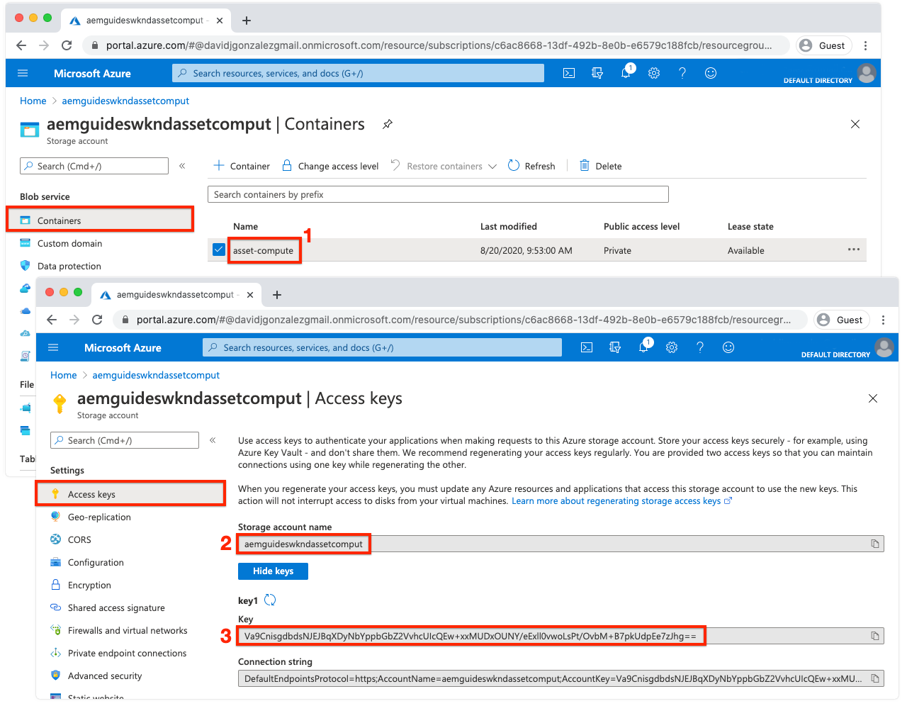

# Configurare le variabili di ambiente


Prima di iniziare lo sviluppo di Asset compute worker, accertati che il progetto sia configurato con informazioni sull’archiviazione Adobe I/O e cloud. Queste informazioni sono memorizzate nel file `.env`  che viene utilizzato solo per lo sviluppo locale e non viene salvato in Git. Il `.env` fornisce un modo pratico per esporre coppie chiave/valori all’ambiente di sviluppo locale Asset compute locale. Quando [distribuzione](../deploy/runtime.md) Asset compute di lavoratori a Adobe I/O Runtime, il `.env` non viene utilizzato, ma viene trasmesso un sottoinsieme di valori tramite variabili di ambiente. Altri parametri e segreti personalizzati possono essere memorizzati nella `.env` , ad esempio le credenziali di sviluppo per i servizi web di terze parti.

## Fai riferimento a `private.key`


Apri `.env` file, rimuovi commento da `ASSET_COMPUTE_PRIVATE_KEY_FILE_PATH` e fornire il percorso assoluto nel file system al `private.key` che è associata al certificato pubblico aggiunto al progetto Adobe I/O App Builder.

+ Se la coppia di chiavi è stata generata da Adobe I/O, è stata scaricata automaticamente come parte della  `config.zip`.
+ Se hai fornito la chiave pubblica a Adobe I/O, dovresti anche essere in possesso della chiave privata corrispondente.
+ In caso contrario, puoi generare nuove coppie di chiavi o caricare nuove chiavi pubbliche nella parte inferiore di:
  [https://console.adobe.com](https://console.adobe.io) > Il tuo progetto Asset compute App Builder > Aree di lavoro @ Sviluppo > Account di servizio (JWT).

Ricorda la `private.key` Il file non deve essere archiviato in Git in quanto contiene segreti, ma deve essere archiviato in un luogo sicuro all’esterno del progetto.

Ad esempio, in macOS potrebbe presentarsi così:

```
...
ASSET_COMPUTE_PRIVATE_KEY_FILE_PATH=/Users/example-user/credentials/aem-guides-wknd-asset-compute/private.key
...
```

## Configurare le credenziali di Cloud Storage

Lo sviluppo locale dei lavoratori Asset compute richiede l&#39;accesso a [archiviazione cloud](../set-up/accounts-and-services.md#cloud-storage). Le credenziali dell’archiviazione cloud utilizzate per lo sviluppo locale vengono fornite nel `.env` file.

Questa esercitazione preferisce l’utilizzo dell’archiviazione BLOB di Azure, tuttavia Amazon S3 e le chiavi corrispondenti in `.env` in alternativa, è possibile utilizzare il file.

### Utilizzo dell’archiviazione BLOB di Azure

Rimuovi il commento e popola i seguenti tasti nella `.env` e li popola con i valori per l’archiviazione cloud fornita trovati sul portale di Azure.



1. Valore per `AZURE_STORAGE_CONTAINER_NAME` chiave
1. Valore per `AZURE_STORAGE_ACCOUNT` chiave
1. Valore per `AZURE_STORAGE_KEY` chiave

Ad esempio, potrebbe presentarsi così (valori solo a titolo illustrativo):

```
...
AZURE_STORAGE_ACCOUNT=aemguideswkndassetcomput
AZURE_STORAGE_KEY=Va9CnisgdbdsNJEJBqXDyNbYppbGbZ2V...OUNY/eExll0vwoLsPt/OvbM+B7pkUdpEe7zJhg==
AZURE_STORAGE_CONTAINER_NAME=asset-compute
...
```

Il risultato `.env` il file si presenta come segue:


Se NON utilizzi l’archiviazione BLOB di Microsoft Azure, rimuovi o lascia questi commenti (con il prefisso `#`).

### Utilizzo dell’archiviazione cloud Amazon S3{#amazon-s3}

Se utilizzi l’archiviazione cloud Amazon S3, rimuovi il commento e popola le seguenti chiavi nella `.env` file.

Ad esempio, potrebbe presentarsi così (valori solo a titolo illustrativo):

```
...
S3_BUCKET=aemguideswkndassetcompute
AWS_ACCESS_KEY_ID=KKIXZLZYNLXJLV24PLO6
AWS_SECRET_ACCESS_KEY=Ba898CnisgabdsNJEJBqCYyVrYttbGbZ2...OiNYExll0vwoLsPtOv
AWS_REGION=us-east-1
...
```

## Convalida della configurazione del progetto

Una volta configurato il progetto Asset compute generato, convalida la configurazione prima di apportare modifiche al codice per garantire il provisioning dei servizi di supporto, in `.env` file.

Per avviare lo strumento di sviluppo Asset compute per il progetto Asset compute:

1. Apri una riga di comando nella directory principale del progetto di Asset compute (in Codice VS può essere aperto direttamente nell’IDE tramite Terminal > New Terminal) ed esegui il comando:

   ```
   $ aio app run
   ```

1. Lo strumento di sviluppo Asset compute locale verrà aperto nel browser predefinito all’indirizzo __http://localhost:9000__.

   

1. Esaminare l&#39;output della riga di comando e il browser Web per i messaggi di errore durante l&#39;inizializzazione dello strumento di sviluppo.
1. Per arrestare lo strumento di sviluppo Asset compute, tocca `Ctrl-C` nella finestra che ha eseguito `aio app run` per terminare il processo.

## Risoluzione dei problemi

+ [Impossibile avviare lo strumento di sviluppo. Private.key mancante](../troubleshooting.md#missing-private-key)
