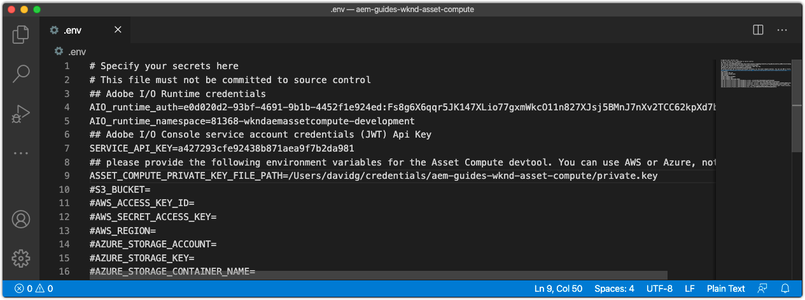

# Configurare le variabili di ambiente


Prima di iniziare lo sviluppo dei processi di lavoro di Asset Compute, assicurati che il progetto sia configurato con le informazioni di Adobe I/O e dell’archiviazione cloud. Queste informazioni sono memorizzate in `.env` del progetto, che viene utilizzato solo per lo sviluppo locale, e non vengono salvate in Git. Il file `.env` consente di esporre le coppie chiave/valori all&#39;ambiente di sviluppo locale Asset Compute locale. Quando [distribuisce](../deploy/runtime.md) processi di lavoro Asset Compute in Adobe I/O Runtime, il file `.env` non viene utilizzato, ma viene passato un sottoinsieme di valori tramite variabili di ambiente. Nel file `.env` possono essere archiviati anche altri parametri e segreti personalizzati, ad esempio le credenziali di sviluppo per i servizi Web di terze parti.

<!--
## Reference the `private.key`



Open the `.env` file, uncomment the `ASSET_COMPUTE_PRIVATE_KEY_FILE_PATH` key, and provide the absolute path on your filesystem to the `private.key` that pairs with the public certificate added to your Adobe I/O App Builder project.

+ If your key pair was generated by Adobe I/O, it was auto-downloaded as part of the  `config.zip`.
+ If you provided the public key to Adobe I/O, then you should also be in possession of the matching private key.
+ If you do not have these key pairs, you can generate new key pairs or upload new public keys at the bottom of:
[https://console.adobe.com](https://console.adobe.io) > Your Asset Compute App Builder project > Workspaces @ Development > Service Account (JWT).

Remember the `private.key` file should not be checked into Git as it contains secrets, rather it should be stored in a safe place outside the project.

For example, on macOS this might look like:

```
...
ASSET_COMPUTE_PRIVATE_KEY_FILE_PATH=/Users/example-user/credentials/aem-guides-wknd-asset-compute/private.key
...
```
-->

## Configurare le credenziali di Cloud Storage

Lo sviluppo locale dei processi di lavoro di Asset Compute richiede l&#39;accesso all&#39;[archiviazione cloud](../set-up/accounts-and-services.md#cloud-storage). Le credenziali dell&#39;archiviazione cloud utilizzate per lo sviluppo locale sono fornite nel file `.env`.

Questa esercitazione preferisce l&#39;utilizzo dell&#39;archiviazione BLOB di Azure, tuttavia è possibile utilizzare Amazon S3 e le chiavi corrispondenti nel file `.env`.

### Utilizzo dell’archiviazione BLOB di Azure

Rimuovere il commento e popolare le chiavi seguenti nel file `.env` e popolarle con i valori per l&#39;archiviazione cloud con provisioning trovati nel portale di Azure.


1. Valore per la chiave `AZURE_STORAGE_CONTAINER_NAME`
1. Valore per la chiave `AZURE_STORAGE_ACCOUNT`
1. Valore per la chiave `AZURE_STORAGE_KEY`

Ad esempio, potrebbe presentarsi così (valori solo a titolo illustrativo):

```
...
AZURE_STORAGE_ACCOUNT=aemguideswkndassetcomput
AZURE_STORAGE_KEY=Va9CnisgdbdsNJEJBqXDyNbYppbGbZ2V...OUNY/eExll0vwoLsPt/OvbM+B7pkUdpEe7zJhg==
AZURE_STORAGE_CONTAINER_NAME=asset-compute
...
```

Il file `.env` risultante ha il seguente aspetto:


Se NON utilizzi l’archiviazione BLOB di Microsoft Azure, rimuovi o lascia questi commenti (con il prefisso `#`).

### Utilizzo dell’archiviazione cloud Amazon S3{#amazon-s3}

Se utilizzi l&#39;archiviazione cloud Amazon S3, rimuovi il commento e popola le seguenti chiavi nel file `.env`.

Ad esempio, potrebbe presentarsi così (valori solo a titolo illustrativo):

```
...
S3_BUCKET=aemguideswkndassetcompute
AWS_ACCESS_KEY_ID=KKIXZLZYNLXJLV24PLO6
AWS_SECRET_ACCESS_KEY=Ba898CnisgabdsNJEJBqCYyVrYttbGbZ2...OiNYExll0vwoLsPtOv
AWS_REGION=us-east-1
...
```

## Convalida della configurazione del progetto

Una volta configurato il progetto Asset Compute generato, convalidare la configurazione prima di apportare modifiche al codice per garantire il provisioning dei servizi di supporto nei file `.env`.

Per avviare Asset Compute Development Tool per il progetto Asset Compute:

1. Apri una riga di comando nella directory principale del progetto Asset Compute (in VS Code può essere aperta direttamente nell’IDE tramite Terminal > New Terminal) ed esegui il comando:

   ```
   $ aio app run
   ```

1. Lo strumento di sviluppo Asset Compute locale verrà aperto nel browser Web predefinito in __http://localhost :9000__.

   

1. Esaminare l&#39;output della riga di comando e il browser Web per i messaggi di errore durante l&#39;inizializzazione dello strumento di sviluppo.
1. Per arrestare lo strumento di sviluppo Asset Compute, tocca `Ctrl-C` nella finestra che ha eseguito `aio app run` per terminare il processo.

## Risoluzione di problemi

+ [Impossibile avviare lo strumento di sviluppo. Private.key mancante](../troubleshooting.md#missing-private-key)
