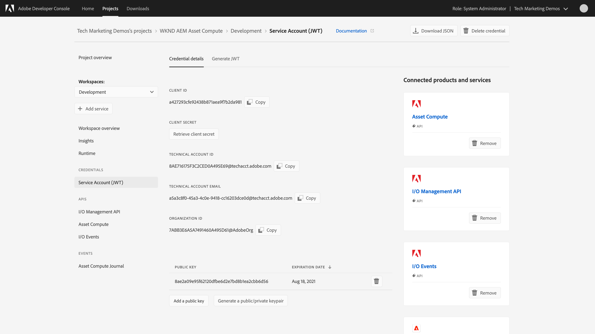

# Configurare App Builder

I progetti di Asset compute sono progetti App Builder appositamente definiti e, come tali, richiedono l’accesso ad App Builder nella console Adobe Developer per poterli impostare e distribuire.

## Creare e configurare App Builder nella console Adobe Developer{#set-up}

>[!VIDEO](https://video.tv.adobe.com/v/40183?quality=12&learn=on)

_Click-through dell&#39;impostazione di App Builder (nessun audio)_

1. Accedi a [Console Adobe Developer](https://console.adobe.io) utilizzo dell’Adobe ID associato al provisioning [account e servizi](./accounts-and-services.md). Assicurati di essere un __Amministratore di sistema__ o nella __Ruolo Sviluppatore__ per l’organizzazione di Adobe corretta.
1. Per creare un progetto App Builder, tocca __Crea nuovo progetto > Progetto da modello > App Builder__

   _Se__ Crea nuovo progetto __o__ App Builder __tipo non disponibile, il che significa che l’organizzazione Adobe non è [predisposto con App Builder](#request-adobe-project-app-builder)._

   + __Titolo progetto__: `WKND AEM Asset Compute`
   + __Nome app__: `wkndAemAssetCompute<YourName>`
      + Il __Nome app__ deve essere univoco in tutti i progetti FApp Builderirefly e non può essere modificato in un secondo momento. Aggiungi un prefisso al nome della tua azienda o organizzazione e un suffisso significativo come suffisso per la pubblicazione: `wkndAemAssetCompute`.
      + Per l’abilitazione automatica, spesso è meglio aggiungere il tuo nome alla __Nome app__, ad esempio `wkndAemAssetComputeJaneDoe` per evitare conflitti con altri progetti di App Builder.
   + Sotto __Aree di lavoro__ aggiungi un nuovo ambiente denominato `Development`
   + Sotto __Adobe I/O Runtime__ assicurare __Includi runtime con ogni area di lavoro__ è selezionato
   + Tocca __Salva__ per salvare il progetto
1. Nel progetto App Builder, seleziona `Development` dal selettore dell’area di lavoro
1. Tocca __+ Aggiungi servizio > API__ per aprire __Aggiungere un’API__ procedura guidata, utilizza questo approccio per aggiungere le seguenti API:

   + __EXPERIENCE CLOUD > ASSET COMPUTE__
      + Seleziona __Generare una coppia di chiavi__ e tocca il __Genera coppia di chiavi__ e salvare il file scaricato `config.zip` in un luogo sicuro per [utilizzo successivo](#private-key)
      + Tocca __Successivo__
      + Seleziona il profilo di prodotto __Integrazioni - Cloud Service__ e tocca __Salva API configurata__
   + __Adobe Services > Eventi di I/O__ e tocca __Salva API configurata__
   + __Adobe Services > API di gestione I/O__ e tocca __Salva API configurata__

## Accedi a private.key{#private-key}

Durante la configurazione di [Integrazione API Asset compute](#set-up) è stata generata una nuova coppia di chiavi e un `config.zip` il file è stato scaricato automaticamente. Questo `config.zip` contiene il certificato pubblico generato e la corrispondenza `private.key` file.

1. Decomprimi `config.zip` in un punto sicuro del file system come `private.key` è [utilizzato in seguito](../develop/environment-variables.md)
   + I segreti e le chiavi private non devono mai essere aggiunti a Git per motivi di sicurezza.

## Verifica le credenziali dell’account di servizio (JWT)

Le credenziali di questo progetto di Adobe I/O sono utilizzate dal [Strumento di sviluppo Asset compute](../develop/development-tool.md) per interagire con Adobe I/O Runtime e deve essere incorporato nel progetto Asset compute. Acquisisci familiarità con le credenziali dell’account di servizio (JWT).

1. Dal progetto Adobe I/O Project App Builder, assicurati che le `Development` area di lavoro selezionata
1. Toccare su __Account di servizio (JWT)__ in __Credenziali__
1. Verifica le credenziali dell’Adobe I/O visualizzate
   + Il __chiave pubblica__ elencato in basso contiene __private.key__ controparte nel `config.zip` scaricato quando __API ASSET COMPUTE__ è stato aggiunto a questo progetto.
      + Se la chiave privata viene persa o compromessa, la chiave pubblica corrispondente può essere rimossa e una nuova coppia di chiavi generata o caricata in Adobe I/O utilizzando questa interfaccia.
