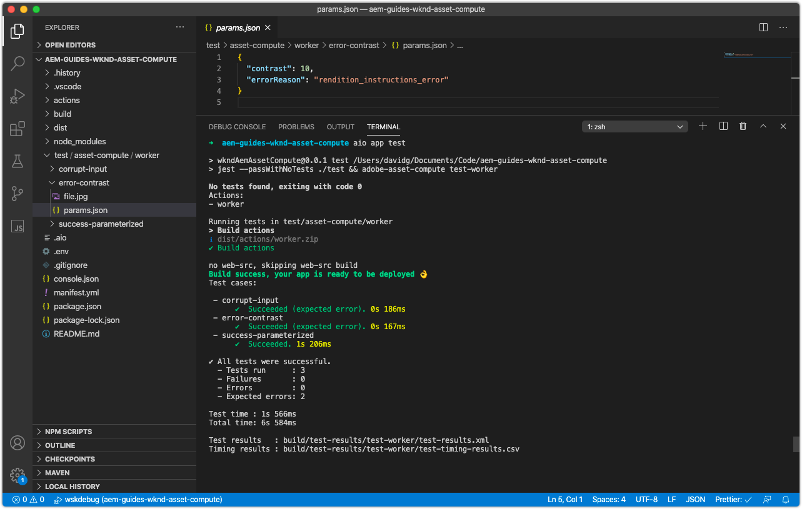

# Eseguire il test di un processo di lavoro Asset compute

Il progetto di Asset compute definisce un pattern che consente di creare ed eseguire facilmente [prove sui lavoratori Asset compute](https://experienceleague.adobe.com/docs/asset-compute/using/extend/test-custom-application.html).

## Anatomia di un test di lavoro

I test dei lavoratori Asset compute vengono suddivisi in suite di test e, all’interno di ogni suite di test, uno o più casi di test affermano una condizione da testare.

La struttura dei test in un progetto Asset compute è la seguente:

```
/actions/<worker-name>/index.js
...
/test/
  asset-compute/
    <worker-name>/           <--- Test suite for the worker, must match the yaml key for this worker in manifest.yml
        <test-case-1>/       <--- Specific test case 
            file.jpg         <--- Input file (ie. `source.path` or `source.url`)
            params.json      <--- Parameters (ie. `rendition.instructions`)
            rendition.png    <--- Expected output file (ie. `rendition.path`)
        <test-case-2>/       <--- Another specific test case for this worker
            ...
```

Ogni cast di test può avere i seguenti file:

+ `file.<extension>`
   + File di origine da testare (l’estensione può essere qualsiasi cosa tranne `.link`)
   + Obbligatorio
+ `rendition.<extension>`
   + Rendering previsto
   + Obbligatorio, ad eccezione della verifica degli errori
+ `params.json`
   + Istruzioni JSON per la rappresentazione singola
   + Facoltativo
+ `validate`
   + Uno script che ottiene come argomenti i percorsi previsti ed effettivi del file di rendering e deve restituire il codice di uscita 0 se il risultato è ok, o un codice di uscita diverso da zero se la convalida o il confronto non è riuscito.
   + Facoltativo, il valore predefinito è `diff` comando
   + Utilizza uno script della shell che racchiude un comando di esecuzione docker per l’utilizzo di diversi strumenti di convalida
+ `mock-<host-name>.json`
   + Risposte HTTP in formato JSON per [beffa delle chiamate di servizio esterne](https://www.mock-server.com/mock_server/creating_expectations.html).
   + Facoltativo, utilizzato solo se il codice del lavoratore effettua proprie richieste HTTP

## Scrittura di un test case

Questo test case afferma l&#39;input con parametri (`params.json`) per il file di input (`file.jpg`) genera la rappresentazione PNG prevista (`rendition.png`).

1. Elimina innanzitutto il file generato automaticamente `simple-worker` test case su `/test/asset-compute/simple-worker` poiché questo non è valido, poiché il nostro lavoratore non copia più semplicemente l’origine nella rappresentazione.
1. Crea una nuova cartella di test case in `/test/asset-compute/worker/success-parameterized` per verificare la corretta esecuzione del processo di lavoro che genera una rappresentazione PNG.
1. In `success-parameterized` , aggiungi il test [file di input](./assets/test/success-parameterized/file.jpg) per questo caso di test e denominalo `file.jpg`.
1. In `success-parameterized` cartella, aggiungi un nuovo file denominato `params.json` che definisce i parametri di input del lavoratore:

   ```json
   { 
       "size": "400",
       "contrast": "0.25",
       "brightness": "-0.50"
   }
   ```

   Questi sono gli stessi valori chiave trasmessi nel [Definizione del profilo di Asset compute dello strumento di sviluppo](../develop/development-tool.md), meno `worker` chiave.

1. Aggiungi il previsto [file di rappresentazione](./assets/test/success-parameterized/rendition.png) a questo caso di test e denominalo `rendition.png`. Questo file rappresenta l&#39;output previsto del processo di lavoro per l&#39;input specificato `file.jpg`.
1. Dalla riga di comando, esegui i test della directory principale del progetto eseguendo `aio app test`
   + Assicurare [Docker Desktop](../set-up/development-environment.md#docker) e le immagini Docker di supporto vengono installate e avviate
   + Termina tutte le istanze dello strumento di sviluppo in esecuzione


## Scrittura di un test case di controllo degli errori

Questo test case verifica che il lavoratore generi l&#39;errore appropriato quando `contrast` parametro impostato su un valore non valido.

1. Crea una nuova cartella di test case in `/test/asset-compute/worker/error-contrast` per verificare un&#39;esecuzione errata del lavoratore a causa di un errore `contrast` valore del parametro.
1. In `error-contrast` , aggiungi il test [file di input](./assets/test/error-contrast/file.jpg) per questo caso di test e denominalo `file.jpg`. Il contenuto di questo file non è rilevante per questo test, deve solo esistere per superare il controllo &quot;Origine danneggiata&quot;, al fine di raggiungere `rendition.instructions` controlli di validità, che il test case convalida.
1. In `error-contrast` cartella, aggiungi un nuovo file denominato `params.json` che definisce i parametri di input del lavoratore con il contenuto:

   ```json
   {
       "contrast": "10",
       "errorReason": "rendition_instructions_error"
   }
   ```

   + Imposta `contrast` parametri per `10`, un valore non valido, poiché il contrasto deve essere compreso tra -1 e 1, per generare un `RenditionInstructionsError`.
   + Asserire che l’errore appropriato viene generato nei test impostando `errorReason` chiave del &quot;motivo&quot; associato all’errore previsto. Questo parametro di contrasto non valido genera il [errore personalizzato](../develop/worker.md#errors), `RenditionInstructionsError`, pertanto imposta il `errorReason` al motivo di questo errore, oppure`rendition_instructions_error` per affermare che è stato lanciato.

1. Poiché non deve essere generata alcuna rappresentazione durante un’esecuzione errata, no `rendition.<extension>` è necessario.
1. Esegui la suite di test dalla directory principale del progetto eseguendo il comando `aio app test`
   + Assicurare [Docker Desktop](../set-up/development-environment.md#docker) e le immagini Docker di supporto vengono installate e avviate
   + Termina tutte le istanze dello strumento di sviluppo in esecuzione



## Casi di test su Github

I test case finali sono disponibili su Github all’indirizzo:

+ [aem-guides-wknd-asset-compute/test/asset-compute/worker](https://github.com/adobe/aem-guides-wknd-asset-compute/tree/master/test/asset-compute/worker)

## Risoluzione dei problemi

+ [Nessuna rappresentazione generata durante l’esecuzione del test](../troubleshooting.md#test-no-rendition-generated)
+ [Il test genera una rappresentazione errata](../troubleshooting.md#tests-generates-incorrect-rendition)
