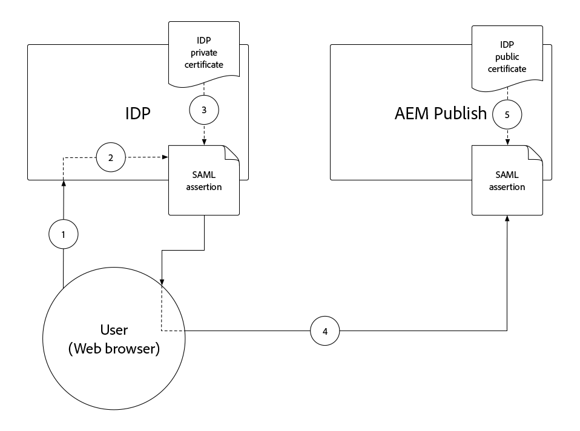

# Autenticazione SAML 2.0{#saml-2-0-authentication}

Scopri come impostare e autenticare gli utenti finali (non autori AEM) in un IDP compatibile con SAML 2.0 a tua scelta.

## Quale SAML per AEM as a Cloud Service?

L’integrazione SAML 2.0 con AEM Publish (o Anteprima), consente agli utenti finali di un’esperienza web basata su AEM di autenticarsi in un IDP (Identity Provider) non Adobe e di accedere all’AEM come utente autorizzato con un nome.

|                       | Autore AEM | Pubblicazione AEM |
|-----------------------|:----------:|:-----------:|
| Supporto SAML 2.0 | ✘ | ✔ |

+++ Comprendere il flusso SAML 2.0 con AEM

Il flusso tipico di un’integrazione AEM-Publish SAML è il seguente:

1. L’utente invia una richiesta a AEM Publish indicando che è necessaria l’autenticazione.
   + L’utente richiede una risorsa protetta da CUG/ACL.
   + L’utente richiede una risorsa soggetta a un requisito di autenticazione.
   + L&#39;utente segue un collegamento all&#39;endpoint di accesso dell&#39;AEM (ad esempio `/system/sling/login`) che richiede esplicitamente l&#39;azione di accesso.
1. L’AEM invia una AuthnRequest all’IDP, richiedendo a quest’ultimo di avviare il processo di autenticazione.
1. L&#39;utente si autentica in IDP.
   + L&#39;IDP richiede all&#39;utente le credenziali.
   + L&#39;utente è già autenticato con l&#39;IDP e non deve fornire ulteriori credenziali.
1. IDP genera un&#39;asserzione SAML contenente i dati dell&#39;utente e la firma utilizzando il certificato privato dell&#39;IDP.
1. IDP invia l’asserzione SAML tramite HTTP POST, tramite il browser web dell’utente, a AEM Publish.
1. AEM Publish riceve l&#39;asserzione SAML e ne convalida l&#39;integrità e l&#39;autenticità utilizzando il certificato pubblico IDP.
1. AEM Publish gestisce il record utente AEM in base alla configurazione OSGi SAML 2.0 e al contenuto della dichiarazione SAML.
   + Crea utente
   + Sincronizza gli attributi utente
   + Aggiorna l&#39;iscrizione al gruppo di utenti AEM
1. AEM Publish imposta il cookie AEM `login-token` sulla risposta HTTP, utilizzato per autenticare le richieste successive a AEM Publish.
1. Publish AEM reindirizza l&#39;utente all&#39;URL nel Publish AEM come specificato dal cookie `saml_request_path`.

+++

## Procedura dettagliata della configurazione

>[!VIDEO](https://video.tv.adobe.com/v/343040?quality=12&learn=on)

Questo video illustra come configurare l’integrazione SAML 2.0 con il servizio AEM as a Cloud Service Publish e utilizzare Okta come IDP.

## Prerequisiti

Per configurare l’autenticazione SAML 2.0 sono necessari i seguenti elementi:

+ Accesso di Responsabile dell’implementazione a Cloud Manager
+ Accesso dell’amministratore AEM all’ambiente AEM as a Cloud Service
+ Accesso amministratore all&#39;IDP
+ Facoltativamente, accesso a una coppia di chiavi pubblica/privata utilizzata per crittografare i payload SAML

SAML 2.0 è supportato solo per l’autenticazione degli utilizzi in Publish o Anteprima AEM. Per gestire l&#39;autenticazione di AEM Author tramite e IDP, [integra l&#39;IDP con Adobe IMS](https://helpx.adobe.com/it/enterprise/using/set-up-identity.html).


## Installare il certificato pubblico IDP su AEM

Il certificato pubblico dell&#39;IDP viene aggiunto al Global Trust Store dell&#39;AEM e utilizzato per convalidare la validità dell&#39;asserzione SAML inviata dall&#39;IDP.

+++Flusso di firma asserzione SAML



1. L&#39;utente si autentica in IDP.
1. IDP genera un&#39;asserzione SAML contenente i dati dell&#39;utente.
1. IDP firma l&#39;asserzione SAML utilizzando il certificato privato dell&#39;IDP.
1. IDP avvia un POST HTTP lato client all&#39;endpoint SAML di Publish AEM (`.../saml_login`) che include l&#39;asserzione SAML firmata.
1. AEM Publish riceve il POST HTTP contenente l’asserzione SAML firmata; può convalidare la firma utilizzando il certificato pubblico IDP.

+++


1. Ottieni il file del __certificato pubblico__ dall&#39;IDP. Questo certificato consente all&#39;AEM di convalidare l&#39;asserzione SAML fornita all&#39;AEM dall&#39;IDP.

   Il certificato è in formato PEM e deve essere simile al seguente:

   ```
   -----BEGIN CERTIFICATE-----
   MIIC4jCBAcoCCQC33wnybT5QZDANBgkqhkiG9w0BAQsFADAyMQswCQYDVQQGEwJV
   ...
   m0eo2USlSRTVl7QHRTuiuSThHpLKQQ==
   -----END CERTIFICATE-----
   ```

1. Accedi a AEM Author come amministratore AEM.
1. Passa a __Strumenti > Sicurezza > Archivio attendibile__.
1. Crea o apri l&#39;archivio fonti attendibili globale. Se si crea un archivio fonti attendibili globale, memorizzare la password in un luogo sicuro.
1. Espandere __Aggiungi certificato da file CER__.
1. Selezionare __Seleziona file certificato__ e caricare il file certificato fornito dall&#39;IDP.
1. Lascia vuoto __Mappa certificato all&#39;utente__.
1. Seleziona __Invia__.
1. Il certificato appena aggiunto viene visualizzato sopra la sezione __Aggiungi certificato da file CRT__.
1. Prendere nota dell&#39;alias __alias__, in quanto questo valore viene utilizzato nella configurazione OSGi del gestore autenticazione [SAML 2.0](#saml-2-0-authentication-handler-osgi-configuration).
1. Seleziona __Salva e chiudi__.

L&#39;archivio fonti attendibili globale è configurato con il certificato pubblico dell&#39;IDP per l&#39;autore AEM, ma poiché SAML viene utilizzato solo in AEM Publish, l&#39;archivio fonti attendibili globale deve essere replicato in AEM Publish affinché il certificato pubblico dell&#39;IDP sia accessibile.


1. Passa a __Strumenti > Distribuzione > Pacchetti__.
1. Creare un pacchetto
   + Nome pacchetto: `Global Trust Store`
   + Versione: `1.0.0`
   + Gruppo: `com.your.company`
1. Modifica il nuovo pacchetto __Archivio attendibile globale__.
1. Selezionare la scheda __Filtri__ e aggiungere un filtro per il percorso radice `/etc/truststore`.
1. Seleziona __Fine__ e quindi __Salva__.
1. Selezionare il pulsante __Genera__ per il pacchetto __Archivio attendibilità globale__.
1. Una volta generato, selezionare __Altro__ > __Replica__ per attivare il nodo dell&#39;archivio fonti attendibili globale (`/etc/truststore`) in AEM Publish.

## Crea keystore del servizio di autenticazione{#authentication-service-keystore}

_È necessario creare un keystore per il servizio di autenticazione quando la proprietà di configurazione OSGi `handleLogout` del gestore di autenticazione [SAML 2.0 è impostata su `true`](#saml-20-authenticationsaml-2-0-authentication) o quando [è richiesta la firma AuthnRequest/la crittografia dell&#39;asserzione SAML](#install-aem-public-private-key-pair)_

1. Accedi a AEM Author come amministratore AEM per caricare la chiave privata.
1. Passa a __Strumenti > Protezione > Utenti__, seleziona l&#39;utente __authentication-service__ e seleziona __Proprietà__ dalla barra delle azioni superiore.
1. Selezionare la scheda __Registro chiavi__.
1. Crea o apri il keystore. Se crei un keystore, proteggi la password.
   + Un keystore [pubblico/privato è installato in questo keystore](#install-aem-public-private-key-pair) solo se è richiesta la firma AuthnRequest/la crittografia dell&#39;asserzione SAML.
   + Se questa integrazione SAML supporta la disconnessione ma non l&#39;asserzione di firma AuthnRequest/SAML, è sufficiente un keystore vuoto.
1. Seleziona __Salva e chiudi__.
1. Crea un pacchetto contenente l&#39;utente __authentication-service__ aggiornato.

   _Utilizzare la seguente soluzione alternativa temporanea utilizzando i pacchetti:_

   1. Passa a __Strumenti > Distribuzione > Pacchetti__.
   1. Creare un pacchetto
      + Nome pacchetto: `Authentication Service`
      + Versione: `1.0.0`
      + Gruppo: `com.your.company`
   1. Modifica il nuovo pacchetto __Archivio chiavi del servizio di autenticazione__.
   1. Selezionare la scheda __Filtri__ e aggiungere un filtro per il percorso radice `/home/users/system/cq:services/internal/security/<AUTHENTICATION SERVICE UUID>/keystore`.
      + Per trovare `<AUTHENTICATION SERVICE UUID>`, passa a __Strumenti > Protezione > Utenti__ e seleziona l&#39;utente __authentication-service__. L’UUID è l’ultima parte dell’URL.
   1. Seleziona __Fine__ e quindi __Salva__.
   1. Selezionare il pulsante __Build__ per il pacchetto __Authentication Service Key Store__.
   1. Una volta generato, seleziona __Altro__ > __Replica__ per attivare l&#39;archivio chiavi del servizio di autenticazione in AEM Publish.

## Installare una coppia di chiavi pubblica/privata AEM{#install-aem-public-private-key-pair}

_L&#39;installazione della coppia di chiavi pubblica/privata AEM è facoltativa_

AEM Publish può essere configurato per firmare AuthnRequests (a IDP) e crittografare le asserzioni SAML (a AEM). Ciò si ottiene fornendo una chiave privata al Publish dell&#39;AEM, che corrisponde alla chiave pubblica dell&#39;IDP.

+++ Comprendere il flusso di firma AuthnRequest (facoltativo)

AuthnRequest (la richiesta all’IDP da AEM Publish che avvia il processo di accesso) può essere firmata da AEM Publish. A questo scopo, AEM Publish firma la AuthnRequest utilizzando la chiave privata, che l’IDP convalida quindi la firma utilizzando la chiave pubblica. Questo garantisce all&#39;IDP che AuthnRequest è stato avviato e richiesto da AEM Publish, e non una terza parte dannosa.


1. L’utente invia una richiesta HTTP a AEM Publish che restituisce una richiesta di autenticazione SAML all’IDP.
1. AEM Publish genera la richiesta SAML da inviare all’IDP.
1. AEM Publish firma la richiesta SAML utilizzando la chiave privata AEM.
1. Il Publish AEM avvia AuthnRequest, un reindirizzamento lato client HTTP all’IDP che contiene la richiesta SAML firmata.
1. IDP riceve la AuthnRequest e convalida la firma utilizzando la chiave pubblica dell’AEM, garantendo che l’AEM Publish abbia avviato la AuthnRequest.
1. AEM Publish convalida quindi l&#39;integrità e l&#39;autenticità dell&#39;asserzione SAML decrittografata utilizzando il certificato pubblico IDP.

+++

+++ Comprendere il flusso di crittografia dell’asserzione SAML (facoltativo)

Tutte le comunicazioni HTTP tra IDP e AEM Publish devono essere effettuate tramite HTTPS e quindi protette per impostazione predefinita. Tuttavia, come richiesto, le asserzioni SAML possono essere crittografate nel caso in cui sia richiesta ulteriore riservatezza oltre a quella fornita da HTTPS. A questo scopo, l’IDP crittografa i dati dell’asserzione SAML utilizzando la chiave privata, mentre AEM Publish decrittografa l’asserzione SAML utilizzando la chiave privata.


1. L&#39;utente si autentica in IDP.
1. IDP genera un&#39;asserzione SAML contenente i dati dell&#39;utente e la firma utilizzando il certificato privato dell&#39;IDP.
1. L&#39;IDP crittografa quindi l&#39;asserzione SAML con la chiave pubblica dell&#39;AEM, che richiede la chiave privata dell&#39;AEM per decrittografare.
1. L’asserzione SAML crittografata viene inviata tramite il browser web dell’utente a AEM Publish.
1. AEM Publish riceve l’asserzione SAML e la decrittografa utilizzando la chiave privata AEM.
1. IDP richiede all&#39;utente di eseguire l&#39;autenticazione.

+++

Sia la firma AuthnRequest che la crittografia delle asserzioni SAML sono facoltative, ma entrambe sono abilitate, utilizzando la proprietà di configurazione OSGi `useEncryption`](#saml-20-authenticationsaml-2-0-authentication) del gestore di autenticazione [SAML 2.0, che indica che è possibile utilizzare entrambe o nessuna delle due.


1. Ottieni la chiave pubblica, la chiave privata (PKCS#8 in formato DER) e il file della catena di certificati (questa potrebbe essere la chiave pubblica) utilizzati per firmare la richiesta di authoring e crittografa l’asserzione SAML. Le chiavi vengono in genere fornite dal team di sicurezza dell&#39;organizzazione IT.

   + È possibile generare una coppia di chiavi autofirmate utilizzando __openssl__:

   ```
   $ openssl req -x509 -sha256 -days 365 -newkey rsa:4096 -keyout aem-private.key -out aem-public.crt
   
   # Provide a password (keep in safe place), and other requested certificate information
   
   # Convert the keys to AEM's required format 
   $ openssl rsa -in aem-private.key -outform der -out aem-private.der
   $ openssl pkcs8 -topk8 -inform der -nocrypt -in aem-private.der -outform der -out aem-private-pkcs8.der
   ```

1. Carica la chiave pubblica nell&#39;IDP.
   + Utilizzando il metodo `openssl` precedente, la chiave pubblica è il file `aem-public.crt`.
1. Accedi a AEM Author come amministratore AEM per caricare la chiave privata.
1. Passa a __Strumenti > Sicurezza > Archivio attendibile__, seleziona l&#39;utente __authentication-service__ e seleziona __Proprietà__ dalla barra delle azioni superiore.
1. Passa a __Strumenti > Protezione > Utenti__, seleziona l&#39;utente __authentication-service__ e seleziona __Proprietà__ dalla barra delle azioni superiore.
1. Selezionare la scheda __Registro chiavi__.
1. Crea o apri il keystore. Se crei un keystore, proteggi la password.
1. Selezionare __Aggiungi chiave privata dal file DER__ e aggiungere la chiave privata e il file della catena all&#39;AEM:
   + __Alias__: fornire un nome significativo, spesso il nome dell&#39;IDP.
   + __File di chiave privata__: carica il file di chiave privata (PKCS#8 in formato DER).
      + Utilizzando il metodo `openssl`, si tratta del file `aem-private-pkcs8.der`
   + __Selezionare il file della catena di certificati__: caricare il file della catena associato (potrebbe essere la chiave pubblica).
      + Utilizzando il metodo `openssl`, si tratta del file `aem-public.crt`
   + Seleziona __Invia__
1. Il certificato appena aggiunto viene visualizzato sopra la sezione __Aggiungi certificato da file CRT__.
   + Prendere nota dell&#39;alias __alias__ utilizzato nella configurazione OSGi del gestore di autenticazione [SAML 2.0](#saml-20-authentication-handler-osgi-configuration)
1. Seleziona __Salva e chiudi__.
1. Crea un pacchetto contenente l&#39;utente __authentication-service__ aggiornato.

   _Utilizzare la seguente soluzione alternativa temporanea utilizzando i pacchetti:_

   1. Passa a __Strumenti > Distribuzione > Pacchetti__.
   1. Creare un pacchetto
      + Nome pacchetto: `Authentication Service`
      + Versione: `1.0.0`
      + Gruppo: `com.your.company`
   1. Modifica il nuovo pacchetto __Archivio chiavi del servizio di autenticazione__.
   1. Selezionare la scheda __Filtri__ e aggiungere un filtro per il percorso radice `/home/users/system/cq:services/internal/security/<AUTHENTICATION SERVICE UUID>/keystore`.
      + Per trovare `<AUTHENTICATION SERVICE UUID>`, passa a __Strumenti > Protezione > Utenti__ e seleziona l&#39;utente __authentication-service__. L’UUID è l’ultima parte dell’URL.
   1. Seleziona __Fine__ e quindi __Salva__.
   1. Selezionare il pulsante __Build__ per il pacchetto __Authentication Service Key Store__.
   1. Una volta generato, seleziona __Altro__ > __Replica__ per attivare l&#39;archivio chiavi del servizio di autenticazione in AEM Publish.

## Configura gestore autenticazione SAML 2.0{#configure-saml-2-0-authentication-handler}

La configurazione SAML dell&#39;AEM viene eseguita tramite la configurazione OSGi __Adobe Granite SAML 2.0 Authentication Handler__.
La configurazione è una configurazione di fabbrica OSGi, il che significa che un singolo servizio AEM as a Cloud Service Publish può avere più strutture di risorse discrete di copertura della configurazione SAML dell’archivio; questo è utile per le distribuzioni AEM multisito.

+++ Glossario della configurazione OSGi del gestore autenticazione SAML 2.0

### Configurazione OSGi del gestore autenticazione SAML 2.0 Adobe Granite{#configure-saml-2-0-authentication-handler-osgi-configuration}

|                                   | Proprietà OSGi | Obbligatorio | Formato del valore | Valore predefinito | Descrizione |
|-----------------------------------|-------------------------------|:--------:|:---------------------:|---------------------------|-------------|
| Percorsi | `path` | ✔ | Array di stringhe | `/` | Percorsi AEM per cui viene utilizzato questo gestore di autenticazione. |
| URL IDP | `idpUrl` | ✔ | Stringa |                           | URL IDP viene inviata la richiesta di autenticazione SAML. |
| Alias certificato IDP | `idpCertAlias` | ✔ | Stringa |                           | Alias del certificato IDP trovato nell&#39;archivio fonti attendibili globale dell&#39;AEM |
| Reindirizzamento HTTP IDP | `idpHttpRedirect` | ✘ | Booleano | `false` | Indica se si tratta di un reindirizzamento HTTP all’URL IDP anziché inviare una AuthnRequest. Impostato su `true` per l&#39;autenticazione avviata da IDP. |
| Identificatore IDP | `idpIdentifier` | ✘ | Stringa |                           | ID IDP univoco per garantire l’univocità dell’utente e del gruppo AEM. Se vuoto, viene utilizzato `serviceProviderEntityId`. |
| URL servizio consumer di asserzione | `assertionConsumerServiceURL` | ✘ | Stringa |                           | Attributo URL `AssertionConsumerServiceURL` in AuthnRequest che specifica dove inviare il messaggio `<Response>` all&#39;AEM. |
| ID entità SP | `serviceProviderEntityId` | ✔ | Stringa |                           | Identifica in modo univoco l&#39;AEM per l&#39;IDP; di solito il nome dell&#39;host dell&#39;AEM. |
| Crittografia SP | `useEncryption` | ✘ | Booleano | `true` | Indica se l’IDP crittografa le asserzioni SAML. Richiede `spPrivateKeyAlias` e `keyStorePassword` per essere impostati. |
| Alias chiave privata SP | `spPrivateKeyAlias` | ✘ | Stringa |                           | Alias della chiave privata nell&#39;archivio chiavi dell&#39;utente `authentication-service`. Obbligatorio se `useEncryption` è impostato su `true`. |
| Password archivio chiavi SP | `keyStorePassword` | ✘ | Stringa |                           | Password dell&#39;archivio chiavi dell&#39;utente del servizio di autenticazione. Obbligatorio se `useEncryption` è impostato su `true`. |
| Reindirizzamento predefinito | `defaultRedirectUrl` | ✘ | Stringa | `/` | URL di reindirizzamento predefinito dopo l’autenticazione riuscita. Può essere relativo all&#39;host AEM (ad esempio, `/content/wknd/us/en/html`). |
| Attributo ID utente | `userIDAttribute` | ✘ | Stringa | `uid` | Nome dell&#39;attributo di asserzione SAML contenente l&#39;ID utente dell&#39;utente AEM. Lascia vuoto per usare `Subject:NameId`. |
| Creazione automatica di utenti AEM | `createUser` | ✘ | Booleano | `true` | Indica se gli utenti AEM vengono creati dopo la corretta autenticazione. |
| Percorso intermedio per utenti AEM | `userIntermediatePath` | ✘ | Stringa |                           | Quando si creano utenti AEM, questo valore viene utilizzato come percorso intermedio (ad esempio, `/home/users/<userIntermediatePath>/jane@wknd.com`). Richiede `createUser` per essere impostato su `true`. |
| Attributi utente AEM | `synchronizeAttributes` | ✘ | Array di stringhe |                           | Elenco dei mapping di attributi SAML da archiviare nell&#39;utente AEM nel formato `[ "saml-attribute-name=path/relative/to/user/node" ]` (ad esempio `[ "firstName=profile/givenName" ]`). Consulta l&#39;[elenco completo degli attributi AEM nativi](#aem-user-attributes). |
| Aggiungere un utente ai gruppi AEM | `addGroupMemberships` | ✘ | Booleano | `true` | Indica se un utente AEM viene aggiunto automaticamente ai gruppi di utenti AEM dopo la corretta autenticazione. |
| Attributo di iscrizione al gruppo AEM | `groupMembershipAttribute` | ✘ | Stringa | `groupMembership` | Nome dell&#39;attributo di asserzione SAML contenente un elenco di gruppi di utenti AEM a cui l&#39;utente deve essere aggiunto. Richiede `addGroupMemberships` per essere impostato su `true`. |
| Gruppi AEM predefiniti | `defaultGroups` | ✘ | Array di stringhe |                           | A viene sempre aggiunto un elenco di gruppi di utenti AEM autenticati (ad esempio, `[ "wknd-user" ]`). Richiede `addGroupMemberships` per essere impostato su `true`. |
| Formato NameIDPolicy | `nameIdFormat` | ✘ | Stringa | `urn:oasis:names:tc:SAML:2.0:nameid-format:transient` | Valore del parametro di formato NameIDPolicy da inviare al messaggio AuthnRequest. |
| Memorizza risposta SAML | `storeSAMLResponse` | ✘ | Booleano | `false` | Indica se il valore `samlResponse` è archiviato nel nodo `cq:User` dell&#39;AEM. |
| Gestisci disconnessione | `handleLogout` | ✘ | Booleano | `false` | Indica se la richiesta di disconnessione è gestita da questo gestore di autenticazione SAML. Richiede `logoutUrl` per essere impostato. |
| URL disconnessione | `logoutUrl` | ✘ | Stringa |                           | URL dell&#39;IDP a cui viene inviata la richiesta di disconnessione SAML. Obbligatorio se `handleLogout` è impostato su `true`. |
| Tolleranza orologio | `clockTolerance` | ✘ | Numero intero | `60` | Tolleranza di sfasamento dell’orologio di IDP e AEM (SP) durante la convalida delle asserzioni SAML. |
| Metodo digest | `digestMethod` | ✘ | Stringa | `http://www.w3.org/2001/04/xmlenc#sha256` | Algoritmo di digest utilizzato dall&#39;IDP per firmare un messaggio SAML. |
| Metodo di firma | `signatureMethod` | ✘ | Stringa | `http://www.w3.org/2001/04/xmldsig-more#rsa-sha256` | Algoritmo di firma utilizzato dall&#39;IDP per firmare un messaggio SAML. |
| Tipo di sincronizzazione identità | `identitySyncType` | ✘ | `default` oppure `idp` | `default` | Non modificare il valore predefinito di `from` per AEM as a Cloud Service. |
| Classificazione del servizio | `service.ranking` | ✘ | Numero intero | `5002` | Configurazioni di classificazione superiori sono preferite per lo stesso `path`. |

### Attributi utente AEM{#aem-user-attributes}

AEM utilizza i seguenti attributi utente, che possono essere compilati tramite la proprietà `synchronizeAttributes` nella configurazione OSGi del gestore autenticazione SAML 2.0 di Adobe Granite.  Qualsiasi attributo IDP può essere sincronizzato con qualsiasi proprietà utente AEM, tuttavia la mappatura a AEM use attribute properties (elencato di seguito) consente al AEM di utilizzarlo naturalmente.

| Attributo utente | Percorso proprietà relativa dal nodo `rep:User` |
|--------------------------------|--------------------------|
| Titolo (ad esempio, `Mrs`) | `profile/title` |
| Nome (ossia nome) | `profile/givenName` |
| Cognome (ad esempio cognome) | `profile/familyName` |
| Qualifica | `profile/jobTitle` |
| Indirizzo e-mail | `profile/email` |
| Indirizzo | `profile/street` |
| Città | `profile/city` |
| Codice postale | `profile/postalCode` |
| Paese | `profile/country` |
| Numero di telefono | `profile/phoneNumber` |
| Informazioni su di me | `profile/aboutMe` |

+++

1. Crea un file di configurazione OSGi nel progetto in `/ui.config/src/main/content/jcr_root/wknd-examples/osgiconfig/config.publish/com.adobe.granite.auth.saml.SamlAuthenticationHandler~saml.cfg.json` e aprilo nell&#39;IDE.
   + Cambia `/wknd-examples/` in `/<project name>/`
   + L&#39;identificatore dopo `~` nel nome file deve identificare in modo univoco questa configurazione, quindi potrebbe essere il nome dell&#39;IDP, ad esempio `...~okta.cfg.json`. Il valore deve essere alfanumerico con trattini.
1. Incolla il seguente JSON nel file `com.adobe.granite.auth.saml.SamlAuthenticationHandler~...cfg.json` e aggiorna i riferimenti `wknd` in base alle esigenze.

   ```json
   {
       "path": [ "/content/wknd", "/content/dam/wknd" ], 
       "idpCertAlias": "$[env:SAML_IDP_CERT_ALIAS;default=certalias___1652125559800]",
       "idpIdentifier": "$[env:SAML_IDP_ID;default=http://www.okta.com/exk4z55r44Jz9C6am5d7]",
       "idpUrl": "$[env:SAML_IDP_URL;default=https://dev-5511372.okta.com/app/dev-5511372_aemasacloudservice_1/exk4z55r44Jz9C6am5d7/sso/saml]",
       "serviceProviderEntityId": "$[env:SAML_AEM_ID;default=https://publish-p123-e456.adobeaemcloud.com]",
       "useEncryption": false,
       "createUser": true,
       "userIntermediatePath": "wknd/idp",
       "synchronizeAttributes":[
           "firstName=profile/givenName"
       ],
       "addGroupMemberships": true,
       "defaultGroups": [ 
           "wknd-users"
       ]
   }
   ```

1. Aggiorna i valori come richiesto dal progetto. Per le descrizioni delle proprietà di configurazione, vedi il glossario di configurazione OSGi __Gestore autenticazione SAML 2.0__ sopra
1. È consigliabile, ma non obbligatorio, utilizzare le variabili di ambiente OSGi e i segreti, quando i valori possono non essere sincronizzati con il ciclo di rilascio o quando i valori differiscono tra tipi di ambiente/livelli di servizio simili. I valori predefiniti possono essere impostati con la sintassi `$[env:..;default=the-default-value]"`, come illustrato sopra.

Le configurazioni OSGi per ambiente (`config.publish.dev`, `config.publish.stage` e `config.publish.prod`) possono essere definite con attributi specifici se la configurazione SAML varia da un ambiente all&#39;altro.

### Usa crittografia

Quando [si crittografano le asserzioni AuthnRequest e SAML](#encrypting-the-authnrequest-and-saml-assertion), sono necessarie le seguenti proprietà: `useEncryption`, `spPrivateKeyAlias` e `keyStorePassword`. `keyStorePassword` contiene una password, pertanto il valore non deve essere memorizzato nel file di configurazione OSGi, ma inserito utilizzando [valori di configurazione segreti](https://experienceleague.adobe.com/docs/experience-manager-cloud-service/content/implementing/deploying/configuring-osgi.html#secret-configuration-values)

+++Facoltativamente, aggiorna la configurazione OSGi per utilizzare la crittografia

1. Apri `/ui.config/src/main/content/jcr_root/wknd-examples/osgiconfig/config.publish/com.adobe.granite.auth.saml.SamlAuthenticationHandler~saml.cfg.json` nell&#39;IDE.
1. Aggiungere le tre proprietà `useEncryption`, `spPrivateKeyAlias` e `keyStorePassword` come illustrato di seguito.

   ```json
   {
   "path": [ "/content/wknd", "/content/dam/wknd" ], 
   "idpCertAlias": "$[env:SAML_IDP_CERT_ALIAS;default=certalias___1234567890]",
   "idpIdentifier": "$[env:SAML_IDP_ID;default=http://www.okta.com/abcdef1235678]",
   "idpUrl": "$[env:SAML_IDP_URL;default=https://dev-5511372.okta.com/app/dev-123567890_aemasacloudservice_1/abcdef1235678/sso/saml]",
   "serviceProviderEntityId": "$[env:SAML_AEM_ID;default=https://publish-p123-e456.adobeaemcloud.com]",
   "useEncryption": true,
   "spPrivateKeyAlias": "$[env:SAML_AEM_KEYSTORE_ALIAS;default=aem-saml-encryption]",
   "keyStorePassword": "$[secret:SAML_AEM_KEYSTORE_PASSWORD]",
   "createUser": true,
   "userIntermediatePath": "wknd/idp"
   "synchronizeAttributes":[
       "firstName=profile/givenName"
   ],
   "addGroupMemberships": true,
   "defaultGroups": [ 
       "wknd-users"
   ]
   }
   ```

1. Le tre proprietà di configurazione OSGi necessarie per la crittografia sono:

+ `useEncryption` impostato su `true`
+ `spPrivateKeyAlias` contiene l&#39;alias della voce keystore per la chiave privata utilizzata dall&#39;integrazione SAML.
+ `keyStorePassword` contiene una [variabile di configurazione segreta OSGi](https://experienceleague.adobe.com/docs/experience-manager-cloud-service/content/implementing/deploying/configuring-osgi.html#secret-configuration-values) contenente la password del keystore utente `authentication-service`.

+++

## Configura filtro Referrer

Durante il processo di autenticazione SAML, l&#39;IDP avvia un POST HTTP lato client per l&#39;endpoint `.../saml_login` del Publish AEM. Se il Publish IDP e AEM si trovano in un&#39;origine diversa, il __filtro referrer__ di AEM Publish viene configurato tramite la configurazione OSGi per consentire i POST HTTP dall&#39;origine dell&#39;IDP.

1. Crea (o modifica) un file di configurazione OSGi nel progetto in `/ui.config/src/main/content/jcr_root/wknd-examples/osgiconfig/config.publish/org.apache.sling.security.impl.ReferrerFilter.cfg.json`.
   + Cambia `/wknd-examples/` in `/<project name>/`
1. Verificare che il valore `allow.empty` sia impostato su `true`, che `allow.hosts` (o se si preferisce, `allow.hosts.regexp`) contenga l&#39;origine dell&#39;IDP e che `filter.methods` includa `POST`. La configurazione OSGi deve essere simile a:

   ```json
   {
       "allow.empty": true,
       "allow.hosts.regexp": [ ],
       "allow.hosts": [ 
           "$[env:SAML_IDP_REFERRER;default=dev-123567890.okta.com]"
       ],
       "filter.methods": [
           "POST",
       ],
       "exclude.agents.regexp": [ ]
   }
   ```

AEM Publish supporta una singola configurazione del filtro Referrer, in modo da unire i requisiti di configurazione SAML con tutte le configurazioni esistenti.

Le configurazioni OSGi per ambiente (`config.publish.dev`, `config.publish.stage` e `config.publish.prod`) possono essere definite con attributi specifici se `allow.hosts` (o `allow.hosts.regex`) variano da un ambiente all&#39;altro.

## Configurare la condivisione CORS (Cross-Origin Resource Sharing)

Durante il processo di autenticazione SAML, l&#39;IDP avvia un POST HTTP lato client per l&#39;endpoint `.../saml_login` del Publish AEM. Se l&#39;IDP e il Publish AEM esistono in host/domini diversi, è necessario configurare la condivisione delle risorse CORS __CRoss-Origin Resource Sharing__ di AEM Publish per consentire i POST HTTP dall&#39;host/dominio dell&#39;IDP.

L&#39;intestazione `Origin` della richiesta HTTP POST in genere ha un valore diverso rispetto all&#39;host Publish dell&#39;AEM, pertanto è necessaria la configurazione CORS.

Durante il test dell&#39;autenticazione SAML sull&#39;SDK AEM locale (`localhost:4503`), l&#39;IDP può impostare l&#39;intestazione `Origin` su `null`. In tal caso, aggiungere `"null"` all&#39;elenco `alloworigin`.

1. Crea un file di configurazione OSGi nel progetto in `/ui.config/src/main/content/jcr_root/wknd-examples/osgiconfig/config.publish/com.adobe.granite.cors.impl.CORSPolicyImpl~saml.cfg.json`
   + Cambia `/wknd-examples/` con il nome del progetto
   + L&#39;identificatore dopo `~` nel nome file deve identificare in modo univoco questa configurazione, quindi potrebbe essere il nome dell&#39;IDP, ad esempio `...CORSPolicyImpl~okta.cfg.json`. Il valore deve essere alfanumerico con trattini.
1. Incolla il seguente JSON nel file `com.adobe.granite.cors.impl.CORSPolicyImpl~...cfg.json`.

```json
{
    "alloworigin": [ 
        "$[env:SAML_IDP_ORIGIN;default=https://dev-1234567890.okta.com]", 
        "null"
    ],
    "allowedpaths": [ 
        ".*/saml_login"
    ],
    "supportedmethods": [ 
        "POST"
    ]
}
```

Le configurazioni OSGi per ambiente (`config.publish.dev`, `config.publish.stage` e `config.publish.prod`) possono essere definite con attributi specifici se `alloworigin` e `allowedpaths` variano da un ambiente all&#39;altro.

## Configurare AEM Dispatcher per consentire SAML HTTP POST

Dopo aver eseguito correttamente l&#39;autenticazione nell&#39;IDP, l&#39;IDP orchestrerà un POST HTTP per tornare all&#39;endpoint registrato `/saml_login` dell&#39;AEM (configurato nell&#39;IDP). Questo POST HTTP a `/saml_login` è bloccato per impostazione predefinita in Dispatcher, pertanto deve essere esplicitamente consentito utilizzando la seguente regola di Dispatcher:

1. Apri `dispatcher/src/conf.dispatcher.d/filters/filters.any` nell&#39;IDE.
1. Aggiungere nella parte inferiore del file una regola Consenti per i POST HTTP agli URL che terminano con `/saml_login`.

```
...

# Allow SAML HTTP POST to ../saml_login end points
/0190 { /type "allow" /method "POST" /url "*/saml_login" }
```

Se la riscrittura dell&#39;URL nel server web Apache è configurata (`dispatcher/src/conf.d/rewrites/rewrite.rules`), assicurati che le richieste agli endpoint `.../saml_login` non vengano gestite accidentalmente.

## Distribuzione della configurazione SAML

Le configurazioni OSGi devono essere salvate in Git e distribuite in AEM as a Cloud Service utilizzando Cloud Manager.

```
$ git remote -v            
adobe   https://git.cloudmanager.adobe.com/myOrg/myCloudManagerGit/ (fetch)
adobe   https://git.cloudmanager.adobe.com/myOrg/myCloudManagerGit/ (push)
$ git add .
$ git commit -m "SAML 2.0 configurations"
$ git push adobe saml-auth:develop
```

Distribuire il ramo Git Cloud Manager di destinazione (in questo esempio, `develop`) utilizzando una pipeline di distribuzione full stack.

## Richiamare l’autenticazione SAML

Il flusso di autenticazione SAML può essere richiamato da una pagina web del sito AEM, creando un collegamento creato appositamente o un pulsante. I parametri descritti di seguito possono essere impostati a livello di programmazione in base alle esigenze. Ad esempio, un pulsante di accesso può impostare `saml_request_path`, ovvero il punto in cui l&#39;utente viene indirizzato dopo l&#39;autenticazione SAML, su pagine AEM diverse, in base al contesto del pulsante.

### richiesta GET

L’autenticazione SAML può essere richiamata creando una richiesta HTTP GET nel formato:

`HTTP GET /system/sling/login`

e fornendo parametri di query:

| Nome parametro query | Valore parametro query |
|----------------------|-----------------------|
| `resource` | Qualsiasi percorso JCR, o percorso secondario, su cui è in ascolto il gestore di autenticazione SAML, come definito nella proprietà `path` ](#configure-saml-2-0-authentication-handler) del gestore di autenticazione OSGi [Adobe Granite SAML 2.0 Authentication Handler. |
| `saml_request_path` | Percorso URL a cui deve essere indirizzato l’utente dopo l’autenticazione SAML riuscita. |

Questo collegamento HTML, ad esempio, attiverà il flusso di accesso SAML e, in caso di esito positivo, porterà l&#39;utente a `/content/wknd/us/en/protected/page.html`. Questi parametri di query possono essere impostati a livello di programmazione in base alle esigenze.

```html
<a href="/system/sling/login?resource=/content/wknd&saml_request_path=/content/wknd/us/en/protected/page.html">
    Log in using SAML
</a>
```

## richiesta POST

L’autenticazione SAML può essere richiamata creando una richiesta HTTP POST nel formato:

`HTTP POST /system/sling/login`

e fornendo i dati del modulo:

| Nome dati modulo | Valore dati modulo |
|----------------------|-----------------------|
| `resource` | Qualsiasi percorso JCR, o percorso secondario, su cui è in ascolto il gestore di autenticazione SAML, come definito nella proprietà `path` ](#configure-saml-2-0-authentication-handler) del gestore di autenticazione OSGi [Adobe Granite SAML 2.0 Authentication Handler. |
| `saml_request_path` | Percorso URL a cui deve essere indirizzato l’utente dopo l’autenticazione SAML riuscita. |


Questo pulsante HTML, ad esempio, utilizzerà un POST HTTP per attivare il flusso di accesso SAML e, in caso di esito positivo, porterà l&#39;utente a `/content/wknd/us/en/protected/page.html`. Questi parametri dei dati del modulo possono essere impostati a livello di programmazione in base alle esigenze.

```html
<form action="/system/sling/login" method="POST">
    <input type="hidden" name="resource" value="/content/wknd">
    <input type="hidden" name="saml_request_path" value="/content/wknd/us/en/protected/page.html">
    <input type="submit" value="Log in using SAML">
</form>
```

### Configurazione Dispatcher

Entrambi i metodi HTTP GET e POST richiedono l&#39;accesso client agli endpoint AEM `/system/sling/login` e pertanto devono essere consentiti tramite AEM Dispatcher.

Consenti i pattern URL necessari in base all’utilizzo di GET o POST

```
# Allow GET-based SAML authentication invocation
/0191 { /type "allow" /method "GET" /url "/system/sling/login" /query="*" }

# Allow POST-based SAML authentication invocation
/0192 { /type "allow" /method "POST" /url "/system/sling/login" }
```
