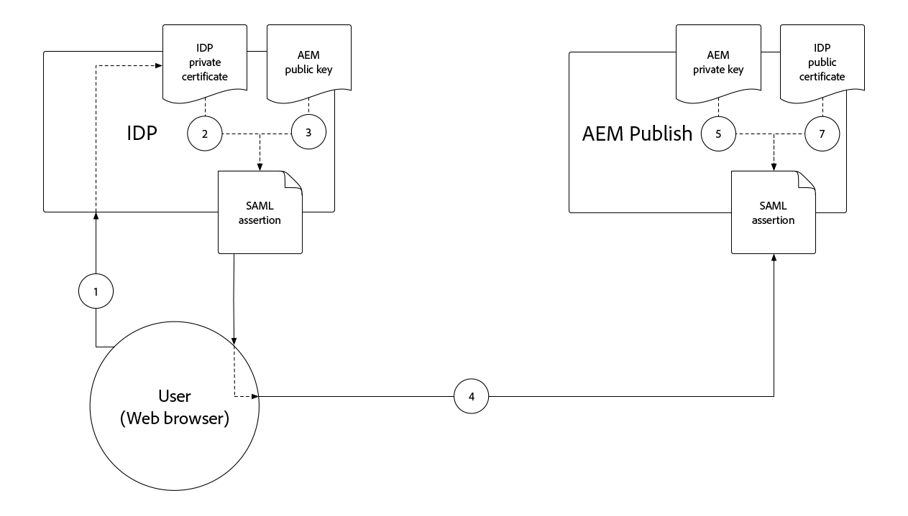
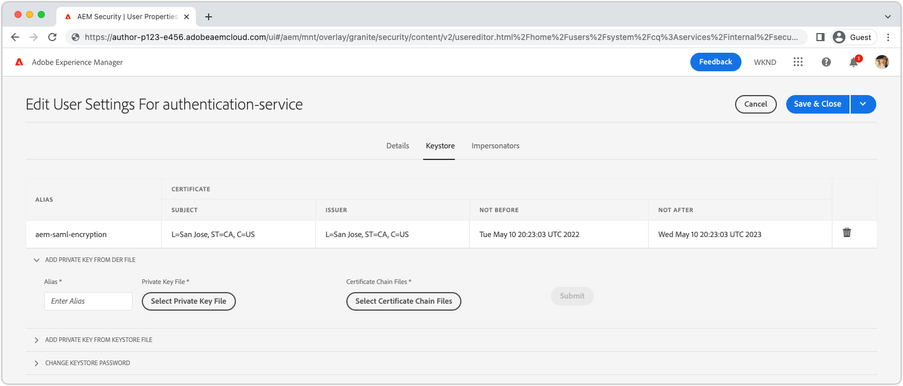

# Autenticazione SAML 2.0

Scopri come configurare e autenticare gli utenti finali (non gli autori dell&#39;AEM) in un IDP compatibile con SAML 2.0 di tua scelta.

L’integrazione di SAML 2.0 con AEM Publish (o Preview), consente agli utenti finali di un’esperienza Web basata su AEM di autenticarsi a un IDP (Identity Provider) non Adobe e di accedere all’AEM come utente autorizzato e designato.

|                       | AEM Author | Pubblicazione AEM |
|-----------------------|:----------:|:-----------:|
| Supporto di SAML 2.0 | ✘ | ✔ |

+++ Comprendere il flusso SAML 2.0 con AEM

Il flusso tipico di un’integrazione AEM Publish SAML è il seguente:

1. L’utente richiede al Publish AEM l’autenticazione indica che è richiesta.
   + L&#39;utente richiede una risorsa protetta CUG/ACL.
   + L&#39;utente richiede una risorsa soggetta a un requisito di autenticazione.
   + L&#39;utente segue un collegamento all&#39;endpoint di accesso AEM (ad esempio `/system/sling/login`) che richiede esplicitamente l&#39;azione di accesso.
1. L’AEM presenta una AuthnRequest all’IDP, richiedendo all’IDP di avviare il processo di autenticazione.
1. L’utente si autentica nell’IDP.
   + All’utente vengono richieste le credenziali dall’IDP.
   + L’utente è già autenticato con l’IDP e non deve fornire ulteriori credenziali.
1. IDP genera un&#39;asserzione SAML contenente i dati dell&#39;utente e la firma utilizzando il certificato privato dell&#39;IDP.
1. IDP invia l’asserzione SAML tramite HTTP POST, tramite il browser web dell’utente (RESPECTIVE_PROTECTED_PATH/saml_login), ad AEM Publish.
1. AEM Publish riceve l’asserzione SAML e ne convalida l’integrità e l’autenticità utilizzando il certificato pubblico IDP.
1. AEM Publish gestisce il record utente di AEM in base alla configurazione OSGi SAML 2.0 e al contenuto dell’asserzione SAML.
   + Crea utente
   + Sincronizza gli attributi utente
   + Aggiornamenti dell’iscrizione al gruppo di utenti AEM
1. Il Publish AEM imposta il cookie AEM `login-token` nella risposta HTTP, che viene utilizzato per autenticare le richieste successive al Publish AEM.
1. AEM Publish reindirizza l&#39;utente all&#39;URL in AEM Publish come specificato dal cookie `saml_request_path`.

+++

## Procedura dettagliata della configurazione

>[!VIDEO](https://video.tv.adobe.com/v/343040?quality=12&learn=on)

Questo video illustra come configurare l’integrazione SAML 2.0 con il servizio AEM as a Cloud Service Publish e utilizzare Okta come IDP.

## Prerequisiti

Per configurare l’autenticazione SAML 2.0 sono necessari i seguenti elementi:

+ Accesso di Responsabile dell’implementazione a Cloud Manager
+ Accesso amministratore AEM all’ambiente AEM as a Cloud Service
+ Accesso amministratore all&#39;IDP
+ Facoltativamente, accesso a una coppia di chiavi pubblica/privata utilizzata per crittografare i payload SAML
+ Pagine AEM Sites (o strutture di pagina), pubblicate in AEM Publish e [protette da gruppi di utenti chiusi (CUG)](https://experienceleague.adobe.com/en/docs/experience-manager-cloud-service/content/sites/authoring/sites-console/page-properties#permissions)

SAML 2.0 è supportato solo per autenticare gli utilizzi in AEM Publish o Preview. Per gestire l&#39;autenticazione dell&#39;autore dell&#39;AEM tramite e IDP, [integra l&#39;IDP con Adobe IMS](https://helpx.adobe.com/it/enterprise/using/set-up-identity.html).

### Supporto del servizio AEM as a Cloud Service Preview

SAML 2.0 è supportato su AEM come Cloud Service, inclusa AEM Preview. Tuttavia, le configurazioni SAML dell&#39;AEM si basano sulle configurazioni OSGi e sia l&#39;anteprima AEM che l&#39;AEM Publish condividono la stessa risoluzione della modalità di esecuzione OSGi (`config.publish`). Di conseguenza, non è possibile creare file di configurazioni SAML separati per Preview e Publish.

Utilizza invece [valori di configurazione specifici dell&#39;ambiente](https://experienceleague.adobe.com/en/docs/experience-manager-cloud-service/content/implementing/deploying/configuring-osgi#environment-specific-configuration-values) nelle configurazioni OSGi e [imposta i valori di variabile appropriati](https://experienceleague.adobe.com/en/docs/experience-manager-cloud-service/content/implementing/deploying/configuring-osgi#cloud-manager-api-format-for-setting-properties) per gli ambienti di anteprima e pubblicazione.

## Installare il certificato pubblico IDP su AEM

Il certificato pubblico dell&#39;IDP viene aggiunto all&#39;archivio fonti attendibili globale di AEM e utilizzato per convalidare la validità dell&#39;asserzione SAML inviata dall&#39;IDP.

+++Flusso di firma dell&#39;asserzione SAML


1. L&#39;utente si autentica in IDP.
1. IDP genera un&#39;asserzione SAML contenente i dati dell&#39;utente.
1. IDP firma l&#39;asserzione SAML utilizzando il certificato privato dell&#39;IDP.
1. IDP avvia un HTTP POST lato client all&#39;endpoint SAML di AEM Publish (`.../saml_login`) che include l&#39;asserzione SAML firmata.
1. AEM Publish riceve il POST HTTP contenente l’asserzione SAML firmata; può convalidare la firma utilizzando il certificato pubblico IDP.

+++


1. Ottieni il file del __certificato pubblico__ dall&#39;IDP. Questo certificato consente ad AEM di convalidare l’asserzione SAML fornita ad AEM dall’IDP.

   Il certificato è in formato PEM e deve essere simile al seguente:

   ```
   -----BEGIN CERTIFICATE-----
   MIIC4jCBAcoCCQC33wnybT5QZDANBgkqhkiG9w0BAQsFADAyMQswCQYDVQQGEwJV
   ...
   m0eo2USlSRTVl7QHRTuiuSThHpLKQQ==
   -----END CERTIFICATE-----
   ```

1. Accedi ad AEM Author come amministratore di AEM.
1. Passa a __Strumenti > Sicurezza > Archivio attendibile__.
1. Crea o apri l&#39;archivio fonti attendibili globale. In caso di creazione di un Global Trust Store, memorizzare la password in un luogo sicuro.
1. Espandere __Aggiungi certificato dal file CER__.
1. Selezionare __Seleziona file certificato__ e caricare il file del certificato fornito dall&#39;IDP.
1. Lasciare vuoto __Mappa certificato all&#39;utente__.
1. Seleziona __Invia__.
1. Il certificato appena aggiunto viene visualizzato sopra la sezione __Aggiungi certificato da file CRT__.
1. Prendere nota dell&#39;__alias__, poiché questo valore viene utilizzato nella configurazione OSGi del gestore di autenticazione [SAML 2.0](#saml-2-0-authentication-handler-osgi-configuration).
1. Seleziona __Salva e chiudi__.

L&#39;archivio protetto globale è configurato con il certificato pubblico dell&#39;IDP sull&#39;autore dell&#39;AEM, ma poiché SAML viene utilizzato solo su AEM Publish, l&#39;archivio protetto globale deve essere replicato sull&#39;AEM Publish affinché il certificato pubblico dell&#39;IDP sia accessibile lì.


1. Seleziona __Strumenti > Distribuzione > Pacchetti__.
1. Creare un pacchetto
   + Nome pacchetto: `Global Trust Store`
   + Versione: `1.0.0`
   + Gruppo: `com.your.company`
1. Modifica il nuovo pacchetto __Archivio attendibile globale__.
1. Selezionare la scheda __Filtri__ e aggiungere un filtro per il percorso radice `/etc/truststore`.
1. Seleziona __Fine__ e quindi __Salva__.
1. Selezionare il pulsante __Build__ per il pacchetto __Global Trust Store__.
1. Una volta creato, selezionare __Altro__ > __Replica__ per attivare il nodo Archivio attendibile globale (`/etc/truststore`) nel Publish AEM.

## Crea keystore del servizio di autenticazione{#authentication-service-keystore}

_La creazione di un archivio chiavi per il servizio di autenticazione è necessaria quando la proprietà di configurazione OSGi [&#x200B; del gestore di autenticazione `handleLogout`SAML 2.0 è impostata su `true`](#saml-20-authenticationsaml-2-0-authentication) o quando è richiesta la [firma AuthnRequest/la crittografia dell&#39;asserzione SAML](#install-aem-public-private-key-pair)_

1. Accedi ad AEM Author come amministratore di AEM per caricare la chiave privata.
1. Passa a __Strumenti > Protezione > Utenti__, seleziona l&#39;utente __authentication-service__ e seleziona __Proprietà__ dalla barra delle azioni superiore.
1. Selezionare la scheda __Registro chiavi__.
1. Crea o apri il keystore. Se crei un keystore, proteggi la password.
   + Un keystore [pubblico/privato è installato in questo keystore](#install-aem-public-private-key-pair) solo se è richiesta la firma AuthnRequest/la crittografia dell&#39;asserzione SAML.
   + Se questa integrazione SAML supporta la disconnessione, ma non l’asserzione AuthnRequest signing/SAML, è sufficiente un keystore vuoto.
1. Seleziona __Salva e chiudi__.
1. Crea un pacchetto contenente l&#39;utente __authentication-service__ aggiornato.

   _Utilizza la seguente soluzione alternativa temporanea utilizzando i pacchetti :_

   1. Passa a __Strumenti > Distribuzione > Pacchetti__.
   1. Creare un pacchetto
      + Nome pacchetto: `Authentication Service`
      + Versione: `1.0.0`
      + Gruppo: `com.your.company`
   1. Modifica il nuovo pacchetto __Archivio chiavi del servizio di autenticazione__.
   1. Selezionare la scheda __Filtri__ e aggiungere un filtro per il percorso radice `/home/users/system/cq:services/internal/security/<AUTHENTICATION SERVICE UUID>/keystore`.
      + È possibile trovare `<AUTHENTICATION SERVICE UUID>` scegliendo __Strumenti > Protezione > Utenti__ e selezionando __utente del servizio di autenticazione__. L’UUID è l’ultima parte dell’URL.
   1. Seleziona __Fine__ e quindi __Salva__.
   1. Selezionare il pulsante __Build__ per il pacchetto __Authentication Service Key Store__.
   1. Una volta creato, seleziona __Altro__ > __Replica__ per attivare l&#39;archivio chiavi del servizio di autenticazione nel Publish AEM.

## Installa coppia di chiavi pubblica/privata AEM{#install-aem-public-private-key-pair}

_L&#39;installazione della coppia di chiavi pubblica/privata di AEM è facoltativa_

AEM Publish può essere configurato per firmare le richieste di authoring (a IDP) e crittografare le asserzioni SAML (ad AEM). Ciò si ottiene fornendo una chiave privata ad AEM Publish, che corrisponde alla chiave pubblica dell&#39;IDP.

+++ Comprendere il flusso di firma AuthnRequest (facoltativo)

AuthnRequest (la richiesta all&#39;IDP da AEM Publish che avvia il processo di accesso) può essere firmata da AEM Publish. A questo scopo, AEM Publish firma la AuthnRequest utilizzando la chiave privata, in modo che l’IDP convalidi la firma utilizzando la chiave pubblica. In questo modo si garantisce all’IDP che AuthnRequest è stato avviato e richiesto da AEM Publish e non a una terza parte dannosa.


1. L’utente invia una richiesta HTTP ad AEM Publish che restituisce una richiesta di autenticazione SAML all’IDP.
1. AEM Publish genera la richiesta SAML da inviare all&#39;IDP.
1. AEM Publish firma la richiesta SAML utilizzando la chiave privata di AEM.
1. AEM Publish avvia AuthnRequest, un reindirizzamento HTTP lato client all&#39;IDP contenente la richiesta SAML firmata.
1. IDP riceve la AuthnRequest e convalida la firma utilizzando la chiave pubblica di AEM, garantendo che AEM Publish abbia avviato la AuthnRequest.
1. AEM Publish convalida quindi l’integrità e l’autenticità dell’asserzione SAML decrittografata utilizzando il certificato pubblico IDP.

+++

+++ Comprendere il flusso di crittografia dell’asserzione SAML (facoltativo)

Tutte le comunicazioni HTTP tra IDP e AEM Publish devono essere effettuate tramite HTTPS e quindi protette per impostazione predefinita. Tuttavia, come richiesto, le asserzioni SAML possono essere crittografate nel caso in cui sia richiesta ulteriore riservatezza oltre a quella fornita da HTTPS. A questo scopo, l’IDP crittografa i dati dell’asserzione SAML utilizzando la chiave privata e AEM Publish decrittografa l’asserzione SAML utilizzando la chiave privata.



1. L’utente si autentica nell’IDP.
1. IDP genera un&#39;asserzione SAML contenente i dati dell&#39;utente e li firma utilizzando il certificato privato dell&#39;IDP.
1. L’IDP quindi crittografa l’asserzione SAML con la chiave pubblica dell’AEM, che richiede la chiave privata dell’AEM per la decrittografia.
1. L’asserzione SAML crittografata viene inviata tramite il browser web dell’utente ad AEM Publish.
1. AEM Publish riceve l’asserzione SAML e la decrittografa utilizzando la chiave privata di AEM.
1. IDP richiede all&#39;utente di eseguire l&#39;autenticazione.

+++

Sia la firma di AuthnRequest che la crittografia delle asserzioni SAML sono facoltative, tuttavia entrambe sono abilitate, utilizzando la proprietà di configurazione OSGi [&#x200B; del gestore di autenticazione `useEncryption`](#saml-20-authenticationsaml-2-0-authentication)SAML 2.0, che indica che è possibile utilizzare entrambe le proprietà o nessuna delle due.



1. Ottenere la chiave pubblica, la chiave privata (PKCS#8 in formato DER) e il file della catena di certificati (potrebbe essere la chiave pubblica) utilizzati per firmare la richiesta di autenticazione e cifrare l&#39;asserzione SAML. Le chiavi vengono in genere fornite dal team di sicurezza dell&#39;organizzazione IT.

   + È possibile generare una coppia di chiavi autofirmate utilizzando __openssl__:

   ```
   $ openssl req -x509 -sha256 -days 365 -newkey rsa:4096 -keyout aem-private.key -out aem-public.crt
   
   # Provide a password (keep in safe place), and other requested certificate information
   
   # Convert the keys to AEM's required format 
   $ openssl rsa -in aem-private.key -outform der -out aem-private.der
   $ openssl pkcs8 -topk8 -inform der -nocrypt -in aem-private.der -outform der -out aem-private-pkcs8.der
   ```

1. Carica la chiave pubblica nell&#39;IDP.
   + Utilizzando il metodo `openssl` precedente, la chiave pubblica è il file `aem-public.crt`.
1. Accedi all’Autore AEM come Amministratore AEM per caricare la chiave privata.
1. Passa a __Strumenti > Sicurezza > Archivio attendibile__, seleziona l’utente __authentication-service__ e seleziona __Proprietà__ dalla barra delle azioni superiore.
1. Passa a __Strumenti > Sicurezza > Utenti__, seleziona l’utente __authentication-service__ e seleziona __Proprietà__ dalla barra delle azioni superiore.
1. Selezionare la scheda __Keystore__.
1. Crea o apri il keystore. Se si crea un keystore, mantenere la password al sicuro.
1. Selezionare __Aggiungi chiave privata dal file DER__ e aggiungere la chiave privata e il file della catena all&#39;AEM:
   + __Alias__: fornisci un nome significativo, spesso il nome dell&#39;IDP.
   + __File di chiave privata__: caricare il file di chiave privata (PKCS#8 in formato DER).
      + Utilizzando il metodo `openssl` precedente, questo è il file `aem-private-pkcs8.der`
   + __Selezionare il file della catena di certificati__: caricare il file della catena associato (potrebbe essere la chiave pubblica).
      + Utilizzando il metodo `openssl`, si tratta del file `aem-public.crt`
   + Seleziona __Invia__
1. Il certificato appena aggiunto viene visualizzato sopra la sezione __Aggiungi certificato dal file CRT__.
   + Prendere nota dell&#39;__alias__ utilizzato nella configurazione OSGi del gestore di autenticazione [SAML 2.0](#saml-20-authentication-handler-osgi-configuration)
1. Seleziona __Salva e chiudi__.
1. Crea un pacchetto contenente l&#39;utente __authentication-service__ aggiornato.

   _Utilizza la seguente soluzione alternativa temporanea utilizzando i pacchetti :_

   1. Passa a __Strumenti > Distribuzione > Pacchetti__.
   1. Creare un pacchetto
      + Nome pacchetto: `Authentication Service`
      + Versione: `1.0.0`
      + Gruppo: `com.your.company`
   1. Modifica il nuovo pacchetto __Archivio chiavi del servizio di autenticazione__.
   1. Selezionare la scheda __Filtri__ e aggiungere un filtro per il percorso radice `/home/users/system/cq:services/internal/security/<AUTHENTICATION SERVICE UUID>/keystore`.
      + Per trovare `<AUTHENTICATION SERVICE UUID>`, passa a __Strumenti > Protezione > Utenti__ e seleziona l&#39;utente __authentication-service__. L’UUID è l’ultima parte dell’URL.
   1. Seleziona __Fine__ e quindi __Salva__.
   1. Selezionare il pulsante __Build__ per il pacchetto __Authentication Service Key Store__.
   1. Una volta creato, seleziona __Altro__ > __Replica__ per attivare l&#39;archivio chiavi del servizio di autenticazione nel Publish AEM.

## Configurazione del gestore di autenticazione SAML 2.0{#configure-saml-2-0-authentication-handler}

La configurazione SAML AEM viene eseguita tramite la configurazione OSGi di __Adobe Granite SAML 2.0 Authentication Handler__.
La configurazione è una configurazione di fabbrica OSGi, il che significa che un singolo servizio di pubblicazione AEM as a Cloud Service può avere più strutture di risorse discrete di copertura della configurazione SAML dell’archivio; questo è utile per le distribuzioni AEM multisito.

+++ Glossario della configurazione OSGi del gestore autenticazione SAML 2.0

### Configurazione OSGi del gestore autenticazione Adobe Granite SAML 2.0{#configure-saml-2-0-authentication-handler-osgi-configuration}

|                                   | Proprietà OSGi | Obbligatorio | Formato del valore | Valore predefinito | Descrizione |
|-----------------------------------|-------------------------------|:--------:|:---------------------:|---------------------------|-------------|
| Percorsi | `path` | ✔ | Array di stringhe | `/` | Percorsi AEM per i quali viene utilizzato questo gestore di autenticazione. |
| URL IDP | `idpUrl` | ✔ | Stringa |                           | URL IDP viene inviata la richiesta di autenticazione SAML. |
| Alias certificato IDP | `idpCertAlias` | ✔ | Stringa |                           | Alias del certificato IDP trovato nell&#39;archivio fonti attendibili globali di AEM |
| Reindirizzamento HTTP IDP | `idpHttpRedirect` | ✘ | Booleano | `false` | Indica se un reindirizzamento HTTP all&#39;URL IDP anziché inviare una AuthnRequest. Imposta su `true` per l&#39;autenticazione avviata da IDP. |
| Identificatore IDP | `idpIdentifier` | ✘ | Stringa |                           | ID IDP univoco per garantire l’univocità di utenti e gruppi di AEM. Se vuoto, viene utilizzato `serviceProviderEntityId`. |
| URL servizio consumer di asserzione | `assertionConsumerServiceURL` | ✘ | Stringa |                           | Attributo URL `AssertionConsumerServiceURL` in AuthnRequest che specifica dove inviare il messaggio `<Response>` ad AEM. |
| ID entità SP | `serviceProviderEntityId` | ✔ | Stringa |                           | Identifica in modo univoco AEM nell’IDP; di solito il nome host di AEM. |
| Crittografia SP | `useEncryption` | ✘ | Booleano | `true` | Indica se l’IDP crittografa le asserzioni SAML. Richiede `spPrivateKeyAlias` e `keyStorePassword` per essere impostati. |
| Alias chiave privata SP | `spPrivateKeyAlias` | ✘ | Stringa |                           | Alias della chiave privata nell&#39;archivio chiavi dell&#39;utente `authentication-service`. Richiesto se `useEncryption` è impostato su `true`. |
| Password archivio chiavi SP | `keyStorePassword` | ✘ | Stringa |                           | Password dell&#39;archivio chiavi dell&#39;utente &#39;authentication-service&#39;. Richiesto se `useEncryption` è impostato su `true`. |
| Reindirizzamento predefinito | `defaultRedirectUrl` | ✘ | Stringa | `/` | URL di reindirizzamento predefinito dopo l&#39;autenticazione riuscita. Può essere relativo all&#39;host AEM, ad esempio `/content/wknd/us/en/html`. |
| Attributo ID utente | `userIDAttribute` | ✘ | Stringa | `uid` | Nome dell’attributo di asserzione SAML contenente l’ID utente dell’utente AEM. Lascia vuoto per usare `Subject:NameId`. |
| Creazione automatica di utenti AEM | `createUser` | ✘ | Booleano | `true` | Indica se gli utenti di AEM vengono creati in caso di autenticazione riuscita. |
| Percorso intermedio per utenti AEM | `userIntermediatePath` | ✘ | Stringa |                           | Durante la creazione di utenti AEM, questo valore viene utilizzato come percorso intermedio (ad esempio, `/home/users/<userIntermediatePath>/jane@wknd.com`). Richiede `createUser` per essere impostato su `true`. |
| Attributi utente di AEM | `synchronizeAttributes` | ✘ | Array di stringhe |                           | Elenco dei mapping di attributi SAML da archiviare nell&#39;utente AEM nel formato `[ "saml-attribute-name=path/relative/to/user/node" ]` (ad esempio `[ "firstName=profile/givenName" ]`). Consulta l&#39;[elenco completo degli attributi nativi di AEM](#aem-user-attributes). |
| Aggiungere un utente a un gruppo AEM | `addGroupMemberships` | ✘ | Booleano | `true` | Indica se un utente AEM viene aggiunto automaticamente ai gruppi di utenti AEM dopo l’autenticazione riuscita. |
| Attributo di iscrizione al gruppo AEM | `groupMembershipAttribute` | ✘ | Stringa | `groupMembership` | Nome dell’attributo di asserzione SAML contenente un elenco di gruppi di utenti AEM a cui l’utente deve essere aggiunto. Richiede `addGroupMemberships` per essere impostato su `true`. |
| Gruppi predefiniti di AEM | `defaultGroups` | ✘ | Array di stringhe |                           | Un elenco di gruppi di utenti autenticati di AEM viene sempre aggiunto a (ad esempio, `[ "wknd-user" ]`). Richiede `addGroupMemberships` per essere impostato su `true`. |
| Formato NameIDPolicy | `nameIdFormat` | ✘ | Stringa | `urn:oasis:names:tc:SAML:2.0:nameid-format:transient` | Valore del parametro di formato NameIDPolicy da inviare al messaggio AuthnRequest. |
| Memorizza risposta SAML | `storeSAMLResponse` | ✘ | Booleano | `false` | Indica se il valore `samlResponse` è archiviato nel nodo AEM `cq:User`. |
| Gestisci disconnessione | `handleLogout` | ✘ | Booleano | `false` | Indica se la richiesta di disconnessione è gestita da questo gestore di autenticazione SAML. Richiede `logoutUrl` per essere impostato. |
| URL disconnessione | `logoutUrl` | ✘ | Stringa |                           | URL di IDP a cui viene inviata la richiesta di disconnessione SAML. Richiesto se `handleLogout` è impostato su `true`. |
| Tolleranza orologio | `clockTolerance` | ✘ | Numero intero | `60` | La tolleranza di sfasamento dell’orologio IDP e AEM (SP) durante la convalida delle asserzioni SAML. |
| Metodo digest | `digestMethod` | ✘ | Stringa | `http://www.w3.org/2001/04/xmlenc#sha256` | Algoritmo di digest utilizzato dall&#39;IDP per firmare un messaggio SAML. |
| Metodo di firma | `signatureMethod` | ✘ | Stringa | `http://www.w3.org/2001/04/xmldsig-more#rsa-sha256` | Algoritmo di firma utilizzato dall&#39;IDP per firmare un messaggio SAML. |
| Tipo di sincronizzazione identità | `identitySyncType` | ✘ | `default` oppure `idp` | `default` | Non modificare il valore predefinito di `from` per AEM as a Cloud Service. |
| Classificazione del servizio | `service.ranking` | ✘ | Numero intero | `5002` | Configurazioni di classificazione superiori sono preferite per lo stesso `path`. |

### Attributi utente AEM{#aem-user-attributes}

AEM utilizza i seguenti attributi utente, che possono essere compilati tramite la proprietà `synchronizeAttributes` nella configurazione OSGi del gestore di autenticazione SAML 2.0 di Adobe Granite.  Qualsiasi attributo IDP può essere sincronizzato con qualsiasi proprietà utente AEM, tuttavia l&#39;associazione alle proprietà dell&#39;attributo d&#39;uso AEM (elencate di seguito) consente all&#39;AEM di utilizzarle in modo naturale.

| Attributo utente | Percorso proprietà relativa dal nodo `rep:User` |
|--------------------------------|--------------------------|
| Titolo (ad esempio, `Mrs`) | `profile/title` |
| Nome (ossia nome) | `profile/givenName` |
| Cognome (ad esempio cognome) | `profile/familyName` |
| Titolo professionale | `profile/jobTitle` |
| Indirizzo e-mail | `profile/email` |
| Indirizzo | `profile/street` |
| Città | `profile/city` |
| Codice postale | `profile/postalCode` |
| Paese | `profile/country` |
| Numero di telefono | `profile/phoneNumber` |
| Informazioni su di me | `profile/aboutMe` |

+++

1. Crea un file di configurazione OSGi nel progetto in `/ui.config/src/main/content/jcr_root/wknd-examples/osgiconfig/config.publish/com.adobe.granite.auth.saml.SamlAuthenticationHandler~saml.cfg.json` e aprilo nell&#39;IDE.
   + Cambia `/wknd-examples/` in `/<project name>/`
   + L&#39;identificatore dopo `~` nel nome file deve identificare in modo univoco questa configurazione, quindi potrebbe essere il nome dell&#39;IDP, ad esempio `...~okta.cfg.json`. Il valore deve essere alfanumerico con trattini.
1. Incolla il seguente JSON nel file `com.adobe.granite.auth.saml.SamlAuthenticationHandler~...cfg.json` e aggiorna i riferimenti `wknd` in base alle esigenze.

   ```json
   {
       "path": [ "/content/wknd", "/content/dam/wknd" ], 
       "idpCertAlias": "$[env:SAML_IDP_CERT_ALIAS;default=certalias___1652125559800]",
       "idpIdentifier": "$[env:SAML_IDP_ID;default=http://www.okta.com/exk4z55r44Jz9C6am5d7]",
       "idpUrl": "$[env:SAML_IDP_URL;default=https://dev-5511372.okta.com/app/dev-5511372_aemasacloudservice_1/exk4z55r44Jz9C6am5d7/sso/saml]",
       "serviceProviderEntityId": "$[env:SAML_AEM_ID;default=https://publish-p123-e456.adobeaemcloud.com]",
       "useEncryption": false,
       "createUser": true,
       "userIntermediatePath": "wknd/idp",
       "synchronizeAttributes":[
           "firstName=profile/givenName"
       ],
       "addGroupMemberships": true,
       "defaultGroups": [ 
           "wknd-users"
       ]
   }
   ```

1. Aggiorna i valori come richiesto dal progetto. Per le descrizioni delle proprietà di configurazione, vedi il glossario di configurazione OSGi __Gestore autenticazione SAML 2.0__ sopra. `path` deve contenere le strutture del contenuto protette da gruppi di utenti chiusi (CUG) e richiedere l&#39;autenticazione. Questo gestore di autenticazione deve essere responsabile della protezione.
1. Si consiglia, ma non è obbligatorio, di utilizzare le variabili di ambiente e i segreti OSGi, quando i valori potrebbero non essere sincronizzati con il ciclo di rilascio o quando i valori differiscono tra tipi di ambiente/livelli di servizio simili. I valori predefiniti possono essere impostati utilizzando la sintassi `$[env:..;default=the-default-value]"` come mostrato sopra.

Le configurazioni OSGi per ambiente (`config.publish.dev`, `config.publish.stage` e `config.publish.prod`) possono essere definite con attributi specifici se la configurazione SAML varia da un ambiente all&#39;altro.

### Usa crittografia

Quando [si crittografano le asserzioni AuthnRequest e SAML](#encrypting-the-authnrequest-and-saml-assertion), sono necessarie le seguenti proprietà: `useEncryption`, `spPrivateKeyAlias` e `keyStorePassword`. `keyStorePassword` contiene una password, pertanto il valore non deve essere archiviato nel file di configurazione OSGi, ma inserito utilizzando [valori di configurazione segreti](https://experienceleague.adobe.com/docs/experience-manager-cloud-service/content/implementing/deploying/configuring-osgi.html?lang=it#secret-configuration-values)

+++Se necessario, aggiorna la configurazione OSGi per utilizzare la crittografia

1. Apri `/ui.config/src/main/content/jcr_root/wknd-examples/osgiconfig/config.publish/com.adobe.granite.auth.saml.SamlAuthenticationHandler~saml.cfg.json` nell&#39;IDE.
1. Aggiungere le tre proprietà `useEncryption`, `spPrivateKeyAlias` e `keyStorePassword` come illustrato di seguito.

   ```json
   {
   "path": [ "/content/wknd", "/content/dam/wknd" ], 
   "idpCertAlias": "$[env:SAML_IDP_CERT_ALIAS;default=certalias___1234567890]",
   "idpIdentifier": "$[env:SAML_IDP_ID;default=http://www.okta.com/abcdef1235678]",
   "idpUrl": "$[env:SAML_IDP_URL;default=https://dev-5511372.okta.com/app/dev-123567890_aemasacloudservice_1/abcdef1235678/sso/saml]",
   "serviceProviderEntityId": "$[env:SAML_AEM_ID;default=https://publish-p123-e456.adobeaemcloud.com]",
   "useEncryption": true,
   "spPrivateKeyAlias": "$[env:SAML_AEM_KEYSTORE_ALIAS;default=aem-saml-encryption]",
   "keyStorePassword": "$[secret:SAML_AEM_KEYSTORE_PASSWORD]",
   "createUser": true,
   "userIntermediatePath": "wknd/idp"
   "synchronizeAttributes":[
       "firstName=profile/givenName"
   ],
   "addGroupMemberships": true,
   "defaultGroups": [ 
       "wknd-users"
   ]
   }
   ```

1. Le tre proprietà di configurazione OSGi necessarie per la crittografia sono:

+ `useEncryption` impostato su `true`
+ `spPrivateKeyAlias` contiene l&#39;alias della voce keystore per la chiave privata utilizzata dall&#39;integrazione SAML.
+ `keyStorePassword` contiene una [variabile di configurazione segreta OSGi](https://experienceleague.adobe.com/docs/experience-manager-cloud-service/content/implementing/deploying/configuring-osgi.html?lang=it#secret-configuration-values) contenente la password del keystore utente `authentication-service`.

+++

## Configura filtro Referrer

Durante il processo di autenticazione SAML, l&#39;IDP avvia un HTTP POST lato client all&#39;endpoint `.../saml_login` di AEM Publish. Se l&#39;IDP e la pubblicazione AEM esistono in un&#39;origine diversa, il __filtro referrer__ di AEM Publish viene configurato tramite la configurazione OSGi per consentire i POST HTTP dall&#39;origine dell&#39;IDP.

1. Crea (o modifica) un file di configurazione OSGi nel progetto in `/ui.config/src/main/content/jcr_root/wknd-examples/osgiconfig/config.publish/org.apache.sling.security.impl.ReferrerFilter.cfg.json`.
   + Cambia `/wknd-examples/` in `/<project name>/`
1. Verificare che il valore `allow.empty` sia impostato su `true`, che `allow.hosts` (o se si preferisce, `allow.hosts.regexp`) contenga l&#39;origine dell&#39;IDP e che `filter.methods` includa `POST`. La configurazione OSGi deve essere simile a:

   ```json
   {
       "allow.empty": true,
       "allow.hosts.regexp": [ ],
       "allow.hosts": [ 
           "$[env:SAML_IDP_REFERRER;default=dev-123567890.okta.com]"
       ],
       "filter.methods": [
           "POST",
       ],
       "exclude.agents.regexp": [ ]
   }
   ```

AEM Publish supporta una singola configurazione del filtro Referrer, in modo da unire i requisiti di configurazione SAML con eventuali configurazioni esistenti.

Le configurazioni OSGi per ambiente (`config.publish.dev`, `config.publish.stage` e `config.publish.prod`) possono essere definite con attributi specifici se `allow.hosts` (o `allow.hosts.regex`) variano da un ambiente all&#39;altro.

## Configurare la condivisione CORS (Cross-Origin Resource Sharing)

Durante il processo di autenticazione SAML, l&#39;IDP avvia un HTTP POST lato client all&#39;endpoint `.../saml_login` di AEM Publish. Se l&#39;IDP e il Publish AEM esistono su host/domini diversi, è necessario configurare __CORS-Origin Resource Sharing (CORS)__ di AEM Publish per consentire POST HTTP dall&#39;host/dominio dell&#39;IDP.

L&#39;intestazione `Origin` di questa richiesta HTTP POST in genere ha un valore diverso rispetto all&#39;host AEM Publish, pertanto è necessaria la configurazione CORS.

Durante il test dell&#39;autenticazione SAML sul SDK AEM locale (`localhost:4503`), l&#39;IDP può impostare l&#39;intestazione `Origin` su `null`. In tal caso, aggiungere `"null"` all&#39;elenco `alloworigin`.

1. Crea un file di configurazione OSGi nel progetto in `/ui.config/src/main/content/jcr_root/wknd-examples/osgiconfig/config.publish/com.adobe.granite.cors.impl.CORSPolicyImpl~saml.cfg.json`
   + Cambia `/wknd-examples/` con il nome del progetto
   + L&#39;identificatore dopo `~` nel nome file deve identificare in modo univoco questa configurazione, quindi potrebbe essere il nome dell&#39;IDP, ad esempio `...CORSPolicyImpl~okta.cfg.json`. Il valore deve essere alfanumerico con trattini.
1. Incolla il seguente JSON nel file `com.adobe.granite.cors.impl.CORSPolicyImpl~...cfg.json`.

```json
{
    "alloworigin": [ 
        "$[env:SAML_IDP_ORIGIN;default=https://dev-1234567890.okta.com]", 
        "null"
    ],
    "allowedpaths": [ 
        ".*/saml_login"
    ],
    "supportedmethods": [ 
        "POST"
    ]
}
```

Le configurazioni OSGi per ambiente (`config.publish.dev`, `config.publish.stage` e `config.publish.prod`) possono essere definite con attributi specifici se `alloworigin` e `allowedpaths` variano da un ambiente all&#39;altro.

## Configura AEM Dispatcher per consentire SAML HTTP POST

Dopo aver eseguito correttamente l&#39;autenticazione nell&#39;IDP, l&#39;IDP orchestrerà un POST HTTP per tornare all&#39;endpoint `/saml_login` registrato di AEM (configurato nell&#39;IDP). Questo HTTP POST a `/saml_login` è bloccato per impostazione predefinita in Dispatcher, pertanto deve essere consentito esplicitamente utilizzando la seguente regola di Dispatcher:

1. Apri `dispatcher/src/conf.dispatcher.d/filters/filters.any` nell&#39;IDE.
1. Aggiungere nella parte inferiore del file una regola Consenti per i POST HTTP agli URL che terminano con `/saml_login`.

```
...

# Allow SAML HTTP POST to ../saml_login end points
/0190 { /type "allow" /method "POST" /url "*/saml_login" }
```

>[!NOTE]
>Quando distribuisci più configurazioni SAML in AEM per vari percorsi protetti ed endpoint IDP distinti, accertati che l’IDP inserisca nell’endpoint RESPECTIVE_PROTECTED_PATH/saml_login per selezionare la configurazione SAML appropriata sul lato AEM. Se sono presenti configurazioni SAML duplicate per lo stesso percorso protetto, la selezione della configurazione SAML verrà eseguita in modo casuale.

Se la riscrittura dell&#39;URL nel server web Apache è configurata (`dispatcher/src/conf.d/rewrites/rewrite.rules`), assicurati che le richieste agli endpoint `.../saml_login` non vengano gestite accidentalmente.

## Appartenenza a gruppi dinamici

L&#39;appartenenza al gruppo dinamico è una funzionalità di [Apache Jackrabbit Oak](https://jackrabbit.apache.org/oak/docs/security/authentication/external/dynamic.html) che aumenta le prestazioni della valutazione e del provisioning del gruppo. Questa sezione descrive come utenti e gruppi vengono memorizzati quando questa funzione è abilitata e come modificare la configurazione del gestore di autenticazione SAML per abilitarlo per ambienti nuovi o esistenti.

### Come abilitare l&#39;iscrizione a gruppi dinamici per gli utenti SAML in nuovi ambienti

Per migliorare in modo significativo le prestazioni di valutazione dei gruppi nei nuovi ambienti AEM come Cloud Service, si consiglia di attivare la funzione di iscrizione dinamica ai gruppi in nuovi ambienti.
Si tratta di un passaggio necessario anche quando viene attivata la sincronizzazione dei dati. Ulteriori dettagli [qui](https://experienceleague.adobe.com/en/docs/experience-manager-cloud-service/content/sites/authoring/personalization/user-and-group-sync-for-publish-tier) .
A tale scopo, aggiungere la seguente proprietà al file di configurazione OSGI:

`/apps/example/osgiconfig/config.publish/com.adobe.granite.auth.saml.SamlAuthenticationHandler~example.cfg.json`

Con questa configurazione, utenti e gruppi vengono creati come [Utenti esterni Oak](https://jackrabbit.apache.org/oak/docs/security/authentication/identitymanagement.html). In AEM, gli utenti e i gruppi esterni dispongono di un `rep:principalName` predefinito composto da `[user name];[idp]` o `[group name];[idp]`.
Tenere presente che gli elenchi di controllo di accesso (ACL) sono associati al nome principale degli utenti o dei gruppi.
Quando si distribuisce questa configurazione in una distribuzione esistente in cui in precedenza `identitySyncType` non era specificato o impostato su `default`, verranno creati nuovi utenti e gruppi e a questi nuovi utenti e gruppi deve essere applicato l&#39;ACL. I gruppi esterni non possono contenere utenti locali. [Repoinit](https://sling.apache.org/documentation/bundles/repository-initialization.html) può essere utilizzato per creare ACL per i gruppi esterni SAML, anche se verranno creati solo quando l&#39;utente eseguirà un accesso.
Per evitare questo refactoring su ACL, è stata implementata una [funzionalità di migrazione](#automatic-migration-to-dynamic-group-membership-for-existing-environments) standard.

### Come archiviare le iscrizioni in gruppi locali ed esterni con appartenenza a gruppi dinamici

Nei gruppi locali i membri del gruppo sono memorizzati nell&#39;attributo oak: `rep:members`. L’attributo contiene l’elenco degli UID di ogni membro del gruppo. Ulteriori dettagli sono disponibili [qui](https://jackrabbit.apache.org/oak/docs/security/user/membership.html#member-representation-in-the-repository).
Esempio:

```
{
  "jcr:primaryType": "rep:Group",
  "rep:principalName": "operators",
  "rep:managedByIdp": "SAML",
  "rep:members": [
    "635afa1c-beeb-3262-83c4-38ea31e5549e",
    "5e496093-feb6-37e9-a2a1-7c87b1cec4b0",
    ...
  ],
   ...
}
```

I gruppi esterni con appartenenza dinamica al gruppo non memorizzano alcun membro nella voce del gruppo.
L&#39;appartenenza al gruppo viene invece memorizzata nelle voci utente. Ulteriori informazioni sono disponibili [qui](https://jackrabbit.apache.org/oak/docs/security/authentication/external/dynamic.html). Ad esempio, questo è il nodo OAK del gruppo:

```
{
  "jcr:primaryType": "rep:Group",
  "jcr:mixinTypes": [
    "rep:AccessControllable"
  ],
  "jcr:createdBy": "",
  "jcr:created": "Tue Jul 16 2024 08:58:47 GMT+0000",
  "rep:principalName": "GROUP_1;aem-saml-idp-1",
  "rep:lastSynced": "Tue Jul 16 2024 08:58:47 GMT+0000",
  "jcr:uuid": "d9c6af8a-35c0-3064-899a-59af55455cd0",
  "rep:externalId": "GROUP_1;aem-saml-idp-1",
  "rep:authorizableId": "GROUP_1;aem-saml-idp-1"
}
```

Questo è il nodo per un membro utente di quel gruppo:

```
{
  "jcr:primaryType": "rep:User",
  "jcr:mixinTypes": [
    "rep:AccessControllable"
  ],
  "surname": "Test",
  "rep:principalName": "testUser",
  "rep:externalId": "test;aem-saml-idp-1",
  "rep:authorizableId": "test",
  "rep:externalPrincipalNames": [
    "projects-users;aem-saml-idp-1",
    "GROUP_2;aem-saml-idp-1",
    "GROUP_1;aem-saml-idp-1",
    "operators;aem-saml-idp-1"
  ],
  ...
}
```

### Come abilitare l&#39;iscrizione a gruppi dinamici per gli utenti SAML negli ambienti esistenti

Come spiegato nella sezione precedente, il formato degli utenti e dei gruppi esterni è leggermente diverso da quello utilizzato per gli utenti e i gruppi locali. È possibile definire un nuovo ACL per i gruppi esterni ed eseguire il provisioning di nuovi utenti esterni, oppure utilizzare lo strumento di migrazione come descritto di seguito.

#### Abilitazione dell’iscrizione dinamica ai gruppi per gli ambienti esistenti con utenti esterni

Il gestore di autenticazione SAML crea utenti esterni quando viene specificata la seguente proprietà: `"identitySyncType": "idp"`. In questo caso, è possibile abilitare l&#39;appartenenza a gruppi dinamici modificando questa proprietà in: `"identitySyncType": "idp_dynamic"`. Nessuna migrazione richiesta.

#### Migrazione automatica all&#39;appartenenza a gruppi dinamici per gli ambienti esistenti con utenti locali

Il gestore di autenticazione SAML crea utenti locali quando viene specificata la seguente proprietà: `"identitySyncType": "default"`. Questo è anche il valore predefinito quando la proprietà non è specificata. In questa sezione vengono descritti i passaggi eseguiti dalla procedura di migrazione automatica.

Quando questa migrazione è abilitata, viene eseguita durante l’autenticazione dell’utente ed è costituita dai seguenti passaggi:
1. L’utente locale viene migrato a un utente esterno mantenendo il nome utente originale. Ciò implica che gli utenti locali migrati, che ora agiscono come utenti esterni, conservino il nome utente originale invece di seguire la sintassi di denominazione indicata nella sezione precedente. Verrà aggiunta una proprietà aggiuntiva denominata: `rep:externalId` con valore `[user name];[idp]`. L&#39;utente `PrincipalName` non è modificato.
2. Per ogni gruppo esterno ricevuto nell&#39;asserzione SAML, viene creato un gruppo esterno. Se esiste un gruppo locale corrispondente, il gruppo esterno viene aggiunto al gruppo locale come membro.
3. L&#39;utente viene aggiunto come membro del gruppo esterno.
4. L’utente locale viene quindi rimosso da tutti i gruppi locali Saml di cui era membro. I gruppi locali Saml sono identificati dalla proprietà OAK: `rep:managedByIdp`. Questa proprietà viene impostata dal gestore di autenticazione Saml quando l&#39;attributo `syncType` non è specificato o è impostato su `default`.

Ad esempio, se prima della migrazione `user1` è un utente locale e un membro del gruppo locale `group1`, dopo la migrazione si verificheranno le seguenti modifiche:
`user1` diventa un utente esterno. Attributo `rep:externalId` aggiunto al suo profilo.
`user1` diventa membro del gruppo esterno: `group1;idp`
`user1` non è più membro diretto del gruppo locale: `group1`
`group1;idp` è membro del gruppo locale: `group1`.
`user1` è quindi membro del gruppo locale: `group1` sebbene ereditarietà

L&#39;appartenenza al gruppo per i gruppi esterni è archiviata nel profilo utente nella proprietà `rep:externalPrincipalNames`

### Come configurare la migrazione automatica all&#39;appartenenza a un gruppo dinamico

1. Abilitare la proprietà `"identitySyncType": "idp_dynamic_simplified_id"` nel file di configurazione OSGi SAML: `com.adobe.granite.auth.saml.SamlAuthenticationHandler~...cfg.json`:
2. Configurare il nuovo servizio OSGi con PID di fabbrica che inizia con: `com.adobe.granite.auth.saml.migration.SamlDynamicGroupMembershipMigration~`. Ad esempio, un PID può essere: `com.adobe.granite.auth.saml.migration.SamlDynamicGroupMembershipMigration~myIdP`. Imposta la seguente proprietà:

```
{
  "idpIdentifier": "<value of IDP Identifier (idpIdentifier)" property from the "com.adobe.granite.auth.saml.SamlAuthenticationHandler" configuration to be migrated>"
}
```

Per migrare più configurazioni SAML, è necessario creare più configurazioni OSGi factory per `com.adobe.granite.auth.saml.migration.SamlDynamicGroupMembershipMigration`, ognuna delle quali specifica un `idpIdentifier` per la migrazione.

## Hook di accesso SAML personalizzati

Per i casi d&#39;uso avanzati, AEM supporta lo sviluppo di hook di accesso SAML personalizzati, ovvero servizi OSGi che implementano l&#39;interfaccia `com.adobe.granite.auth.saml.SamlLoginHook`. Questi hook vengono eseguiti durante il processo di autenticazione SAML e possono essere utilizzati per implementare una logica personalizzata, ad esempio provisioning utente aggiuntivo o registrazione personalizzata.

Per ulteriori informazioni su come sviluppare e registrare un hook di accesso SAML personalizzato, consulta la documentazione [Hook di accesso SAML personalizzato](https://experienceleague.adobe.com/docs/experience-manager-cloud-service/content/implementing/developing/custom-saml-login-hook.html).

## Distribuzione della configurazione SAML

Le configurazioni OSGi devono essere salvate in Git e distribuite in AEM as a Cloud Service utilizzando Cloud Manager.

```
$ git remote -v            
adobe   https://git.cloudmanager.adobe.com/myOrg/myCloudManagerGit/ (fetch)
adobe   https://git.cloudmanager.adobe.com/myOrg/myCloudManagerGit/ (push)
$ git add .
$ git commit -m "SAML 2.0 configurations"
$ git push adobe saml-auth:develop
```

Distribuire il ramo Git Cloud Manager di destinazione (in questo esempio, `develop`) utilizzando una pipeline di distribuzione full stack.

## Richiamare l’autenticazione SAML

Il flusso di autenticazione SAML può essere richiamato da una pagina web del sito AEM creando un collegamento creato appositamente o un pulsante. I parametri descritti di seguito possono essere impostati a livello di programmazione in base alle esigenze. Ad esempio, un pulsante di accesso può impostare `saml_request_path`, ovvero il punto in cui l&#39;utente viene indirizzato dopo l&#39;autenticazione SAML, su pagine AEM diverse, in base al contesto del pulsante.

## Memorizzazione in cache protetta durante l’utilizzo di SAML

Nell’istanza di pubblicazione di AEM, la maggior parte delle pagine viene generalmente memorizzata nella cache. Tuttavia, per i percorsi protetti da SAML, la memorizzazione nella cache deve essere disabilitata o abilitata utilizzando la configurazione auth_checker. Per ulteriori informazioni, fare riferimento ai dettagli forniti [qui](https://experienceleague.adobe.com/it/docs/experience-manager-dispatcher/using/configuring/permissions-cache)

Tieni presente che se memorizzi nella cache i percorsi protetti senza abilitare auth_checker, potresti riscontrare un comportamento imprevedibile.

### richiesta GET

L’autenticazione SAML può essere richiamata creando una richiesta HTTP GET nel formato:

`HTTP GET /system/sling/login`

e fornendo parametri di query:

| Nome parametro query | Valore parametro query |
|----------------------|-----------------------|
| `resource` | Qualsiasi percorso JCR, o percorso secondario, su cui è in ascolto il gestore di autenticazione SAML, come definito nella proprietà [&#x200B; &#x200B;](#configure-saml-2-0-authentication-handler) del gestore di autenticazione OSGi `path`Adobe Granite SAML 2.0 Authentication Handler. |
| `saml_request_path` | Il percorso URL a cui deve essere indirizzato l&#39;utente dopo aver completato l&#39;autenticazione SAML. |

Questo collegamento HTML, ad esempio, attiverà il flusso di accesso SAML e, al termine dell&#39;operazione, porterà l&#39;utente a `/content/wknd/us/en/protected/page.html`. Questi parametri di query possono essere impostati a livello di programmazione in base alle esigenze.

```html
<a href="/system/sling/login?resource=/content/wknd&saml_request_path=/content/wknd/us/en/protected/page.html">
    Log in using SAML
</a>
```

## richiesta POST

L&#39;autenticazione SAML può essere richiamata creando una richiesta HTTP POST nel formato:

`HTTP POST /system/sling/login`

e fornendo i dati del modulo:

| Nome dati modulo | Valore dati modulo |
|----------------------|-----------------------|
| `resource` | Qualsiasi percorso JCR, o sottopercorso, su cui il gestore di autenticazione SAML è in ascolto, come definito nella proprietà [&#x200B; di configurazione OSGi &#x200B;](#configure-saml-2-0-authentication-handler)Adobe Granite SAML 2.0 Authentication Handler `path`. |
| `saml_request_path` | Il percorso URL a cui deve essere indirizzato l&#39;utente dopo aver completato l&#39;autenticazione SAML. |


Questo pulsante HTML, ad esempio, utilizzerà un POST HTTP per attivare il flusso di accesso SAML e, al termine, porterà l&#39;utente a `/content/wknd/us/en/protected/page.html`. Questi parametri dei dati dei moduli possono essere impostati a livello di programmazione in base alle esigenze.

```html
<form action="/system/sling/login" method="POST">
    <input type="hidden" name="resource" value="/content/wknd">
    <input type="hidden" name="saml_request_path" value="/content/wknd/us/en/protected/page.html">
    <input type="submit" value="Log in using SAML">
</form>
```

### Configurazione del Dispatcher

Entrambi i metodi HTTP GET e POST richiedono l&#39;accesso client agli endpoint AEM `/system/sling/login` e pertanto devono essere consentiti tramite Dispatcher AEM.

Consenti i pattern URL necessari in base al caso in cui GET o POST siano in uso

```
# Allow GET-based SAML authentication invocation
/0191 { /type "allow" /method "GET" /url "/system/sling/login" /query "*" }

# Allow POST-based SAML authentication invocation
/0192 { /type "allow" /method "POST" /url "/system/sling/login" }
```
