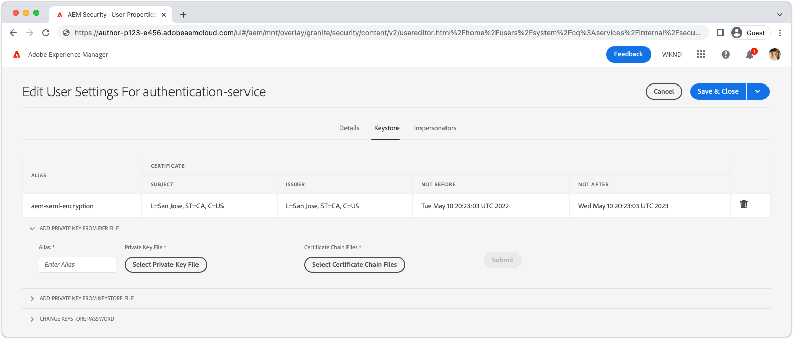

# Autenticazione SAML 2.0{#saml-2-0-authentication}

Scopri come impostare e autenticare gli utenti finali (non autori AEM) in un IDP compatibile con SAML 2.0 a tua scelta.

## Quale SAML per AEM as a Cloud Service?

L’integrazione SAML 2.0 con Pubblicazione (o Anteprima) AEM consente agli utenti finali di un’esperienza web basata su AEM di autenticarsi in un IDP (Identity Provider) non Adobe e di accedere all’AEM come utente autorizzato con nome.

|                       | Autore AEM | AEM Publish |
|-----------------------|:----------:|:-----------:|
| Supporto SAML 2.0 | ✘ | ✔ |

+++ Comprendere il flusso SAML 2.0 con AEM

Il flusso tipico di un’integrazione AEM Publish SAML è il seguente:

1. L’utente invia una richiesta a Pubblicazione AEM dove indica che è necessaria l’autenticazione.
   + L’utente richiede una risorsa protetta da CUG/ACL.
   + L’utente richiede una risorsa soggetta a un requisito di autenticazione.
   + L’utente segue un collegamento all’endpoint di accesso AEM (ad es. `/system/sling/login`) che richiede esplicitamente l’azione di accesso.
1. L’AEM invia una AuthnRequest all’IDP, richiedendo a quest’ultimo di avviare il processo di autenticazione.
1. L&#39;utente si autentica in IDP.
   + L&#39;IDP richiede all&#39;utente le credenziali.
   + L&#39;utente è già autenticato con l&#39;IDP e non deve fornire ulteriori credenziali.
1. IDP genera un&#39;asserzione SAML contenente i dati dell&#39;utente e la firma utilizzando il certificato privato dell&#39;IDP.
1. IDP invia l’asserzione SAML tramite HTTP POST, tramite il browser web dell’utente, a AEM Publish.
1. La pubblicazione AEM riceve l&#39;asserzione SAML e ne convalida l&#39;integrità e l&#39;autenticità utilizzando il certificato pubblico IDP.
1. AEM Publish gestisce il record utente AEM in base alla configurazione OSGi SAML 2.0 e al contenuto della SAML Assertion.
   + Crea utente
   + Sincronizza gli attributi utente
   + Aggiorna l&#39;iscrizione al gruppo di utenti AEM
1. Pubblicazione AEM imposta l&#39;AEM `login-token` cookie nella risposta HTTP, utilizzato per autenticare le richieste successive alla pubblicazione AEM.
1. Pubblicazione AEM reindirizza l’utente all’URL nella pubblicazione AEM come specificato da `saml_request_path` cookie.

+++

## Procedura dettagliata della configurazione

>[!VIDEO](https://video.tv.adobe.com/v/343040?quality=12&learn=on)

Questo video illustra come configurare l’integrazione SAML 2.0 con il servizio di pubblicazione as a Cloud Service dell’AEM e come utilizzare Okta come IDP.

## Prerequisiti

Per configurare l’autenticazione SAML 2.0 sono necessari i seguenti elementi:

+ Accesso a Cloud Manager da parte di Deployment Manager
+ Accesso dell’amministratore AEM all’ambiente as a Cloud Service AEM
+ Accesso amministratore all&#39;IDP
+ Facoltativamente, accesso a una coppia di chiavi pubblica/privata utilizzata per crittografare i payload SAML

SAML 2.0 è supportato solo per l’autenticazione degli utilizzi in Pubblicazione o Anteprima AEM. Per gestire l’autenticazione di AEM Author tramite e IDP, [integrare IDP con Adobe IMS](https://helpx.adobe.com/it/enterprise/using/set-up-identity.html).


## Installare il certificato pubblico IDP su AEM

Il certificato pubblico dell&#39;IDP viene aggiunto all&#39;AEM Global Trust Store e utilizzato per convalidare la validità dell&#39;asserzione SAML inviata dall&#39;IDP.

+++Flusso di firma asserzione SAML


1. L&#39;utente si autentica in IDP.
1. IDP genera un&#39;asserzione SAML contenente i dati dell&#39;utente.
1. IDP firma l&#39;asserzione SAML utilizzando il certificato privato dell&#39;IDP.
1. IDP avvia un POST HTTP lato client per l&#39;endpoint SAML della pubblicazione AEM (`.../saml_login`) che include l&#39;asserzione SAML firmata.
1. La pubblicazione AEM riceve il POST HTTP contenente l&#39;asserzione SAML firmata, può convalidare la firma utilizzando il certificato pubblico IDP.

+++


1. Ottenere il __certificato pubblico__ dall&#39;IDP. Questo certificato consente all&#39;AEM di convalidare l&#39;asserzione SAML fornita all&#39;AEM dall&#39;IDP.

   Il certificato è in formato PEM e deve essere simile al seguente:

   ```
   -----BEGIN CERTIFICATE-----
   MIIC4jCBAcoCCQC33wnybT5QZDANBgkqhkiG9w0BAQsFADAyMQswCQYDVQQGEwJV
   ...
   m0eo2USlSRTVl7QHRTuiuSThHpLKQQ==
   -----END CERTIFICATE-----
   ```

1. Accedi a AEM Author come amministratore AEM.
1. Accedi a __Strumenti > Protezione > Archivio fonti attendibili__.
1. Crea o apri l&#39;archivio fonti attendibili globale. Se si crea un archivio fonti attendibili globale, memorizzare la password in un luogo sicuro.
1. Espandi __Aggiungi certificato da file CER__.
1. Seleziona __Seleziona file di certificato__, e carica il file del certificato fornito dall&#39;IDP.
1. Esci __Mappa certificato a utente__ vuoto.
1. Seleziona __Invia__.
1. Il nuovo certificato aggiunto viene visualizzato sopra il __Aggiungi certificato da file CRT__ sezione.
1. Prendi nota di __alias__, in quanto questo valore viene utilizzato nel [Configurazione OSGi del gestore autenticazione SAML 2.0](#saml-2-0-authentication-handler-osgi-configuration).
1. Seleziona __Salva e chiudi__.

L&#39;archivio fonti attendibili globale è configurato con il certificato pubblico dell&#39;IDP per l&#39;autore AEM, ma poiché SAML viene utilizzato solo per la pubblicazione dell&#39;AEM, l&#39;archivio fonti attendibili globale deve essere replicato in AEM Publish affinché il certificato pubblico dell&#39;IDP sia accessibile.


1. Accedi a __Strumenti > Implementazione > Pacchetti__.
1. Creare un pacchetto
   + Nome pacchetto: `Global Trust Store`
   + Versione: `1.0.0`
   + Gruppo: `com.your.company`
1. Modifica il nuovo __Archivio attendibile globale__ pacchetto.
1. Seleziona la __Filtri__ e aggiungere un filtro per il percorso principale `/etc/truststore`.
1. Seleziona __Fine__ e poi __Salva__.
1. Seleziona la __Genera__ pulsante per __Archivio attendibile globale__ pacchetto.
1. Una volta creata, seleziona __Altro__ > __Replica__ per attivare il nodo Archivio fonti attendibili globale (`/etc/truststore`) alla pubblicazione AEM.

## Crea keystore del servizio di autenticazione{#authentication-service-keystore}

_La creazione di un keystore per il servizio di autenticazione è necessaria quando [Proprietà di configurazione OSGi del gestore autenticazione SAML 2.0 `handleLogout` è impostato su `true`](#saml-20-authenticationsaml-2-0-authentication) o quando [Firma AuthnRequest/Crittografia asserzione SAML](#install-aem-public-private-key-pair) è obbligatorio_

1. Accedi a AEM Author come amministratore AEM per caricare la chiave privata.
1. Accedi a __Strumenti > Sicurezza > Utenti__, e seleziona __authentication-service__ e seleziona __Proprietà__ dalla barra delle azioni superiore.
1. Seleziona la __Registro chiavi__ scheda.
1. Crea o apri il keystore. Se crei un keystore, proteggi la password.
   + A [keystore pubblico/privato installato in questo keystore](#install-aem-public-private-key-pair) solo se è richiesta la firma AuthnRequest/la crittografia dell&#39;asserzione SAML.
   + Se questa integrazione SAML supporta la disconnessione ma non l&#39;asserzione di firma AuthnRequest/SAML, è sufficiente un keystore vuoto.
1. Seleziona __Salva e chiudi__.
1. Crea un pacchetto contenente il file aggiornato __authentication-service__ utente.

   _Utilizza la seguente soluzione alternativa temporanea utilizzando i pacchetti:_

   1. Accedi a __Strumenti > Implementazione > Pacchetti__.
   1. Creare un pacchetto
      + Nome pacchetto: `Authentication Service`
      + Versione: `1.0.0`
      + Gruppo: `com.your.company`
   1. Modifica il nuovo __Archivio chiavi del servizio di autenticazione__ pacchetto.
   1. Seleziona la __Filtri__ e aggiungere un filtro per il percorso principale `/home/users/system/cq:services/internal/security/<AUTHENTICATION SERVICE UUID>/keystore`.
      + Il `<AUTHENTICATION SERVICE UUID>` possono essere trovati passando a __Strumenti > Sicurezza > Utenti__, e selezione __authentication-service__ utente. L’UUID è l’ultima parte dell’URL.
   1. Seleziona __Fine__ e poi __Salva__.
   1. Seleziona la __Genera__ pulsante per __Archivio chiavi del servizio di autenticazione__ pacchetto.
   1. Una volta creata, seleziona __Altro__ > __Replica__ per attivare l’archivio chiavi del servizio di autenticazione in Pubblicazione AEM.

## Installare una coppia di chiavi pubblica/privata AEM{#install-aem-public-private-key-pair}

_L’installazione della coppia di chiavi pubblica/privata AEM è facoltativa_

La funzione Pubblicazione AEM può essere configurata per firmare le richieste di authoring (a IDP) e crittografare le asserzioni SAML (a AEM). Ciò si ottiene fornendo una chiave privata all&#39;AEM Publish, che corrisponde alla chiave pubblica dell&#39;IDP.

+++ Comprendere il flusso di firma AuthnRequest (facoltativo)

AuthnRequest (la richiesta all&#39;IDP da AEM Publish che avvia il processo di accesso) può essere firmata da AEM Publish. A questo scopo, la funzione Pubblica dell’AEM firma la AuthnRequest utilizzando la chiave privata, ossia che l’IDP convalida la firma utilizzando la chiave pubblica. Questo garantisce all&#39;IDP che AuthnRequest è stato avviato e richiesto da AEM Publish, e non a terzi malintenzionati.


1. L’utente invia una richiesta HTTP a AEM Publish che restituisce una richiesta di autenticazione SAML all’IDP.
1. La pubblicazione AEM genera la richiesta SAML da inviare all’IDP.
1. Pubblicazione AEM firma la richiesta SAML utilizzando la chiave privata AEM.
1. Con Pubblicazione AEM viene avviata AuthnRequest, un reindirizzamento lato client HTTP all&#39;IDP contenente la richiesta SAML firmata.
1. IDP riceve la AuthnRequest e convalida la firma utilizzando la chiave pubblica dell&#39;AEM, garantendo che la funzione Publish dell&#39;AEM abbia avviato la AuthnRequest.
1. La pubblicazione AEM convalida quindi l&#39;integrità e l&#39;autenticità dell&#39;asserzione SAML decrittografata utilizzando il certificato pubblico IDP.

+++

+++ Comprendere il flusso di crittografia dell’asserzione SAML (facoltativo)

Tutte le comunicazioni HTTP tra IDP e pubblicazione AEM devono essere effettuate tramite HTTPS e quindi protette per impostazione predefinita. Tuttavia, come richiesto, le asserzioni SAML possono essere crittografate nel caso in cui sia richiesta ulteriore riservatezza oltre a quella fornita da HTTPS. A questo scopo, l’IDP crittografa i dati dell’asserzione SAML utilizzando la chiave privata e l’asserzione SAML viene decrittografata dalla pubblicazione AEM utilizzando la chiave privata.


1. L&#39;utente si autentica in IDP.
1. IDP genera un&#39;asserzione SAML contenente i dati dell&#39;utente e la firma utilizzando il certificato privato dell&#39;IDP.
1. L&#39;IDP crittografa quindi l&#39;asserzione SAML con la chiave pubblica AEM, che richiede la chiave privata AEM per decrittografare.
1. L’asserzione SAML crittografata viene inviata tramite il browser web dell’utente a AEM Publish.
1. La pubblicazione AEM riceve l’asserzione SAML e la decrittografa utilizzando la chiave privata AEM.
1. IDP richiede all&#39;utente di eseguire l&#39;autenticazione.

+++

La firma AuthnRequest e la crittografia delle asserzioni SAML sono facoltative, ma entrambe sono abilitate, utilizzando [Proprietà di configurazione OSGi del gestore autenticazione SAML 2.0 `useEncryption`](#saml-20-authenticationsaml-2-0-authentication), il che significa che è possibile utilizzare entrambi o nessuno dei due.



1. Ottieni la chiave pubblica, la chiave privata (PKCS#8 in formato DER) e il file della catena di certificati (questa potrebbe essere la chiave pubblica) utilizzati per firmare la richiesta di authoring e crittografa l’asserzione SAML. Le chiavi vengono in genere fornite dal team di sicurezza dell&#39;organizzazione IT.

   + È possibile generare una coppia di chiavi autofirmate utilizzando __openssl__:

   ```
   $ openssl req -x509 -sha256 -days 365 -newkey rsa:4096 -keyout aem-private.key -out aem-public.crt
   
   # Provide a password (keep in safe place), and other requested certificate information
   
   # Convert the keys to AEM's required format 
   $ openssl rsa -in aem-private.key -outform der -out aem-private.der
   $ openssl pkcs8 -topk8 -inform der -nocrypt -in aem-private.der -outform der -out aem-private-pkcs8.der
   ```

1. Carica la chiave pubblica nell&#39;IDP.
   + Utilizzo di `openssl` precedente, la chiave pubblica è il `aem-public.crt` file.
1. Accedi a AEM Author come amministratore AEM per caricare la chiave privata.
1. Accedi a __Strumenti > Protezione > Archivio fonti attendibili__, e seleziona __authentication-service__ e seleziona __Proprietà__ dalla barra delle azioni superiore.
1. Accedi a __Strumenti > Sicurezza > Utenti__, e seleziona __authentication-service__ e seleziona __Proprietà__ dalla barra delle azioni superiore.
1. Seleziona la __Registro chiavi__ scheda.
1. Crea o apri il keystore. Se crei un keystore, proteggi la password.
1. Seleziona __Aggiungi chiave privata da file DER__, e aggiungere la chiave privata e il file della catena all’AEM:
   + __Alias__: specifica un nome significativo, spesso il nome dell’IDP.
   + __File di chiave privata__: carica il file della chiave privata (PKCS#8 in formato DER).
      + Utilizzo di `openssl` metodo precedente, questo è il `aem-private-pkcs8.der` file
   + __Seleziona file catena di certificati__: carica il file della catena allegato (potrebbe essere la chiave pubblica).
      + Utilizzo di `openssl` metodo precedente, questo è il `aem-public.crt` file
   + Seleziona __Invia__
1. Il nuovo certificato aggiunto viene visualizzato sopra il __Aggiungi certificato da file CRT__ sezione.
   + Prendi nota di __alias__ in quanto viene utilizzato nel [Configurazione OSGi del gestore autenticazione SAML 2.0](#saml-20-authentication-handler-osgi-configuration)
1. Seleziona __Salva e chiudi__.
1. Crea un pacchetto contenente il file aggiornato __authentication-service__ utente.

   _Utilizza la seguente soluzione alternativa temporanea utilizzando i pacchetti:_

   1. Accedi a __Strumenti > Implementazione > Pacchetti__.
   1. Creare un pacchetto
      + Nome pacchetto: `Authentication Service`
      + Versione: `1.0.0`
      + Gruppo: `com.your.company`
   1. Modifica il nuovo __Archivio chiavi del servizio di autenticazione__ pacchetto.
   1. Seleziona la __Filtri__ e aggiungere un filtro per il percorso principale `/home/users/system/cq:services/internal/security/<AUTHENTICATION SERVICE UUID>/keystore`.
      + Il `<AUTHENTICATION SERVICE UUID>` possono essere trovati passando a __Strumenti > Sicurezza > Utenti__, e selezione __authentication-service__ utente. L’UUID è l’ultima parte dell’URL.
   1. Seleziona __Fine__ e poi __Salva__.
   1. Seleziona la __Genera__ pulsante per __Archivio chiavi del servizio di autenticazione__ pacchetto.
   1. Una volta creata, seleziona __Altro__ > __Replica__ per attivare l’archivio chiavi del servizio di autenticazione in Pubblicazione AEM.

## Configura gestore autenticazione SAML 2.0{#configure-saml-2-0-authentication-handler}

La configurazione SAML dell’AEM viene eseguita tramite __Gestore autenticazione SAML 2.0 Adobe Granite__ Configurazione OSGi.
La configurazione è una configurazione di fabbrica OSGi, il che significa che un singolo servizio di pubblicazione as a Cloud Service dell’AEM può avere più strutture di risorse distinte dell’archivio di copertura della configurazione SAML; questo è utile per le distribuzioni AEM multisito.

+++ Glossario della configurazione OSGi del gestore autenticazione SAML 2.0

### Configurazione OSGi del gestore autenticazione SAML 2.0 Adobe Granite{#configure-saml-2-0-authentication-handler-osgi-configuration}

|                                   | Proprietà OSGi | Obbligatorio | Formato del valore | Valore predefinito | Descrizione |
|-----------------------------------|-------------------------------|:--------:|:---------------------:|---------------------------|-------------|
| Percorsi | `path` | ✔ | Array di stringhe | `/` | Percorsi AEM per cui viene utilizzato questo gestore di autenticazione. |
| URL IDP | `idpUrl` | ✔ | Stringa |                           | URL IDP viene inviata la richiesta di autenticazione SAML. |
| Alias certificato IDP | `idpCertAlias` | ✔ | Stringa |                           | Alias del certificato IDP trovato nell&#39;archivio fonti attendibili globale AEM |
| Reindirizzamento HTTP IDP | `idpHttpRedirect` | ✘ | Booleano | `false` | Indica se si tratta di un reindirizzamento HTTP all’URL IDP anziché inviare una AuthnRequest. Imposta su `true` per l’autenticazione avviata da IDP. |
| Identificatore IDP | `idpIdentifier` | ✘ | Stringa |                           | ID IDP univoco per garantire l’univocità dell’utente e del gruppo AEM. Se vuoto, `serviceProviderEntityId` viene utilizzato al suo posto. |
| URL servizio consumer di asserzione | `assertionConsumerServiceURL` | ✘ | Stringa |                           | Il `AssertionConsumerServiceURL` Attributo URL in AuthnRequest che specifica dove `<Response>` Il messaggio deve essere inviato all’AEM. |
| ID entità SP | `serviceProviderEntityId` | ✔ | Stringa |                           | Identifica in modo univoco l&#39;AEM per l&#39;IDP; di solito il nome dell&#39;host dell&#39;AEM. |
| Crittografia SP | `useEncryption` | ✘ | Booleano | `true` | Indica se l’IDP crittografa le asserzioni SAML. Richiede `spPrivateKeyAlias` e `keyStorePassword` da impostare. |
| Alias chiave privata SP | `spPrivateKeyAlias` | ✘ | Stringa |                           | Alias della chiave privata in `authentication-service` archivio chiavi dell’utente. Obbligatorio se `useEncryption` è impostato su `true`. |
| Password archivio chiavi SP | `keyStorePassword` | ✘ | Stringa |                           | Password dell&#39;archivio chiavi dell&#39;utente del servizio di autenticazione. Obbligatorio se `useEncryption` è impostato su `true`. |
| Reindirizzamento predefinito | `defaultRedirectUrl` | ✘ | Stringa | `/` | URL di reindirizzamento predefinito dopo l’autenticazione riuscita. Può essere relativo all’host dell’AEM (ad esempio, `/content/wknd/us/en/html`). |
| Attributo ID utente | `userIDAttribute` | ✘ | Stringa | `uid` | Nome dell&#39;attributo di asserzione SAML contenente l&#39;ID utente dell&#39;utente AEM. Lascia vuoto per usare `Subject:NameId`. |
| Creazione automatica di utenti AEM | `createUser` | ✘ | Booleano | `true` | Indica se gli utenti AEM vengono creati dopo la corretta autenticazione. |
| Percorso intermedio per utenti AEM | `userIntermediatePath` | ✘ | Stringa |                           | Quando si creano utenti AEM, questo valore viene utilizzato come percorso intermedio (ad esempio, `/home/users/<userIntermediatePath>/jane@wknd.com`). Richiede `createUser` da impostare su `true`. |
| Attributi utente AEM | `synchronizeAttributes` | ✘ | Array di stringhe |                           | Elenco delle mappature di attributi SAML da memorizzare sull’utente AEM, nel formato `[ "saml-attribute-name=path/relative/to/user/node" ]` (ad esempio, `[ "firstName=profile/givenName" ]`). Consulta la [elenco completo degli attributi AEM nativi](#aem-user-attributes). |
| Aggiungere un utente ai gruppi AEM | `addGroupMemberships` | ✘ | Booleano | `true` | Indica se un utente AEM viene aggiunto automaticamente ai gruppi di utenti AEM dopo la corretta autenticazione. |
| Attributo di iscrizione al gruppo AEM | `groupMembershipAttribute` | ✘ | Stringa | `groupMembership` | Nome dell&#39;attributo di asserzione SAML contenente un elenco di gruppi di utenti AEM a cui l&#39;utente deve essere aggiunto. Richiede `addGroupMemberships` da impostare su `true`. |
| Gruppi AEM predefiniti | `defaultGroups` | ✘ | Array di stringhe |                           | Un elenco di gruppi di utenti AEM a cui vengono sempre aggiunti utenti autenticati (ad esempio, `[ "wknd-user" ]`). Richiede `addGroupMemberships` da impostare su `true`. |
| Formato NameIDPolicy | `nameIdFormat` | ✘ | Stringa | `urn:oasis:names:tc:SAML:2.0:nameid-format:transient` | Valore del parametro di formato NameIDPolicy da inviare al messaggio AuthnRequest. |
| Memorizza risposta SAML | `storeSAMLResponse` | ✘ | Booleano | `false` | Indica se `samlResponse` viene memorizzato nell’AEM `cq:User` nodo. |
| Gestisci disconnessione | `handleLogout` | ✘ | Booleano | `false` | Indica se la richiesta di disconnessione è gestita da questo gestore di autenticazione SAML. Richiede `logoutUrl` da impostare. |
| URL disconnessione | `logoutUrl` | ✘ | Stringa |                           | URL dell&#39;IDP a cui viene inviata la richiesta di disconnessione SAML. Obbligatorio se `handleLogout` è impostato su `true`. |
| Tolleranza orologio | `clockTolerance` | ✘ | Intero | `60` | Tolleranza di sfasamento dell’orologio di IDP e AEM (SP) durante la convalida delle asserzioni SAML. |
| Metodo digest | `digestMethod` | ✘ | Stringa | `http://www.w3.org/2001/04/xmlenc#sha256` | Algoritmo di digest utilizzato dall&#39;IDP per firmare un messaggio SAML. |
| Metodo di firma | `signatureMethod` | ✘ | Stringa | `http://www.w3.org/2001/04/xmldsig-more#rsa-sha256` | Algoritmo di firma utilizzato dall&#39;IDP per firmare un messaggio SAML. |
| Tipo di sincronizzazione identità | `identitySyncType` | ✘ | `default` oppure `idp` | `default` | Non modificare `from` predefinito per AEM as a Cloud Service. |
| Classificazione del servizio | `service.ranking` | ✘ | Intero | `5002` | Configurazioni di classificazione più elevate sono preferite per lo stesso `path`. |

### Attributi utente AEM{#aem-user-attributes}

L&#39;AEM utilizza i seguenti attributi utente, che possono essere compilati tramite `synchronizeAttributes` proprietà nella configurazione OSGi del gestore autenticazione SAML 2.0 Adobe Granite.  Qualsiasi attributo IDP può essere sincronizzato con qualsiasi proprietà utente AEM, tuttavia la mappatura a AEM use attribute properties (elencato di seguito) consente al AEM di utilizzarlo naturalmente.

| Attributo utente | Percorso proprietà relativa da `rep:User` nodo |
|--------------------------------|--------------------------|
| Titolo (ad esempio, `Mrs`) | `profile/title` |
| Nome (ossia nome) | `profile/givenName` |
| Cognome (ad esempio cognome) | `profile/familyName` |
| Qualifica | `profile/jobTitle` |
| Indirizzo e-mail | `profile/email` |
| Indirizzo | `profile/street` |
| Città | `profile/city` |
| Codice postale | `profile/postalCode` |
| Paese | `profile/country` |
| Numero di telefono | `profile/phoneNumber` |
| Informazioni su di me | `profile/aboutMe` |

+++

1. Crea un file di configurazione OSGi nel progetto all’indirizzo `/ui.config/src/main/content/jcr_root/wknd-examples/osgiconfig/config.publish/com.adobe.granite.auth.saml.SamlAuthenticationHandler~saml.cfg.json` e aprire nell’IDE.
   + Cambia `/wknd-examples/` al tuo `/<project name>/`
   + L’identificatore dopo il `~` nel nome file deve identificare in modo univoco questa configurazione, quindi potrebbe essere il nome dell’IDP, ad esempio `...~okta.cfg.json`. Il valore deve essere alfanumerico con trattini.
1. Incolla il seguente JSON in `com.adobe.granite.auth.saml.SamlAuthenticationHandler~...cfg.json` e aggiorna `wknd` riferimenti in base alle esigenze.

   ```json
   {
       "path": [ "/content/wknd", "/content/dam/wknd" ], 
       "idpCertAlias": "$[env:SAML_IDP_CERT_ALIAS;default=certalias___1652125559800]",
       "idpIdentifier": "$[env:SAML_IDP_ID;default=http://www.okta.com/exk4z55r44Jz9C6am5d7]",
       "idpUrl": "$[env:SAML_IDP_URL;default=https://dev-5511372.okta.com/app/dev-5511372_aemasacloudservice_1/exk4z55r44Jz9C6am5d7/sso/saml]",
       "serviceProviderEntityId": "$[env:SAML_AEM_ID;default=https://publish-p123-e456.adobeaemcloud.com]",
       "useEncryption": false,
       "createUser": true,
       "userIntermediatePath": "wknd/idp",
       "synchronizeAttributes":[
           "firstName=profile/givenName"
       ],
       "addGroupMemberships": true,
       "defaultGroups": [ 
           "wknd-users"
       ]
   }
   ```

1. Aggiorna i valori come richiesto dal progetto. Consulta la __Glossario della configurazione OSGi del gestore autenticazione SAML 2.0__ sopra per le descrizioni delle proprietà di configurazione
1. È consigliabile, ma non obbligatorio, utilizzare le variabili di ambiente OSGi e i segreti, quando i valori possono non essere sincronizzati con il ciclo di rilascio o quando i valori differiscono tra tipi di ambiente/livelli di servizio simili. I valori predefiniti possono essere impostati utilizzando `$[env:..;default=the-default-value]"` come mostrato sopra.

Configurazioni OSGi per ambiente (`config.publish.dev`, `config.publish.stage`, e `config.publish.prod`) può essere definito con attributi specifici se la configurazione SAML varia tra gli ambienti.

### Usa crittografia

Quando [cifratura dell’asserzione AuthnRequest e SAML](#encrypting-the-authnrequest-and-saml-assertion), sono necessarie le seguenti proprietà: `useEncryption`, `spPrivateKeyAlias`, e `keyStorePassword`. Il `keyStorePassword` contiene una password, pertanto il valore non deve essere memorizzato nel file di configurazione OSGi, ma inserito utilizzando [valori di configurazione segreti](https://experienceleague.adobe.com/docs/experience-manager-cloud-service/content/implementing/deploying/configuring-osgi.html#secret-configuration-values)

+++Facoltativamente, aggiorna la configurazione OSGi per utilizzare la crittografia

1. Apri `/ui.config/src/main/content/jcr_root/wknd-examples/osgiconfig/config.publish/com.adobe.granite.auth.saml.SamlAuthenticationHandler~saml.cfg.json` nell’IDE.
1. Aggiungi le tre proprietà `useEncryption`, `spPrivateKeyAlias`, e `keyStorePassword` come mostrato di seguito.

   ```json
   {
   "path": [ "/content/wknd", "/content/dam/wknd" ], 
   "idpCertAlias": "$[env:SAML_IDP_CERT_ALIAS;default=certalias___1234567890]",
   "idpIdentifier": "$[env:SAML_IDP_ID;default=http://www.okta.com/abcdef1235678]",
   "idpUrl": "$[env:SAML_IDP_URL;default=https://dev-5511372.okta.com/app/dev-123567890_aemasacloudservice_1/abcdef1235678/sso/saml]",
   "serviceProviderEntityId": "$[env:SAML_AEM_ID;default=https://publish-p123-e456.adobeaemcloud.com]",
   "useEncryption": true,
   "spPrivateKeyAlias": "$[env:SAML_AEM_KEYSTORE_ALIAS;default=aem-saml-encryption]",
   "keyStorePassword": "$[secret:SAML_AEM_KEYSTORE_PASSWORD]",
   "createUser": true,
   "userIntermediatePath": "wknd/idp"
   "synchronizeAttributes":[
       "firstName=profile/givenName"
   ],
   "addGroupMemberships": true,
   "defaultGroups": [ 
       "wknd-users"
   ]
   }
   ```

1. Le tre proprietà di configurazione OSGi necessarie per la crittografia sono:

+ `useEncryption` imposta su `true`
+ `spPrivateKeyAlias` contiene l’alias della voce keystore per la chiave privata utilizzata dall’integrazione SAML.
+ `keyStorePassword` contiene un [Variabile di configurazione segreta OSGi](https://experienceleague.adobe.com/docs/experience-manager-cloud-service/content/implementing/deploying/configuring-osgi.html#secret-configuration-values) contenente `authentication-service` password dell&#39;utente keystore.

+++

## Configura filtro Referrer

Durante il processo di autenticazione SAML, l’IDP avvia un POST HTTP lato client per la pubblicazione AEM `.../saml_login` punto finale. Se l&#39;IDP e la pubblicazione AEM hanno origini diverse, la pubblicazione AEM __Filtro referrer__ è configurato tramite la configurazione OSGi per consentire i POST HTTP dall’origine dell’IDP.

1. Creare (o modificare) un file di configurazione OSGi nel progetto all’indirizzo `/ui.config/src/main/content/jcr_root/wknd-examples/osgiconfig/config.publish/org.apache.sling.security.impl.ReferrerFilter.cfg.json`.
   + Cambia `/wknd-examples/` al tuo `/<project name>/`
1. Assicurati che `allow.empty` valore impostato su `true`, il `allow.hosts` (o se preferisci, `allow.hosts.regexp`) contiene l&#39;origine dell&#39;IDP, e `filter.methods` include `POST`. La configurazione OSGi deve essere simile a:

   ```json
   {
       "allow.empty": true,
       "allow.hosts.regexp": [ ],
       "allow.hosts": [ 
           "$[env:SAML_IDP_REFERRER;default=dev-123567890.okta.com]"
       ],
       "filter.methods": [
           "POST",
       ],
       "exclude.agents.regexp": [ ]
   }
   ```

La pubblicazione AEM supporta una singola configurazione del filtro Referrer, in modo da unire i requisiti di configurazione SAML con eventuali configurazioni esistenti.

Configurazioni OSGi per ambiente (`config.publish.dev`, `config.publish.stage`, e `config.publish.prod`) può essere definito con attributi specifici se `allow.hosts` (o `allow.hosts.regex`) variano da ambiente a ambiente.

## Configurare la condivisione CORS (Cross-Origin Resource Sharing)

Durante il processo di autenticazione SAML, l’IDP avvia un POST HTTP lato client per la pubblicazione AEM `.../saml_login` punto finale. Se l’IDP e la pubblicazione AEM esistono su host/domini diversi, la pubblicazione AEM __Condivisione risorse CRoss-Origin (CORS)__ deve essere configurato per consentire i POST HTTP dall’host/dominio dell’IDP.

Di questa richiesta HTTP POST `Origin` L’intestazione di solito ha un valore diverso rispetto all’host di pubblicazione AEM, e richiede quindi la configurazione CORS.

Durante il test dell’autenticazione SAML sull’SDK AEM locale (`localhost:4503`), l&#39;IDP può impostare `Origin` intestazione a `null`. In tal caso, aggiungi `"null"` al `alloworigin` elenco.

1. Crea un file di configurazione OSGi nel progetto all’indirizzo `/ui.config/src/main/content/jcr_root/wknd-examples/osgiconfig/config.publish/com.adobe.granite.cors.impl.CORSPolicyImpl~saml.cfg.json`
   + Cambia `/wknd-examples/` al nome del progetto
   + L’identificatore dopo il `~` nel nome file deve identificare in modo univoco questa configurazione, quindi potrebbe essere il nome dell’IDP, ad esempio `...CORSPolicyImpl~okta.cfg.json`. Il valore deve essere alfanumerico con trattini.
1. Incolla il seguente JSON in `com.adobe.granite.cors.impl.CORSPolicyImpl~...cfg.json` file.

```json
{
    "alloworigin": [ 
        "$[env:SAML_IDP_ORIGIN;default=https://dev-1234567890.okta.com]", 
        "null"
    ],
    "allowedpaths": [ 
        ".*/saml_login"
    ],
    "supportedmethods": [ 
        "POST"
    ]
}
```

Configurazioni OSGi per ambiente (`config.publish.dev`, `config.publish.stage`, e `config.publish.prod`) può essere definito con attributi specifici se `alloworigin` e `allowedpaths` varia da un ambiente all’altro.

## Configura il Dispatcher AEM per consentire i POST HTTP SAML

Dopo aver eseguito correttamente l’autenticazione nell’IDP, l’IDP orchestrerà un POST HTTP per riportarlo all’AEM registrato `/saml_login` punto finale (configurato nell’IDP). Questo POST HTTP a `/saml_login` è bloccato per impostazione predefinita in Dispatcher, quindi deve essere esplicitamente consentito utilizzando la seguente regola di Dispatcher:

1. Apri `dispatcher/src/conf.dispatcher.d/filters/filters.any` nell’IDE.
1. Aggiungi nella parte inferiore del file una regola di autorizzazione per i POST HTTP agli URL che terminano con `/saml_login`.

```
...

# Allow SAML HTTP POST to ../saml_login end points
/0190 { /type "allow" /method "POST" /url "*/saml_login" }
```

Se è configurata la riscrittura dell’URL nel server web Apache (`dispatcher/src/conf.d/rewrites/rewrite.rules`), assicurati che le richieste agli `.../saml_login` i punti finali non vengono manipolati accidentalmente.

## Abilitare la sincronizzazione dei dati e incapsulare i token

Una volta che il flusso di autenticazione SAML crea un utente nella pubblicazione AEM, il nodo utente AEM può essere autenticato nel livello di servizio di pubblicazione AEM.
Questo richiede [sincronizzazione dei dati](https://experienceleague.adobe.com/docs/experience-manager-cloud-service/content/sites/authoring/personalization/user-and-group-sync-for-publish-tier.html#data-synchronization) e [token incapsulati](https://experienceleague.adobe.com/docs/experience-manager-cloud-service/content/sites/authoring/personalization/user-and-group-sync-for-publish-tier.html#sticky-sessions-and-encapsulated-tokens) da attivare tramite il supporto Adobe sul servizio di pubblicazione AEM.

Invia una richiesta all’Assistenza clienti Adobe (tramite [AdminConsole](https://adminconsole.adobe.com) > Support) con richiesta di:

> La sincronizzazione dei dati e i token incapsulati sono abilitati nel servizio di pubblicazione AEM per il programma X e l’ambiente Y.

## Distribuzione della configurazione SAML

Le configurazioni OSGi devono essere salvate in Git e distribuite in AEM as a Cloud Service tramite Cloud Manager.

```
$ git remote -v            
adobe   https://git.cloudmanager.adobe.com/myOrg/myCloudManagerGit/ (fetch)
adobe   https://git.cloudmanager.adobe.com/myOrg/myCloudManagerGit/ (push)
$ git add .
$ git commit -m "SAML 2.0 configurations"
$ git push adobe saml-auth:develop
```

Distribuire il ramo Git di Cloud Manager di destinazione (in questo esempio, `develop`), utilizzando una pipeline di distribuzione full stack.
