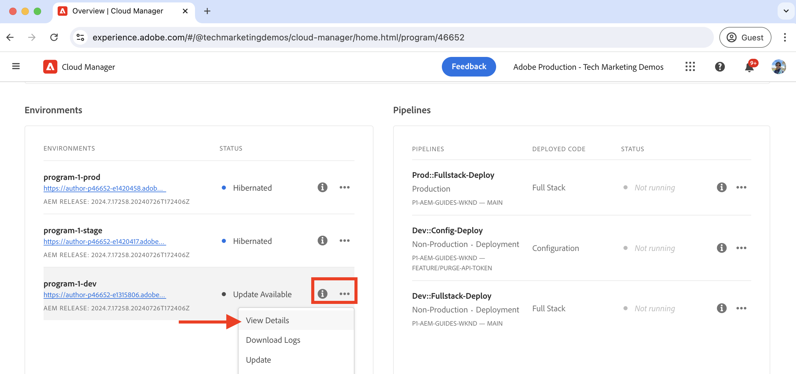

# Come eliminare la cache CDN

Scopri come eliminare o rimuovere la risposta HTTP dalla cache dal CDN di AEM as a Cloud Service. Utilizzando la funzionalità self-service denominata **Rimuovi token API**, è possibile eliminare la cache per una risorsa specifica, un gruppo di risorse e l&#39;intera cache.

In questa esercitazione imparerai a impostare e utilizzare Purge API Token per eliminare la cache CDN del sito [AEM WKND](https://github.com/adobe/aem-guides-wknd) di esempio utilizzando la funzione self-service.

>[!VIDEO](https://video.tv.adobe.com/v/3436939?quality=12&learn=on&captions=ita)

## Annullamento della validità della cache ed eliminazione esplicita

Esistono due modi per rimuovere le risorse memorizzate in cache dalla rete CDN:

1. **Annullamento della validità della cache:** È il processo di rimozione delle risorse dalla rete CDN in base alle intestazioni della cache come `Cache-Control`, `Surrogate-Control` o `Expires`. Il valore dell&#39;attributo `max-age` dell&#39;intestazione della cache viene utilizzato per determinare la durata della cache delle risorse, nota anche come TTL (Time To Live) della cache. Alla scadenza della durata della cache, le risorse memorizzate in cache vengono rimosse automaticamente dalla cache CDN.

1. **Eliminazione esplicita:** È il processo di rimozione manuale delle risorse memorizzate nella cache CDN prima della scadenza del TTL. L’eliminazione esplicita è utile quando desideri rimuovere immediatamente le risorse memorizzate in cache. Tuttavia, aumenta il traffico verso il server di origine.

Quando le risorse memorizzate in cache vengono rimosse dalla cache CDN, la richiesta successiva per la stessa risorsa recupera la versione più recente dal server di origine.

## Configurare il token API di rimozione

Scopri come impostare Purge API Token per eliminare la cache CDN.

### Configurare la regola CDN

Il token API di eliminazione viene creato configurando la regola CDN nel codice del progetto AEM.

1. Apri il file `cdn.yaml` dalla cartella principale `config` del progetto AEM. Ad esempio, il file cdn.yaml[&#128279;](https://github.com/adobe/aem-guides-wknd/blob/main/config/cdn.yaml) del progetto WKND.

1. Aggiungi la seguente regola CDN al file `cdn.yaml`:

```yaml
kind: "CDN"
version: "1"
metadata:
  envTypes: ["dev", "stage", "prod"]
data:  
  authentication: # The main authentication configuration
    authenticators: # The list of authenticators
       - name: purge-auth # The name of the authenticator
         type: purge  # The type of the authenticator, must be purge
         purgeKey1: ${{CDN_PURGEKEY_081324}} # The first purge key, must be referenced by the Cloud Manager secret-type environment variable name ${{CDN_EDGEKEY_073124}}
         purgeKey2: ${{CDN_PURGEKEY_111324}} # The second purge key, must be referenced by the Cloud Manager secret-type environment variable name ${{CDN_EDGEKEY_111324}}. It is used for the rotation of secrets without any interruptions.
    rules: # The list of authentication rules
       - name: purge-auth-rule # The name of the rule
         when: { reqProperty: tier, equals: "publish" } # The condition when the rule should be applied
         action: # The action to be taken when the rule is applied
           type: authenticate # The type of the action, must be authenticate
           authenticator: purge-auth # The name of the authenticator to be used, must match the name from the above authenticators list               
```

Nella regola precedente, sia `purgeKey1` che `purgeKey2` vengono aggiunti dall&#39;inizio per supportare la rotazione dei segreti senza interruzioni. Tuttavia, è possibile iniziare con solo `purgeKey1` e aggiungere `purgeKey2` in un secondo momento durante la rotazione dei segreti.

1. Salva, conferma e invia le modifiche all’archivio a monte di Adobe.

### Creare la variabile di ambiente Cloud Manager

Quindi, crea le variabili di ambiente Cloud Manager per memorizzare il valore Purge API Token.

1. Accedi a Cloud Manager all&#39;indirizzo [my.cloudmanager.adobe.com](https://my.cloudmanager.adobe.com/) e seleziona l&#39;organizzazione e il programma.

1. Nella sezione __Ambienti__, fai clic sui **puntini di sospensione** (...) accanto all&#39;ambiente desiderato e seleziona **Visualizza dettagli**.

   

1. Selezionare quindi la scheda **Configurazione** e fare clic sul pulsante **Aggiungi configurazione**.

1. Nella finestra di dialogo **Configurazione ambiente**, immetti i dettagli seguenti:
   - **Nome**: immettere il nome della variabile di ambiente. Deve corrispondere al valore `purgeKey1` o `purgeKey2` del file `cdn.yaml`.
   - **Valore**: immettere il valore Token API di rimozione.
   - **Servizio applicato**: selezionare l&#39;opzione **All**.
   - **Tipo**: selezionare l&#39;opzione **Segreto**.
   - Fai clic sul pulsante **Aggiungi**.

   

1. Ripetere i passaggi precedenti per creare la seconda variabile di ambiente per il valore `purgeKey2`.

1. Fai clic su **Salva** per salvare e applicare le modifiche.

### Distribuire la regola CDN

Infine, distribuisci la regola CDN configurata nell’ambiente AEM as a Cloud Service utilizzando la pipeline Cloud Manager.

1. In Cloud Manager, passa alla sezione **Pipeline**.

1. Crea una nuova pipeline o seleziona la pipeline esistente che distribuisce solo i file **Config**. Per i passaggi dettagliati, vedere [Creare una pipeline di configurazione](https://experienceleague.adobe.com/it/docs/experience-manager-learn/cloud-service/security/traffic-filter-and-waf-rules/how-to-setup#deploy-rules-through-cloud-manager).

1. Fai clic sul pulsante **Esegui** per distribuire la regola CDN.

   

## Utilizzare il token API di rimozione

Per rimuovere la cache CDN, richiama l’URL del dominio specifico del servizio AEM con il token API di rimozione. La sintassi per eliminare la cache è la seguente:

```
PURGE <URL> HTTP/1.1
Host: <AEM_SERVICE_SPECIFIC_DOMAIN>
X-AEM-Purge-Key: <PURGE_API_TOKEN>
X-AEM-Purge: <PURGE_TYPE>
Surrogate-Key: <SURROGATE_KEY>
```

Dove:

- **RIMUOVI`<URL>`**: il metodo `PURGE` è seguito dal percorso URL della risorsa che si desidera eliminare.
- **Host:`<AEM_SERVICE_SPECIFIC_DOMAIN>`**: specifica il dominio del servizio AEM.
- **X-AEM-Purge-Key:`<PURGE_API_TOKEN>`**: intestazione personalizzata contenente il valore del token API Purge.
- **X-AEM-Purge:`<PURGE_TYPE>`**: intestazione personalizzata che specifica il tipo di operazione di eliminazione. Il valore può essere `hard`, `soft` o `all`. Nella tabella riportata di seguito viene descritto ogni tipo di rimozione.

  | Tipo di rimozione | Descrizione |
  |:------------:|:-------------:|
  | rigido (impostazione predefinita) | Rimuove immediatamente la risorsa memorizzata nella cache. Evitalo poiché aumenta il traffico verso il server di origine. |
  | morbido | Contrassegna la risorsa memorizzata in cache come non aggiornata e recupera la versione più recente dal server di origine. |
  | tutti | Rimuove tutte le risorse memorizzate nella cache CDN. |

- **Chiave sostitutiva:`<SURROGATE_KEY>`**: (facoltativo) un&#39;intestazione personalizzata che specifica le chiavi sostitutive (separate da uno spazio) dei gruppi di risorse da eliminare. La chiave sostitutiva viene utilizzata per raggruppare le risorse e deve essere impostata nell’intestazione di risposta della risorsa.

>[!TIP]
>
>Negli esempi seguenti, `X-AEM-Purge: hard` viene utilizzato a scopo dimostrativo. È possibile sostituirlo con `soft` o `all` in base alle proprie esigenze. Prestare attenzione quando si utilizza il tipo di eliminazione `hard`, poiché aumenta il traffico verso il server di origine.

### Eliminare la cache per una risorsa specifica

In questo esempio, il comando `curl` elimina la cache per la risorsa `/us/en.html` sul sito WKND distribuito in un ambiente AEM as a Cloud Service.

```bash
curl -X PURGE "https://publish-p46652-e1315806.adobeaemcloud.com/us/en.html" \
-H "X-AEM-Purge-Key: 123456789" \
-H "X-AEM-Purge: hard"
```

Dopo l&#39;eliminazione corretta, viene restituita una risposta `200 OK` con contenuto JSON.

```json
{ "status": "ok", "id": "1000098-1722961031-13237063" }
```

### Eliminare la cache per un gruppo di risorse

In questo esempio, il comando `curl` elimina la cache per il gruppo di risorse con la chiave sostitutiva `wknd-assets`. L&#39;intestazione di risposta `Surrogate-Key` è impostata in [`wknd.vhost`](https://github.com/adobe/aem-guides-wknd/blob/main/dispatcher/src/conf.d/available_vhosts/wknd.vhost#L176), ad esempio:

```http
<VirtualHost *:80>
    ...

    # Core Component Image Component: long-term caching (30 days) for immutable URLs, background refresh to avoid MISS
    <LocationMatch "^/content/.*\.coreimg.*\.(?i:jpe?g|png|gif|svg)$">
        Header set Cache-Control "max-age=2592000,stale-while-revalidate=43200,stale-if-error=43200,public,immutable" "expr=%{REQUEST_STATUS} < 400"
        # Set Surrogate-Key header to group the cache of WKND assets, thus it can be flushed independtly
        Header set Surrogate-Key "wknd-assets"
        Header set Age 0
    </LocationMatch>

    ...
</VirtualHost>
```

```bash
curl -X PURGE "https://publish-p46652-e1315806.adobeaemcloud.com" \
-H "Surrogate-Key: wknd-assets" \
-H "X-AEM-Purge-Key: 123456789" \
-H "X-AEM-Purge: hard"
```

Dopo l&#39;eliminazione corretta, viene restituita una risposta `200 OK` con contenuto JSON.

```json
{ "wknd-assets": "10027-1723478994-2597809-1" }
```

### Eliminare l&#39;intera cache

In questo esempio, utilizzando il comando `curl` l&#39;intera cache viene eliminata dal sito WKND di esempio distribuito nell&#39;ambiente AEM as a Cloud Service.

```bash
curl -X PURGE "https://publish-p46652-e1315806.adobeaemcloud.com/" \
-H "X-AEM-Purge-Key: 123456789" \
-H "X-AEM-Purge: all"
```

Dopo l&#39;eliminazione corretta, viene restituita una risposta `200 OK` con contenuto JSON.

```json
{"status":"ok"}
```

### Verificare l’eliminazione della cache

Per verificare l’eliminazione della cache, accedi all’URL della risorsa nel browser web e controlla le intestazioni di risposta. Il valore dell&#39;intestazione `X-Cache` deve essere `MISS`.


