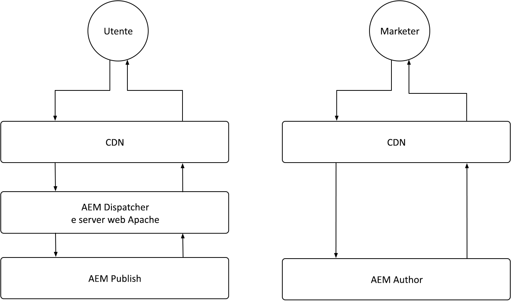

# caching di AEM as a Cloud Service

In AEM as a Cloud Service, comprendere il caching è fondamentale. La memorizzazione nella cache comporta l’archiviazione e il riutilizzo dei dati recuperati in precedenza per migliorare l’efficienza del sistema e ridurre i tempi di caricamento. Questo meccanismo accelera in modo significativo la distribuzione dei contenuti, migliora le prestazioni del sito web e ottimizza l’esperienza utente.

AEM as a Cloud Service dispone di più livelli di caching e strategie che differiscono tra i servizi Author e Publish.

{align="center"}

## caching di AEM

AEM as a Cloud Service dispone di una solida strategia di caching a più livelli configurabile, che include una rete CDN, AEM Dispatcher e, facoltativamente, una rete CDN gestita dal cliente. La memorizzazione nella cache tra i livelli può essere ottimizzata per ottimizzare le prestazioni, garantendo in tal modo che AEM fornisca solo le migliori esperienze. AEM presenta diversi problemi di caching per i servizi Author e Publish. Esplora le strategie di caching per ciascun servizio di seguito.

    

    

        

          <figure class="image is-16by9">
            
          </figure>
        

        

          

            
<a href="./publish.md" title="Memorizzazione in cache del servizio di pubblicazione AEM">Memorizzazione in cache del servizio di pubblicazione AEM</a>

            
Il servizio di pubblicazione di AEM utilizza una rete CDN gestita e AEM Dispatcher per ottimizzare le esperienze web degli utenti finali.

            <a href="./publish.md" class="spectrum-Button spectrum-Button--outline spectrum-Button--primary spectrum-Button--sizeM">
              Scopri
            </a>
          

        

      

    

    

        

            

            <figure class="image is-16by9">
                
            </figure>
            

            

            

                
<a href="./author.md" title="Memorizzazione in cache del servizio AEM Author">Memorizzazione in cache del servizio AEM Author</a>

                
Il servizio Author di AEM utilizza una rete CDN gestita per fornire esperienze di authoring ottimizzate.

                <a href="./author.md" class="spectrum-Button spectrum-Button--outline spectrum-Button--primary spectrum-Button--sizeM">
                Scopri
                </a>
            

            

        

    

