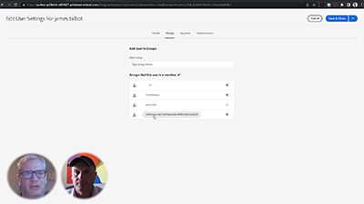

# Cloud 5

>[!VIDEO](https://video.tv.adobe.com/v/346567)

## Introduzione

Benvenuto alla seconda serie Cloud 5 di AEM Engineering. Uno dei problemi principali nella fase di implementazione di un prodotto è avere abbastanza campioni di codice e/o dimostrazioni live di tali campioni, strumenti o API. L&#39;obiettivo di questa serie è quello di fornire informazioni utili su AEM as a Cloud Service in 5 minuti o meno.

## Casella di suggerimenti

Visita il [Casella di suggerimenti](https://forms.office.com/r/74P5Xz4UH0) per la presentazione di idee sull&#39;argomento.

## Stagione 2

Ogni stagione varia in lunghezza e viene rilasciata su un programma fisso. Gli argomenti della seconda stagione sono principalmente basati su richieste passate che abbiamo incontrato nei nostri impegni quotidiani con clienti e partner. Visita questa pagina per aggiornamenti settimanali o seguici sul social network di tua scelta.

<table>
    <tr>
        <td>
            
            

                <a href="season-2/cloud5-experience-v-content-fragments.md"><strong>Frammenti</strong></a>        
                 <em>con Darin Kuntze e James Talbot, architetti senior di cloud</em>
            

            

                 
                Una panoramica dettagliata delle differenze tra l’esperienza e i frammenti di contenuto. Spoiler: vincono tutti.
            

        </td>   
         <td>
            
            

                <a href="season-2/cloud5-repo-modernizer.md"><strong>Modernizzatore dell'archivio</strong></a> 
                <em>con Darin Kuntze e James Talbot, architetti senior di cloud</em>
            

            

                 
                Informazioni rapide sull’utilizzo dell’utilità di modernizzazione dell’archivio per ristrutturare i pacchetti di progetto esistenti in pacchetti discreti compatibili con AEM as a cloud service.
            

         </td>
         <td>
            
            

                  <a href="season-2/cloud5-admin-console.md"><strong>Admin Console</strong></a>
                <em>con Darin Kuntze e James Talbot, architetti senior di cloud</em>
            

            

             
               Darin e James discutono alcune cose comuni che le persone dovrebbero sapere su Admin Console, provisioning e accesso.
            

         </td> 
  </tr>
  <tr>
         <td>
            
            

                  <a href="season-2/cloud5-sling-job-scheduler.md"><strong>Processi Sling</strong></a>
                <em>con Darin Kuntze e James Talbot, architetti senior di cloud</em>
            

            

             
               Darin e James discutono gotchas e cose da cercare per la pianificazione dei lavori e il consumo in AEM as a cloud service.
            

         </td> 
         <td>
            
            

                  <a href="season-2/cloud5-repoinit.md"><strong>Inizializzatore dell’archivio Sling</strong></a>
                <em>con Darin Kuntze e James Talbot, architetti senior di cloud</em>
            

            

             
              Scopri alcuni trucchi per sbloccare la potenza dell’utilizzo di Sling Repository Initializer, noto anche come repoinit.
            

         </td>   
     <td>
            
      

         <a href="season-2/cloud5-fix-your-cache.md"><strong>Correggi il tuo... Cache</strong></a>
          <em>con Damian Langsweirdt e James Talbot, architetti senior di cloud</em>
      

      

          
             Esplora le aree per ottimizzare la cache e velocizzare l'esecuzione del sito su AEM as a Cloud Service.
      

   </td> 
  </tr>
<tr>
   <td>
           
      

            <a href="season-2/cloud5-fix-your-rewrites.md"><strong>Correggi il tuo... Riscrittura</strong></a>
          <em>con Darin Kuntze e James Talbot, architetti senior di cloud</em>
      

      

         
         Informazioni rapide sulle cose che aiuteranno ad accelerare lo sviluppo di riscrittura e l'ottimizzazione su AEM as a Cloud Service.
      

     </td>   
     <td>
            
      

            <a href="season-2/cloud5-mocm-experience-audit.md"><strong>Misteri di Cloud Manager.. Audit delle esperienze</strong></a>
          <em>con Darin Kuntze, architetto senior del cloud</em>
      

      

         
        Scopri le nozioni di base di Cloud Manager e le sue funzionalità di Experience Audit.
      

   </td>
     <td>
            
      

            <a href="season-2/cloud5-mocm-unit-tests.md"><strong>Misteri di Cloud Manager.. Test di unità</strong></a>
          <em>con Darin Kuntze e Bryan Stopp, architetti senior di Cloud</em>
      

      

         
        Darin e Bryan discutono di come Cloud Manager integra l’esecuzione di test di unità e la generazione di rapporti sulla copertura del codice nella pipeline CI/CD per incoraggiare e promuovere le best practice relative al testing di unità AEM codice.
      

   </td> 
  </tr>
    <tr>
        <td>
               
            

                <a href="season-2/cloud5-mocm-functional-tests.md"><strong>Misteri di Cloud Manager.. Test funzionali</strong> </a>        
                <em>con Darin Kuntze e Bryan Stopp, architetti senior di Cloud</em>
            

            
 
                Darin e Bryan discutono diversi tipi di test funzionali incorporati nel processo di distribuzione as a Cloud Service AEM per garantire la qualità e l'affidabilità del codice.
            

        </td>
        <td></td>
        <td></td>
    </tr>
</table>
