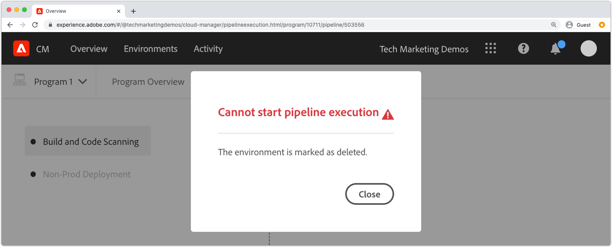
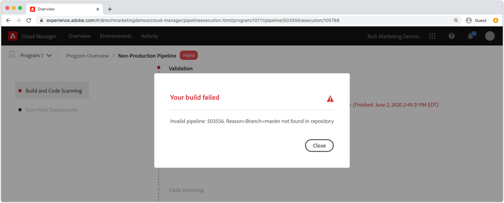

# Debug delle build e delle implementazioni di AEM as a Cloud Service

Adobe Cloud Manager facilita la creazione e la distribuzione del codice in AEM as a Cloud Service. Possono verificarsi errori durante le fasi del processo di compilazione, che richiedono un&#39;azione per risolverli. Questa guida illustra come comprendere gli errori comuni in nell’implementazione e come affrontarli nel modo migliore.


## Convalida

Il passaggio di convalida assicura semplicemente la validità delle configurazioni di base di Cloud Manager. Gli errori comuni di convalida includono:

### L’ambiente è in uno stato non valido

+ __Messaggio di errore:__ l&#39;ambiente è in uno stato non valido.
  
+ __Causa:__ L&#39;ambiente di destinazione della pipeline è in uno stato di transizione e non può accettare nuove build.
+ __Risoluzione:__ attendere la risoluzione dello stato in esecuzione (o aggiornamento disponibile). Se l’ambiente viene eliminato, ricrealo o scegli un altro ambiente in cui generare la build.

### Impossibile trovare l’ambiente associato alla pipeline

+ __Messaggio di errore:__ l&#39;ambiente è contrassegnato come eliminato.
  
+ __Causa:__ L&#39;ambiente che la pipeline è configurata per l&#39;utilizzo è stato eliminato.
Anche se viene ricreato un nuovo ambiente con lo stesso nome, Cloud Manager non associa automaticamente la pipeline a tale ambiente con lo stesso nome.
+ __Risoluzione:__ modificare la configurazione della pipeline e selezionare nuovamente l&#39;ambiente in cui eseguire la distribuzione.

### Impossibile trovare il ramo Git associato alla pipeline

+ __Messaggio di errore:__ pipeline non valida: XXXXXX. Reason=Branch=xxxx non trovato nell&#39;archivio.
  
+ __Causa:__ Il ramo Git configurato per l&#39;utilizzo della pipeline è stato eliminato.
+ __Risoluzione:__ ricreare il ramo Git mancante utilizzando lo stesso nome o riconfigurare la pipeline in modo che venga generata da un ramo esistente diverso.

## Build e unit test


La fase Build e Unit Testing esegue una build Maven (`mvn clean package`) del progetto estratto dal ramo Git configurato della pipeline.

Gli errori identificati in questa fase devono essere riproducibili nella creazione locale del progetto, con le seguenti eccezioni:

+ Viene utilizzata una dipendenza Maven non disponibile in [Maven Central](https://search.maven.org/) e l&#39;archivio Maven contenente la dipendenza è:
   + Non raggiungibile da Cloud Manager, ad esempio un archivio Maven interno privato, o l’archivio Maven richiede l’autenticazione e sono state fornite credenziali errate.
   + Registrazione non esplicita in `pom.xml` del progetto. Tieni presente che, includere gli archivi Maven è sconsigliato in quanto aumenta i tempi di creazione.
+ Gli unit test non riescono a causa di problemi di tempistica. Ciò può verificarsi quando gli unit test sono sensibili agli intervalli. Un indicatore sicuro si basa su `.sleep(..)` nel codice di test.
+ Utilizzo di plug-in Maven non supportati.

## Scansione del codice


La scansione del codice esegue l’analisi del codice statico utilizzando una combinazione di best practice specifiche per Java e AEM.

Se nel codice sono presenti vulnerabilità di sicurezza critiche, l’analisi del codice genera un errore di build. Le violazioni meno importanti possono essere ignorate, ma si consiglia di correggerle. La scansione del codice non è perfetta e può causare [falsi positivi](https://experienceleague.adobe.com/docs/experience-manager-cloud-service/implementing/using-cloud-manager/test-results/overview-test-results.html#dealing-with-false-positives).

Per risolvere i problemi di scansione del codice, scarica il rapporto in formato CSV fornito da Cloud Manager tramite il pulsante **Scarica dettagli** e controlla eventuali voci.

Per ulteriori dettagli, vedi Regole specifiche per AEM, vedi la documentazione di Cloud Manager [regole di scansione del codice specifiche per AEM personalizzate](https://experienceleague.adobe.com/docs/experience-manager-cloud-manager/using/how-to-use/custom-code-quality-rules.html).

## Immagini di build


L’immagine della build è responsabile della combinazione degli artefatti di codice generati nel passaggio Build e Unit Testing con la versione di AEM, per formare un singolo artefatto distribuibile.

Anche se durante la generazione e il testing di unità vengono riscontrati problemi di compilazione e compilazione del codice, possono esserci problemi di configurazione o strutturali identificati quando si tenta di combinare l’artefatto di compilazione personalizzato con la versione di AEM.

### Configurazioni OSGi duplicate

Quando più configurazioni OSGi vengono risolte tramite la modalità di esecuzione per l’ambiente AEM di destinazione, il passaggio Genera immagine non riesce e viene visualizzato l’errore:

```
[ERROR] Unable to convert content-package [/tmp/packages/enduser.all-1.0-SNAPSHOT.zip]: 
Configuration 'com.example.ExampleComponent' already defined in Feature Model 'com.example.groupId:example.all:slingosgifeature:xxxxx:X.X', 
set the 'mergeConfigurations' flag to 'true' if you want to merge multiple configurations with same PID
```

#### Causa 1

+ __Causa:__ il pacchetto all del progetto AEM contiene più pacchetti di codice e la stessa configurazione OSGi è fornita da più pacchetti di codice, causando un conflitto. Il passaggio Build Image non è in grado di decidere quale deve essere utilizzata, pertanto la compilazione non riesce. Questo non si applica alle configurazioni di fabbrica OSGi, purché abbiano nomi univoci.
+ __Risoluzione:__ esamina tutti i pacchetti di codice (inclusi eventuali pacchetti di codice di terze parti) distribuiti come parte dell&#39;applicazione AEM, cercando configurazioni OSGi duplicate che si risolvono nell&#39;ambiente di destinazione tramite la modalità di esecuzione. L’istruzione del messaggio di errore &quot;imposta il flag mergeConfigurations su true&quot; non è possibile in AEM as a Cloud Service e deve essere ignorata.

#### Causa 2

+ __Causa:__ Il progetto AEM include erroneamente lo stesso pacchetto di codice due volte, determinando la duplicazione di qualsiasi configurazione OSGi contenuta in tale pacchetto.
+ __Risoluzione:__ Rivedi tutti i pom.xml dei pacchetti incorporati nel progetto all e assicurati che la `filevault-package-maven-plugin` [configurazione](https://experienceleague.adobe.com/docs/experience-manager-cloud-service/implementing/developing/aem-project-content-package-structure.html#cloud-manager-target) sia impostata su `<cloudManagerTarget>none</cloudManagerTarget>`.

### Script di repoinit non valido

Gli script Repoinit definiscono il contenuto della linea di base, gli utenti, gli ACL, ecc. In AEM as a Cloud Service, gli script di repoinit vengono applicati durante la generazione dell’immagine, ma nell’avvio rapido locale di AEM SDK vengono applicati quando viene attivata la configurazione di fabbrica di repoinit OSGi. Per questo motivo, gli script Repoinit potrebbero non riuscire (con la registrazione) nell’avvio rapido locale di AEM SDK, ma il passaggio Genera immagine non riesce, interrompendo la distribuzione.

+ __Causa:__ Uno script di repoinit non è valido. Questo potrebbe lasciare l’archivio in uno stato incompleto, in quanto eventuali script di repoinit dopo lo script non riuscito non vengono eseguiti nell’archivio.
+ __Risoluzione:__ controlla l&#39;avvio rapido locale di AEM SDK quando viene distribuita la configurazione OSGi dello script di repoinit per determinare se e quali sono gli errori.

### Dipendenza contenuto repoinit non soddisfatta

Gli script Repoinit definiscono il contenuto della linea di base, gli utenti, gli ACL, ecc. Nel modulo quickstart locale di AEM SDK, gli script di repoinit vengono applicati quando viene attivata la configurazione di fabbrica OSGi di repoinit, o in altre parole, dopo che l’archivio è attivo e potrebbe aver subito modifiche al contenuto direttamente o tramite pacchetti di contenuti. In AEM as a Cloud Service, gli script repoinit vengono applicati durante la generazione dell’immagine in un archivio che potrebbe non contenere contenuto da cui dipende lo script repoinit.

+ __Causa:__ Uno script di repoinit dipende da contenuto inesistente.
+ __Risoluzione:__ Verificare che esista il contenuto da cui dipende lo script Repoinit. Spesso questo indica una definizione inadeguata degli script di repoinit con direttive mancanti che definiscono queste strutture di contenuto mancanti, ma necessarie. Questa operazione può essere riprodotta localmente eliminando AEM, decomprimendo il file JAR e aggiungendo la configurazione OSGi repoinit contenente lo script repoinit alla cartella di installazione e avviando AEM. L’errore si presenta nel file error.log del quickstart locale di AEM SDK.


### La versione dei Componenti core dell’applicazione è successiva alla versione implementata

_Questo problema riguarda solo gli ambienti non di produzione che NON eseguono l&#39;aggiornamento automatico all&#39;ultima versione di AEM._

AEM as a Cloud Service include automaticamente la versione più recente dei Componenti core in ogni versione di AEM, ovvero dopo che a un ambiente AEM as a Cloud Service viene, automaticamente o manualmente, installata la versione più recente dei Componenti core.

È possibile che il passaggio Genera immagine non riesca quando:

+ L&#39;applicazione che distribuisce aggiorna la versione della dipendenza Maven dei Componenti core nel progetto `core` (bundle OSGi)
+ L’applicazione di distribuzione viene quindi distribuita in un ambiente AEM as a Cloud Service sandbox (non di produzione) che non è stato aggiornato per l’utilizzo di una versione di AEM contenente la nuova versione dei Componenti core.

Per evitare questo errore, ogni volta che è disponibile un aggiornamento dell’ambiente AEM as a Cloud Service, includi l’aggiornamento come parte della build/distribuzione successiva e assicurati sempre che gli aggiornamenti vengano inclusi dopo l’incremento della versione dei Componenti core nella base di codice dell’applicazione.

+ __Sintomi:__
Il passaggio Genera immagine non riesce e viene visualizzato un messaggio di ERRORE in cui si segnala che `com.adobe.cq.wcm.core.components...` pacchetti in intervalli di versione specifici non possono essere importati dal progetto `core`.

  ```
  [ERROR] Bundle com.example.core:0.0.3-SNAPSHOT is importing package(s) Package com.adobe.cq.wcm.core.components.models;version=[12.13,13) in start level 20 but no bundle is exporting these for that start level in the required version range.
  [ERROR] Analyser detected errors on feature 'com.adobe.granite:aem-ethos-app-image:slingosgifeature:aem-runtime-application-publish-dev:1.0.0-SNAPSHOT'. See log output for error messages.
  [INFO] ------------------------------------------------------------------------
  [INFO] BUILD FAILURE
  [INFO] ------------------------------------------------------------------------
  ```

+ __Causa:__ Il bundle OSGi dell&#39;applicazione (definito nel progetto `core`) importa le classi Java dalla dipendenza core dei Componenti core a un livello di versione diverso da quello distribuito in AEM as a Cloud Service.
+ __Risoluzione:__
   + Utilizzando Git, ripristina un commit di lavoro esistente prima dell’incremento di versione dei Componenti core. Invia questo commit a un ramo Git di Cloud Manager ed esegui un aggiornamento dell’ambiente da questo ramo. Questo aggiornerà AEM as a Cloud Service all’ultima versione di AEM, che includerà la versione più recente dei Componenti core. Dopo aver aggiornato AEM as a Cloud Service alla versione più recente di AEM, che avrà la versione più recente dei Componenti core, ridistribuisci il codice che originariamente aveva esito negativo.
   + Per riprodurre il problema localmente, accertati che la versione di AEM SDK corrisponda alla versione di AEM in uso nell’ambiente AEM as a Cloud Service.


### Creazione di un caso di supporto Adobe

Se gli approcci di risoluzione dei problemi sopra descritti non risolvono il problema, crea un caso di supporto Adobe tramite:

+ [Adobe Admin Console](https://adminconsole.adobe.com) > Scheda Supporto > Crea caso

  _Se sei membro di più organizzazioni Adobe, accertati che l&#39;organizzazione Adobe con pipeline non riuscita sia selezionata nel selettore Adobe Orgs prima di creare il caso._

## Distribuisci in

Il passaggio Distribuisci su è responsabile della creazione dell’artefatto di codice generato nell’immagine generata, dell’avvio dei nuovi servizi AEM Author e Publish che lo utilizzano e, in caso di esito positivo, della rimozione dei vecchi servizi AEM Author e Publish. Anche in questo passaggio vengono installati e aggiornati pacchetti e indici di contenuto variabile.

Acquisisci familiarità con [registri AEM as a Cloud Service](./logs.md) prima di eseguire il debug del passaggio Distribuisci a. Il registro `aemerror` contiene informazioni sull&#39;avvio e l&#39;arresto dei pod che possono essere pertinenti per la distribuzione in caso di problemi. Il registro disponibile tramite il pulsante Download Log nel passaggio Distribuisci su di Cloud Manager non è il registro `aemerror` e non contiene informazioni dettagliate relative all&#39;avvio delle applicazioni.


I tre motivi principali per cui la distribuzione al passaggio potrebbe non riuscire:

### La pipeline di Cloud Manager contiene una vecchia versione di AEM

+ __Causa:__ una pipeline Cloud Manager contiene una versione di AEM precedente a quella distribuita nell&#39;ambiente di destinazione. Questo può verificarsi quando una pipeline viene riutilizzata e puntata a un nuovo ambiente che esegue una versione successiva di AEM. Questo può essere identificato controllando se la versione di AEM dell’ambiente è maggiore della versione di AEM della pipeline.
  
+ __Risoluzione:__
   + Se nell&#39;ambiente di destinazione è disponibile un aggiornamento, selezionare Aggiorna dalle azioni dell&#39;ambiente, quindi eseguire nuovamente la build.
   + Se nell’ambiente di destinazione non è disponibile un aggiornamento, significa che è in esecuzione la versione più recente di AEM. Per risolvere questo problema, elimina la pipeline e ricreala.


### Cloud Manager timeout

Il codice in esecuzione durante l’avvio del servizio AEM appena implementato impiega talmente tanto tempo che Cloud Manager va in timeout prima che la distribuzione possa essere completata. In questi casi, la distribuzione potrebbe riuscire, anche se lo stato del Cloud Manager segnalato come Non riuscito.

+ __Causa:__ il codice personalizzato può eseguire operazioni, come query di grandi dimensioni o attraversamenti di contenuto, attivate in anticipo nel bundle OSGi o nei cicli di vita dei componenti, ritardando notevolmente l&#39;ora di avvio di AEM.
+ __Risoluzione:__ verifica l&#39;implementazione del codice che viene eseguito all&#39;inizio del ciclo di vita del bundle OSGi, quindi controlla i `aemerror` registri per i servizi AEM Author e Publish intorno al momento dell&#39;errore (tempo di registrazione in GMT) come mostrato da Cloud Manager e cerca i messaggi di registro che indicano eventuali processi di esecuzione di registro personalizzati.

### Codice o configurazione non compatibile

La maggior parte delle violazioni di codice e configurazione viene rilevata in una fase precedente della build, tuttavia il codice personalizzato o la configurazione possono essere incompatibili con AEM as a Cloud Service e non vengono rilevate finché non vengono eseguite nel contenitore.

+ __Causa:__ il codice personalizzato può richiamare operazioni lunghe, come query di grandi dimensioni o attraversamenti di contenuto, attivate in anticipo nel bundle OSGi o nei cicli di vita dei componenti, ritardando notevolmente l&#39;avvio di AEM.
+ __Risoluzione:__ esamina i registri `aemerror` per i servizi Author e Publish di AEM nel periodo di tempo (tempo di registrazione in GMT) dell&#39;errore, come mostrato da Cloud Manager.
   1. Esamina i registri per individuare eventuali ERRORI generati dalle classi Java fornite dall’applicazione personalizzata. Se vengono rilevati problemi, risolvi questi, invia il codice corretto e ricompila la pipeline.
   1. Esamina i registri per individuare eventuali ERRORI segnalati da aspetti di AEM che stai estendendo/interagendo con nell’applicazione personalizzata e analizzali; questi ERRORI potrebbero non essere attribuiti direttamente alle classi Java. Se vengono rilevati problemi, risolvi questi, invia il codice corretto e ricompila la pipeline.

### Inclusione di /var nel pacchetto di contenuti

`/var` è modificabile e contiene diversi contenuti temporanei e di runtime. Inclusione di `/var` in pacchetti di contenuti (ad es. `ui.content`) distribuita tramite Cloud Manager potrebbe impedire il completamento della distribuzione.

Questo problema è difficile da identificare in quanto non si verifica un errore nella distribuzione iniziale, ma solo nelle distribuzioni successive. I sintomi più evidenti includono:

+ La distribuzione iniziale ha esito positivo, tuttavia il contenuto mutabile nuovo o modificato, che fa parte della distribuzione, non sembra esistere nel servizio di pubblicazione AEM.
+ L’attivazione/disattivazione del contenuto in AEM Author è bloccata
+ Le distribuzioni successive non riescono nel passaggio di implementazione a, con la distribuzione a un passaggio che non riesce dopo circa 60 minuti.

Per convalidare questo problema, la causa è il comportamento errato:

1. Determinando che almeno un pacchetto di contenuti che fa parte della distribuzione, scrive in `/var`.
1. Verifica che la coda di distribuzione primaria (in grassetto) sia bloccata in:
   + AEM Author > Strumenti > Implementazione > Distribuzione

     
1. In caso di mancata distribuzione successiva, scarica i registri di Cloud Manager &quot;Deploy to&quot; utilizzando il pulsante Download Log (Scarica registro):

   

   ... e verificare che trascorrano circa 60 minuti tra le istruzioni di registro:

   ```
   2020-01-01T01:01:02+0000 Begin deployment in aem-program-x-env-y-dev [CorrelationId: 1234]
   ```

   ... e ...

   ```
   2020-01-01T02:04:10+0000 Failed deployment in aem-program-x-env-y-dev
   ```

   Tieni presente che questo registro non conterrà questi indicatori sulle distribuzioni iniziali che riportano come riuscite, ma solo sulle distribuzioni successive con errori.

+ __Causa:__ l&#39;utente del servizio di replica di AEM utilizzato per distribuire pacchetti di contenuti al servizio di pubblicazione di AEM non può scrivere in `/var` in AEM Publish. In questo modo la distribuzione del pacchetto di contenuti al servizio di pubblicazione AEM non riesce.
+ __Risoluzione:__ I seguenti modi per risolvere i problemi sono elencati in ordine di preferenza:
   1. Se le risorse `/var` non sono necessarie, rimuovere le risorse in `/var` dai pacchetti di contenuto distribuiti come parte dell&#39;applicazione.
   2. Se le risorse `/var` sono necessarie, definire le strutture dei nodi utilizzando [repoinit](https://experienceleague.adobe.com/docs/experience-manager-cloud-service/implementing/deploying/overview.html#repoinit). Gli script Repoinit possono essere indirizzati ad AEM Author, AEM Publish o a entrambi, tramite le modalità di esecuzione OSGi.
   3. Se le risorse `/var` sono necessarie solo per AEM Author e non possono essere ragionevolmente modellate con [repoinit](https://experienceleague.adobe.com/docs/experience-manager-cloud-service/implementing/deploying/overview.html#repoinit), spostale in un pacchetto di contenuti discreto, installato solo in AEM Author [incorporandolo](https://experienceleague.adobe.com/docs/experience-manager-cloud-service/implementing/developing/aem-project-content-package-structure.html?lang=it#embeddeds) nel pacchetto `all` in una cartella runmode di AEM Author (`<target>/apps/example-packages/content/install.author</target>`).
   4. Fornire le ACL appropriate all&#39;utente del servizio `sling-distribution-importer` come descritto in questo [Adobe KB](https://helpx.adobe.com/in/experience-manager/kb/cm/cloudmanager-deploy-fails-due-to-sling-distribution-aem.html).

### Creazione di un caso di supporto Adobe

Se gli approcci di risoluzione dei problemi sopra descritti non risolvono il problema, crea un caso di supporto Adobe tramite:

+ [Adobe Admin Console](https://adminconsole.adobe.com) > Scheda Supporto > Crea caso

  _Se sei membro di più organizzazioni Adobe, accertati che l&#39;organizzazione Adobe con pipeline non riuscita sia selezionata nel selettore Adobe Orgs prima di creare il caso._
