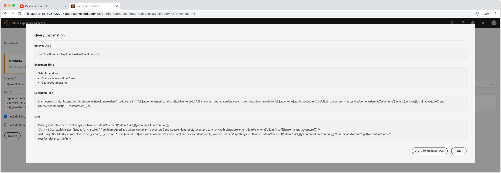

# Debug di AEM as a Cloud Service con Developer Console

AEM as a Cloud Service fornisce una Console per sviluppatori per ogni ambiente che espone vari dettagli del servizio AEM in esecuzione che sono utili per il debug.

Ogni ambiente as a Cloud Service AEM dispone di una propria Console per sviluppatori.

## Passa a Console sviluppatori

Developer Console è accessibile per ogni ambiente as a Cloud Service AEM tramite Cloud Manager.

1. Accedi a __[Cloud Manager](https://my.cloudmanager.adobe.com/)__
2. Apri __Programma__ che contiene l’ambiente AEM as a Cloud Service per aprire Console sviluppatori.
3. Individua il __Ambiente__, e seleziona la `...`.
4. Seleziona __Console per sviluppatori__ dall’elenco a discesa.

## Accesso a Console sviluppatori

Per accedere e utilizzare la Console per sviluppatori è necessario assegnare le seguenti autorizzazioni all’Adobe ID dello sviluppatore tramite [Admin Console di Adobe](https://adminconsole.adobe.com).

1. Verifica che l’organizzazione di Adobe che ha interessato Cloud Manager e i prodotti AEM as a Cloud Service sia attiva nel commutatore dell’organizzazione di Adobe.
1. Lo sviluppatore deve essere membro di [Prodotti di Cloud Manager __Sviluppatore - Cloud Service__ Profilo prodotto](https://experienceleague.adobe.com/docs/experience-manager-cloud-service/content/onboarding/journey/assign-profiles-cloud-manager.html#assign-developer).
   + Se questa appartenenza non esiste, lo sviluppatore non potrà accedere a Console sviluppatori.
1. Lo sviluppatore deve essere membro di [__Utenti AEM__ o __Amministratori AEM__ Profilo di prodotto su AEM Author e/o Publish](https://experienceleague.adobe.com/docs/experience-manager-cloud-service/content/onboarding/journey/assign-profiles-aem.html#aem-product-profiles).
   + Se l&#39;appartenenza non esiste, il [stato](#status) Le immagini si interromperanno per timeout a causa di un errore 401 Unauthorized.

### Risoluzione dei problemi di accesso alla Console per sviluppatori

#### 401 Errore non autorizzato durante il dumping dello stato

Se viene segnalato un errore 401 Unauthorized, significa che l’utente non dispone ancora delle autorizzazioni necessarie in AEM as a Cloud Service o che l’utilizzo dei token di accesso non è valido o è scaduto.

Per risolvere il problema 401 Unauthorized:

1. Assicurati che l’utente sia membro del profilo di prodotto Adobe IMS appropriato (Amministratori AEM o Utenti AEM) per l’istanza di prodotto AEM as a Cloud Service associata alla Console per sviluppatori.
   + Ricorda che Developer Console accede a 2 istanze di prodotto Adobe IMS; le istanze di prodotto Author e Publish as a Cloud Service dall’AEM, quindi assicurati che vengano utilizzati i profili di prodotto corretti a seconda del livello di servizio a cui è necessario accedere tramite Developer Console.
1. Accedi a AEM as a Cloud Service (Author o Publish) e assicurati che l’utente e i gruppi siano sincronizzati correttamente in AEM.
   + Developer Console richiede che il record utente venga creato nel livello di servizio AEM corrispondente per l’autenticazione in tale livello di servizio.
1. Cancella i cookie del browser e lo stato dell’applicazione (archiviazione locale) ed effettua di nuovo l’accesso a Console sviluppatori, verificando che il token di accesso utilizzato da Console sviluppatori sia corretto e non scaduto.

## Pod

I servizi di authoring e pubblicazione as a Cloud Service dell’AEM sono composti da più istanze rispettivamente per gestire la variabilità del traffico e gli aggiornamenti continui senza tempi di inattività. Queste istanze sono denominate Pod. La selezione del pod in Console sviluppatori definisce l’ambito dei dati che verranno esposti tramite gli altri controlli.

+ Un pod è un’istanza discreta che fa parte di un servizio AEM (authoring o pubblicazione)
+ I baccelli sono transitori, il che significa che gli as a Cloud Service AEM li creano e li distruggono se necessario
+ Solo i pod che fanno parte dell’ambiente AEM as a Cloud Service associato, sono elencati nello switcher Pod di Developer Console di tale ambiente.
+ Nella parte inferiore dello switcher Pod, le opzioni di praticità consentono di selezionare i Pod in base al tipo di servizio:
   + Tutti gli autori
   + Tutti gli editori
   + Tutte le istanze

## Stato

Stato fornisce opzioni per l’output di uno stato di runtime AEM specifico nell’output di testo o JSON. Developer Console fornisce informazioni simili a quelle della console web OSGi QuickStart locale dell’SDK per AEM, con la netta differenza che Developer Console è di sola lettura.

### Bundle

I bundle elencano tutti i bundle OSGi in AEM. Questa funzionalità è simile a [Bundle OSGi per avvio rapido locale dell’SDK dell’AEM](http://localhost:4502/system/console/bundles) a `/system/console/bundles`.

I bundle consentono di eseguire il debug in base a:

+ Elenco di tutti i bundle OSGi implementati in AEM as a Service
+ Elencando lo stato di ciascun bundle OSGi, anche se è attivo o meno
+ Fornire dettagli sulle dipendenze non risolte che causano l’attivazione dei bundle OSGi

### Componenti

Componenti elenca tutti i componenti OSGi nell’AEM. Questa funzionalità è simile a [Componenti OSGi per avvio rapido locale dell’SDK dell’AEM](http://localhost:4502/system/console/components) a `/system/console/components`.

I componenti facilitano il debug mediante:

+ Elenco di tutti i componenti OSGi implementati in AEM as a Cloud Service
+ Fornire lo stato di ciascun componente OSGi, anche se è attivo o non soddisfatto
+ Se si forniscono dettagli sui riferimenti di servizio non soddisfatti, i componenti OSGi potrebbero diventare attivi
+ Elenco delle proprietà OSGi e dei relativi valori associati al componente OSGi.
   + Verranno visualizzati i valori effettivi inseriti tramite [Variabili di configurazione dell’ambiente OSGi](https://experienceleague.adobe.com/docs/experience-manager-cloud-service/content/implementing/deploying/configuring-osgi.html#environment-specific-configuration-values).

### Configurazioni

Configurazioni elenca tutte le configurazioni del componente OSGi (proprietà e valori OSGi). Questa funzionalità è simile a [Gestione configurazione OSGi quickstart locale dell’SDK dell’AEM](http://localhost:4502/system/console/configMgr) a `/system/console/configMgr`.

Le configurazioni aiutano a eseguire il debug:

+ Elenco delle proprietà OSGi e dei relativi valori per componente OSGi
   + I valori effettivi inseriti tramite NON verranno visualizzati [Variabili di configurazione dell’ambiente OSGi](https://experienceleague.adobe.com/docs/experience-manager-cloud-service/content/implementing/deploying/configuring-osgi.html#environment-specific-configuration-values). Consulta [Componenti](#components) sopra, per i valori inseriti.
+ Individuazione e identificazione delle proprietà non configurate correttamente

### Indici Oak

Gli indici Oak forniscono un dump dei nodi definiti sotto `/oak:index`. Tieni presente che questo non mostra indici uniti, che si verifica quando viene modificato un indice AEM.

Gli indici Oak facilitano il debug di:

+ Elenco di tutte le definizioni degli indici Oak che forniscono informazioni sul modo in cui le query di ricerca vengono eseguite in AEM. Tieni presente che le modifiche apportate agli indici AEM non vengono riportate qui. Questa visualizzazione è utile solo per gli indici forniti esclusivamente dall’AEM o solo dal codice personalizzato.

### Servizi OSGi

Componenti elenca tutti i servizi OSGi. Questa funzionalità è simile a [Servizi OSGi per avvio rapido locale dell’SDK dell’AEM](http://localhost:4502/system/console/services) a `/system/console/services`.

I servizi OSGi aiutano nel debug:

+ Elenco di tutti i servizi OSGi in AEM, del bundle OSGi fornito e di tutti i bundle OSGi utilizzati

### Processi Sling

Processi Sling elenca tutte le code dei processi Sling. Questa funzionalità è simile a [Processi per avvio rapido locale dell’SDK dell’AEM](http://localhost:4502/system/console/slingevent) a `/system/console/slingevent`.

I processi Sling facilitano il debug:

+ Elenco delle code di processi Sling e relative configurazioni
+ Fornire informazioni sul numero di processi Sling attivi, in coda ed elaborati, utile per il debug dei problemi relativi ai flussi di lavoro, ai flussi di lavoro transitori e ad altri lavori eseguiti dai processi Sling in AEM.

## Pacchetti Java

I pacchetti Java consentono di verificare se un pacchetto Java, e una versione, sono disponibili per l’utilizzo in AEM as a Cloud Service. Questa funzionalità è la stessa di [Dependency Finder dell&#39;SDK di avvio rapido locale dell&#39;AEM](http://localhost:4502/system/console/depfinder) a `/system/console/depfinder`.

I pacchetti Java vengono utilizzati per risolvere i problemi che impediscono l’avvio dei bundle di ripresa a causa di importazioni non risolte o classi non risolte negli script (HTL, JSP, ecc.). Se in Pacchetti Java non viene segnalato alcun bundle, esporta un pacchetto Java (o la versione non corrisponde a quella importata da un bundle OSGi):

+ Assicurati che la versione della dipendenza Maven dall’API AEM del tuo progetto corrisponda alla versione dell’ambiente rilasciata dall’AEM (e, se possibile, aggiorna tutto alla versione più recente).
+ Se nel progetto Maven vengono utilizzate dipendenze Maven aggiuntive
   + Determina se è possibile utilizzare un’API alternativa fornita dalla dipendenza API dell’SDK AEM.
   + Se è necessaria una dipendenza aggiuntiva, accertati che sia fornita come bundle OSGi (anziché come Jar normale) e che sia incorporata nel pacchetto di codice del progetto, (`ui.apps`), simile a come il bundle OSGi di base è incorporato nella `ui.apps` pacchetto.

## Servlet

I servlet vengono utilizzati per fornire approfondimenti su come AEM risolve un URL in un servlet o script Java (HTL, JSP) che alla fine gestisce la richiesta. Questa funzionalità è la stessa di [Sling Servlet Resolver per avvio rapido locale dell’SDK di AEM](http://localhost:4502/system/console/servletresolver) a `/system/console/servletresolver`.

I servlet consentono di determinare mediante debug:

+ Come un URL viene decomposto nelle sue parti indirizzabili (risorsa, selettore, estensione).
+ Quale servlet o script viene risolto da un URL, aiutando a identificare gli URL con formato errato o i servlet/script non registrati correttamente.

## Query

Le query forniscono informazioni approfondite su cosa e come vengono eseguite le query di ricerca sull’AEM. Questa funzionalità è la stessa di  [Avvio rapido locale dell’SDK AEM Strumenti > Prestazioni delle query](http://localhost:4502/libs/granite/operations/content/diagnosistools/queryPerformance.html) console.

Le query funzionano solo quando viene selezionato un pod specifico, poiché apre la console web Prestazioni query del pod, che richiede allo sviluppatore di avere accesso al servizio AEM.

Le query consentono di eseguire il debug mediante:

+ Spiegare come le query vengono interpretate, analizzate ed eseguite da Oak. Questo è molto importante quando si tiene traccia del motivo per cui una query è lenta e si capisce come può essere velocizzata.
+ Elencare le query più popolari in esecuzione in AEM, con la possibilità di spiegarle.
+ Elencare le query più lente in esecuzione in AEM, con la possibilità di spiegarle.
