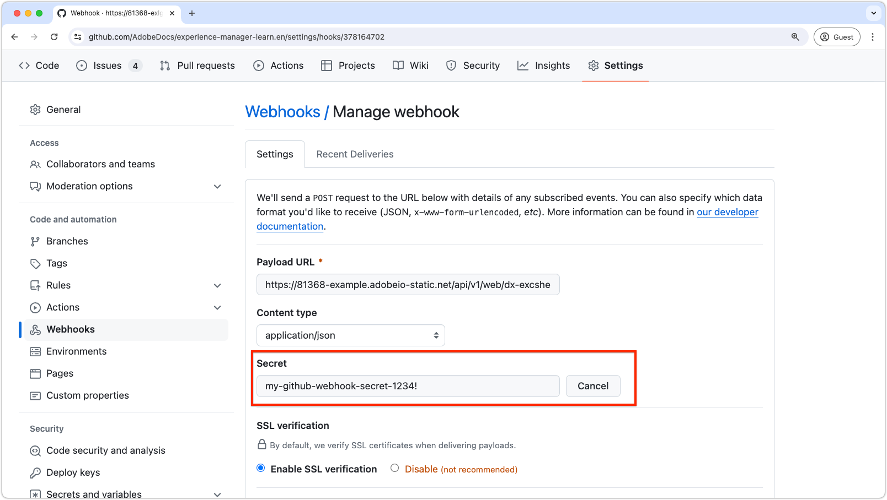

# Verifica webhook Github.com

I webhook ti consentono di creare o configurare integrazioni che si abbonano a determinati eventi su GitHub.com. Quando viene attivato uno di questi eventi, GitHub invia un payload POST HTTP all’URL configurato del webhook. Tuttavia, per motivi di sicurezza, è importante verificare che la richiesta del webhook in ingresso provenga effettivamente da GitHub e non da un attore dannoso. Questa esercitazione ti guida attraverso i passaggi per verificare una richiesta di webhook GitHub.com in un&#39;azione di App Builder di Adobe utilizzando un segreto condiviso.

## Configurare il segreto Github in AppBuilder

1. **Aggiungi segreto a `.env` file:**

   Nel progetto App Builder di `.env` , aggiungi una chiave personalizzata per il segreto del webhook GitHub.com:

   ```env
   # Specify your secrets here
   # This file must not be committed to source control
   ...
   GITHUB_SECRET=my-github-webhook-secret-1234!
   ```

2. **Aggiorna `ext.config.yaml` file:**

   Il `ext.config.yaml` è necessario aggiornare il file per verificare la richiesta del webhook GitHub.com.

   - Impostare l&#39;azione AppBuilder `web` configurazione a `raw` per ricevere il corpo della richiesta non elaborato da GitHub.com.
   - Sotto `inputs` nella configurazione dell&#39;azione AppBuilder, aggiungi `GITHUB_SECRET` chiave, mappatura `.env` campo contenente il segreto. Il valore di questa chiave è `.env` nome campo con prefisso `$`.
   - Imposta il `require-adobe-auth` annotazione nella configurazione dell&#39;azione AppBuilder a `false` per consentire la chiamata dell’azione senza richiedere l’autenticazione Adobe.

   Il risultato `ext.config.yaml` Il file deve avere un aspetto simile al seguente:

   ```yaml
   operations:
     view:
       - type: web
         impl: index.html
   actions: actions
   web: web-src
   runtimeManifest:
     packages:
       dx-excshell-1:
         license: Apache-2.0
         actions:
           github-to-jira:
             function: actions/generic/index.js
             web: 'raw'
             runtime: nodejs:20
             inputs:
               LOG_LEVEL: debug
               GITHUB_SECRET: $GITHUB_SECRET
             annotations:
               require-adobe-auth: false
               final: true
   ```

## Aggiungi codice di verifica all&#39;azione AppBuilder

Aggiungi quindi il codice JavaScript fornito di seguito (copiato da [Documentazione di GitHub.com](https://docs.github.com/en/webhooks/using-webhooks/validating-webhook-deliveries#javascript-example)) all&#39;azione AppBuilder. Assicurati di esportare la `verifySignature` funzione.

```javascript
// src/dx-excshell-1/actions/generic/github-webhook-verification.js

let encoder = new TextEncoder();

async function verifySignature(secret, header, payload) {
    let parts = header.split("=");
    let sigHex = parts[1];

    let algorithm = { name: "HMAC", hash: { name: 'SHA-256' } };

    let keyBytes = encoder.encode(secret);
    let extractable = false;
    let key = await crypto.subtle.importKey(
        "raw",
        keyBytes,
        algorithm,
        extractable,
        [ "sign", "verify" ],
    );

    let sigBytes = hexToBytes(sigHex);
    let dataBytes = encoder.encode(payload);
    let equal = await crypto.subtle.verify(
        algorithm.name,
        key,
        sigBytes,
        dataBytes,
    );

    return equal;
}

function hexToBytes(hex) {
    let len = hex.length / 2;
    let bytes = new Uint8Array(len);

    let index = 0;
    for (let i = 0; i < hex.length; i += 2) {
        let c = hex.slice(i, i + 2);
        let b = parseInt(c, 16);
        bytes[index] = b;
        index += 1;
    }

    return bytes;
}

module.exports = { verifySignature };
```

## Implementare la verifica nell’azione di AppBuilder

Successivamente, verifica che la richiesta provenga da GitHub confrontando la firma nell’intestazione della richiesta con la firma generata da `verifySignature` funzione.

Nel campo dell&#39;azione AppBuilder `index.js`, aggiungi il seguente codice al `main` funzione:


```javascript
// src/dx-excshell-1/actions/generic/index.js

const { verifySignature } = require("./github-webhook-verification");
...

// Main function that will be executed by Adobe I/O Runtime
async function main(params) {
  // Create a Logger
  const logger = Core.Logger("main", { level: params?.LOG_LEVEL || "info" });

  try {
    // Log parameters if LOG_LEVEL is 'debug'
    logger.debug(stringParameters(params));

    // Define required parameters and headers
    const requiredParams = [
      // Verifies the GITHUB_SECRET is present in the action's configuration; add other parameters here as needed.
      "GITHUB_SECRET"
    ];

    const requiredHeaders = [
      // Require the x-hub-signature-256 header, which GitHub.com populates with a sha256 hash of the payload
      "x-hub-signature-256"
    ];

    // Check for missing required parameters and headers
    const errorMessage = checkMissingRequestInputs(params, requiredParams, requiredHeaders);

    if (errorMessage) {
      // Return and log client errors
      return errorResponse(400, errorMessage, logger);
    }

    // Decode the request body (which is base64 encoded) to a string
    const body = Buffer.from(params.__ow_body, 'base64').toString('utf-8');

    // Verify the GitHub webhook signature
    const isSignatureValid = await verifySignature(
      params.GITHUB_SECRET,
      params.__ow_headers["x-hub-signature-256"],
      body
    );

    if (!isSignatureValid) {
      // GitHub signature verification failed
      return errorResponse(401, "Unauthorized", logger);
    } else {
      logger.debug("Signature verified");
    }

    // Parse the request body as JSON so its data is useful in the action
    const githubParams = JSON.parse(body) || {};

    // Optionally, merge the GitHub webhook request parameters with the action parameters
    const mergedParams = {
      ...params,
      ...githubParams
    };

    // Do work based on the GitHub webhook request
    doWork(mergedParams);

    return {
      statusCode: 200,
      body: { message: "GitHub webhook received and processed!" }
    };

  } catch (error) {
    // Log any server errors
    logger.error(error);
    // Return with 500 status code
    return errorResponse(500, "Server error", logger);
  }
}
```

## Configurare il webhook in GitHub

Tornando a GitHub.com, fornisci lo stesso valore segreto a GitHub.com durante la creazione del webhook. Utilizza il valore segreto specificato nel `.env` del file `GITHUB_SECRET` chiave.

In GitHub.com, vai alle impostazioni dell’archivio e modifica il webhook. Nelle impostazioni del webhook, specifica il valore segreto in `Secret` campo. Clic __Aggiorna webhook__ nella parte inferiore per salvare le modifiche.



Seguendo questi passaggi, assicurati che l’azione di App Builder possa verificare in modo sicuro che le richieste di webhook in ingresso provengano effettivamente dal webhook GitHub.com.
