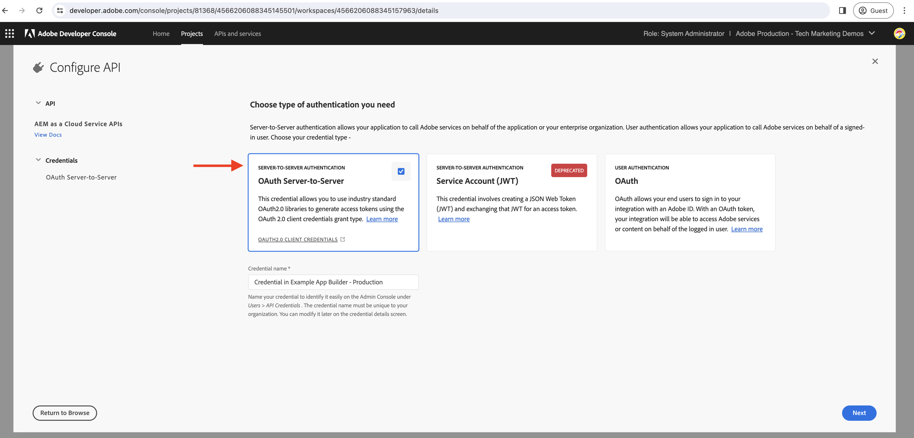

# Generare token di accesso server-to-server nell’azione di App Builder

Le azioni di App Builder potrebbero dover interagire con le API Adobe che supportano **Credenziali server-to-server OAuth** e sono associati ai progetti della console Adobe Developer in cui viene distribuita l’app App Builder.

Questa guida spiega come generare un token di accesso utilizzando _Credenziali server-to-server OAuth_ da utilizzare in un&#39;azione di App Builder.

>[!IMPORTANT]
>
> Le credenziali dell’account di servizio (JWT) sono state dichiarate obsolete e sostituite dalle credenziali server-to-server OAuth. Tuttavia, esistono ancora alcune API di Adobe che supportano solo le credenziali dell’account di servizio (JWT) e la migrazione a OAuth Server-to-Server è in corso. Consulta la documentazione API di Adobe per capire quali credenziali sono supportate.

## Configurazioni dei progetti per la console Adobe Developer

Quando aggiungi l’API Adobe desiderata al progetto Adobe Developer Console, nel _Configurare API_ , seleziona la **OAuth Server-to-Server** tipo di autenticazione.



Per assegnare l’account del servizio di integrazione creato automaticamente di cui sopra, seleziona il profilo di prodotto desiderato. Pertanto, tramite il profilo di prodotto, vengono controllate le autorizzazioni dell’account di servizio.


## file .env

Nel progetto App Builder di `.env` file, aggiungi le chiavi personalizzate per le credenziali server-to-server OAuth del progetto Adobe Developer Console. I valori delle credenziali da server a server OAuth possono essere ottenuti dal file di progetto della console Adobe Developer __Credenziali__ > __OAuth Server-to-Server__ per una determinata area di lavoro.


```
...
OAUTHS2S_CLIENT_ID=58b23182d80a40fea8b12bc236d71167
OAUTHS2S_CLIENT_SECRET=p8e-EIRF6kY6EHLBSdw2b-pLUWKodDqJqSz3
OAUTHS2S_CECREDENTIALS_METASCOPES=AdobeID,openid,ab.manage,additional_info.projectedProductContext,read_organizations,read_profile,account_cluster.read
```

I valori per `OAUTHS2S_CLIENT_ID`, `OAUTHS2S_CLIENT_SECRET`, `OAUTHS2S_CECREDENTIALS_METASCOPES` possono essere copiate direttamente dalla schermata Credenziali server-to-server OAuth del progetto Adobe Developer Console.

## Mappatura degli input

Con il valore delle credenziali server-to-server OAuth impostato in `.env` , devono essere mappati agli input dell&#39;azione AppBuilder in modo da poter essere letti nell&#39;azione stessa. A questo scopo, aggiungi voci per ciascuna variabile nella `ext.config.yaml` azione `inputs` nel formato: `PARAMS_INPUT_NAME: $ENV_KEY`.

Ad esempio:

```yaml
operations:
  view:
    - type: web
      impl: index.html
actions: actions
runtimeManifest:
  packages:
    dx-excshell-1:
      license: Apache-2.0
      actions:
        generic:
          function: actions/generic/index.js
          web: 'yes'
          runtime: nodejs:16
          inputs:
            LOG_LEVEL: debug
            OAUTHS2S_CLIENT_ID: $OAUTHS2S_CLIENT_ID
            OAUTHS2S_CLIENT_SECRET: $OAUTHS2S_CLIENT_SECRET
            OAUTHS2S_CECREDENTIALS_METASCOPES: $OAUTHS2S_CECREDENTIALS_METASCOPES
          annotations:
            require-adobe-auth: false
            final: true
```

Le chiavi definite in `inputs` sono disponibili sul `params` oggetto fornito all&#39;azione di App Builder.

## Credenziali server-to-server OAuth per accedere al token

Nell&#39;azione di App Builder, le credenziali server-to-server OAuth sono disponibili nel `params` oggetto. Utilizzando queste credenziali il token di accesso può essere generato utilizzando [Librerie OAuth 2.0](https://oauth.net/code/). Oppure puoi utilizzare il [Libreria di recupero nodi](https://www.npmjs.com/package/node-fetch) per effettuare una richiesta POST all’endpoint del token Adobe IMS per ottenere il token di accesso.

L&#39;esempio seguente illustra come utilizzare il `node-fetch` per effettuare una richiesta POST all’endpoint del token Adobe IMS per ottenere il token di accesso.

```javascript
const fetch = require("node-fetch");
const { Core } = require("@adobe/aio-sdk");
const { errorResponse, stringParameters, checkMissingRequestInputs } = require("../utils");

async function main(params) {
  const logger = Core.Logger("main", { level: params.LOG_LEVEL || "info" });

  try {
    // Perform any necessary input error checking
    const systemErrorMessage = checkMissingRequestInputs(params, ["OAUTHS2S_CLIENT_ID", "OAUTHS2S_CLIENT_SECRET", "OAUTHS2S_CECREDENTIALS_METASCOPES"], []);

    // The Adobe IMS token endpoint URL
    const adobeIMSV3TokenEndpointURL = 'https://ims-na1.adobelogin.com/ims/token/v3';

    // The POST request options
    const options = {
        method: 'POST',
        headers: {
        'Content-Type': 'application/x-www-form-urlencoded',
        },
        body: `grant_type=client_credentials&client_id=${params.OAUTHS2S_CLIENT_ID}&client_secret=${params.OAUTHS2S_CLIENT_SECRET}&scope=${params.OAUTHS2S_CECREDENTIALS_METASCOPES}`,
    };

    // Make a POST request to the Adobe IMS token endpoint to get the access token
    const tokenResponse = await fetch(adobeIMSV3TokenEndpointURL, options);
    const tokenResponseJSON = await tokenResponse.json();

    // The 24-hour IMS Access Token is used to call the AEM Data Service API
    // Can look at caching this token for 24 hours to reduce calls
    const accessToken = tokenResponseJSON.access_token;

    // Invoke an AEM Data Service API using the access token
    const aemDataResponse = await fetch(`https://api.adobeaemcloud.com/adobe/stats/statistics/contentRequestsQuota?imsOrgId=${IMS_ORG_ID}&current=true`, {
      headers: {
        'X-Adobe-Accept-Experimental': '1',
        'x-gw-ims-org-id': IMS_ORG_ID,
        'X-Api-Key': params.OAUTHS2S_CLIENT_ID,
        Authorization: `Bearer ${access_token}`, // The 24-hour IMS Access Token
      },
      method: "GET",
    });

    if (!aemDataResponse.ok) { throw new Error("Request to API failed with status code " + aemDataResponse.status);}

    // API data
    let data = await aemDataResponse.json();

    const response = {
      statusCode: 200,
      body: data,
    };

    return response;
  } catch (error) {
    logger.error(error);
    return errorResponse(500, "server error", logger);
  }
}

exports.main = main;
```
