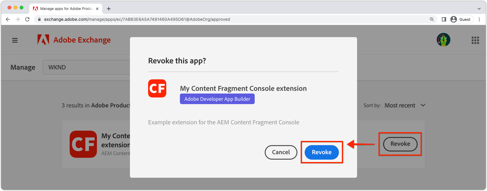

# Distribuire un&#39;estensione

Per l’utilizzo in ambienti AEM as a Cloud Service, l’app App Builder dell’estensione deve essere implementata e approvata.

Ci sono diverse considerazioni di cui tenere conto quando si distribuiscono le app App Builder di estensione:

+ Le estensioni vengono distribuite nell’area di lavoro del progetto di Adobe Developer Console. Le aree di lavoro predefinite sono:
   + __Produzione__ L’area di lavoro contiene distribuzioni di estensioni disponibili in tutti gli as a Cloud Service AEM.
   + __Fase__ workspace funge da workspace per sviluppatori. Le estensioni distribuite nell’area di lavoro di Stage non sono disponibili in AEM as a Cloud Service.
Le aree di lavoro della console Adobe Developer non hanno alcuna correlazione diretta con i tipi di ambiente as a Cloud Service AEM.
+ Un’estensione distribuita nell’area di lavoro di produzione viene visualizzata in tutti gli ambienti AEM as a Cloud Service nell’organizzazione di Adobe in cui esiste l’estensione.
Un&#39;estensione non può essere limitata agli ambienti in cui è registrata aggiungendo [logica condizionale che controlla il nome host as a Cloud Service dall’AEM](https://developer.adobe.com/uix/docs/guides/publication/#enabling-extension-only-on-specific-aem-environments).
+ È possibile utilizzare più estensioni su AEM as a Cloud Service. L’Adobe consiglia di utilizzare ogni app App Builder di estensione per risolvere un singolo obiettivo di business. Detto questo, un’app App Builder con una singola estensione può implementare più punti di estensione che supportano un obiettivo di business comune.

## Distribuzione iniziale

Affinché un’estensione sia disponibile negli ambienti AEM as a Cloud Service, deve essere implementata nella console Adobe Developer.

Il processo di distribuzione è suddiviso in due fasi logiche:

1. Implementazione dell’app App Builder per l’estensione nella console Adobe Developer da parte di uno sviluppatore.
1. Approvazione dell’estensione da parte di un Responsabile dell’implementazione o di un Proprietario business.

### Distribuire l’app App Builder dell’estensione

Distribuisci l’estensione nell’area di lavoro di produzione. Le estensioni distribuite nell’area di lavoro di produzione vengono aggiunte automaticamente a tutti i servizi di authoring as a Cloud Service dell’AEM nell’organizzazione Adobe in cui viene distribuita l’estensione.

1. Apri una riga di comando nella directory principale dell&#39;app App Builder aggiornata dell&#39;estensione.
1. Assicurati che l’area di lavoro di produzione sia attiva

   ```shell
   $ aio app use -w Production
   ```

   Unisci eventuali modifiche apportate a `.env` e `.aio`.

1. Distribuisci l&#39;app App Builder aggiornata dell&#39;estensione.

   ```shell
   $ aio app deploy
   ```

#### Richiedi approvazione distribuzione

{align="center"}

1. Accedi a [Console Adobe Developer](https://developer.adobe.com)
1. Seleziona __Console__
1. Accedi a __Progetti__
1. Seleziona il progetto associato all’estensione
1. Seleziona la __Produzione__ workspace
1. Seleziona __Invia per approvazione__
1. Completa e invia il modulo, aggiornando i campi in base alle esigenze.

Tieni presente che è necessaria un’icona. Se non disponi di un’icona, puoi utilizzare [questa icona](./assets/deploy/icon.png).

### Approvare la richiesta di distribuzione

{align="center"}

1. Accedi a [Scambio Adobe](https://exchange.adobe.com/)
1. Accedi a __Gestisci__ > __App in attesa di revisione__
1. __Revisione__ l’app App Builder per l’estensione
1. Se le modifiche dell’estensione sono accettabili __Accetta__ la revisione. Questo inietta immediatamente l’estensione su tutti i servizi di authoring as a Cloud Service dell’AEM all’interno dell’organizzazione Adobe.

Una volta approvata la richiesta di estensione, questa diventa immediatamente attiva nei servizi di authoring as a Cloud Service dell’AEM.

## Aggiornare un’estensione

L&#39;aggiornamento e l&#39;estensione dell&#39;app App Builder seguono lo stesso processo dell&#39; [distribuzione iniziale](#initial-deployment), con la deviazione che la distribuzione dell’estensione esistente deve prima essere revocata.

### Revocare l’estensione

Per distribuire una nuova versione di un&#39;estensione, è necessario prima revocarla o rimuoverla. L’estensione è revocata ma non è disponibile nelle console AEM.

1. Accedi a [Scambio Adobe](https://exchange.adobe.com/)
1. Accedi a __Gestisci__ > __App di App Builder__
1. __Revoca__ l’estensione da aggiornare

### Distribuire l’estensione

Distribuisci l’estensione nell’area di lavoro di produzione. Le estensioni distribuite nell’area di lavoro di produzione vengono aggiunte automaticamente a tutti i servizi di authoring as a Cloud Service dell’AEM nell’organizzazione Adobe in cui viene distribuita l’estensione.

1. Apri una riga di comando nella directory principale dell&#39;app App Builder aggiornata dell&#39;estensione.
1. Assicurati che l’area di lavoro di produzione sia attiva

   ```shell
   $ aio app use -w Production
   ```

   Unisci eventuali modifiche apportate a `.env` e `.aio`.

1. Distribuisci l&#39;app App Builder aggiornata dell&#39;estensione.

   ```shell
   $ aio app deploy
   ```

#### Richiedi approvazione distribuzione

{align="center"}

1. Accedi a [Console Adobe Developer](https://developer.adobe.com)
1. Seleziona __Console__
1. Accedi a __Progetti__
1. Seleziona il progetto associato all’estensione
1. Seleziona la __Produzione__ workspace
1. Seleziona __Invia per approvazione__
1. Completa e invia il modulo, aggiornando i campi in base alle esigenze.

#### Approvare la richiesta di distribuzione

{align="center"}

1. Accedi a [Scambio Adobe](https://exchange.adobe.com/)
1. Accedi a __Gestisci__ > __App in attesa di revisione__
1. __Revisione__ l’app App Builder per l’estensione
1. Se le modifiche dell’estensione sono accettabili __Accetta__ la revisione. Questo inietta immediatamente l’estensione su tutti i servizi di authoring as a Cloud Service dell’AEM all’interno dell’organizzazione Adobe.

Una volta approvata la richiesta di estensione, questa diventa immediatamente attiva nei servizi di authoring as a Cloud Service dell’AEM.

## Rimuovere un’estensione



Per rimuovere un&#39;estensione, revocarla o rimuoverla da Adobe Exchange. Quando l’estensione viene revocata, viene rimossa da tutti i servizi di authoring as a Cloud Service dell’AEM.

1. Accedi a [Scambio Adobe](https://exchange.adobe.com/)
1. Accedi a __Gestisci__ > __App di App Builder__
1. __Revoca__ l’estensione da rimuovere
