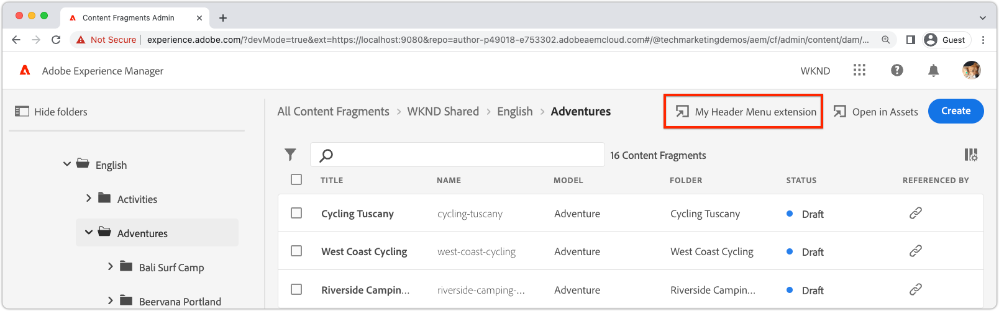

# Registrazione delle estensioni

AEM le estensioni della console Frammenti di contenuto sono app specializzate di App Builder, basate su React e utilizzano l’ [React Spectrum](https://react-spectrum.adobe.com/react-spectrum/) Framework di interfaccia utente.

Per definire dove e come viene visualizzata la AEM console Frammenti di contenuto l’estensione, nell’app App Builder dell’estensione sono necessarie due configurazioni specifiche: routing dell&#39;app e registrazione dell&#39;estensione.

## Indirizzi delle app{#app-routes}

L&#39;estensione `App.js` dichiara la [Reagisce router](https://reactrouter.com/en/main) che include una route di indice che registra l&#39;estensione nella AEM console Frammenti di contenuto.

La route di indice viene richiamata quando viene inizialmente caricata AEM console Frammenti di contenuto e la destinazione di questo percorso definisce come l&#39;estensione viene esposta nella console.

+ `./src/aem-cf-console-admin-1/web-src/src/components/App.js`

```javascript
import ExtensionRegistration from "./ExtensionRegistration"
...            
function App(props) {
  return (
    <Router>
      <ErrorBoundary onError={onError} FallbackComponent={fallbackComponent}>
        <Routes>
          {/* The index route maps to the extension registration */}
          <Route index element={<ExtensionRegistration />} />
          ...                                   
        </Routes>
      </ErrorBoundary>
    </Router>
  )
  ...
}
```

## Registrazione delle estensioni

`ExtensionRegistration.js` deve essere caricato immediatamente tramite la via di indicizzazione dell&#39;estensione e agisce sul punto di registrazione dell&#39;estensione, definendo:

1. il tipo di estensione; a [menu intestazione](./header-menu.md) o [barra delle azioni](./action-bar.md) pulsante .
   + [Menu Intestazione](./header-menu.md#extension-registration) le estensioni sono identificate dalle `headerMenu` proprietà sotto `methods`.
   + [Barra delle azioni](./action-bar.md#extension-registration) le estensioni sono identificate dalle `actionBar` proprietà sotto `methods`.
1. Definizione del pulsante di estensione, in `getButton()` funzione . Questa funzione restituisce un oggetto con campi:
   + `id` è un ID univoco per il pulsante
   + `label` è l’etichetta del pulsante di estensione nella console Frammento di contenuto AEM
   + `icon` è l’icona del pulsante di estensione nella console Frammento di contenuto AEM. L’icona è un [React Spectrum](https://spectrum.adobe.com/page/icons/) nome dell’icona, con gli spazi rimossi.
1. Gestore di clic per il pulsante, in definito in un `onClick()` funzione .
   + [Menu Intestazione](./header-menu.md#extension-registration) Le estensioni non trasmettono parametri al gestore di clic.
   + [Barra delle azioni](./action-bar.md#extension-registration) Le estensioni forniscono un elenco dei percorsi di frammento di contenuto selezionati nella sezione `selections` parametro .

### Estensione Menu intestazione



I pulsanti di estensione del menu intestazione vengono visualizzati quando non è selezionato alcun frammento di contenuto. Poiché le estensioni del menu di intestazione non agiscono in una selezione di frammenti di contenuto, non vengono forniti frammenti di contenuto al relativo `onClick()` handler.

+ `./src/aem-cf-console-admin-1/web-src/src/components/ExtensionRegistration.js`

```javascript
function ExtensionRegistration() {
  const init = async () => {
    const guestConnection = await register({
      id: extensionId, // A unique ID for the extension
      methods: {
        // Configure your Action Bar button here
        headerMenu: {
          getButton() {
            return {
              'id': 'example.my-header-menu-extension', // Unique ID for the button
              'label': 'My header menu extension',      // Button label 
              'icon': 'Edit'                            // Button icon from https://spectrum.adobe.com/page/icons/
            }
          },

          // Click handler for the extension button
          // Header Menu extensions do not pass parameters to the click handler
          onClick() { ... }
        }
      }
    })
  }
  init().catch(console.error)
}
```

<div class="column is-8-desktop is-full-mobile is-half-tablet" style="
    border: solid 1px #ccc;
    border-radius: 10px;
    margin: 4rem auto;
">
  <div class="is-flex is-padded-small is-padded-big-mobile">
    <div>
      <p class="has-text-weight-bold is-size-36 is-size-27-touch is-margin-bottom-big has-text-blackest">Passa alla creazione di un’estensione del menu di intestazione</p>
      <p class="has-text-blackest">Scopri come registrare e definire un’estensione del menu di intestazione nella AEM console Frammenti di contenuto .</p>
      <div class="has-align-start is-margin-top-big">
        <a href="./header-menu.md" target="_blank" class="spectrum-Button spectrum-Button--outline spectrum-Button--primary spectrum-Button--sizeM">
          <span class="spectrum-Button-label has-no-wrap has-text-weight-bold" title="Scopri come creare un’estensione del menu di intestazione">Scopri come creare un’estensione del menu di intestazione</span>
        </a>
      </div>
    </div>
  </div>
</div>

### Estensione barra delle azioni


I pulsanti di estensione della barra delle azioni vengono visualizzati quando si selezionano uno o più frammenti di contenuto. I percorsi selezionati del frammento di contenuto sono resi disponibili all’estensione tramite `selections` nel `onClick(..)` handler.

+ `./src/aem-cf-console-admin-1/web-src/src/components/ExtensionRegistration.js`

```javascript
function ExtensionRegistration() {
  const init = async () => {
    const guestConnection = await register({
      id: extensionId, // A unique ID for the extension
      methods: {
        // Configure your Action Bar button here
        actionBar: {
          getButton() {
            return {
              'id': 'example.my-action-bar-extension',  // Unique ID for the button
              'label': 'My action bar extension',       // Button label 
              'icon': 'Edit'                            // Button icon from https://spectrum.adobe.com/page/icons/
            }
          },

          // Click handler for the extension button
          // Only Action Bar buttons populate the selections parameter
          onClick(selections) { ... }
        }
      }
    })
  }
  init().catch(console.error)
}
```

<div class="column is-8-desktop is-full-mobile is-half-tablet" style="
    border: solid 1px #ccc;
    border-radius: 10px;
    margin: 4rem auto;
">
  <div class="is-flex is-padded-small is-padded-big-mobile">
    <div>
      <p class="has-text-weight-bold is-size-36 is-size-27-touch is-margin-bottom-big has-text-blackest">Passa alla creazione di un'estensione della barra delle azioni</p>
      <p class="has-text-blackest">Scopri come registrare e definire un’estensione della barra delle azioni nella AEM console Frammenti di contenuto .</p>
      <div class="has-align-start is-margin-top-big">
        <a href="./action-bar.md" target="_blank" class="spectrum-Button spectrum-Button--outline spectrum-Button--primary spectrum-Button--sizeM">
          <span class="spectrum-Button-label has-no-wrap has-text-weight-bold" title="Scopri come creare un’estensione della barra delle azioni">Scopri come creare un’estensione della barra delle azioni</span>
        </a>
      </div>
    </div>
  </div>
</div>

## Includi estensioni in modo condizionale

AEM le estensioni della console Frammenti di contenuto possono eseguire logiche personalizzate per limitare l’aspetto dell’estensione nella console Frammenti di contenuto AEM. Questo controllo viene eseguito prima del `register` chiama `ExtensionRegistration` e restituisce immediatamente se l&#39;estensione non deve essere visualizzata.

Questo controllo ha un contesto limitato disponibile:

+ L&#39;host AEM su cui viene caricata l&#39;estensione.
+ Token di accesso AEM dell&#39;utente corrente.

I controlli più comuni per il caricamento di un&#39;estensione sono:

+ Utilizzo dell’host AEM (`new URLSearchParams(window.location.search).get('repo')`) per determinare se l&#39;estensione deve essere caricata.
   + Mostra l’estensione solo AEM ambienti che fanno parte di un programma specifico (come mostrato nell’esempio di seguito).
   + Mostra l’estensione solo in un ambiente AEM specifico (ad es. AEM host).
+ Utilizzo di un [Azione Adobe I/O Runtime](./runtime-action.md) per effettuare una chiamata HTTP a AEM per determinare se l&#39;utente corrente deve visualizzare l&#39;estensione.

L&#39;esempio seguente illustra la limitazione dell&#39;estensione a tutti gli ambienti del programma `p12345`.

+ `./src/aem-cf-console-admin-1/web-src/src/components/ExtensionRegistration.js`

```javascript
function ExtensionRegistration() {
  const PROGRAM_ID = 'p12345';

  // Get the current AEM Host (author-pXXX-eYYY.adobeaemcloud.com) the extension is loading on
  const aemHost = new URLSearchParams(window.location.search).get('repo');

  // Create a check to determine if the current AEM host matches the AEM program that uses this extension 
  const aemHostRegex = new RegExp(`^author-${PROGRAM_ID}-e[\\d]+\\.adobeaemcloud\\.com$`)

  // Disable the extension if the Cloud Manager Program Id doesn't match the regex.
  if (!aemHostRegex.test(aemHost)) {
    return; // Skip extension registration if the environment is not in program p12345.
  }

  // Else, continue initializing the extension
  const init = async () => { .. };
  
  init().catch(console.error);
}
```
