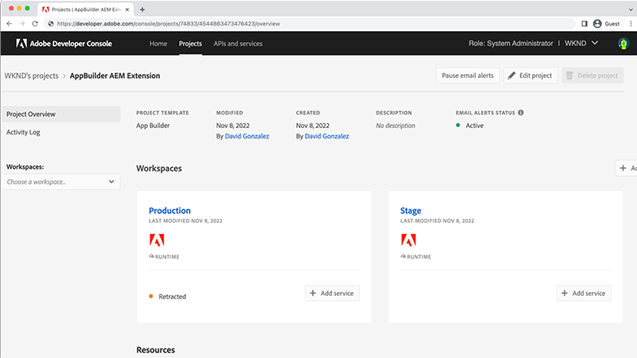
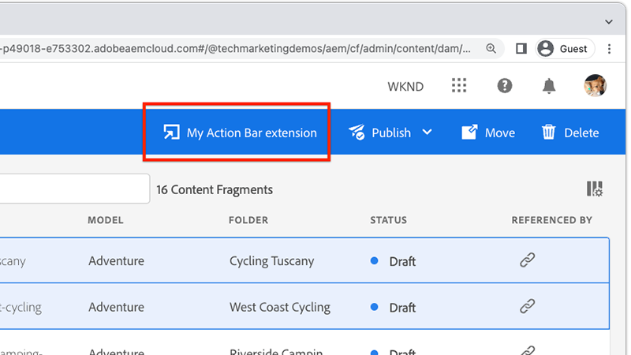

# Estensione della console Frammenti di contenuto AEM

[Console Frammenti di contenuto AEM](https://experienceleague.adobe.com/docs/experience-manager-cloud-service/content/sites/administering/content-fragments/content-fragments-console.html?lang=it) le estensioni possono essere aggiunte tramite due punti di estensione: un pulsante nella [Console Frammenti di contenuto](https://experienceleague.adobe.com/docs/experience-manager-cloud-service/content/sites/administering/content-fragments/content-fragments-console.html?lang=it) menu intestazione o barra delle azioni. Le estensioni sono scritte in JavaScript e vengono eseguite come app di App Builder; possono inoltre implementare un’interfaccia utente web personalizzata e azioni Adobe I/O Runtime senza server per eseguire operazioni più intensive e di lunga durata.

{align="center"}

| Tipo di estensione | Descrizione | Parametro/i |
| :--- | :--- | :--- |
| Menu intestazione | Aggiunge un pulsante all’intestazione che viene visualizzato quando __zero__ I frammenti di contenuto sono selezionati. | Nessuno. |
| Barra delle azioni | Aggiunge un pulsante alla barra delle azioni che viene visualizzato quando __uno o più__ I frammenti di contenuto sono selezionati. | Array dei percorsi dei frammenti di contenuto selezionati. |

Una singola estensione della Console Frammenti di contenuto AEM può includere zero o un menu di intestazione e zero o un tipo di estensione della barra delle azioni. Se sono necessari più tipi di estensione dello stesso tipo, è necessario creare più estensioni della console Frammenti di contenuto AEM.

Le estensioni della console Frammenti di contenuto AEM richiedono un [Progetto console Adobe Developer](https://developer.adobe.com/uix/docs/services/aem-cf-console-admin/extension-development/#create-a-project-in-adobe-developer-console) e un [App Builder](https://developer.adobe.com/uix/docs/services/aem-cf-console-admin/code-generation) utilizzando `@adobe/aem-cf-admin-ui-ext-tpl` modello, associato al progetto della console Adobe Developer.

Seleziona una delle seguenti funzionalità per generare l&#39;app di App Builder, in base alle funzioni dell&#39;estensione. È possibile utilizzare qualsiasi combinazione di opzioni in un’estensione.

|  | Aggiungi pulsante a [Menu intestazione](./header-menu.md) | Aggiungi pulsante a [Barra delle azioni](./action-bar.md) | Spettacolo [Modale](./modal.md) | Aggiungi [gestore lato server](./runtime-action.md) |
| ------------------------------------------ | :-----------------------: | :----------------------: | :--------: | :--------------------:  |
| Disponibile quando i frammenti di contenuto non sono selezionati | ✔ |  |  |  |
| Disponibile quando sono selezionati uno o più frammenti di contenuto |  | ✔ |  |  |
| Raccoglie input personalizzati dall&#39;utente |  |  | ✔️ |  |
| Visualizza feedback personalizzato per l&#39;utente |  |  | ✔️ |  |
| Richiama le richieste HTTP all’AEM |  |  |  | ✔ |
| Richiama richieste HTTP ai servizi di Adobe/terze parti |  |  |  | ✔ |

## Documentazione di Adobe Developer

Adobe Developer contiene informazioni per gli sviluppatori sulle estensioni della Console Frammenti di contenuto AEM. Rivedi il [Contenuto Adobe Developer per ulteriori dettagli tecnici](https://developer.adobe.com/uix/docs/).

## Sviluppare un’estensione

Segui i passaggi descritti di seguito per scoprire come generare, sviluppare e distribuire un’estensione della console Frammenti di contenuto AEM per AEM as a Cloud Service.

    <!-- Create Adobe Developer Project -->
    

        

            

                <figure class="image is-16by9">
                    
                </figure>
            

            

                

                    
1. Creare un progetto

                    
Crea un progetto Adobe Developer Console che ne definisce l’accesso ad altri servizi Adobe e ne gestisce le implementazioni.

                    <a href="./adobe-developer-console-project.md" class="spectrum-Button spectrum-Button--outline spectrum-Button--primary spectrum-Button--sizeM">
                        Creazione di un progetto Adobe Developer
                    </a>
                

            

        

    

    <!-- Generate an Extension app -->
    

        

            

                <figure class="image is-16by9">
                    
                </figure>
            

            

                

                    
2. Inizializzare un’app di estensione

                    
Inizializza un’app App Builder per l’estensione della Console Frammenti di contenuto AEM che definisce dove viene visualizzata l’estensione e il lavoro che esegue.

                    <a href="./app-initialization.md" class="spectrum-Button spectrum-Button--outline spectrum-Button--primary spectrum-Button--sizeM">
                        Inizializzare un’app di estensione
                    </a>
                

            

        

    

    <!-- Extension registration -->
    

        

            

                <figure class="image is-16by9">
                    
                </figure>
            

            

                

                    
3. Registrazione dell’estensione

                    
Registra l’estensione nella console Frammenti di contenuto AEM come tipo di estensione per il menu dell’intestazione o la barra delle azioni.

                    <a href="./extension-registration.md" class="spectrum-Button spectrum-Button--outline spectrum-Button--primary spectrum-Button--sizeM">
                        Registrare l'estensione
                    </a>
                

            

        

    

    <!-- Header Menu -->
    

        

            

                <figure class="image is-16by9">
                    
                </figure>
            

            

                

                    
4a. Menu intestazione

                    
Scopri come creare un’estensione del menu di intestazione della Console Frammenti di contenuto AEM.

                    <a href="./header-menu.md" class="spectrum-Button spectrum-Button--outline spectrum-Button--primary spectrum-Button--sizeM">
                        Estendere il menu dell’intestazione
                    </a>
                

            

        

    

    <!-- Action Bar -->
    

        

            

                <figure class="image is-16by9">
                    
                </figure>
            

            

                

                    
4b. Barra delle azioni

                    
Scopri come creare un’estensione della barra delle azioni della Console Frammenti di contenuto AEM.

                    <a href="./action-bar.md" class="spectrum-Button spectrum-Button--outline spectrum-Button--primary spectrum-Button--sizeM">
                        Estendere la barra delle azioni
                    </a>
                

            

        

    

    <!-- Modal -->
    

        

            

                <figure class="image is-16by9">
                    
                </figure>
            

            

                

                    
5. Modale

                    
Aggiungi all’estensione una finestra modale personalizzata che può essere utilizzata per creare esperienze personalizzate per gli utenti. I moduli spesso raccolgono input dagli utenti e visualizzano i risultati di un'operazione.

                    <a href="./modal.md" class="spectrum-Button spectrum-Button--outline spectrum-Button--primary spectrum-Button--sizeM">
                        Aggiungi un modale
                    </a>
                

            

        

    

    <!-- Adobe I/O Runtime action -->
    

        

            

                <figure class="image is-16by9">
                    
                </figure>
            

            

                

                    
6. Azione Adobe I/O Runtime

                    
Aggiungi un’azione Adobe I/O Runtime senza server che l’estensione può richiamare per interagire con Frammenti di contenuto e AEM per eseguire operazioni aziendali personalizzate.

                    <a href="./runtime-action.md" class="spectrum-Button spectrum-Button--outline spectrum-Button--primary spectrum-Button--sizeM">
                        Aggiungere un’azione Adobe I/O Runtime
                    </a>
                

            

        

    

    <!-- Test -->
    

        

            

                <figure class="image is-16by9">
                    
                </figure>
            

            

                

                    
7. Prova

                    
Verifica le estensioni durante lo sviluppo e condividi le estensioni completate ai tester QA o UAT utilizzando un URL speciale.

                    <a href="./test.md" class="spectrum-Button spectrum-Button--outline spectrum-Button--primary spectrum-Button--sizeM">
                        Testare l’estensione
                    </a>
                

            

        

    

    <!-- Extension deployment -->
    

        

            

                <figure class="image is-16by9">
                    
                </figure>
            

            

                

                    
8. Distribuzione nell’ambiente di produzione

                    
Distribuisci l’estensione in Adobe I/O, rendendola disponibile agli utenti AEM. È possibile aggiornare e rimuovere anche le estensioni.

                    <a href="./deploy.md" class="spectrum-Button spectrum-Button--outline spectrum-Button--primary spectrum-Button--sizeM">
                        Implementare in produzione
                    </a>
                

            

        

    

## Estensioni di esempio

Esempio di estensioni della console Frammenti di contenuto AEM.

    <!-- Bulk property update extension -->
    

        

            

                <figure class="image is-16by9">
                    
                </figure>
            

            

                

                    
Estensione di aggiornamento proprietà in blocco

                    
Esplora un esempio di estensione della barra delle azioni che aggiorna in blocco una proprietà nei frammenti di contenuto selezionati.

                    <a href="./example-extensions/bulk-property-update.md" class="spectrum-Button spectrum-Button--outline spectrum-Button--primary spectrum-Button--sizeM">
                        Esplora l’estensione di esempio
                    </a>
                

            

        

    

    <!-- Image Generartion update extension -->
    

        

            

                <figure class="image is-16by9">
                    
                </figure>
            

            

                

                    
Generazione di immagini basate su OpenAI e caricamento nell’estensione AEM

                    
Esplora un esempio di estensione della barra delle azioni che genera un’immagine utilizzando OpenAI, la carica sull’AEM e aggiorna la proprietà dell’immagine nel frammento di contenuto selezionato.

                    <a href="./example-extensions/image-generation-and-image-upload.md" class="spectrum-Button spectrum-Button--outline spectrum-Button--primary spectrum-Button--sizeM">
                        Esplora l’estensione di esempio
                    </a>
                

            

        

    

