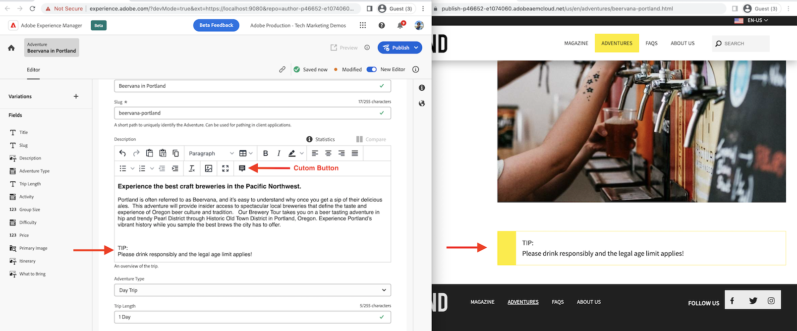

# Pulsante personalizzato sulla barra degli strumenti dell’Editor Rich Text

{align="center"}

È possibile aggiungere pulsanti personalizzati alla **Barra degli strumenti dell’editor Rich Text** nell’Editor frammento di contenuto utilizzando `rte` punto di estensione. Questo esempio mostra come aggiungere un pulsante personalizzato denominato _Aggiungi suggerimento_ sulla barra degli strumenti dell’editor Rich Text e modificare il contenuto all’interno dell’editor Rich Text.

Utilizzo di `rte` del punto di estensione `getCustomButtons()` metodo è possibile aggiungere uno o più pulsanti personalizzati al **Barra degli strumenti dell’editor Rich Text**. È inoltre possibile aggiungere o rimuovere pulsanti standard dell’editor Rich Text, come _Copia, Incolla, Grassetto e Corsivo_ utilizzo `getCoreButtons()` e `removeButtons)` metodi.

In questo esempio viene illustrato come inserire una nota o un suggerimento evidenziato utilizzando l&#39;opzione _Aggiungi suggerimento_ pulsante della barra degli strumenti. Il contenuto della nota o del suggerimento evidenziato presenta una formattazione speciale applicata tramite elementi HTML e le classi CSS associate. Il contenuto segnaposto e il codice HTML vengono inseriti utilizzando `onClick()` metodo di callback di `getCustomButtons()`.

## Punto di estensione

Questo esempio si estende al punto di estensione `rte` per aggiungere un pulsante personalizzato alla barra degli strumenti dell’Editor Rich Text nell’Editor frammento di contenuto.

| Interfaccia utente AEM estesa | Punto di estensione |
| ------------------------ | --------------------- | 
| [Editor frammento di contenuto](https://developer.adobe.com/uix/docs/services/aem-cf-editor/) | [Barra degli strumenti dell’editor Rich Text](https://developer.adobe.com/uix/docs/services/aem-cf-editor/api/rte-toolbar/) |

## Estensione di esempio

Nell&#39;esempio seguente viene creata una _Aggiungi suggerimento_ nella barra degli strumenti dell’editor Rich Text. L’azione clic inserisce il testo segnaposto nella posizione corrente del punto di inserimento nell’editor Rich Text.

Il codice mostra come aggiungere il pulsante personalizzato con un’icona e registrare la funzione di gestione dei clic.

### Registrazione dell’estensione

`ExtensionRegistration.js`, mappato alla route index.html, è il punto di ingresso per l&#39;estensione AEM e definisce:

+ Definizione del pulsante della barra degli strumenti dell’editor Rich Text in `getCustomButtons()` funzione con `id, tooltip and icon` attributi.
+ Il gestore di clic per il pulsante, nel `onClick()` funzione.
+ La funzione di gestione dei clic riceve `state` come argomento per ottenere il contenuto dell’editor Rich Text in formato HTML o testo. Tuttavia, in questo esempio non viene utilizzato.
+ La funzione del gestore di clic restituisce un array di istruzioni. Questo array ha un oggetto con `type` e `value` attributi. Per inserire il contenuto, `value` attributi frammento di codice HTML, il `type` utilizza l&#39; `insertContent`. Se è presente un caso d’uso per sostituire il contenuto, il caso d’uso `replaceContent` tipo di istruzione.

Il `insertContent` value è una stringa HTML, `<div class=\"cmp-contentfragment__element-tip\"><div>TIP</div><div>Add your tip text here...</div></div>`. Le classi CSS `cmp-contentfragment__element-tip` utilizzato per visualizzare il valore non sono definiti nel widget, ma sono implementati nell’esperienza web su cui viene visualizzato il campo Frammento di contenuto.


`src/aem-cf-editor-1/web-src/src/components/ExtensionRegistration.js`

```javascript
import { Text } from "@adobe/react-spectrum";
import { register } from "@adobe/uix-guest";
import { extensionId } from "./Constants";

// This function is called when the extension is registered with the host and runs in an iframe in the Content Fragment Editor browser window.
function ExtensionRegistration() {

  const init = async () => {
    const guestConnection = await register({
      id: extensionId,
      methods: {
        rte: {

          // RTE Toolbar custom button
          getCustomButtons: () => ([
            {
              id: "wknd-cf-tip",       // Provide a unique ID for the custom button
              tooltip: "Add Tip",      // Provide a label for the custom button
              icon: 'Note',            // Provide an icon for the button (see https://spectrum.adobe.com/page/icons/ for a list of available icons)
              onClick: (state) => {    // Provide a click handler function that returns the instructions array with type and value. This example inserts the HTML snippet for TIP content.
                return [{
                  type: "insertContent",
                  value: "<div class=\"cmp-contentfragment__element-tip\"><div>TIP</div><div>Add your tip text here...</div></div>"
                }];
              },
            },
          ]),
      }
    });
  };
  
  init().catch(console.error);

  return <Text>IFrame for integration with Host (AEM)...</Text>;
}
```
