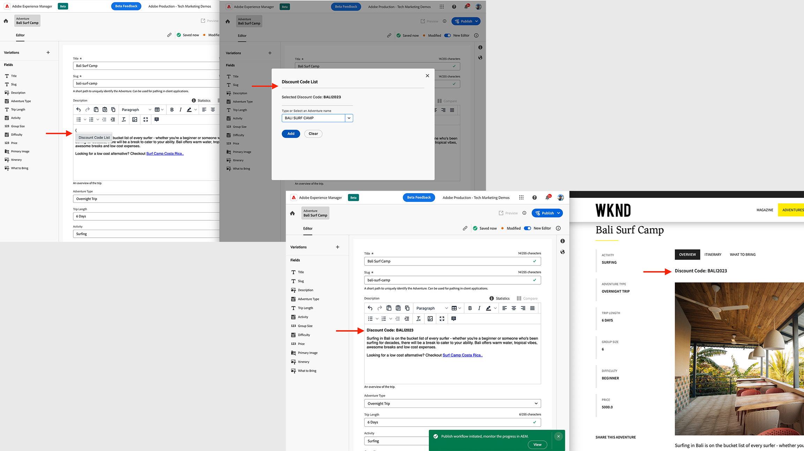

# Aggiungere widget all’editor Rich Text

{align="center"}

Per aggiungere contenuti dinamici nell’editor Rich Text, **widget** funzionalità. I widget consentono di integrare l’interfaccia utente semplice o complessa nell’editor Rich Text e l’interfaccia utente tramite il framework JS scelto. Possono essere considerati come finestre di dialogo aperte premendo `{` chiave speciale nell’editor Rich Text.

In genere, i widget vengono utilizzati per inserire il contenuto dinamico che ha una dipendenza di sistema esterna o che potrebbe cambiare in base al contesto corrente.

Il **widget** sono aggiunti al **RTE** nell’Editor frammento di contenuto utilizzando `rte` punto di estensione. Utilizzo di `rte` del punto di estensione `getWidgets()` metodo uno o più widget aggiunti. Vengono attivati premendo il tasto `{` tasto speciale per aprire l&#39;opzione del menu di scelta rapida, quindi selezionare il widget desiderato per caricare l&#39;interfaccia utente della finestra di dialogo personalizzata.

Questo esempio mostra come aggiungere un widget denominato _Lista codici sconto_ per trovare, selezionare e aggiungere il codice di sconto WKND specifico per l’avventura all’interno di un contenuto RTE. Questi codici di sconto possono essere gestiti in sistemi esterni come Order Management System (OMS), Product Information Management (PIM), applicazioni sviluppate in casa o un&#39;azione AppBuilder di Adobe.

Per semplificare, in questo esempio viene utilizzato [Spettro di reazione Adobe](https://react-spectrum.adobe.com/react-spectrum/index.html) framework per sviluppare l’interfaccia utente di widget o finestre di dialogo e il nome dell’avventura WKND hardcoded, dati con codice sconto.

## Punto di estensione

Questo esempio si estende al punto di estensione `rte` per aggiungere un widget all’editor Rich Text nell’Editor frammento di contenuto.

| Interfaccia utente AEM estesa | Punto di estensione |
| ------------------------ | --------------------- | 
| [Editor frammento di contenuto](https://developer.adobe.com/uix/docs/services/aem-cf-editor/) | [Widget editor Rich Text](https://developer.adobe.com/uix/docs/services/aem-cf-editor/api/rte-widgets/) |

## Estensione di esempio

Nell&#39;esempio seguente viene creata una _Lista codici sconto_ widget. Premendo il tasto `{` tasto speciale nell’editor Rich Text, viene aperto il menu di scelta rapida, quindi selezionando _Lista codici sconto_ dal menu di scelta rapida viene aperta la finestra di dialogo UI.

Gli autori di contenuti WKND possono trovare, selezionare e aggiungere il codice di sconto corrente specifico per Adventure, se disponibile.

### Registrazione dell’estensione

`ExtensionRegistration.js`, mappato alla route index.html, è il punto di ingresso per l&#39;estensione AEM e definisce:

+ La definizione del widget in `getWidgets()` funzione con `id, label and url` attributi.
+ Il `url` valore attributo, un percorso URL relativo (`/index.html#/discountCodes`) per caricare l&#39;interfaccia utente della finestra di dialogo.

`src/aem-cf-editor-1/web-src/src/components/ExtensionRegistration.js`

```javascript
import { Text } from "@adobe/react-spectrum";
import { register } from "@adobe/uix-guest";
import { extensionId } from "./Constants";

// This function is called when the extension is registered with the host and runs in an iframe in the Content Fragment Editor browser window.
function ExtensionRegistration() {

  const init = async () => {
    const guestConnection = await register({
      id: extensionId,
      methods: {
        rte: {

          // RTE Widgets
          getWidgets: () => [
            {
              id: "discountcode-list-widget",       // Provide a unique ID for the widget
              label: "Discount Code List",          // Provide a label for the widget
              url: "/index.html#/discountCodes",     // Provide the "relative" URL to the widget content. It will be resolved as `/index.html#/discountCodes`
            },
          ],
      }
    });
  };
  
  init().catch(console.error);

  return <Text>IFrame for integration with Host (AEM)...</Text>;
}
```

### Aggiungi `discountCodes` instradamento `App.js`{#add-widgets-route}

Nel componente React principale `App.js`, aggiungi `discountCodes` route per eseguire il rendering dell&#39;interfaccia utente per il percorso URL relativo indicato sopra.

`src/aem-cf-editor-1/web-src/src/components/App.js`

```javascript
...

<Routes>
  <Route index element={<ExtensionRegistration />} />
  <Route
    exact path="index.html"
    element={<ExtensionRegistration />}
  />

  {/* Content Fragment RTE routes that support the Discount Codes Widget functionality*/}
  <Route path="/discountCodes" element={<DiscountCodes />} />
</Routes>
...
```

### Crea `DiscountCodes` Componente React{#create-widget-react-component}

Il widget o l&#39;interfaccia utente della finestra di dialogo viene creata utilizzando [Spettro di reazione Adobe](https://react-spectrum.adobe.com/react-spectrum/index.html) infrastruttura. Il `DiscountCodes` il codice del componente è il seguente, dove sono evidenziati i principali elementi:

+ Il rendering dell’interfaccia utente viene eseguito utilizzando i componenti Spectrum di React, come [CasellaCombinata](https://react-spectrum.adobe.com/react-spectrum/ComboBox.html), [GruppoPulsanti](https://react-spectrum.adobe.com/react-spectrum/ButtonGroup.html), [Pulsante](https://react-spectrum.adobe.com/react-spectrum/Button.html)
+ Il `adventureDiscountCodes` array dispone della mappatura hardcoded di nome avventura e codice sconto. In uno scenario reale, questi dati possono essere recuperati da un’azione Adobe AppBuilder o da sistemi esterni come PIM, OMS o gateway API basato su provider cloud o home-based.
+ Il `guestConnection` viene inizializzato utilizzando `useEffect` [Gancio di reazione](https://react.dev/reference/react/useEffect) e gestito come stato componente. Viene utilizzato per comunicare con l’ospite dell’AEM.
+ Il `handleDiscountCodeChange` La funzione ottiene il codice sconto per il nome dell’avventura selezionata e aggiorna la variabile di stato.
+ Il `addDiscountCode` funzione che utilizza `guestConnection` L&#39;oggetto fornisce istruzioni RTE da eseguire. In questo caso `insertContent` frammento di codice di istruzioni e HTML del codice sconto effettivo da inserire nell’editor Rich Text.

`src/aem-cf-editor-1/web-src/src/components/DiscountCodes.js`

```javascript
import {
  Button,
  ButtonGroup,
  ComboBox,
  Content,
  Divider,
  Flex, Form,
  Item,
  Provider,
  Text,
  defaultTheme
} from '@adobe/react-spectrum';
import { attach } from '@adobe/uix-guest';
import React, { useEffect, useState } from 'react';
import { extensionId } from './Constants';

const DiscountCodes = () => {

  // The Adventure Discount Code list
  // In this example its hard coded, however you can call an Adobe AppBuilder Action or even make an AJAX call to load it from 3rd party system
  const adventureDiscountCodes = [
    { id: 1, adventureName: 'BALI SURF CAMP', discountCode: 'BALI2023' },
    { id: 2, adventureName: 'BEERVANA IN PORTLAND', discountCode: 'PORTFEST' },
    { id: 3, adventureName: 'NAPA WINE TASTING', discountCode: 'WINEINSPRING' },
    { id: 4, adventureName: 'RIVERSIDE CAMPING', discountCode: 'SUMMERSCAPE' },
    { id: 5, adventureName: 'TAHOE SKIING', discountCode: 'EPICPASS' },
  ];

  // Set up state used by the React component
  const [guestConnection, setGuestConnection] = useState();

  // State hooks to manage the component state
  const [discountCode, setDiscountCode] = useState(null);

  // Asynchronously attach the extension to AEM, we must wait or the guestConnection to be set before doing anything in the modal
  useEffect(() => {
    (async () => {
      const myGuestConnection = await attach({ id: extensionId });

      setGuestConnection(myGuestConnection);
    })();
  }, []);

  // Handle the `discountCodeList` Dropdown change
  const handleDiscountCodeChange = (key) => {

    if (key) {
      //console.log(`DiscountCode Key: ${key}`);
      //console.log(`DiscountCode Value: ${adventureDiscountCodes[key-1].discountCode}`);

      //Get discount code value using selected key/index
      let discountCodeValue = adventureDiscountCodes[key - 1].discountCode;

      //update the `discountCode` state
      setDiscountCode(discountCodeValue);
    }
  };

  // Add the selected Adventure's Discount Code into the RTE
  const addDiscountCode = () => {

    if (discountCode) {
      // Use `guestConnection.host.rte.applyInstructions` method and provide RTE instruction to execute.
      // The instructions are passed as an array of object, that has `type` and `value` keys
      guestConnection.host.rte.applyInstructions([{ type: "insertContent", value: `<strong>Discount Code: ${discountCode}</strong>` }]);
    }

  };

  // Adobe React Spectrum (HTML code) that renders the Discount Code dropdown list, see https://react-spectrum.adobe.com/react-spectrum/index.html
  return (
    <Provider theme={defaultTheme}>
      <Content width="100%">
        <Flex width="100%">

          <Form width="50%">

            <Text>Selected Discount Code: <strong>{discountCode}</strong></Text>

            <p />

            <Divider size="M" />


            <ComboBox
              name="discountCodeList"
              label="Type or Select an Adventure name"
              defaultItems={adventureDiscountCodes}
              onSelectionChange={handleDiscountCodeChange}>
              {item => <Item>{item.adventureName}</Item>}
            </ComboBox>

            <p />

            <ButtonGroup align="right">
              <Button variant="accent" onPress={addDiscountCode} autoFocus>Add</Button>
              <Button variant="secondary" onPress={() => setDiscountCode(null)}>Clear</Button>
            </ButtonGroup>

          </Form>
        </Flex>
      </Content>
    </Provider>
  );
}

export default DiscountCodes;
```

