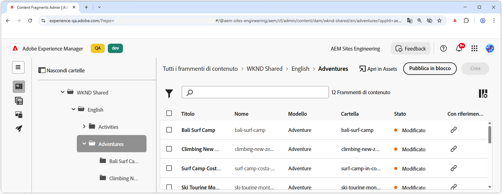
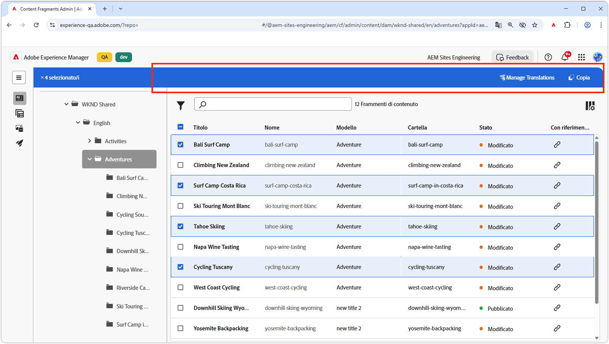
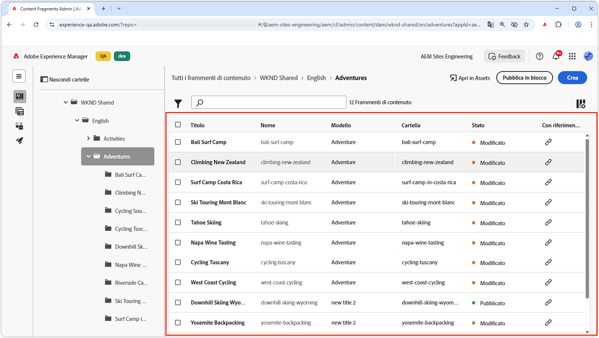
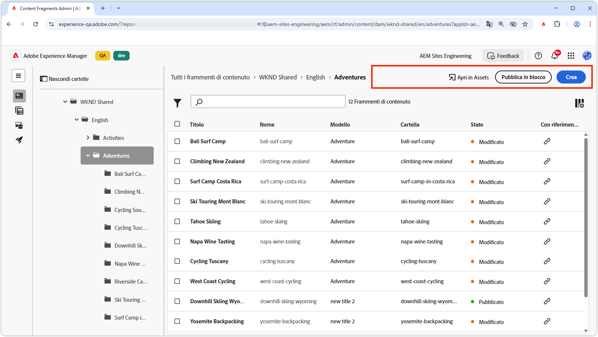
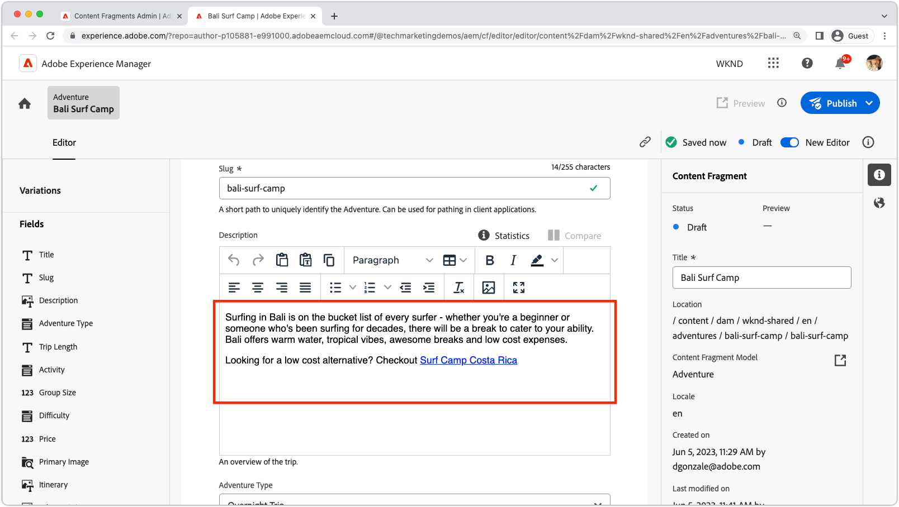
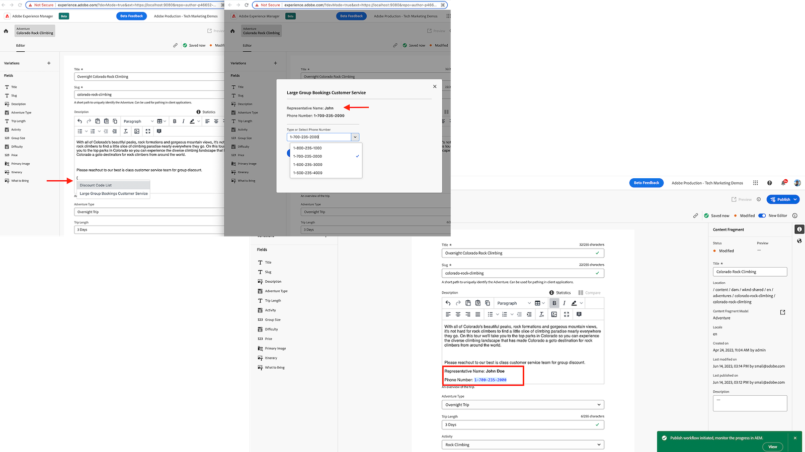

# Estensibilità dei frammenti di contenuto AEM

L’interfaccia utente Frammenti di contenuto dell’AEM è una potente interfaccia utente estensibile per la gestione della creazione, della gestione e della modifica di Frammenti di contenuto. Sono disponibili diversi punti di estensione per personalizzare l’interfaccia utente in base alle tue esigenze. Sono disponibili diversi punti di estensione in base all’interfaccia utente che stai estendendo.

## Punti di estensione della console Frammenti di contenuto

La Console Frammenti di contenuto nell’AEM (Adobe Experience Manager) è un’interfaccia utente che fornisce una posizione centralizzata per la gestione e l’organizzazione dei frammenti di contenuto. Offre un set completo di strumenti e funzioni per creare, modificare, pubblicare e tenere traccia dei frammenti di contenuto, consentendo agli utenti di gestire in modo efficiente contenuti strutturati su vari canali e punti di contatto.

[Console Frammenti di contenuto AEM](https://experienceleague.adobe.com/docs/experience-manager-cloud-service/content/sites/administering/content-fragments/content-fragments-console.html?lang=it) è l’interfaccia utente estensibile per l’elenco e la gestione dei frammenti di contenuto. [Vengono create le estensioni della console Frammenti di contenuto AEM](https://developer.adobe.com/uix/docs/services/aem-cf-console-admin/code-generation) utilizzando `@adobe/aem-cf-admin-ui-ext-tpl` Modello App Builder.

Sono disponibili i seguenti punti di estensione della console Frammenti di contenuto:

      

        

          

            <figure class="image is-16by9">
              
            </figure>
          

          

            

              
<a href="https://developer.adobe.com/uix/docs/services/aem-cf-console-admin/api/action-bar/" title="Barra delle azioni" target="_blank" rel="referrer">Barra delle azioni</a>

              
Personalizza le azioni per quando sono selezionati uno o più frammenti di contenuto.

              <a href="https://developer.adobe.com/uix/docs/services/aem-cf-console-admin/api/action-bar/" class="spectrum-Button spectrum-Button--outline spectrum-Button--primary spectrum-Button--sizeM" target="_blank" rel="referrer">
                Visualizzare la documentazione
              </a>
            

          

        

      

  

    

      

        <figure class="image is-16by9">
          
        </figure>
      

      

        

          
<a href="https://developer.adobe.com/uix/docs/services/aem-cf-console-admin/api/grid-columns/" title="Colonne griglia" target="_blank" rel="referrer">Colonne griglia</a>

          
Personalizza i dati visualizzati nell’elenco Frammenti di contenuto.

          <a href="https://developer.adobe.com/uix/docs/services/aem-cf-console-admin/api/grid-columns/" class="spectrum-Button spectrum-Button--outline spectrum-Button--primary spectrum-Button--sizeM" target="_blank" rel="referrer">
            Visualizzare la documentazione
          </a>
        

      

    

  

  

    

      

        <figure class="image is-16by9">
          
        </figure>
      

      

        

          
<a href="https://developer.adobe.com/uix/docs/services/aem-cf-console-admin/api/header-menu/" title="Menu intestazione" target="_blank" rel="referrer">Menu intestazione</a>

          
Personalizza le azioni per quando non è selezionato alcun frammento di contenuto.

          <a href="https://developer.adobe.com/uix/docs/services/aem-cf-console-admin/api/header-menu/" class="spectrum-Button spectrum-Button--outline spectrum-Button--primary spectrum-Button--sizeM" target="_blank" rel="referrer">
            Visualizzare la documentazione
          </a>
        

      

    

  
  

## Punti di estensione dell’Editor frammenti di contenuto

L’Editor frammenti di contenuto nell’AEM (Adobe Experience Manager) è un componente dell’interfaccia utente che consente agli utenti di creare, modificare e gestire frammenti di contenuto. Offre un ambiente visivamente intuitivo e facile da usare per lavorare con contenuti strutturati, consentendo agli utenti di definire e organizzare gli elementi di contenuto, applicare modelli, gestire le varianti e visualizzare in anteprima come il contenuto viene visualizzato tra canali diversi. L’Editor frammento di contenuto semplifica il processo di creazione di contenuti riutilizzabili e modulari che possono essere facilmente distribuiti e pubblicati in più esperienze digitali.

L’editor di frammenti di contenuto AEM è l’interfaccia utente estensibile per la modifica di frammenti di contenuto. [Vengono create le estensioni dell’Editor frammenti di contenuto dell’AEM](https://developer.adobe.com/uix/docs/services/aem-cf-editor/code-generation/) utilizzando `@adobe/aem-cf-editor-ui-ext-tpl` Modello App Builder.

Sono disponibili i seguenti punti di estensione dell’Editor frammenti di contenuto:

    

      

        

          <figure class="image is-16by9">
            
          </figure>
        

        

          

            
<a href="https://developer.adobe.com/uix/docs/services/aem-cf-editor/api/header-menu/" title="Menu intestazione" target="_blank" rel="referrer">Menu intestazione</a>

            
Personalizza le azioni nel menu di intestazione dell’Editor frammento di contenuto.

            <a href="https://developer.adobe.com/uix/docs/services/aem-cf-editor/api/header-menu" class="spectrum-Button spectrum-Button--outline spectrum-Button--primary spectrum-Button--sizeM" target="_blank" rel="referrer">
              Visualizzare la documentazione
            </a>
          

        

      

    

  

    

      

        <figure class="image is-16by9">
          
        </figure>
      

      

        

          
<a href="https://developer.adobe.com/uix/docs/services/aem-cf-editor/api/rte-toolbar/" title="Barra degli strumenti dell’Editor Rich Text"  target="_blank" rel="referrer">Barra degli strumenti dell’Editor Rich Text</a>

          
Pulsante per aggiungere un elemento personalizzato all’editor Rich Text dell’editor di frammenti di contenuto.

          <a href="https://developer.adobe.com/uix/docs/services/aem-cf-editor/api/rte-toolbar/" class="spectrum-Button spectrum-Button--outline spectrum-Button--primary spectrum-Button--sizeM" target="_blank" rel="referrer">
            Visualizzare la documentazione
          </a>
        

      

    

  

    

      

        <figure class="image is-16by9">
          
        </figure>
      

      

        

          
<a href="https://developer.adobe.com/uix/docs/services/aem-cf-editor/api/rte-widgets/" title="Widget editor Rich Text" target="_blank" rel="referrer">Widget editor Rich Text</a>

          
Personalizzare le azioni nell'editor Rich Text associate alla sequenza di tasti.

          <a href="https://developer.adobe.com/uix/docs/services/aem-cf-editor/api/rte-widgets/" class="spectrum-Button spectrum-Button--outline spectrum-Button--primary spectrum-Button--sizeM" target="_blank" rel="referrer">
            Visualizzare la documentazione
          </a>
        

      

    

  

  

    

      

        <figure class="image is-16by9">
          
        </figure>
      

      

        

          
<a href="https://developer.adobe.com/uix/docs/services/aem-cf-editor/api/rte-badges/ " title="Badge editor Rich Text" target="_blank" rel="referrer">Badge editor Rich Text</a>

          
Personalizza i blocchi con stili non modificabili all’interno dell’editor Rich Text.

          <a href="https://developer.adobe.com/uix/docs/services/aem-cf-editor/api/rte-badges/" class="spectrum-Button spectrum-Button--outline spectrum-Button--primary spectrum-Button--sizeM" target="_blank" rel="referrer">
            Visualizzare la documentazione
          </a>
        

      

    

  

## Esempi di estensione

Ti diamo il benvenuto in una raccolta di esempi di codice di estensibilità dell’interfaccia utente AEM. Questa risorsa è progettata per fornire dimostrazioni pratiche e informazioni approfondite sull’estensione dell’interfaccia utente di Adobe Experience Manager (AEM). Che tu sia uno sviluppatore interessato a migliorare la funzionalità dell’AEM, questi esempi di codice fungono da riferimento prezioso.

  

    

      

        <figure class="image is-16by9">
          
        </figure>
      

      

        

          
<a href="./examples/console-bulk-property-update.md" title="Aggiornamento proprietà in blocco">Aggiornamento proprietà frammento di contenuto in blocco</a>

          
Estensione della barra delle azioni della console Frammenti di contenuto con azione modale e Adobe I/O Runtime.

          <a href="./examples/console-bulk-property-update.md" class="spectrum-Button spectrum-Button--outline spectrum-Button--primary spectrum-Button--sizeM">
            Visualizza l’esempio
          </a>
        

      

    

  

  

        

            

                <figure class="image is-16by9">
                    
                </figure>
            

            

                

                    
<a href="./examples/console-image-generation-and-image-upload.md" title="Generazione di immagini basate su OpenAI e caricamento nell’estensione AEM">Generazione di immagini OpenAPI</a>

                    
Esplora un esempio di estensione della barra delle azioni che genera un’immagine utilizzando OpenAI, la carica sull’AEM e aggiorna la proprietà dell’immagine nel frammento di contenuto selezionato.

                    <a href="./examples/console-image-generation-and-image-upload.md" class="spectrum-Button spectrum-Button--outline spectrum-Button--primary spectrum-Button--sizeM">
                        Visualizza l’esempio
                    </a>
                

            

        

    
    
  

    

      

        <figure class="image is-16by9">
          
        </figure>
      

      

        

          
<a href="./examples/custom-grid-columns.md" title="Colonne personalizzate">Colonne personalizzate</a>

          
Aggiungi una colonna personalizzata alla console Frammenti di contenuto.

          <a href="./examples/custom-grid-columns.md" class="spectrum-Button spectrum-Button--outline spectrum-Button--primary spectrum-Button--sizeM">
            Visualizza l’esempio
          </a>
        

      

    

  
    
  

    

      

        <figure class="image is-16by9">
          
        </figure>
      

      

        

          
<a href="./examples/editor-export-to-xml.md" title="Esporta in XML">Esporta in XML</a>

          
Esportare un frammento di contenuto come XML dall’Editor frammento di contenuto.

          <a href="./examples/editor-export-to-xml.md" class="spectrum-Button spectrum-Button--outline spectrum-Button--primary spectrum-Button--sizeM">
            Visualizza l’esempio
          </a>
        

      

    

  
    
  

    

      

        <figure class="image is-16by9">
          
        </figure>
      

      

        

          
<a href="./examples/editor-rte-toolbar.md" title="Pulsante della barra degli strumenti dell’Editor Rich Text">Pulsante della barra degli strumenti dell’Editor Rich Text</a>

          
Aggiungere pulsanti della barra degli strumenti personalizzati ai campi dell’Editor Rich Text nell’Editor frammento di contenuto.

          <a href="./examples/editor-rte-toolbar.md" class="spectrum-Button spectrum-Button--outline spectrum-Button--primary spectrum-Button--sizeM">
            Visualizza l’esempio
          </a>
        

      

    

  
   
  

    

      

        <figure class="image is-16by9">
          
        </figure>
      

      

        

          
<a href="./examples/editor-rte-toolbar.md" title="Widget editor Rich Text">Widget editor Rich Text</a>

          
Aggiungere widget all’Editor Rich Text nell’Editor frammento di contenuto.

          <a href="./examples/editor-rte-widget.md" class="spectrum-Button spectrum-Button--outline spectrum-Button--primary spectrum-Button--sizeM">
            Visualizza l’esempio
          </a>
        

      

    

  
   
  

    

      

        <figure class="image is-16by9">
          
        </figure>
      

      

        

          
<a href="./examples/editor-rte-badges.md" title="Badge editor Rich Text">Badge editor Rich Text</a>

          
Aggiungi i badge all’Editor Rich Text nell’Editor frammento di contenuto.

          <a href="./examples/editor-rte-badges.md" class="spectrum-Button spectrum-Button--outline spectrum-Button--primary spectrum-Button--sizeM">
            Visualizza l’esempio
          </a>
        

      

    

  
 

