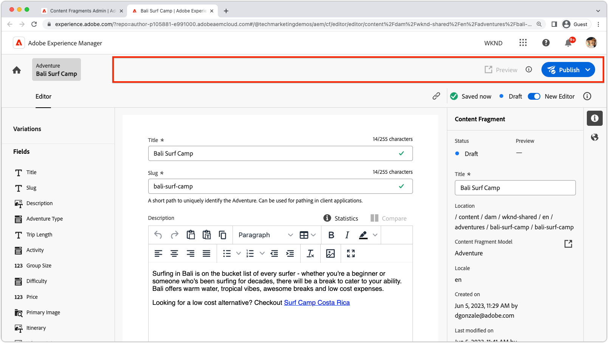
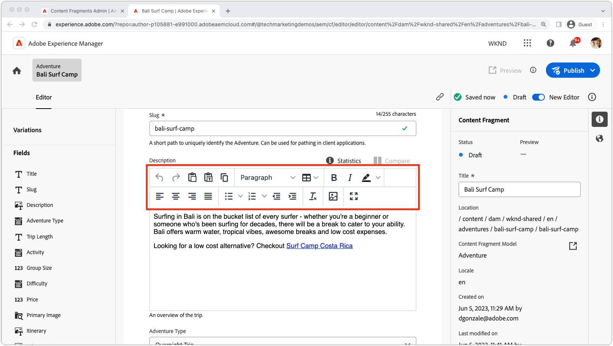

# Estensibilità dei frammenti di contenuto di AEM

L’interfaccia utente della funzione Frammenti di contenuto di AEM è una potente interfaccia utente estensibile per gestire la creazione, la gestione e la modifica di frammenti di contenuto. Diversi punti di estensione consentono di personalizzare l’interfaccia utente in base alle esigenze. I punti di estensione disponibili dipendono dall’interfaccia utente che desideri estendere.

## Punti di estensione della console Frammenti di contenuto

La console Frammenti di contenuto in AEM (Adobe Experience Manager) è un’interfaccia utente che fornisce una posizione centralizzata per la gestione e l’organizzazione dei frammenti di contenuto. Offre un set completo di strumenti e funzioni per creare, modificare, pubblicare e tracciare i frammenti di contenuto, consentendo agli utenti di gestire in modo efficiente contenuti strutturati su vari canali e punti di contatto.

La [console Frammenti di contenuto di AEM](https://experienceleague.adobe.com/docs/experience-manager-cloud-service/content/sites/administering/content-fragments/content-fragments-console.html?lang=it) è l’interfaccia utente estensibile dal punto di vista di elenchi e gestione dei frammenti di contenuto. Le [estensioni per la console Frammenti di contenuto di AEM sono create](https://developer.adobe.com/uix/docs/services/aem-cf-console-admin/code-generation) utilizzando il modello di App Builder `@adobe/aem-cf-admin-ui-ext-tpl`.

Sono disponibili i seguenti punti di estensione della console Frammenti di contenuto:

      

        

          

            <figure class="image is-16by9">
              
            </figure>
          

          

            

              
<a href="https://developer.adobe.com/uix/docs/services/aem-cf-console-admin/api/action-bar/" title="Barra delle azioni" target="_blank" rel="referrer">Barra delle azioni</a>

              
Personalizza le azioni disponibili quando sono selezionati uno o più frammenti di contenuto.

              <a href="https://developer.adobe.com/uix/docs/services/aem-cf-console-admin/api/action-bar/" class="spectrum-Button spectrum-Button--outline spectrum-Button--primary spectrum-Button--sizeM" target="_blank" rel="referrer">
                Consulta la documentazione
              </a>
            

          

        

      

  

    

      

        <figure class="image is-16by9">
          
        </figure>
      

      

        

          
<a href="https://developer.adobe.com/uix/docs/services/aem-cf-console-admin/api/grid-columns/" title="Colonne della griglia" target="_blank" rel="referrer">Colonne della griglia</a>

          
Personalizza i dati che vengono visualizzati nell’elenco Frammenti di contenuto.

          <a href="https://developer.adobe.com/uix/docs/services/aem-cf-console-admin/api/grid-columns/" class="spectrum-Button spectrum-Button--outline spectrum-Button--primary spectrum-Button--sizeM" target="_blank" rel="referrer">
            Consulta la documentazione
          </a>
        

      

    

  

  

    

      

        <figure class="image is-16by9">
          
        </figure>
      

      

        

          
<a href="https://developer.adobe.com/uix/docs/services/aem-cf-console-admin/api/header-menu/" title="Menu di intestazione" target="_blank" rel="referrer">Menu di intestazione</a>

          
Personalizza le azioni disponibili quando non è selezionato alcun frammento di contenuto.

          <a href="https://developer.adobe.com/uix/docs/services/aem-cf-console-admin/api/header-menu/" class="spectrum-Button spectrum-Button--outline spectrum-Button--primary spectrum-Button--sizeM" target="_blank" rel="referrer">
            Consulta la documentazione
          </a>
        

      

    

  
  

## Punti di estensione dell’editor di frammenti di contenuto

L’editor di frammenti di contenuto in AEM (Adobe Experience Manager) è un componente dell’interfaccia utente che consente agli utenti di creare, modificare e gestire i frammenti di contenuto. Offre un ambiente visivo, intuitivo e facile da usare per utilizzare contenuti strutturati, consentendo agli utenti di definire e organizzare gli elementi di contenuto, applicare modelli, gestire le varianti e visualizzare in anteprima come si presenta il contenuto sui diversi canali. L’editor di frammenti di contenuto semplifica il processo di creazione di contenuti riutilizzabili e modulari che possono essere facilmente distribuiti e pubblicati in più esperienze digitali.

L’editor di frammenti di contenuto di AEM è l’interfaccia utente estensibile per la modifica di frammenti di contenuto. Le [estensioni dell’editor di frammenti di contenuto di AEM sono create](https://developer.adobe.com/uix/docs/services/aem-cf-editor/code-generation/) utilizzando il modello di App Builder `@adobe/aem-cf-editor-ui-ext-tpl`.

Sono disponibili i seguenti punti di estensione dell’Editor frammenti di contenuto:

    

      

        

          <figure class="image is-16by9">
            
          </figure>
        

        

          

            
<a href="https://developer.adobe.com/uix/docs/services/aem-cf-editor/api/header-menu/" title="Menu di intestazione" target="_blank" rel="referrer">Menu di intestazione</a>

            
Personalizzare le azioni nel menu di intestazione dell’Editor frammento di contenuto.

            <a href="https://developer.adobe.com/uix/docs/services/aem-cf-editor/api/header-menu/" class="spectrum-Button spectrum-Button--outline spectrum-Button--primary spectrum-Button--sizeM" target="_blank" rel="referrer">
              Visualizza i documenti
            </a>
          

        

      

    

  

    

      

        <figure class="image is-16by9">
          
        </figure>
      

      

        

          
<a href="https://developer.adobe.com/uix/docs/services/aem-cf-editor/api/rte-toolbar/" title="Barra degli strumenti dell’editor Rich Text"  target="_blank" rel="referrer">Barra degli strumenti dell’editor Rich Text</a>

          
Aggiungere un pulsante personalizzato all’editor Rich Text (RTE) dell’editor di frammento di contenuto.

          <a href="https://developer.adobe.com/uix/docs/services/aem-cf-editor/api/rte-toolbar/" class="spectrum-Button spectrum-Button--outline spectrum-Button--primary spectrum-Button--sizeM" target="_blank" rel="referrer">
            Visualizza i documenti
          </a>
        

      

    

  

    

      

        <figure class="image is-16by9">
          
        </figure>
      

      

        

          
<a href="https://developer.adobe.com/uix/docs/services/aem-cf-editor/api/rte-widgets/" title="Widget dell’editor Rich Text" target="_blank" rel="referrer">Widget dell’editor Rich Text</a>

          
Personalizzare le azioni nell’editor Rich Text associate ai tasti.

          <a href="https://developer.adobe.com/uix/docs/services/aem-cf-editor/api/rte-widgets/" class="spectrum-Button spectrum-Button--outline spectrum-Button--primary spectrum-Button--sizeM" target="_blank" rel="referrer">
            Visualizza i documenti
          </a>
        

      

    

  

  

    

      

        <figure class="image is-16by9">
          
        </figure>
      

      

        

          
<a href="https://developer.adobe.com/uix/docs/services/aem-cf-editor/api/rte-badges/ " title="Badge dell’editor Rich Text (RTE)" target="_blank" rel="referrer">Badge dell’editor Rich Text (RTE)</a>

          
Personalizzare i blocchi con stili non modificabili all’interno dell’editor Rich Text.

          <a href="https://developer.adobe.com/uix/docs/services/aem-cf-editor/api/rte-badges/" class="spectrum-Button spectrum-Button--outline spectrum-Button--primary spectrum-Button--sizeM" target="_blank" rel="referrer">
            Visualizza i documenti
          </a>
        

      

    

  

## Esempi di estensione

Ti diamo il benvenuto in una raccolta di esempi di codice di estensibilità dell’interfaccia utente di AEM. Questa risorsa è progettata per fornire dimostrazioni pratiche e approfondimenti sull’estensione dell’interfaccia utente di Adobe Experience Manager (AEM). In qualità di sviluppatore, se ti interessa migliorare le funzionalità di AEM, questi esempi di codice fungono da riferimento prezioso.

  

    

      

        <figure class="image is-16by9">
          
        </figure>
      

      

        

          
<a href="./examples/console-bulk-property-update.md" title="Aggiornamento delle proprietà in blocco">Aggiornamento della proprietà frammento di contenuto in blocco</a>

          
Estensione della barra delle azioni della console Frammento di contenuto con azione modale e Adobe I/O Runtime.

          <a href="./examples/console-bulk-property-update.md" class="spectrum-Button spectrum-Button--outline spectrum-Button--primary spectrum-Button--sizeM">
            Visualizza l’esempio
          </a>
        

      

    

  

  

        

            

                <figure class="image is-16by9">
                    
                </figure>
            

            

                

                    
<a href="./examples/console-image-generation-and-image-upload.md" title="Generazione di immagini basate su OpenAI e caricamento nell’estensione AEM">Generazione di immagini OpenAPI</a>

                    
Esplora un’estensione della barra delle azioni di esempio che genera un’immagine utilizzando OpenAI, la carica su AEM e aggiorna la proprietà dell’immagine sul frammento di contenuto selezionato.

                    <a href="./examples/console-image-generation-and-image-upload.md" class="spectrum-Button spectrum-Button--outline spectrum-Button--primary spectrum-Button--sizeM">
                        Visualizza l’esempio
                    </a>
                

            

        

    
    
  

    

      

        <figure class="image is-16by9">
          
        </figure>
      

      

        

          
<a href="./examples/custom-grid-columns.md" title="Colonne personalizzate">Colonne personalizzate</a>

          
Aggiungere una colonna personalizzata alla console Frammento di contenuto.

          <a href="./examples/custom-grid-columns.md" class="spectrum-Button spectrum-Button--outline spectrum-Button--primary spectrum-Button--sizeM">
            Visualizza l’esempio
          </a>
        

      

    

  
    
  

    

      

        <figure class="image is-16by9">
          
        </figure>
      

      

        

          
<a href="./examples/editor-export-to-xml.md" title="Esportare in XML">Esportare in XML</a>

          
Esportare un frammento di contenuto come XML dall’Editor frammento di contenuto.

          <a href="./examples/editor-export-to-xml.md" class="spectrum-Button spectrum-Button--outline spectrum-Button--primary spectrum-Button--sizeM">
            Visualizza l’esempio
          </a>
        

      

    

  
    
  

    

      

        <figure class="image is-16by9">
          
        </figure>
      

      

        

          
<a href="./examples/editor-rte-toolbar.md" title="Pulsante della barra degli strumenti dell’editor Rich Text">Pulsante della barra degli strumenti dell’editor Rich Text</a>

          
Aggiungere pulsanti della barra degli strumenti personalizzati ai campi dell’editor Rich Text nell’Editor frammento di contenuto.

          <a href="./examples/editor-rte-toolbar.md" class="spectrum-Button spectrum-Button--outline spectrum-Button--primary spectrum-Button--sizeM">
            Visualizza l’esempio
          </a>
        

      

    

  
   
  

    

      

        <figure class="image is-16by9">
          
        </figure>
      

      

        

          
<a href="./examples/editor-rte-toolbar.md" title="Widget dell’editor Rich Text">Widget dell’editor Rich Text</a>

          
Aggiungere i widget all’Editor Rich Text nell’Editor frammento di contenuto.

          <a href="./examples/editor-rte-widget.md" class="spectrum-Button spectrum-Button--outline spectrum-Button--primary spectrum-Button--sizeM">
            Visualizza l’esempio
          </a>
        

      

    

  
   
  

    

      

        <figure class="image is-16by9">
          
        </figure>
      

      

        

          
<a href="./examples/editor-rte-badges.md" title="Badge dell’editor Rich Text">Badge dell’editor Rich Text</a>

          
Aggiungere i badge all’Editor Rich Text nell’Editor frammento di contenuto.

          <a href="./examples/editor-rte-badges.md" class="spectrum-Button spectrum-Button--outline spectrum-Button--primary spectrum-Button--sizeM">
            Visualizza l’esempio
          </a>
        

      

    

  

    

      

        <figure class="image is-16by9">
          
        </figure>
      

      

        

          
<a href="./examples/editor-custom-field.md" title="Campi personalizzati">Campi personalizzati</a>

          
Creare campi di frammento di contenuto personalizzati.

          <a href="./examples/editor-custom-field.md" class="spectrum-Button spectrum-Button--outline spectrum-Button--primary spectrum-Button--sizeM">
            Visualizza l’esempio
          </a>
        

      

    

  
 

