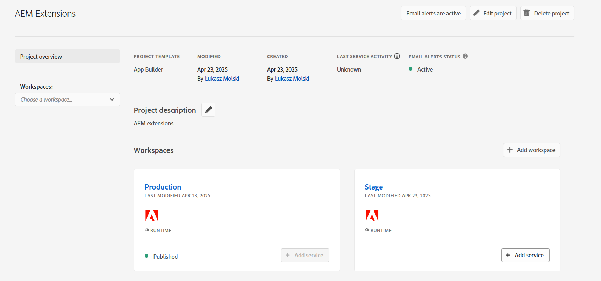

# Distribuire un&#39;estensione

Per l’utilizzo in ambienti AEM as a Cloud Service, è necessario distribuire e approvare l’app App Builder dell’estensione.

Ci sono diverse considerazioni di cui tenere conto durante la distribuzione delle app App Builder per le estensioni:

+ Le estensioni vengono distribuite nell’area di lavoro del progetto di Adobe Developer Console. Le aree di lavoro predefinite sono:
   + L&#39;area di lavoro __Produzione__ contiene distribuzioni di estensioni disponibili in tutte le AEM as a Cloud Service.
   + L&#39;area di lavoro __Stage__ funge da area di lavoro per sviluppatori. Le estensioni distribuite nell’area di lavoro dello stage non sono disponibili in AEM as a Cloud Service.
Le aree di lavoro di Adobe Developer Console non hanno alcuna correlazione diretta con i tipi di ambiente AEM as a Cloud Service.
+ Un’estensione distribuita nell’area di lavoro di produzione viene visualizzata in tutti gli ambienti AEM as a Cloud Service dell’organizzazione Adobe in cui esiste l’estensione.
Un&#39;estensione non può essere limitata agli ambienti con cui è registrata aggiungendo [logica condizionale che controlla il nome host di AEM as a Cloud Service](https://developer.adobe.com/uix/docs/guides/publication/#enabling-extension-only-on-specific-aem-environments).
+ È possibile utilizzare più estensioni in AEM as a Cloud Service. Adobe consiglia di utilizzare ogni estensione dell’app App Builder per risolvere un singolo obiettivo di business. Detto questo, un’app App Builder con una singola estensione può implementare più punti di estensione che supportano un obiettivo aziendale comune.

## Distribuzione iniziale

Affinché un&#39;estensione sia disponibile negli ambienti AEM as a Cloud Service, deve essere distribuita in Adobe Developer Console.

Il processo di distribuzione è suddiviso in due fasi logiche:

1. Implementazione dell’estensione App Builder app in Adobe Developer Console da parte di uno sviluppatore.
1. Approvazione dell’estensione da parte di un Responsabile dell’implementazione o di un Proprietario business.

### Distribuire l’estensione

Distribuisci l’estensione nell’area di lavoro di produzione. Le estensioni distribuite nell’area di lavoro di produzione vengono aggiunte automaticamente a tutti i servizi AEM as a Cloud Service Author nell’organizzazione Adobe in cui viene distribuita l’estensione.

1. Apri una riga di comando nella directory principale dell’app App Builder aggiornata per l’estensione.
1. Assicurati che l’area di lavoro di produzione sia attiva

   ```shell
   $ aio app use -w Production
   ```

   Unisci le modifiche apportate a `.env` e `.aio`.

1. Distribuisci l’estensione aggiornata dell’app App Builder.

   ```shell
   $ aio app deploy
   ```

#### Richiedi approvazione distribuzione

{align="center"}

1. Accedi a [Adobe Developer Console](https://developer.adobe.com)
1. Seleziona __Console__
1. Passa a __Progetti__
1. Seleziona il progetto associato all’estensione
1. Seleziona l&#39;area di lavoro __Produzione__
1. Seleziona __Invia per approvazione__
1. Completa e invia il modulo, aggiornando i campi in base alle esigenze.

### Approvazione della distribuzione

{align="center"}

1. Accedi a [Adobe Exchange](https://exchange.adobe.com/)
1. Passa a __Gestisci__ > __App in attesa di revisione__
1. __Rivedi__ l&#39;estensione dell&#39;app App Builder
1. Se le modifiche dell&#39;estensione sono accettabili __Accetta__ la revisione. L’estensione viene inserita immediatamente in tutti i servizi AEM as a Cloud Service Author all’interno dell’organizzazione Adobe.

Una volta approvata la richiesta di estensione, questa diventa immediatamente attiva nei servizi di authoring di AEM as a Cloud Service.

## Aggiornare un’estensione

L&#39;aggiornamento e l&#39;estensione dell&#39;app App Builder seguono lo stesso processo della [distribuzione iniziale](#initial-deployment), con la deviazione che la distribuzione dell&#39;estensione esistente deve prima essere revocata.

### Revocare l’estensione

Per distribuire una nuova versione di un&#39;estensione, è necessario prima revocarla o rimuoverla. Quando l’estensione è revocata, non è disponibile nelle console AEM.

1. Accedi a [Adobe Exchange](https://exchange.adobe.com/)
1. Passa a __Gestisci__ > __App App Builder__
1. __Revoca__ dell&#39;estensione da aggiornare

Dopo aver revocato l’estensione, questa rimane visibile con lo stato revocato in Gestione estensioni. Per rimuoverlo completamente è necessario rimuovere il progetto.

Il pulsante per rimuovere il progetto si trova in alto a destra:

{align="center"}

Fino a quando l’estensione non viene revocata non sarà possibile eliminare il progetto:

{align="center"}

Quando l&#39;estensione viene revocata, il progetto può essere rimosso:

{align="center"}

Dopo la rimozione del progetto, l’estensione non è più visibile in Extension Manager.

### Distribuire l’estensione

Distribuisci l’estensione nell’area di lavoro di produzione. Le estensioni distribuite nell’area di lavoro di produzione vengono aggiunte automaticamente a tutti i servizi AEM as a Cloud Service Author nell’organizzazione Adobe in cui viene distribuita l’estensione.

1. Apri una riga di comando nella directory principale dell’app App Builder aggiornata per l’estensione.
1. Assicurati che l’area di lavoro di produzione sia attiva

   ```shell
   $ aio app use -w Production
   ```

   Unisci le modifiche apportate a `.env` e `.aio`.

1. Distribuisci l’estensione aggiornata dell’app App Builder.

   ```shell
   $ aio app deploy
   ```

#### Richiedi approvazione distribuzione

{align="center"}

1. Accedi a [Adobe Developer Console](https://developer.adobe.com)
1. Seleziona __Console__
1. Passa a __Progetti__
1. Seleziona il progetto associato all’estensione
1. Seleziona l&#39;area di lavoro __Produzione__
1. Seleziona __Invia per approvazione__
1. Completa e invia il modulo, aggiornando i campi in base alle esigenze.

#### Approvare la richiesta di distribuzione

{align="center"}

1. Accedi a [Adobe Exchange](https://exchange.adobe.com/)
1. Passa a __Gestisci__ > __App in attesa di revisione__
1. __Rivedi__ l&#39;estensione dell&#39;app App Builder
1. Se le modifiche dell&#39;estensione sono accettabili __Accetta__ la revisione. L’estensione viene inserita immediatamente in tutti i servizi AEM as a Cloud Service Author all’interno dell’organizzazione Adobe.

Una volta approvata la richiesta di estensione, questa diventa immediatamente attiva nei servizi di authoring di AEM as a Cloud Service.

## Rimuovere un’estensione


Per rimuovere un’estensione, revocala (o rimuoverla) da Adobe Exchange. Quando l’estensione viene revocata, viene rimossa da tutti i servizi di authoring di AEM as a Cloud Service.

1. Accedi a [Adobe Exchange](https://exchange.adobe.com/)
1. Passa a __Gestisci__ > __App App Builder__
1. __Revoca__ dell&#39;estensione da rimuovere
