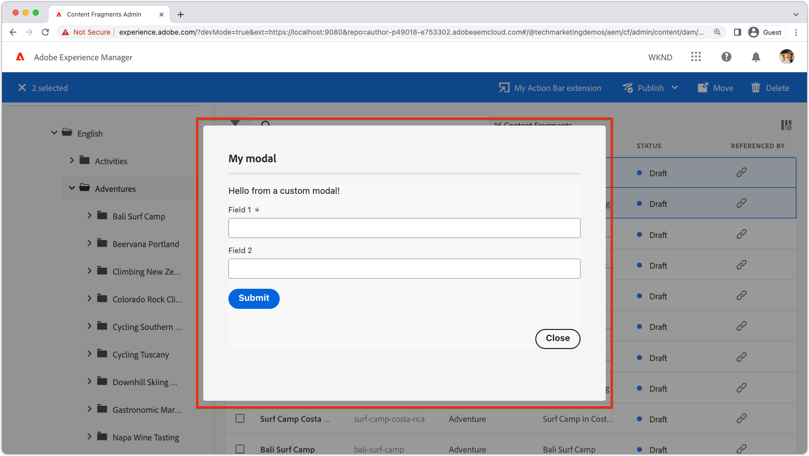

# Finestra modale di estensione

{align="center"}

L&#39;estensione modale dell&#39;interfaccia utente AEM consente di collegare un&#39;interfaccia utente personalizzata alle estensioni dell&#39;interfaccia utente AEM.

I moduli sono applicazioni React basate su [Spettro di reazione](https://react-spectrum.adobe.com/react-spectrum/)e possono creare qualsiasi interfaccia utente personalizzata richiesta dall’estensione, tra cui:

+ Finestre di dialogo di conferma
+ [Moduli di input](https://react-spectrum.adobe.com/react-spectrum/#forms)
+ [Indicatori di avanzamento](https://react-spectrum.adobe.com/react-spectrum/#status)
+ [Riepilogo risultati](https://react-spectrum.adobe.com/react-spectrum/#collections)
+ Messaggi di errore
+ ... o anche un&#39;applicazione multi-view React completa.

## Route modali

L&#39;esperienza modale è definita dall&#39;estensione App Builder React app definita in `web-src` cartella. Come per qualsiasi app React, l’esperienza completa è orchestrata utilizzando [Percorsi React](https://reactrouter.com/en/main/components/routes) che rendono [Componenti React](https://reactjs.org/docs/components-and-props.html).

Per generare la vista modale iniziale è necessaria almeno una route. Questa route iniziale viene richiamata in [registrazione dell&#39;estensione](#extension-registration)di `onClick(..)` come mostrato di seguito.


+ `./src/aem-ui-extension/web-src/src/components/App.js`

```javascript
import MyModal from './MyModal';
import MyModalResults from './MyModalResults';
...
function App(props) {
  return (
    <Router>
      <ErrorBoundary onError={onError} FallbackComponent={fallbackComponent}>
        <Routes>
          ...         
          {/* 
            Define the entry route to the modal.

            For modals opened from Action Bar extensions.
            Depending on the extension point, different parameters are passed to the modal.
            This example illustrates a modal for the AEM Content Fragment Console (list view), where typically a :selection parameter is used to pass in the list of selected Content Fragments.
            Where as Header Menu extensions do not use a selection parameter.
           */}
          <Route
            exact path="aem-ui-extension/:selection/my-modal"
            element={<MyModal />}
          />                    

          {/* Define any other routes the modal may need */}
          <Route
            exact path="aem-ui-extension/my-modal"
            element={<MyOtherModalView />}
          />                    

        </Routes>
      </ErrorBoundary>
    </Router>
  )
  ...
}
```

## Registrazione dell’estensione

Per aprire un modale, chiama `guestConnection.host.modal.showUrl(..)` è creato dal di `onClick(..)` funzione. `showUrl(..)` viene passato un oggetto JavaScript con chiave/valori:

+ `title` fornisce all’utente il nome del titolo del modale visualizzato
+ `url` è l’URL che richiama [Percorso di reazione](#modal-routes) responsabile della visualizzazione iniziale del modale.

È imperativo che `url` passato a `guestConnection.host.modal.showUrl(..)` viene risolto per instradare nell&#39;estensione, altrimenti non viene visualizzato nulla nel modale.

+ `./src/aem-ui-extension/web-src/src/components/ExtensionRegistration.js`

```javascript
function ExtensionRegistration() {
  ...
  onClick() {
    // Create a URL that maps to the React route to be rendered in the modal
    const modalURL = "/index.html#/aem-ui-extension/my-modal";

    // Open the modal and display the React route created above
    guestConnection.host.modal.showUrl({
      title: "My modal title",
      url: modalURL
    })     
  }
  ...     
}...
```

## Componente modale

ciascuna rotta dell&#39;estensione, [non è il `index` percorso](./extension-registration.md#app-routes), viene mappato su un componente React che può essere rappresentato nella finestra modale dell’estensione.

Un modale può essere composto da un numero qualsiasi di route React, da una semplice modale a una complessa modale a più route.

Di seguito viene illustrata una semplice finestra modale a una route, tuttavia questa visualizzazione modale potrebbe contenere collegamenti React che richiamano altre route o comportamenti.

+ `./src/aem-ui-extension/web-src/src/components/MyModal.js`

```javascript
import React, { useState, useEffect } from 'react'
import { attach } from "@adobe/uix-guest"
import {
  Flex,
  Provider,
  Content,
  defaultTheme,
  Text,
  ButtonGroup,
  Button
} from '@adobe/react-spectrum'
import Spinner from "./Spinner"
import { useParams } from "react-router-dom"
import { extensionId } from "./Constants"

export default function MyModal() {
  // Initial modal views for Action Bar extensions typically pass in the list of selected Content Fragment Paths from ExtensionRegistration.js
  // Get the paths from useParams() and split on delimiter used
  let { selection } = useParams();
  let contentFragmentPaths = selection?.split('|') || [];
  
  // Asynchronously attach the extension to AEM. 
  // Wait or the guestConnection to be set before doing anything in the modal.
  const [guestConnection, setGuestConnection] = useState()

  useEffect(() => {
    (async () => {
      const guestConnection = await attach({ id: extensionId })
      setGuestConnection(guestConnection);
    })()
  }, [])

  if (!guestConnection) {
    // If the guestConnection is not initialized, display a loading spinner
    return <Spinner />
  } else {
    // Else the modal is ready to render!
    return (
        <Provider theme={defaultTheme} colorScheme='light'>
        {/* 
            Use the React Spectrum components to render the modal UI.
            Using React Spectrum ensures a consistent, accessible, future-proof look-and-feel and speeds up development.
        */}
            <Content width="100%">
                <Flex width="100%">
                    <Text>
                        This is the contents in the modal! 
                        Anything can be created in this return statement!

                        The selected Content Fragments are: { contentFragmentPaths.join(', ') }
                    </Text>                    
                    {/*
                        Modals must provide their own Close button, by calling: guestConnection.host.modal.close()
                    */}
                    <ButtonGroup align="end">
                        <Button variant="primary" onPress={() => guestConnection.host.modal.close()}>Close</Button>
                    </ButtonGroup>
                </Flex>
            </Content>
        </Provider>
    )
  }
}
```

## Chiudi il modale

{align="center"}

I moduli devono fornire il proprio stretto controllo. A tale scopo, richiama `guestConnection.host.modal.close()`.

```javascript
<ButtonGroup align="end">
    <Button variant="primary" onPress={() => guestConnection.host.modal.close()}>Close</Button>
</ButtonGroup>
```
